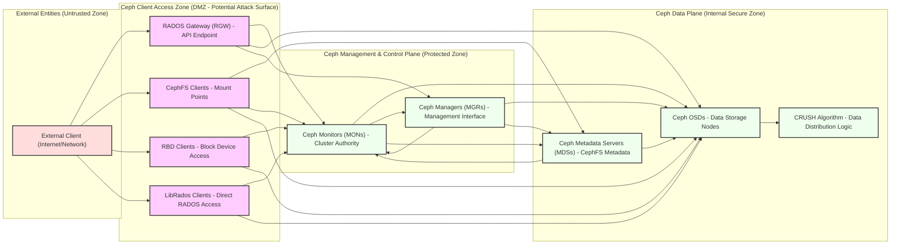

# Project Design Document: Ceph Distributed Storage System for Threat Modeling (Improved)

**Project Name:** Ceph Distributed Storage System

**Project Repository:** [https://github.com/ceph/ceph](https://github.com/ceph/ceph)

**Document Version:** 1.1
**Date:** 2023-10-27
**Author:** AI Cloud & Security Architect

## 1. Introduction

This document provides an enhanced design overview of the Ceph distributed storage system, specifically tailored for threat modeling. Building upon the previous version, this document offers deeper insights into security aspects, potential vulnerabilities, and threat considerations within the Ceph architecture. It aims to equip security professionals with a comprehensive understanding of Ceph's internals to facilitate effective threat identification and mitigation strategies.

## 2. Project Overview

Ceph is a unified, distributed storage system renowned for its performance, reliability, and scalability. It consolidates object, block, and file storage functionalities into a single platform, operating on commodity hardware and embodying a software-defined architecture. This flexibility makes Ceph suitable for diverse environments, from private to public clouds.

**Key Features (Security Relevant Highlights):**

*   **Unified Storage & Access Methods:** Multiple access protocols (S3/Swift, iSCSI/RBD, CephFS) introduce diverse attack surfaces.
*   **Scalability & Distributed Nature:** Distributed architecture increases complexity and potential points of failure and attack.
*   **High Availability & Data Replication:** Replication mechanisms, while enhancing reliability, also involve data transfer and potential interception points.
*   **Software-Defined & Open Source:** Open source nature allows for scrutiny but also potential exploitation of known vulnerabilities if not properly managed.
*   **Authentication & Authorization (Cephx):**  Cephx protocol is central to security; weaknesses or misconfigurations can lead to unauthorized access.

## 3. System Architecture

Ceph's architecture revolves around RADOS (Reliable Autonomic Distributed Object Store), the core object-based storage system.  RADOS underpins all Ceph storage services.  The key components, from a security perspective, are:

*   **Ceph Monitors (MONs):**  The authoritative source for cluster state and security policies. Compromise here is critical.
*   **Ceph Managers (MGRs):** Management and monitoring interface, potential entry point for administrative attacks.
*   **Ceph Object Storage Devices (OSDs):** Data storage nodes; targets for data breaches and availability attacks.
*   **Ceph Metadata Servers (MDSs):** Metadata management for CephFS; vulnerabilities can impact file system integrity and access control.
*   **RADOS Gateways (RGWs):** API gateways for object storage; exposed to external networks and web-based attacks.
*   **CRUSH Algorithm:** Data placement algorithm; understanding its logic is important for data security and resilience analysis.
*   **Client Libraries (LibRados, RBD, CephFS Clients):** Client-side components; vulnerabilities in clients can compromise the entire system.

**High-Level Architecture Diagram (Security Focused):**

## 4. Component Details (Security Deep Dive)

### 4.1. Ceph Monitors (MONs) - Security Authority

*   **Function:**  Maintain cluster map, enforce authentication (Cephx), manage authorization (capabilities), crucial for cluster consensus and integrity.
*   **Key Security Aspects:**
    *   **Authentication (Cephx Protocol):**  Vulnerable to replay attacks, man-in-the-middle if not properly configured (e.g., time synchronization, secure channels). Key management for Cephx is critical.
    *   **Authorization (Capabilities):**  Overly permissive capabilities grant excessive access. Capability management needs granular control and least privilege principle.
    *   **Quorum & Consensus (Paxos/Raft):**  DoS attacks targeting quorum formation can disrupt cluster availability. Compromise of a quorum majority leads to complete cluster control.
    *   **Data Sensitivity (Cluster Map, Keys):**  Store highly sensitive data. Access control to MON data (e.g., RocksDB) is paramount. Encryption at rest for MON data is recommended.
    *   **Communication Security:**  Inter-monitor and monitor-daemon communication must be secured (e.g., using `cephx_require_signatures`, `cephx_cluster_require_signatures`, `cephx_service_require_signatures`).
    *   **Vulnerability to Clock Drift:** Cephx relies on time synchronization. Clock drift can lead to authentication failures or vulnerabilities. NTP configuration is essential.

### 4.2. Ceph Managers (MGRs) - Management & Monitoring Exposure

*   **Function:**  Management interface (dashboard, API), monitoring data aggregation, module hosting. Potential attack vector for administrative access.
*   **Key Security Aspects:**
    *   **Management Interface Security (Dashboard, REST API):**  Web interfaces are vulnerable to common web attacks (XSS, CSRF, injection). Secure coding practices, input validation, and regular security audits are necessary.
    *   **Module Security:**  Third-party or custom MGR modules can introduce vulnerabilities. Module vetting and secure development practices are important.
    *   **Access Control (Management API):**  Strict RBAC (Role-Based Access Control) for management API access. Multi-factor authentication (MFA) should be considered.
    *   **Data Sensitivity (Monitoring Data, Configuration):**  May expose sensitive monitoring data. Access to monitoring data should be controlled.
    *   **Communication Security:**  Communication with MONs and OSDs should be secured to prevent tampering with management operations.
    *   **API Rate Limiting & DoS Protection:** Management APIs should be protected against DoS attacks through rate limiting and other mechanisms.

### 4.3. Ceph Object Storage Devices (OSDs) - Data at Rest & Integrity

*   **Function:**  Store data objects, handle replication, recovery, scrubbing, data migration. Direct data storage and processing.
*   **Key Security Aspects:**
    *   **Data at Rest Encryption (dm-crypt, BlueStore Encryption):**  Essential for protecting data confidentiality against physical theft or unauthorized access to storage media. Key management for encryption is critical.
    *   **Data Integrity (Checksums, Scrubbing):**  Mechanisms to detect data corruption. Regular scrubbing is important for maintaining data integrity and detecting silent data corruption.
    *   **Access Control (Capabilities Enforcement):**  OSDs enforce capabilities granted by MONs. Vulnerabilities in capability enforcement can lead to unauthorized data access.
    *   **Process Isolation & Sandboxing:**  OSD processes should be isolated to prevent cross-contamination and limit the impact of potential vulnerabilities.
    *   **Communication Security:**  OSD-to-OSD and OSD-to-MON communication must be secured to protect data replication and recovery processes.
    *   **Resource Exhaustion & DoS:**  OSDs can be targeted by DoS attacks to exhaust resources (CPU, disk I/O, network) and impact cluster performance and availability.

### 4.4. Ceph Metadata Servers (MDSs) - CephFS Security & Availability

*   **Function:**  Manage metadata for CephFS, provide POSIX-compliant file system access. Critical for CephFS functionality and security.
*   **Key Security Aspects:**
    *   **Metadata Security (Permissions, Attributes):**  Metadata stores access control information. Compromise of MDS can lead to unauthorized access to CephFS data.
    *   **Access Control (POSIX Permissions, Ceph Capabilities):**  Enforce POSIX permissions and Ceph capabilities. Misconfigurations in permissions can lead to security breaches.
    *   **Performance & Availability (DoS Target):**  MDS performance is crucial for CephFS. DoS attacks against MDS can render CephFS unusable. Redundancy and load balancing for MDS are important.
    *   **Communication Security:**  MDS-to-MON, MDS-to-OSD, and MDS-to-client communication must be secured to protect metadata operations and data access.
    *   **Metadata Injection Attacks:**  Vulnerabilities in MDS metadata handling could potentially lead to metadata injection attacks, compromising file system integrity.

### 4.5. RADOS Gateways (RGWs) - API Security & External Exposure

*   **Function:**  S3/Swift API endpoints, translate API requests to RADOS operations. Directly exposed to external networks and web-based threats.
*   **Key Security Aspects:**
    *   **API Security (S3/Swift API Implementation):**  Vulnerable to web application vulnerabilities (OWASP Top 10). Input validation, output encoding, and secure API design are crucial.
    *   **Authentication & Authorization (S3/Swift Authentication):**  Secure handling of S3 keys, Swift tokens, and IAM policies. Vulnerabilities in authentication can lead to unauthorized access.
    *   **Access Control (Bucket/Object Policies, ACLs):**  Enforce bucket and object-level access control policies. Misconfigurations in policies can lead to data breaches.
    *   **Data in Transit Encryption (HTTPS/TLS):**  Mandatory for protecting data confidentiality and integrity during transmission. Proper TLS configuration is essential.
    *   **Input Validation & Injection Prevention:**  Rigorous input validation to prevent injection attacks (SQL injection, command injection, etc.).
    *   **DoS Protection (Rate Limiting, WAF):**  RGWs are exposed to internet-facing DoS attacks. Rate limiting, Web Application Firewalls (WAFs), and other DoS mitigation techniques are necessary.
    *   **SSRF (Server-Side Request Forgery):**  RGW functionalities that interact with external resources can be vulnerable to SSRF attacks.

### 4.6. LibRados & Client Libraries - Client-Side Vulnerabilities

*   **Function:**  Direct RADOS access for applications. Client-side security is paramount as vulnerabilities here can bypass Ceph's internal security.
*   **Key Security Aspects:**
    *   **Client-Side Security Vulnerabilities:**  Applications using LibRados can introduce vulnerabilities (buffer overflows, format string bugs, insecure coding practices). Secure coding practices and regular security audits of client applications are essential.
    *   **Authentication & Authorization Handling (Client-Side):**  Clients must securely handle Ceph authentication credentials (keys, capabilities). Hardcoding credentials or insecure storage of keys is a major risk.
    *   **Input Validation (Client-Side):**  Client applications should validate user inputs before sending requests to Ceph to prevent injection attacks.
    *   **Dependency Management (Client Libraries):**  Vulnerabilities in LibRados or other client library dependencies can impact application security. Regular updates and vulnerability scanning of client libraries are important.

## 5. Threat Landscape & Potential Threat Areas

Based on the architecture and component details, potential threat areas for Ceph include:

*   **Authentication & Authorization Bypass:** Exploiting vulnerabilities in Cephx, RGW authentication, or capability management to gain unauthorized access.
*   **Data Breaches & Confidentiality Violations:**  Unauthorized access to data at rest or in transit due to lack of encryption, misconfigured access controls, or vulnerabilities in access methods (RGW, CephFS, RBD).
*   **Data Integrity Compromise:** Data corruption or modification due to vulnerabilities in data handling, replication, or scrubbing mechanisms.
*   **Availability Disruptions (DoS/DDoS):**  DoS attacks targeting critical components like MONs, MDSs, RGWs, or OSDs, leading to service outages or performance degradation.
*   **Management Plane Attacks:**  Compromising MGRs or MONs through management interfaces or API vulnerabilities to gain administrative control of the cluster.
*   **Metadata Manipulation:**  Exploiting vulnerabilities in MDS to manipulate metadata, leading to unauthorized access, data loss, or file system corruption (CephFS).
*   **Supply Chain Attacks:**  Compromise of Ceph software supply chain or dependencies, introducing vulnerabilities into the system.
*   **Insider Threats:**  Malicious or negligent actions by authorized users with access to Ceph infrastructure or credentials.
*   **Physical Security Breaches:**  Physical access to storage media or infrastructure, leading to data theft or system compromise (if data at rest encryption is not implemented or key management is weak).
*   **Web Application Attacks (RGW):**  Common web vulnerabilities (XSS, CSRF, injection, etc.) targeting RGW API endpoints.

## 6. Data Flow (Security Perspective)

The data flow diagram in the previous version remains relevant. However, from a security perspective, consider these aspects during data flow analysis:

*   **Authentication Points:** Identify where authentication occurs in the data flow (e.g., client to RGW, RGW to MON).
*   **Authorization Checks:** Pinpoint where authorization decisions are made (e.g., RGW, OSDs, MDSs).
*   **Encryption Boundaries:**  Determine where data is encrypted in transit and at rest.
*   **Trust Zones:**  Map data flow across different trust zones (external, DMZ, internal secure zone).
*   **Logging & Auditing Points:** Identify where security-relevant events are logged and audited.

## 7. Technology Stack (Security Implications)

*   **C++ & Python:**  Memory safety vulnerabilities in C++ code, potential for vulnerabilities in Python modules. Code audits and secure development practices are important.
*   **Linux OS:**  OS-level security hardening, kernel vulnerabilities, patch management are crucial.
*   **XFS/ext4/BlueStore:**  File system security, access control mechanisms, potential vulnerabilities in file system implementations.
*   **RocksDB:**  Database security, access control to RocksDB data, potential vulnerabilities in RocksDB itself.
*   **TCP/IP Networking:**  Network security protocols (TLS), network segmentation, firewall rules are essential.
*   **Cephx:**  Security of Cephx protocol implementation, key management, time synchronization dependencies.
*   **TLS/SSL & dm-crypt:**  Configuration and implementation security of encryption technologies. Weak configurations or vulnerabilities in libraries can undermine encryption.
*   **Containerization/Orchestration (Docker/Kubernetes):**  Container security, orchestration platform security, secure deployment configurations.

## 8. Security Best Practices & Mitigation Strategies

Based on the identified threats and security considerations, implement the following best practices:

*   **Strong Authentication & Authorization:**  Enforce Cephx authentication, implement granular capabilities, and practice least privilege. Regularly rotate Cephx keys.
*   **Data Encryption (In-Transit & At-Rest):**  Mandate TLS for all communication channels. Implement OSD encryption for data at rest. Securely manage encryption keys (e.g., using dedicated key management systems).
*   **Network Segmentation & Firewalls:**  Segment Ceph network zones (client access, management, data plane). Implement firewalls to control network traffic and restrict access to Ceph components.
*   **Regular Security Updates & Patch Management:**  Maintain up-to-date Ceph software and underlying OS and dependencies. Implement a robust patch management process.
*   **Intrusion Detection & Prevention Systems (IDS/IPS):**  Deploy IDS/IPS to monitor network traffic and detect malicious activity targeting Ceph.
*   **Security Information & Event Management (SIEM):**  Integrate Ceph logs with a SIEM system for centralized security monitoring and incident response.
*   **Vulnerability Scanning & Penetration Testing:**  Regularly perform vulnerability scans and penetration tests to identify and remediate security weaknesses.
*   **Secure Configuration & Hardening:**  Follow Ceph security hardening guides and best practices. Disable unnecessary services and features.
*   **Incident Response Plan:**  Develop and maintain an incident response plan for security incidents affecting Ceph.
*   **Security Awareness Training:**  Train administrators and users on Ceph security best practices and potential threats.

## 9. Conclusion

This enhanced design document provides a deeper security-focused perspective on the Ceph distributed storage system. By detailing component-level security aspects, outlining potential threats, and recommending mitigation strategies, this document serves as a robust foundation for conducting thorough threat modeling exercises. Utilizing this information, security professionals can effectively identify, analyze, and mitigate security risks associated with Ceph deployments, ensuring a more secure and resilient storage infrastructure. This document should be used as a living document, updated as Ceph evolves and new threats emerge.