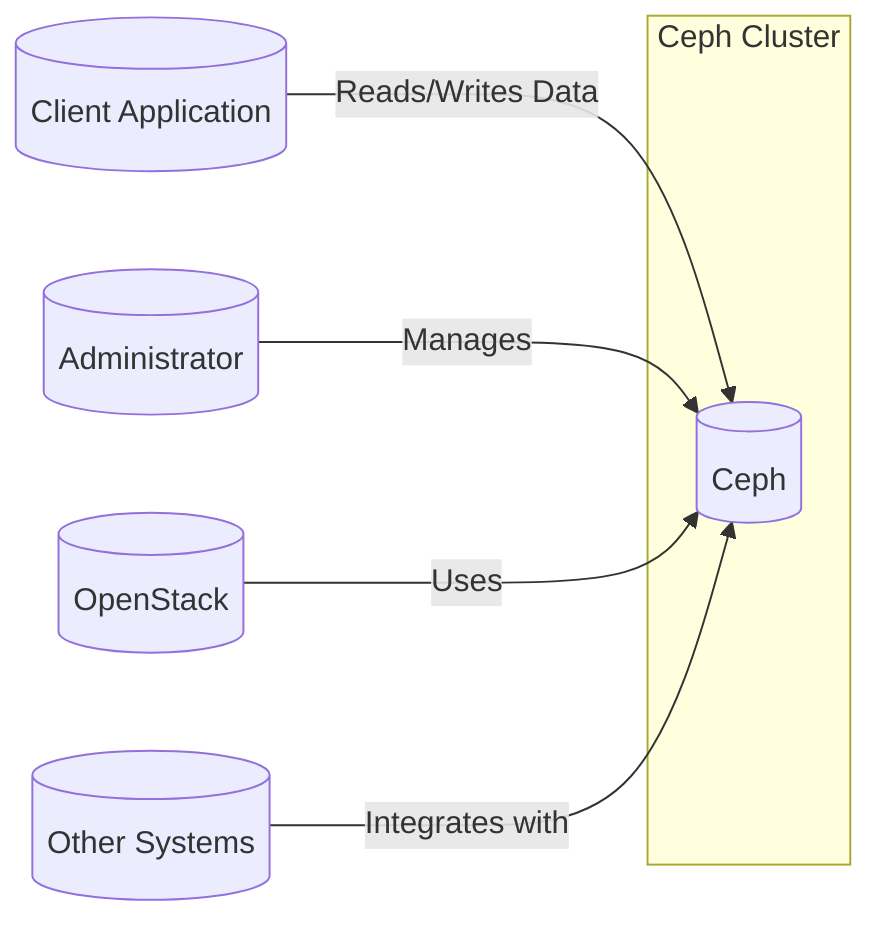
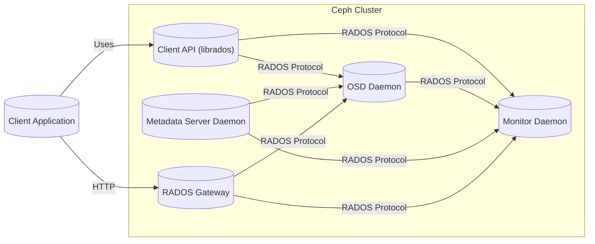
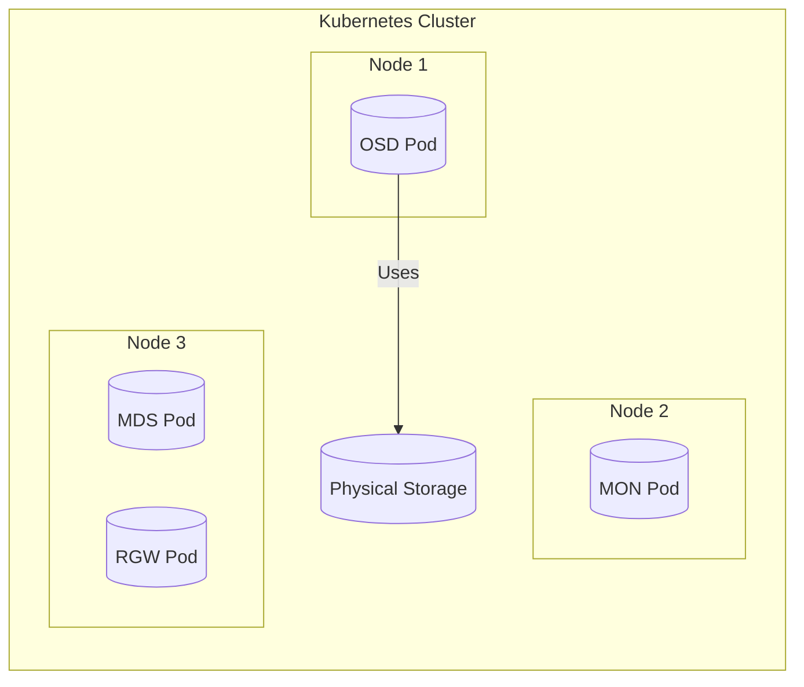
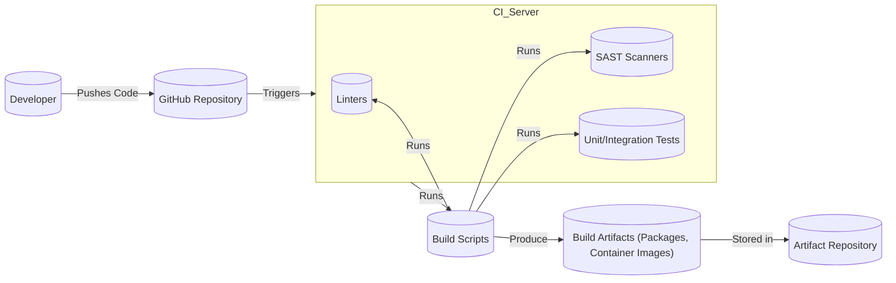

Okay, let's create a design document for the Ceph project, focusing on aspects relevant to threat modeling.

# BUSINESS POSTURE

Ceph is a distributed storage system designed to provide excellent performance, reliability, and scalability. It's used in a variety of contexts, from cloud platforms (like OpenStack) to enterprise storage solutions. Given its nature, the business priorities and goals revolve around data integrity, availability, and performance. The project is mature and widely adopted, suggesting a lower risk appetite than a brand-new project.

Business Priorities:

*   Data Durability and Availability: Ensuring data is not lost and remains accessible even in the face of hardware failures.
*   Scalability: Allowing users to easily expand storage capacity as needed.
*   Performance: Providing fast and efficient access to data.
*   Cost-Effectiveness: Offering a storage solution that is competitive in terms of cost per gigabyte.
*   Open Source Community: Maintaining a healthy and active open-source community.
*   Integration: Seamlessly integrating with other systems and platforms.

Business Risks:

*   Data Loss: The most critical risk is the permanent loss of user data.
*   Data Corruption: Data becoming unusable due to software bugs or hardware issues.
*   Service Unavailability: Users being unable to access their data.
*   Performance Degradation: Slow data access impacting user applications.
*   Security Breaches: Unauthorized access to or modification of data.
*   Supply Chain Attacks: Compromise of the Ceph software supply chain.
*   Lack of Adoption: Failure to attract and retain users and contributors.

# SECURITY POSTURE

Ceph incorporates several security controls, and given its widespread use, likely has a number of accepted risks related to legacy deployments and backward compatibility.

Existing Security Controls:

*   security control: Authentication: Ceph uses `cephx`, a protocol similar to Kerberos, to authenticate clients and daemons. This is described in the Ceph documentation and codebase.
*   security control: Authorization: Ceph provides access control mechanisms to restrict access to specific resources (pools, objects) based on user identity. This is implemented within the Ceph daemons.
*   security control: Encryption (in transit): Ceph supports encryption of data in transit between clients and servers, and between Ceph daemons. This is configurable and implemented using cryptographic libraries.
*   security control: Encryption (at rest): Ceph supports encryption of data at rest. This is configurable and implemented using cryptographic libraries.
*   security control: Auditing: Ceph provides logging capabilities that can be used to track access and changes to data. This is implemented within the Ceph daemons.
*   security control: Network Segmentation: Ceph recommends deploying different components (MONs, OSDs, MDSs) on separate networks or using network segmentation to limit the impact of a compromise. This is a deployment-level control.
*   security control: Regular Security Updates: The Ceph project releases security updates to address vulnerabilities. This is part of the project's release process.
*   security control: Secure Coding Practices: The Ceph project, being a mature open-source project, likely follows secure coding practices, although this is an ongoing effort. This is reflected in code reviews and community contributions.

Accepted Risks:

*   accepted risk: Legacy Deployments: Some older Ceph deployments might not have all security features enabled or might be running older versions with known vulnerabilities.
*   accepted risk: Complexity: The distributed nature of Ceph introduces complexity, which can make it challenging to configure and manage securely.
*   accepted risk: User Misconfiguration: Users might misconfigure Ceph, leaving it vulnerable to attack.
*   accepted risk: Dependence on Underlying Infrastructure: Ceph relies on the security of the underlying operating system and network infrastructure.

Recommended Security Controls:

*   security control: Integrate with centralized identity and access management (IAM) systems (e.g., Active Directory, LDAP) for easier user management and stronger authentication.
*   security control: Implement robust monitoring and alerting for security-related events.
*   security control: Conduct regular penetration testing and vulnerability assessments.
*   security control: Enforce mandatory access control (MAC) using SELinux or AppArmor.
*   security control: Implement a Software Bill of Materials (SBOM) for improved supply chain security.

Security Requirements:

*   Authentication:
    *   All clients and daemons must authenticate before accessing Ceph resources.
    *   Support for strong authentication mechanisms (e.g., multi-factor authentication).
    *   Integration with existing identity providers.

*   Authorization:
    *   Fine-grained access control to restrict access to specific resources.
    *   Role-based access control (RBAC).
    *   Regular review of access permissions.

*   Input Validation:
    *   All input from clients and other systems must be validated to prevent injection attacks.
    *   Sanitize data before using it in system calls or database queries.

*   Cryptography:
    *   Use strong, well-vetted cryptographic algorithms and libraries.
    *   Secure key management practices.
    *   Regular review of cryptographic configurations.
    *   Support for both encryption in transit and at rest.

# DESIGN

## C4 CONTEXT

Context Diagram Element Descriptions:

*   Element:
    *   Name: Client Application
    *   Type: External System
    *   Description: An application that interacts with the Ceph cluster to store and retrieve data.
    *   Responsibilities: Sending read/write requests to Ceph.
    *   Security controls: Authentication with `cephx`, authorization checks within Ceph.

*   Element:
    *   Name: Administrator
    *   Type: User
    *   Description: A person responsible for managing and configuring the Ceph cluster.
    *   Responsibilities: Deploying, configuring, monitoring, and maintaining the Ceph cluster.
    *   Security controls: Authentication with `cephx`, authorization checks within Ceph, secure access to management interfaces.

*   Element:
    *   Name: OpenStack
    *   Type: External System
    *   Description: A cloud computing platform that can use Ceph as a backend storage provider.
    *   Responsibilities: Providing cloud services that rely on Ceph for storage.
    *   Security controls: Authentication and authorization within OpenStack, secure communication with Ceph.

*   Element:
    *   Name: Other Systems
    *   Type: External System
    *   Description: Other systems or applications that might integrate with Ceph.
    *   Responsibilities: Interacting with Ceph for specific storage needs.
    *   Security controls: Authentication and authorization mechanisms appropriate for the specific integration.

*   Element:
    *   Name: Ceph
    *   Type: System
    *   Description: The Ceph distributed storage system.
    *   Responsibilities: Providing reliable, scalable, and performant storage.
    *   Security controls: `cephx` authentication, authorization, encryption (in transit and at rest), auditing, network segmentation.

## C4 CONTAINER

Container Diagram Element Descriptions:

*   Element:
    *   Name: Client API (librados)
    *   Type: Library
    *   Description: A library that provides a native interface to the Ceph storage cluster.
    *   Responsibilities: Providing an API for applications to interact with Ceph.
    *   Security controls: Authentication with `cephx`, authorization checks within Ceph.

*   Element:
    *   Name: OSD Daemon
    *   Type: Daemon
    *   Description: An Object Storage Daemon that manages a single storage device (e.g., a hard drive or SSD).
    *   Responsibilities: Storing and retrieving object data, handling data replication and recovery.
    *   Security controls: Authentication with `cephx`, authorization, encryption (at rest), data integrity checks.

*   Element:
    *   Name: Monitor Daemon
    *   Type: Daemon
    *   Description: A daemon that maintains the cluster map and monitors the health of the cluster.
    *   Responsibilities: Maintaining the cluster map, monitoring the status of OSDs, handling authentication.
    *   Security controls: Authentication with `cephx`, secure communication with other daemons.

*   Element:
    *   Name: Metadata Server Daemon
    *   Type: Daemon
    *   Description: A daemon that manages metadata for the Ceph File System (CephFS).
    *   Responsibilities: Managing file system metadata, handling file system operations.
    *   Security controls: Authentication with `cephx`, authorization, data integrity checks.

*   Element:
    *   Name: RADOS Gateway
    *   Type: Daemon
    *   Description: A gateway that provides an object storage interface (S3 and Swift compatible) to the Ceph cluster.
    *   Responsibilities: Translating S3/Swift API calls to RADOS operations.
    *   Security controls: Authentication (S3/Swift authentication mechanisms), authorization, encryption (in transit).
*   Element:
    *   Name: Client Application
    *   Type: External System
    *   Description: An application that interacts with the Ceph cluster to store and retrieve data.
    *   Responsibilities: Sending read/write requests to Ceph.
    *   Security controls: Authentication with `cephx` or HTTP, authorization checks within Ceph.

## DEPLOYMENT

Ceph can be deployed in various ways, including:

1.  Manual Deployment: Installing and configuring Ceph daemons manually on each server.
2.  Containerized Deployment: Using containerization technologies like Docker and Kubernetes to deploy Ceph.
3.  Automated Deployment: Using tools like ceph-ansible, Rook, or cephadm to automate the deployment process.

We'll describe the containerized deployment using Kubernetes, as it's becoming increasingly popular.

Deployment Diagram Element Descriptions:

*   Element:
    *   Name: OSD Pod
    *   Type: Kubernetes Pod
    *   Description: A Kubernetes Pod running the Ceph OSD daemon.
    *   Responsibilities: Managing a single storage device.
    *   Security controls: Kubernetes network policies, container security context, Ceph authentication and authorization.

*   Element:
    *   Name: MON Pod
    *   Type: Kubernetes Pod
    *   Description: A Kubernetes Pod running the Ceph Monitor daemon.
    *   Responsibilities: Maintaining the cluster map and monitoring the health of the cluster.
    *   Security controls: Kubernetes network policies, container security context, Ceph authentication.

*   Element:
    *   Name: MDS Pod
    *   Type: Kubernetes Pod
    *   Description: A Kubernetes Pod running the Ceph Metadata Server daemon.
    *   Responsibilities: Managing metadata for the Ceph File System.
    *   Security controls: Kubernetes network policies, container security context, Ceph authentication and authorization.

*   Element:
    *   Name: RGW Pod
    *   Type: Kubernetes Pod
    *   Description: A Kubernetes Pod running the Ceph RADOS Gateway.
    *   Responsibilities: Providing an object storage interface (S3 and Swift compatible).
    *   Security controls: Kubernetes network policies, container security context, Ceph authentication and authorization, S3/Swift authentication.

*   Element:
    *   Name: Physical Storage
    *   Type: Storage Device
    *   Description: The physical storage devices (e.g., hard drives, SSDs) used by the OSDs.
    *   Responsibilities: Storing data.
    *   Security controls: Physical security, disk encryption.

*   Element:
    *   Name: Node 1, Node 2, Node 3
    *   Type: Kubernetes Node
    *   Description: Physical or virtual machine that is part of Kubernetes cluster.
    *   Responsibilities: Host for Kubernetes Pods.
    *   Security controls: OS hardening, network security.

## BUILD

Ceph's build process involves multiple steps, from compiling the source code to creating packages and container images. Security controls are crucial throughout this process.

Build Process Description:

1.  Developers write code and push it to the Ceph GitHub repository.
2.  A Continuous Integration (CI) server (e.g., Jenkins, GitHub Actions) is triggered by the code push.
3.  The CI server runs build scripts that perform the following tasks:
    *   Code Compilation: Compiling the Ceph source code into executables.
    *   Static Analysis: Running linters and Static Application Security Testing (SAST) tools to identify potential code quality and security issues.
    *   Testing: Running unit and integration tests to verify the functionality of the code.
    *   Package Creation: Creating packages (e.g., DEB, RPM) for various Linux distributions.
    *   Container Image Creation: Building container images (e.g., Docker images) for containerized deployments.
4.  The build artifacts (packages, container images) are stored in an artifact repository.
5. Supply chain security:
    * Use of signed commits and releases.
    * Vulnerability scanning of dependencies.
    * Building from source in a controlled environment.

# RISK ASSESSMENT

Critical Business Processes:

*   Data Storage and Retrieval: The core function of Ceph is to store and retrieve data reliably and efficiently.
*   Data Replication and Recovery: Ensuring data is replicated across multiple nodes to prevent data loss and enable recovery from failures.
*   Cluster Management: Maintaining the health and stability of the Ceph cluster.

Data Sensitivity:

*   Ceph can store a wide variety of data, ranging from non-sensitive public data to highly sensitive confidential data. The sensitivity of the data depends on the specific use case and the data stored by the users.
*   Data types could include:
    *   User files (documents, images, videos)
    *   Virtual machine images
    *   Database backups
    *   Application data
*   Data sensitivity levels:
    *   Public: Data that can be freely shared with anyone.
    *   Internal: Data that is only accessible to authorized users within an organization.
    *   Confidential: Data that is highly sensitive and requires strict access controls.
    *   Restricted: Data that is subject to regulatory compliance requirements (e.g., HIPAA, GDPR).

# QUESTIONS & ASSUMPTIONS

Questions:

*   What are the specific compliance requirements (e.g., GDPR, HIPAA) that apply to Ceph deployments in different contexts?
*   What are the most common attack vectors against Ceph deployments?
*   What are the existing incident response procedures for Ceph?
*   Are there any specific performance requirements or limitations that need to be considered?
*   What level of detail is required for the component-level diagrams (C4 Component)?

Assumptions:

*   BUSINESS POSTURE: The Ceph project prioritizes data integrity, availability, and security.
*   SECURITY POSTURE: The Ceph project follows secure coding practices and regularly releases security updates. Users are responsible for configuring and deploying Ceph securely.
*   DESIGN: The deployment environment is Kubernetes. The build process uses a CI/CD system. The diagrams provided are sufficient for initial threat modeling, and more detailed diagrams can be created later if needed.