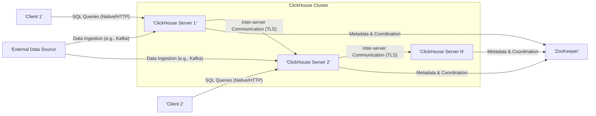
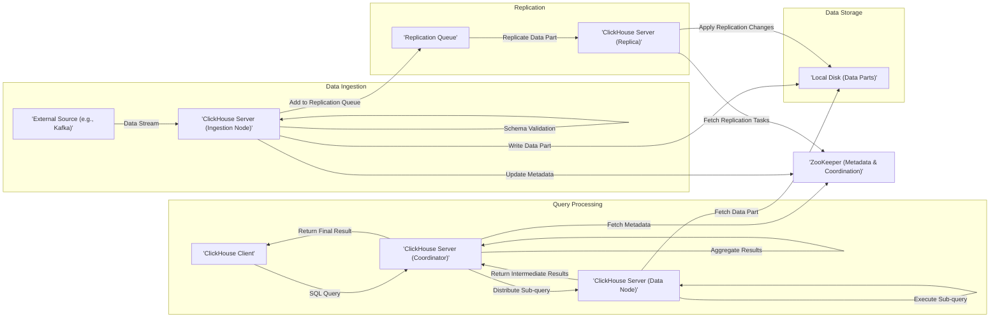

# Project Design Document: ClickHouse

**Version:** 1.1
**Date:** October 26, 2023
**Author:** AI Software Architect

## 1. Introduction

This document provides an enhanced architectural design of the ClickHouse project, an open-source column-oriented database management system (DBMS) tailored for real-time analytical data reporting. Building upon the initial design, this version offers greater detail and clarity, specifically to facilitate comprehensive threat modeling activities. It meticulously outlines the key components, data flow pathways, and interactions within the ClickHouse ecosystem, emphasizing aspects relevant to security analysis.

## 2. System Overview

ClickHouse excels in online analytical processing (OLAP) workloads due to its highly distributed and scalable architecture, enabling the efficient processing of massive datasets. Its core design principles are crucial for understanding potential security implications:

* **Column-Oriented Storage:** Data is organized by columns, optimizing analytical queries that typically access a subset of attributes. This impacts data access patterns and potential vulnerabilities related to column-level security.
* **Vectorized Query Execution:** Operations are performed on batches of data (vectors), enhancing CPU utilization. Understanding this can be relevant to performance-based denial-of-service attacks.
* **Data Compression:** Efficient compression algorithms minimize storage footprint and I/O overhead. The compression methods used might have implications for data exfiltration or manipulation.
* **Distributed Processing:** Queries are executed in parallel across multiple servers, introducing complexities in inter-node communication security.
* **Fault Tolerance:** Mechanisms are implemented to handle node failures, which is relevant to availability and resilience against attacks targeting specific nodes.

## 3. Key Components

The ClickHouse architecture is composed of several interacting components, each with its own security considerations.

* **ClickHouse Server:** The central component responsible for core functionalities:
    * **Data Storage Layer:**
        * Manages persistent storage of data in the column-oriented format on disk.
        * Implements the MergeTree family of table engines.
        * Handles data part management and merging.
    * **Query Processing Engine:**
        * Parses incoming SQL queries.
        * Optimizes query execution plans.
        * Executes queries, leveraging vectorized processing.
        * Manages query lifecycle and resource allocation.
    * **Replication Manager:**
        * Oversees data replication across multiple servers.
        * Manages the replication queue and synchronization processes.
        * Interacts with ZooKeeper for coordination.
    * **Sharding Coordinator:**
        * Determines data distribution across shards based on the sharding key.
        * Routes queries to the appropriate shards.
    * **Access Control Manager:**
        * Handles user authentication using various methods (native, LDAP, Kerberos).
        * Enforces authorization policies based on roles and privileges.
        * Manages row-level and column-level security rules.
    * **Inter-Server Communication Module:**
        * Facilitates communication with other ClickHouse servers within the cluster.
        * Uses a specific protocol for inter-node communication.
* **ClickHouse Client:** Provides interfaces for interacting with the ClickHouse server:
    * **Command-Line Interface (CLI):** A text-based tool for direct query execution and server management. Security depends on the security of the shell environment.
    * **HTTP Interface:** Enables interaction via HTTP requests, commonly used for application integration. Subject to web application security vulnerabilities.
    * **Native TCP Interface:** A binary protocol optimized for performance. Requires secure handling of the binary protocol.
    * **Language-Specific Drivers (JDBC, ODBC, Python, etc.):** Libraries that abstract the underlying communication protocols. Security depends on the driver implementation and secure usage.
* **ZooKeeper:** A critical external dependency for cluster coordination and metadata management:
    * **Metadata Repository:** Stores cluster topology, shard assignments, replication status, and configuration details. Compromise of ZooKeeper can have significant impact.
    * **Leader Election Mechanism:** Manages the election of leaders for replication and other distributed tasks. Vulnerabilities in leader election can lead to instability.
    * **Configuration Management Service:** Provides a central point for managing cluster-wide configurations. Incorrect configurations can introduce security risks.
    * **Distributed Locking Service:** Used to ensure consistency during distributed operations. Misuse or failure of locking can lead to data corruption.
* **MergeTree Engine Family:** The foundation of ClickHouse's storage and processing, with specific security implications depending on the chosen engine:
    * **Ordered Storage:** Data within a partition is sorted by a primary key, influencing data access patterns.
    * **Data Parts (Immutable):** Data is stored in immutable parts, which are periodically merged. Understanding the merging process is important for data integrity.
    * **Primary Key Indexes:** Used for efficient data retrieval, but also represent potential information leakage if not properly secured.
    * **Data Skipping Indexes:** Allow skipping irrelevant data during queries, impacting performance and potentially revealing data access patterns.
* **Replication Queue (within each server):**  Manages asynchronous replication of data:
    * Stores pending replication tasks.
    * Security depends on the integrity of the queue and access controls.
* **Inter-Process Communication (IPC):** Mechanisms used for communication between different processes within a ClickHouse server (e.g., shared memory, sockets). Needs to be secured to prevent local privilege escalation.

## 4. Data Flow

Understanding the data flow is crucial for identifying potential interception or manipulation points.

* **Data Ingestion:**
    * **Sources:** Data originates from diverse sources:
        * **Batch Files (CSV, TSV, Parquet, ORC):** Loaded via `clickhouse-client` or HTTP interface. Security depends on file integrity and access controls.
        * **Streaming Platforms (Kafka, Pulsar):** Data is continuously ingested. Security relies on secure integration with these platforms.
        * **Direct SQL `INSERT` Statements:** Data is inserted directly through client interfaces. Subject to SQL injection vulnerabilities.
        * **External Databases (using `MATERIALIZED VIEW` with `ENGINE = MySQL`/`PostgreSQL`):** Data is pulled from external systems. Security depends on the security of the external database connection.
    * **Process:**
        * Data is received by a ClickHouse server (often a designated ingestion node or the coordinator).
        * The server authenticates the source (if applicable).
        * The server validates the data format and schema.
        * The server determines the target shard(s) based on the sharding key and cluster configuration stored in ZooKeeper.
        * Data is written to local storage on the appropriate server(s) within immutable data parts.
        * For replicated tables, data is added to the local replication queue.
        * The replication process asynchronously copies data to other replicas, coordinated by ZooKeeper.
* **Query Processing:**
    * **Initiation:** A client sends a SQL query to a ClickHouse server (the coordinator node).
    * **Authentication and Authorization:** The server verifies the client's identity and permissions.
    * **Parsing and Optimization:** The coordinator parses the SQL query and optimizes the execution plan.
    * **Distributed Query Planning:** The coordinator identifies the shards and replicas containing the necessary data, consulting metadata in ZooKeeper.
    * **Sub-query Distribution:** The coordinator sends sub-queries to the relevant data nodes.
    * **Local Execution:** Each data node executes its assigned sub-query on its local data partitions.
    * **Result Aggregation:** Data nodes return intermediate results to the coordinator.
    * **Finalization:** The coordinator aggregates and merges the results from the data nodes.
    * **Response:** The final result is sent back to the client.
* **Data Replication (Detailed):**
    * When a write operation occurs on a replica (the leader), the changes are logged in the server's local replication queue.
    * Other replicas (followers) monitor this queue through ZooKeeper.
    * Followers pull the changes (data parts and metadata) from the leader's queue.
    * Followers apply the changes to their local storage, ensuring data consistency.
    * ZooKeeper maintains the replication status and ensures that all replicas are in sync.
* **Data Merging (Background Process):**
    * The MergeTree engine periodically merges smaller, immutable data parts into larger ones.
    * This process optimizes storage, applies data skipping indexes, and removes marked-for-deletion data.
    * The merging process involves reading data parts, combining them, and writing new, larger parts.

## 5. Deployment Model

The deployment model significantly impacts the threat landscape.

* **On-Premise Deployment:**
    * Requires managing the entire infrastructure, including network security, physical security, and server hardening.
    * Security is the responsibility of the deploying organization.
* **Cloud Infrastructure (IaaS - AWS, Azure, GCP):**
    * Leverages the cloud provider's infrastructure security.
    * Requires configuring network security groups, access control lists, and managing virtual machine security.
    * Shared responsibility model for security.
* **Containerized Environments (Docker, Kubernetes):**
    * Introduces container security considerations, including image security, container runtime security, and orchestration security.
    * Requires careful configuration of Kubernetes network policies and RBAC.
* **Managed ClickHouse Services (e.g., Altinity.Cloud, Aiven for ClickHouse):**
    * Offloads infrastructure management and some security responsibilities to the service provider.
    * Requires understanding the provider's security practices and compliance certifications.

## 6. Security Considerations (Enhanced)

This section expands on the security features and potential vulnerabilities.

* **Authentication Mechanisms:**
    * **Native Authentication:** Username/password stored in ClickHouse's internal user management system. Susceptible to brute-force attacks if not properly configured with strong passwords and account lockout policies.
    * **LDAP Authentication:** Integrates with corporate directory services. Security depends on the security of the LDAP server and the connection between ClickHouse and the LDAP server (e.g., using TLS).
    * **Kerberos Authentication:** Provides strong authentication using tickets. Requires proper configuration of Kerberos infrastructure.
    * **HTTP Basic Authentication:** Simple authentication over HTTP. Should only be used over HTTPS to prevent credential sniffing.
* **Authorization Controls:**
    * **Role-Based Access Control (RBAC):**  Permissions are granted to roles, and users are assigned to roles. Requires careful role definition and assignment to follow the principle of least privilege.
    * **Row-Level Security:**  Filters data access based on user attributes or conditions. Complex rules can be difficult to manage and may have performance implications.
    * **Column-Level Security:** Restricts access to specific columns. Important for protecting sensitive data.
    * **Database and Table Level Grants:** Granular control over access to specific databases and tables.
* **Network Security Measures:**
    * **TLS/SSL Encryption:** Encrypts communication between clients and servers and between servers in the cluster. Essential for protecting data in transit. Requires proper certificate management.
    * **Firewall Rules:** Restrict network access to specific ports (default 8123 for HTTP, 9000 for native) and IP addresses. Minimize exposure of ClickHouse instances.
    * **Virtual Private Networks (VPNs):** Can be used to create secure connections between clients and the ClickHouse cluster, especially in on-premise deployments.
* **Data Security Practices:**
    * **Data Encryption at Rest:** Encrypting data stored on disk protects against unauthorized access if storage media is compromised. Consider performance implications.
    * **Data Masking and Anonymization:** Obfuscating sensitive data for non-production environments or for users who don't need access to the raw data.
* **Auditing and Logging:**
    * **Query Logging:** Logs executed queries, including the user, timestamp, and query text. Crucial for identifying suspicious activity.
    * **Access Logging:** Tracks user logins, failed login attempts, and access to resources.
    * **System Logs:**  Monitor server logs for errors, warnings, and security-related events.
* **Potential Vulnerabilities:**
    * **SQL Injection:** If user input is not properly sanitized, attackers could inject malicious SQL code.
    * **Denial of Service (DoS):**  Overwhelming the server with requests or exploiting resource limitations.
    * **Authentication and Authorization Bypass:** Exploiting weaknesses in authentication or authorization mechanisms.
    * **Data Exfiltration:** Unauthorized access and extraction of sensitive data.
    * **Man-in-the-Middle Attacks:** Intercepting communication between clients and servers if TLS is not properly configured or used.
    * **ZooKeeper Compromise:**  If ZooKeeper is compromised, the entire ClickHouse cluster can be affected.
    * **Insecure Inter-Server Communication:** If communication between ClickHouse servers is not encrypted or authenticated, it could be vulnerable to attacks.

## 7. Diagrams

### 7.1. High-Level Architecture

### 7.2. Data Flow Diagram (Detailed)

## 8. Assumptions and Constraints

* This design document describes the general architecture of ClickHouse. Specific implementations and configurations may vary.
* Security features require proper configuration and adherence to best practices.
* The diagrams are illustrative and may not represent all possible interactions or edge cases.
* It is assumed that the threat model will consider the specific deployment environment and configuration.

## 9. Future Considerations

* Detailed design of specific security features, such as encryption key management or auditing configurations.
* Integration with security information and event management (SIEM) systems.
* Development of security best practices and hardening guides for ClickHouse deployments.

This enhanced design document provides a more detailed and security-focused view of the ClickHouse architecture, serving as a robust foundation for subsequent threat modeling exercises. The expanded descriptions of components, data flows, and security considerations aim to facilitate a deeper understanding of potential risks and vulnerabilities.