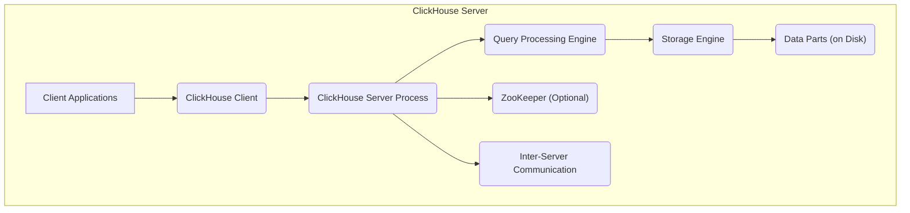
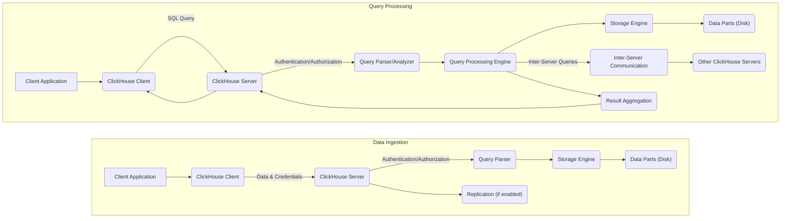

# Project Design Document: ClickHouse

**Version:** 1.1
**Date:** October 26, 2023
**Author:** AI Software Architect

## 1. Introduction

This document provides a detailed architectural overview of ClickHouse, an open-source column-oriented database management system (DBMS) designed for high-performance online analytical processing (OLAP). This design document is specifically created to serve as a foundation for subsequent threat modeling activities. It outlines the key components, data flows, and deployment considerations relevant to understanding the system's security posture. The information is based on the publicly available ClickHouse documentation and source code found at [https://github.com/clickhouse/clickhouse](https://github.com/clickhouse/clickhouse). This revision includes more detail on security-relevant aspects and clarifies certain components.

## 2. Goals and Objectives

The primary goal of this document is to provide a clear, comprehensive, and security-focused architectural description of ClickHouse to facilitate effective threat modeling. The objectives are to:

*   Identify and describe the major components of the ClickHouse system, emphasizing their security relevance.
*   Detail the interactions and data flow between these components, highlighting potential attack surfaces.
*   Outline common deployment architectures and their associated security implications.
*   Elaborate on key security-relevant aspects of the system, providing more specific examples.

## 3. System Overview

ClickHouse excels at analytical queries on large datasets due to its column-oriented storage, vectorized query execution, and distributed processing capabilities. Understanding these core features is crucial for identifying potential threats.

## 4. Key Components

This section provides a more detailed description of the major components of the ClickHouse system, with a focus on their security implications:

*   **Client Applications:** These are external entities interacting with ClickHouse. Security considerations include:
    *   Authentication mechanisms used by these applications.
    *   Authorization levels granted to these applications.
    *   Potential for compromised client applications to execute malicious queries.
    *   Types of data accessed and transmitted by these applications.
*   **ClickHouse Client:** This acts as an intermediary. Security considerations include:
    *   The client's role in handling credentials.
    *   Potential vulnerabilities in the client library itself.
    *   Secure handling of connection parameters.
*   **ClickHouse Server Process:** The core of the system, handling all requests. Key security aspects:
    *   **Network Interface:**  A critical entry point. Security concerns include unauthorized access and DoS attacks.
        *   Protocols supported (TCP, HTTP(S)).
        *   Configuration of listening interfaces.
        *   Rate limiting and connection limits.
    *   **Authentication and Authorization:** Controls access to the system.
        *   Supported authentication methods (native, LDAP, Kerberos, HTTP, TLS).
        *   Granularity of access control (databases, tables, columns, rows via policies).
        *   Management of user credentials and roles.
    *   **Query Parsing and Analysis:**  Potential for SQL injection vulnerabilities if not properly implemented.
        *   Complexity of the SQL dialect supported.
        *   Mechanisms for preventing malicious query construction.
    *   **Query Processing Engine:** Executes queries. Security considerations include:
        *   Resource consumption and potential for resource exhaustion attacks.
        *   Handling of user-defined functions (UDFs) and their potential security risks.
        *   Logging of executed queries for auditing.
    *   **Storage Engine:** Manages data persistence. Security aspects include:
        *   Data at rest encryption capabilities.
        *   Access controls on the underlying file system.
        *   Integrity checks for data parts.
        *   Management of different table engine security properties.
    *   **Replication and Distributed Query Engine:** Coordinates data across multiple servers. Security implications:
        *   Secure communication between server nodes.
        *   Authentication and authorization for inter-server communication.
        *   Consistency and integrity of replicated data.
*   **Data Parts (on Disk):** The physical storage of data. Security considerations:
    *   Physical security of the storage media.
    *   Encryption of data at rest.
    *   Access controls on the file system level.
    *   Potential for data breaches if storage is compromised.
*   **ZooKeeper (Optional):** Used for coordination in distributed setups. Security concerns:
    *   Access control to ZooKeeper nodes.
    *   Authentication mechanisms for ZooKeeper clients (ClickHouse servers).
    *   Potential impact of a compromised ZooKeeper instance on the ClickHouse cluster.
*   **Inter-Server Communication:**  Communication between ClickHouse server nodes in a cluster. Security considerations:
    *   Encryption of communication channels (e.g., using TLS).
    *   Authentication and authorization of communicating nodes.
    *   Protection against man-in-the-middle attacks.

## 5. Data Flow

Understanding the data flow is crucial for identifying where security controls need to be implemented and where vulnerabilities might exist.

1. **Data Ingestion:**
    *   A "Client Application" initiates data insertion.
    *   The "ClickHouse Client" transmits the data and credentials.
    *   The "ClickHouse Server" authenticates and authorizes the request.
    *   The "Query Parser" validates the insertion query.
    *   The "Storage Engine" writes data to "Data Parts (Disk)".
    *   "Replication" mechanisms (if enabled) copy data to other nodes.

2. **Query Processing:**
    *   A "Client Application" submits a query.
    *   The "ClickHouse Client" sends the query to the server.
    *   The "ClickHouse Server" authenticates and authorizes the request.
    *   The "Query Parser/Analyzer" processes the SQL query.
    *   The "Query Processing Engine" retrieves data from the "Storage Engine".
    *   For distributed queries, the engine communicates with "Other ClickHouse Servers" via "Inter-Server Communication".
    *   Results are aggregated and sent back through the "ClickHouse Client" to the "Client Application".

## 6. Deployment Architecture

The deployment architecture significantly impacts the security considerations.

*   **Single Server:** All components reside on a single machine. Security focuses on:
    *   Securing the operating system and the ClickHouse process.
    *   Local access controls to data files.
    *   Network security for client connections.
*   **Distributed Cluster:** Multiple servers work together. Security considerations expand to include:
    *   Secure communication between nodes (encryption, authentication).
    *   Secure configuration and management of ZooKeeper.
    *   Network segmentation and firewall rules between cluster nodes.
    *   Consistency and integrity of data replication.
*   **Cloud Deployments:** Leveraging cloud infrastructure introduces new security aspects:
    *   Security of the underlying cloud platform.
    *   Identity and Access Management (IAM) for cloud resources.
    *   Network security groups and virtual private clouds (VPCs).
    *   Encryption using cloud provider services (e.g., KMS).
    *   Compliance with cloud security best practices.

## 7. Security Considerations

This section expands on the initial security considerations, providing more specific examples and potential threats.

*   **Authentication:**
    *   **Threat:** Brute-force attacks against password-based authentication.
    *   **Mitigation:** Strong password policies, account lockout mechanisms, multi-factor authentication (if supported via integration).
    *   **Threat:** Compromised credentials leading to unauthorized access.
    *   **Mitigation:** Secure storage of credentials, regular password rotation, monitoring for suspicious login attempts.
*   **Authorization:**
    *   **Threat:** Privilege escalation by malicious users.
    *   **Mitigation:** Principle of least privilege, regular review of user roles and permissions.
    *   **Threat:** Data breaches due to overly permissive access controls.
    *   **Mitigation:** Granular access control policies, row-level security for sensitive data.
*   **Network Security:**
    *   **Threat:** Unauthorized access to the ClickHouse server.
    *   **Mitigation:** Firewalls, network segmentation, restricting listening interfaces.
    *   **Threat:** Man-in-the-middle attacks on client-server communication.
    *   **Mitigation:** Enforcing TLS encryption for all client connections.
    *   **Threat:** Denial of Service (DoS) attacks targeting the network interface.
    *   **Mitigation:** Rate limiting, connection limits, intrusion detection/prevention systems.
*   **Data Security:**
    *   **Threat:** Unauthorized access to data at rest.
    *   **Mitigation:** Disk encryption, file system permissions, access controls on data directories.
    *   **Threat:** Data breaches during data transfer.
    *   **Mitigation:** Enforcing TLS encryption for all network communication.
    *   **Threat:** Accidental or malicious data modification or deletion.
    *   **Mitigation:** Backup and recovery mechanisms, audit logging, data integrity checks.
*   **Auditing:**
    *   **Threat:** Lack of visibility into security events.
    *   **Mitigation:** Enabling and regularly reviewing audit logs, integrating with security information and event management (SIEM) systems.
*   **Input Validation:**
    *   **Threat:** SQL injection attacks.
    *   **Mitigation:** Parameterized queries, input sanitization, using prepared statements.
*   **Denial of Service (DoS) Protection:**
    *   **Threat:** Resource exhaustion due to malicious queries.
    *   **Mitigation:** Query timeouts, resource limits (memory, CPU), monitoring resource usage.
*   **Dependencies:**
    *   **Threat:** Vulnerabilities in third-party libraries.
    *   **Mitigation:** Regularly updating dependencies, vulnerability scanning.
*   **ZooKeeper Security (for distributed setups):**
    *   **Threat:** Unauthorized access or manipulation of cluster metadata.
    *   **Mitigation:** Authentication and authorization for ZooKeeper clients, secure configuration of ZooKeeper nodes.

## 8. Dependencies

ClickHouse relies on the following external components, which should be considered during security assessments:

*   **Operating System:**  Security of the underlying OS is paramount.
*   **C++ Standard Library:** Potential vulnerabilities in the standard library.
*   **Boost Libraries:**  Regularly check for vulnerabilities in Boost.
*   **Compression Libraries (zlib, lz4, brotli):**  Ensure these are up-to-date.
*   **gRPC:** Secure configuration and potential vulnerabilities in gRPC.
*   **ZooKeeper (Optional):**  Requires its own security considerations.
*   **OpenSSL/BoringSSL:** Critical for cryptographic operations; ensure it's patched and configured securely.

## 9. Conclusion

This revised document provides a more detailed and security-focused architectural overview of ClickHouse. It highlights key components, data flows, and deployment considerations relevant for threat modeling. The expanded security considerations section offers specific examples of potential threats and mitigations. This document serves as a more robust foundation for identifying vulnerabilities and developing effective security strategies for ClickHouse deployments. Subsequent threat modeling sessions should leverage this information to conduct a comprehensive security analysis.
