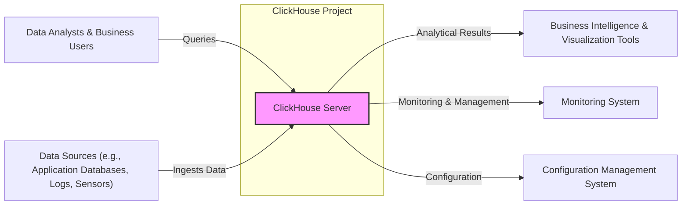
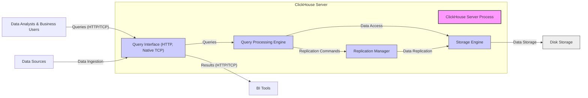
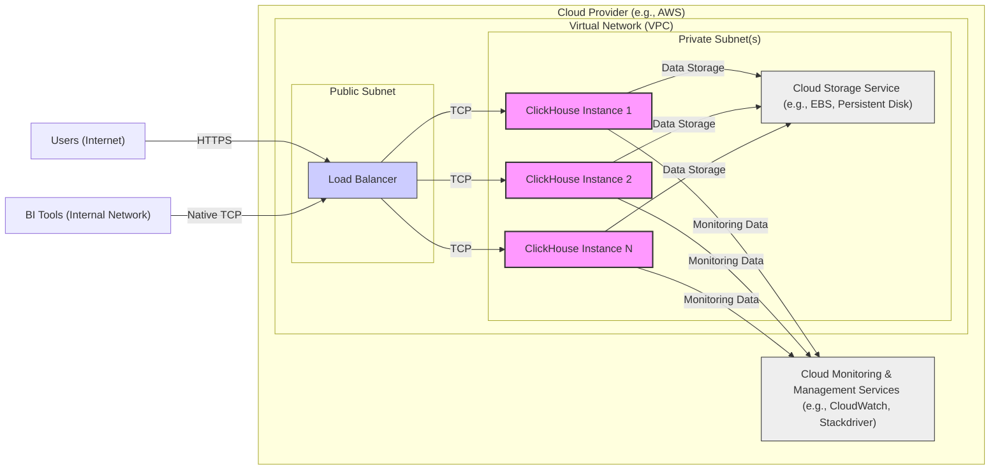
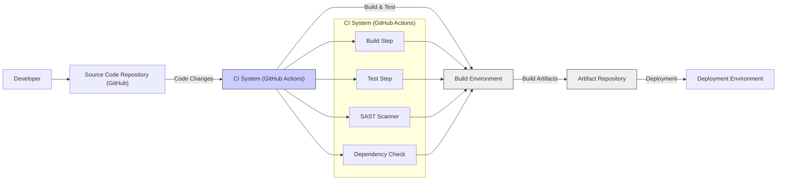

# BUSINESS POSTURE

ClickHouse is a fast open-source column-oriented database management system that allows users to generate analytical data reports in real-time. The primary business goal for ClickHouse is to provide a highly performant and scalable solution for online analytical processing (OLAP). This enables businesses to gain insights from large datasets quickly, supporting data-driven decision-making.

Business priorities include:

- Performance: Delivering query results with minimal latency is critical for interactive analytics.
- Scalability: Handling ever-increasing data volumes and user concurrency is essential.
- Reliability: Ensuring data integrity and system availability is paramount for business continuity.
- Open Source: Maintaining a vibrant open-source community and ecosystem is important for adoption and innovation.

Key business risks associated with ClickHouse include:

- Data breaches: Unauthorized access to sensitive analytical data could lead to financial loss, reputational damage, and regulatory penalties.
- Data integrity issues: Corruption or loss of data could compromise the accuracy of analytical insights and business decisions.
- Availability disruptions: System downtime can interrupt critical analytical processes and impact business operations.
- Performance degradation: Slow query performance can hinder user productivity and diminish the value of real-time analytics.
- Supply chain vulnerabilities: Compromised dependencies in the build or deployment process could introduce security weaknesses.

# SECURITY POSTURE

Existing Security Controls:

- security control: Access control lists (ACLs) for database access. (Implementation details would be in ClickHouse documentation and configuration)
- security control: Role-based access control (RBAC) for managing user permissions. (Implementation details would be in ClickHouse documentation and configuration)
- security control: Encryption of data in transit using TLS/SSL. (Implementation details would be in ClickHouse documentation and configuration)
- security control: Encryption of data at rest. (Implementation details would be in ClickHouse documentation and configuration, likely configurable)
- security control: Regular security audits and vulnerability scanning. (Likely performed by ClickHouse developers and community, details in public security reports if available)
- security control: Secure software development lifecycle (SSDLC) practices. (Assumed for a project of this scale, but details are not explicitly provided in the input)
- security control: Code reviews and static analysis. (Likely part of the development process, details not explicitly provided)
- security control: Input validation and sanitization. (Expected to be implemented within the database engine, details in code and documentation)

Accepted Risks:

- accepted risk: Complexity of configuration can lead to misconfigurations and security vulnerabilities if not properly managed.
- accepted risk: Open-source nature implies reliance on community for vulnerability patching and security updates, which may have SLAs different from commercial offerings.
- accepted risk: Potential for SQL injection vulnerabilities if input validation is not comprehensive across all features.

Recommended Security Controls:

- security control: Implement automated security testing (SAST/DAST) in the CI/CD pipeline.
- security control: Establish a vulnerability disclosure program to encourage responsible reporting of security issues.
- security control: Implement security information and event management (SIEM) integration for monitoring and alerting on security events.
- security control: Regularly perform penetration testing to identify and remediate vulnerabilities.
- security control: Implement database activity monitoring (DAM) to track and audit database access and operations.

Security Requirements:

- Authentication:
    - Requirement: Securely authenticate users accessing the ClickHouse database.
    - Requirement: Support multiple authentication mechanisms (e.g., username/password, LDAP, Kerberos).
    - Requirement: Enforce strong password policies.
- Authorization:
    - Requirement: Implement granular access control to manage user permissions on databases, tables, and operations.
    - Requirement: Follow the principle of least privilege when assigning permissions.
    - Requirement: Audit authorization decisions and access attempts.
- Input Validation:
    - Requirement: Validate all user inputs to prevent injection attacks (e.g., SQL injection).
    - Requirement: Sanitize inputs before processing and storing them in the database.
    - Requirement: Implement input validation at multiple layers (e.g., application and database).
- Cryptography:
    - Requirement: Use strong encryption algorithms for data in transit (TLS/SSL).
    - Requirement: Use strong encryption algorithms for data at rest (e.g., AES-256).
    - Requirement: Securely manage cryptographic keys.

# DESIGN

## C4 CONTEXT

Context Diagram Elements:

- Element:
    - Name: "ClickHouse Server"
    - Type: Software System
    - Description: The ClickHouse database management system, responsible for storing and processing analytical data. It provides high-performance query capabilities for large datasets.
    - Responsibilities:
        - Data storage and management.
        - Query processing and execution.
        - Data ingestion from various sources.
        - Data replication and distribution.
        - User authentication and authorization.
    - Security controls:
        - Access control lists (ACLs).
        - Role-based access control (RBAC).
        - TLS/SSL encryption for network communication.
        - Data at rest encryption.
        - Input validation and sanitization.
        - Audit logging.

- Element:
    - Name: "Data Analysts & Business Users"
    - Type: Person
    - Description: Users who interact with ClickHouse to perform data analysis, generate reports, and gain business insights.
    - Responsibilities:
        - Formulating and executing analytical queries.
        - Interpreting query results and creating visualizations.
        - Making data-driven decisions.
    - Security controls:
        - Authentication to access ClickHouse.
        - Authorization to access specific data and operations.

- Element:
    - Name: "Data Sources (e.g., Application Databases, Logs, Sensors)"
    - Type: Software System
    - Description: External systems that generate data ingested into ClickHouse for analysis. These can include transactional databases, application logs, sensor data streams, etc.
    - Responsibilities:
        - Generating and providing data to ClickHouse.
        - Ensuring data quality and consistency.
    - Security controls:
        - Access control to data sources to prevent unauthorized data extraction.
        - Secure data transfer mechanisms to ClickHouse.

- Element:
    - Name: "Business Intelligence & Visualization Tools"
    - Type: Software System
    - Description: Tools used by data analysts and business users to visualize and interact with the analytical results generated by ClickHouse. Examples include Tableau, Grafana, custom dashboards.
    - Responsibilities:
        - Visualizing data from ClickHouse.
        - Providing user interfaces for data exploration and reporting.
    - Security controls:
        - Authentication and authorization to access BI tools.
        - Secure communication with ClickHouse.

- Element:
    - Name: "Monitoring System"
    - Type: Software System
    - Description: System used to monitor the health, performance, and security of the ClickHouse server. Examples include Prometheus, Grafana, custom monitoring solutions.
    - Responsibilities:
        - Collecting metrics and logs from ClickHouse.
        - Alerting on anomalies and security events.
        - Providing dashboards for monitoring ClickHouse.
    - Security controls:
        - Secure access to monitoring data and dashboards.
        - Secure communication with ClickHouse for data collection.

- Element:
    - Name: "Configuration Management System"
    - Type: Software System
    - Description: System used to manage the configuration of the ClickHouse server. Examples include Ansible, Chef, Puppet.
    - Responsibilities:
        - Centralized configuration management of ClickHouse instances.
        - Automation of configuration changes and deployments.
    - Security controls:
        - Secure access to configuration management system.
        - Version control of configuration changes.
        - Audit logging of configuration changes.

## C4 CONTAINER

Container Diagram Elements:

- Element:
    - Name: "ClickHouse Server Process"
    - Type: Container - Process
    - Description: The main ClickHouse server process, encompassing all core functionalities.
    - Responsibilities:
        - Orchestrating query processing, data storage, and replication.
        - Managing user connections and requests.
        - Providing APIs for data ingestion and querying.
    - Security controls:
        - Process isolation.
        - Resource limits.
        - Logging and auditing.

- Element:
    - Name: "Query Interface (HTTP, Native TCP)"
    - Type: Container - Application Interface
    - Description: Provides interfaces for clients to interact with ClickHouse, including HTTP and native TCP protocols.
    - Responsibilities:
        - Accepting client connections and requests.
        - Authenticating and authorizing users.
        - Handling query parsing and routing.
        - Returning query results to clients.
    - Security controls:
        - Authentication mechanisms (username/password, LDAP, Kerberos).
        - TLS/SSL encryption for network communication.
        - Input validation and sanitization for queries.
        - Rate limiting and connection throttling.

- Element:
    - Name: "Storage Engine"
    - Type: Container - Data Store
    - Description: Manages the storage and retrieval of data on disk. ClickHouse uses a column-oriented storage engine optimized for analytical workloads.
    - Responsibilities:
        - Storing data in columnar format.
        - Efficient data retrieval for query processing.
        - Data compression and indexing.
        - Data at rest encryption.
    - Security controls:
        - Access control to data files on disk.
        - Data at rest encryption.
        - Data integrity checks (checksums).

- Element:
    - Name: "Replication Manager"
    - Type: Container - Application Component
    - Description: Manages data replication across multiple ClickHouse instances for high availability and fault tolerance.
    - Responsibilities:
        - Synchronizing data between replicas.
        - Handling node failures and failover.
        - Ensuring data consistency across replicas.
    - Security controls:
        - Secure communication between replicas (TLS/SSL).
        - Authentication and authorization for replication operations.

- Element:
    - Name: "Query Processing Engine"
    - Type: Container - Application Component
    - Description: Responsible for parsing, optimizing, and executing SQL queries.
    - Responsibilities:
        - SQL parsing and validation.
        - Query optimization and planning.
        - Query execution and data retrieval from storage engine.
    - Security controls:
        - SQL injection prevention through input validation and parameterized queries.
        - Resource limits for query execution to prevent denial-of-service.

- Element:
    - Name: "Disk Storage"
    - Type: Infrastructure
    - Description: Physical or virtual disk storage where ClickHouse data is persisted.
    - Responsibilities:
        - Providing persistent storage for ClickHouse data.
        - Ensuring data durability and availability.
    - Security controls:
        - Physical security of storage media.
        - Access control to storage volumes.
        - Data at rest encryption at the storage level (if applicable).

## DEPLOYMENT

Deployment Architecture Option: Cloud-based Deployment (e.g., AWS, GCP, Azure)

Deployment Diagram Elements (Cloud-based Deployment):

- Element:
    - Name: "Load Balancer"
    - Type: Infrastructure - Network Device
    - Description: Distributes incoming client requests across multiple ClickHouse instances for high availability and scalability.
    - Responsibilities:
        - Load balancing traffic to ClickHouse instances.
        - SSL termination.
        - Health checks for ClickHouse instances.
    - Security controls:
        - DDoS protection.
        - Web Application Firewall (WAF) integration (optional).
        - Access control lists (ACLs).
        - TLS/SSL encryption.

- Element:
    - Name: "ClickHouse Instance 1, 2, N"
    - Type: Infrastructure - Compute Instance (Virtual Machine)
    - Description: Virtual machines running the ClickHouse server software. Multiple instances are deployed for redundancy and scalability.
    - Responsibilities:
        - Running the ClickHouse server process.
        - Processing queries and managing data.
    - Security controls:
        - Operating system hardening.
        - Security patching.
        - Instance isolation within the virtual network.
        - Security groups/firewalls to restrict network access.
        - Data at rest encryption on instance storage.

- Element:
    - Name: "Cloud Storage Service (e.g., EBS, Persistent Disk)"
    - Type: Infrastructure - Storage Service
    - Description: Cloud-based block storage service used to persist ClickHouse data.
    - Responsibilities:
        - Providing persistent and scalable storage for ClickHouse data.
        - Data replication and durability.
    - Security controls:
        - Data at rest encryption provided by the cloud provider.
        - Access control policies to storage volumes.
        - Backup and recovery mechanisms.

- Element:
    - Name: "Cloud Monitoring & Management Services (e.g., CloudWatch, Stackdriver)"
    - Type: Infrastructure - Monitoring Service
    - Description: Cloud-native monitoring and management services used to monitor ClickHouse instances and infrastructure.
    - Responsibilities:
        - Collecting metrics and logs from ClickHouse instances.
        - Providing dashboards and alerts.
        - Infrastructure monitoring and management.
    - Security controls:
        - Secure access to monitoring data and dashboards.
        - Audit logging of monitoring activities.
        - Integration with security information and event management (SIEM) systems.

- Element:
    - Name: "Virtual Network (VPC)"
    - Type: Infrastructure - Network
    - Description: Isolated network within the cloud provider environment, providing network segmentation for security.
    - Responsibilities:
        - Network isolation for ClickHouse deployment.
        - Routing and network connectivity.
        - Security boundaries between public and private subnets.
    - Security controls:
        - Network access control lists (NACLs).
        - Security groups/firewalls.
        - Network segmentation.

## BUILD

Build Process Description:

1. Developer commits code changes to the Source Code Repository (GitHub).
2. CI System (GitHub Actions) is triggered by code changes.
3. CI System orchestrates the build process, including:
    - Build Step: Compiles the source code and creates build artifacts.
    - Test Step: Executes automated tests (unit, integration, etc.) to verify code functionality.
    - SAST Scanner: Static Application Security Testing (SAST) scanner analyzes the source code for potential security vulnerabilities.
    - Dependency Check: Analyzes project dependencies for known vulnerabilities.
4. Build Environment: A controlled environment where the build, test, and security scans are executed.
5. Artifact Repository: Stores the build artifacts (e.g., binaries, packages).
6. Deployment Environment: Artifacts from the repository are deployed to the target deployment environment.

Build Process Security Controls:

- security control: Secure coding practices enforced through code reviews and developer training.
- security control: Static Application Security Testing (SAST) integrated into the CI pipeline to detect vulnerabilities in source code.
- security control: Dependency scanning to identify and manage vulnerable dependencies.
- security control: Automated testing (unit, integration, security tests) to verify code functionality and security.
- security control: Build environment isolation to prevent contamination and ensure build reproducibility.
- security control: Access control to the Artifact Repository to protect build artifacts from unauthorized access.
- security control: Code signing of build artifacts to ensure integrity and authenticity.
- security control: Audit logging of build process activities.
- security control: Infrastructure as Code (IaC) for build environment provisioning to ensure consistency and security.

# RISK ASSESSMENT

Critical Business Processes:

- Real-time analytical reporting: Providing timely insights for business decision-making.
- Data-driven decision support: Enabling users to make informed decisions based on data analysis.
- Business performance monitoring: Tracking key performance indicators (KPIs) and identifying trends.
- Fraud detection: Analyzing data to identify and prevent fraudulent activities.
- Log analysis and security monitoring: Analyzing logs for security events and incident response.

Data Sensitivity:

- Analytical data: Sensitivity depends on the nature of the data being analyzed. It can range from publicly available data to highly sensitive customer data, financial data, or personal identifiable information (PII).
- Metadata: Database schemas, user information, access logs, and audit logs can also be sensitive and require protection.
- Configuration data: Database configuration files, connection strings, and encryption keys are highly sensitive and must be protected.

Data Sensitivity Levels (example, needs to be defined based on actual data):

- Public: Publicly available aggregated data. Low sensitivity.
- Internal: Internal business data, not intended for public disclosure. Medium sensitivity.
- Confidential: Sensitive business data, requiring strict access control. High sensitivity.
- Highly Confidential: PII, financial data, or other regulated data. Very high sensitivity.

# QUESTIONS & ASSUMPTIONS

Questions:

- What is the specific business context and use case for ClickHouse? (e.g., AdTech analytics, IoT data analysis, security monitoring).
- What types of data will be stored in ClickHouse and what is their sensitivity level?
- What are the specific compliance requirements (e.g., GDPR, HIPAA, PCI DSS)?
- What are the performance and scalability requirements for ClickHouse?
- What is the expected user base and access patterns?
- What existing security infrastructure and tools are in place?
- What is the organization's risk appetite and security maturity level?
- Are there any specific security incidents or threats that are of particular concern?
- What is the process for vulnerability management and incident response?

Assumptions:

- Assumption: ClickHouse is used for online analytical processing (OLAP) workloads.
- Assumption: Data stored in ClickHouse includes some level of sensitive business information.
- Assumption: Security is a relevant concern for the deployment and operation of ClickHouse.
- Assumption: The organization deploying ClickHouse has some existing security controls in place.
- Assumption: The deployment environment is a cloud-based infrastructure.
- Assumption: Standard secure software development lifecycle practices are generally followed for ClickHouse development.