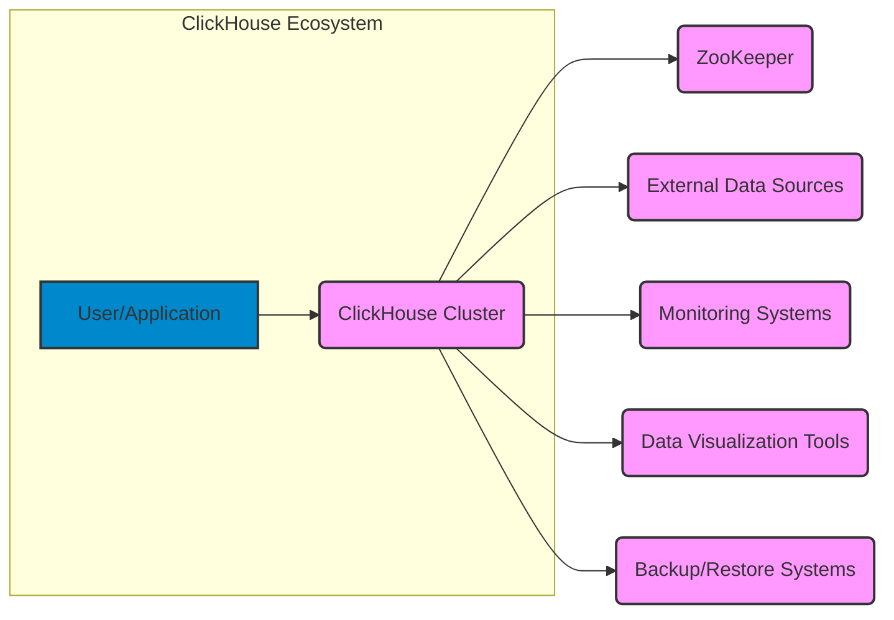
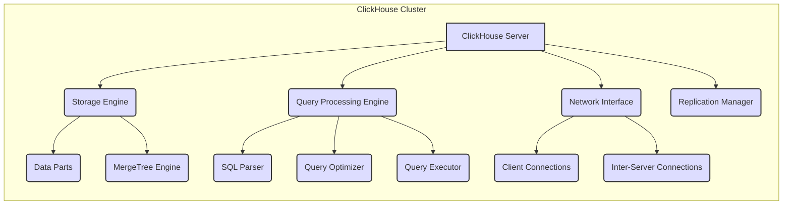
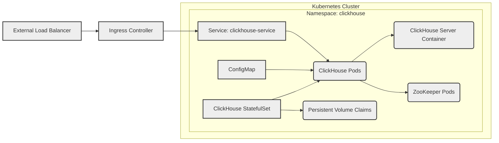

Okay, let's create a design document for ClickHouse, based on the provided GitHub repository.

# BUSINESS POSTURE

ClickHouse is a high-performance, column-oriented, open-source SQL database management system (DBMS) designed for online analytical processing (OLAP).  It's built to process analytical queries over massive datasets with extremely low latency.

Business Priorities:

*   Provide extremely fast query performance for analytical workloads.
*   Handle massive datasets (petabytes).
*   Offer high availability and fault tolerance.
*   Maintain scalability to accommodate growing data volumes and user demands.
*   Provide a cost-effective solution compared to traditional data warehousing solutions.
*   Ensure data integrity and consistency.
*   Offer a flexible and extensible architecture.
*   Maintain an active open-source community and ecosystem.

Business Goals:

*   Enable real-time analytics and reporting for businesses.
*   Become a leading choice for OLAP workloads.
*   Attract and retain a large user and contributor base.
*   Support a wide range of data integration and visualization tools.

Most Important Business Risks:

*   Data loss or corruption due to software bugs, hardware failures, or operational errors.
*   Performance degradation or unavailability impacting business operations.
*   Security breaches leading to unauthorized data access or modification.
*   Inability to scale to meet future data growth and user demand.
*   Competition from other OLAP databases and cloud-based data warehousing solutions.
*   Lack of adoption or negative community perception.

# SECURITY POSTURE

Existing Security Controls:

*   security control: Access control lists (ACLs) for managing user permissions and privileges. (Implemented in SQL and configuration files).
*   security control: User authentication via native users, LDAP, Kerberos, and other methods. (Implemented in server configuration and authentication modules).
*   security control: Network policies and firewall rules to restrict network access. (Implemented at the infrastructure and operating system level).
*   security control: Data encryption at rest (using `encryption_codecs` for table data). (Implemented in storage engine).
*   security control: Data encryption in transit (using TLS/SSL for client-server and inter-server communication). (Implemented in network communication layer).
*   security control: Auditing of user actions and system events. (Implemented via query log, trace log, and system tables).
*   security control: Regular security updates and vulnerability patching. (Managed through the release process and community contributions).
*   security control: Input validation to prevent SQL injection and other code injection vulnerabilities. (Implemented in SQL parser and query execution engine).
*   security control: Row-level security. (Implemented in SQL and configuration files).
*   security control: Quotas and resource limits to prevent denial-of-service attacks. (Implemented in server configuration).

Accepted Risks:

*   accepted risk: Complexity of configuration and management, potentially leading to misconfigurations and security vulnerabilities.
*   accepted risk: Reliance on third-party libraries and dependencies, which may introduce vulnerabilities.
*   accepted risk: Potential for performance bottlenecks or resource exhaustion under extreme load conditions.
*   accepted risk: The inherent risks associated with open-source software, including the potential for undiscovered vulnerabilities.

Recommended Security Controls:

*   Implement a robust vulnerability management program with regular penetration testing and security audits.
*   Enhance monitoring and alerting for security-related events.
*   Provide more granular access control options, such as attribute-based access control (ABAC).
*   Implement data masking or anonymization capabilities for sensitive data.
*   Integrate with security information and event management (SIEM) systems.

Security Requirements:

*   Authentication:
    *   Support for strong password policies.
    *   Multi-factor authentication (MFA) integration.
    *   Centralized authentication and authorization using external identity providers (e.g., Active Directory, Okta).

*   Authorization:
    *   Fine-grained access control based on roles, attributes, and data context.
    *   Support for least privilege principle.
    *   Regular review and auditing of user permissions.

*   Input Validation:
    *   Strict validation of all user inputs to prevent SQL injection, cross-site scripting (XSS), and other injection attacks.
    *   Use of parameterized queries and prepared statements.
    *   Input sanitization and encoding.

*   Cryptography:
    *   Use of strong, industry-standard cryptographic algorithms and protocols.
    *   Secure key management practices.
    *   Regular review and update of cryptographic configurations.
    *   Compliance with relevant cryptographic standards and regulations.

# DESIGN

## C4 CONTEXT



C4 Context Element Descriptions:

*   1.  Name: User/Application
    *   Type: Person
    *   Description: Represents users or applications that interact with the ClickHouse cluster to submit queries, ingest data, or manage the system.
    *   Responsibilities:
        *   Sending SQL queries to ClickHouse.
        *   Ingesting data into ClickHouse.
        *   Managing ClickHouse configuration and resources.
        *   Visualizing data using external tools.
    *   Security controls:
        *   Authentication and authorization mechanisms.
        *   Input validation and sanitization.
        *   Secure communication channels (TLS/SSL).

*   2.  Name: ClickHouse Cluster
    *   Type: System
    *   Description: The core ClickHouse system, consisting of one or more ClickHouse servers working together to store and process data.
    *   Responsibilities:
        *   Storing and managing data.
        *   Processing SQL queries.
        *   Replicating data for high availability and fault tolerance.
        *   Managing metadata.
    *   Security controls:
        *   Access control lists (ACLs).
        *   User authentication.
        *   Data encryption at rest and in transit.
        *   Auditing.
        *   Input validation.
        *   Quotas and resource limits.

*   3.  Name: ZooKeeper
    *   Type: System
    *   Description: A distributed coordination service used by ClickHouse for managing cluster metadata, configuration, and distributed synchronization.
    *   Responsibilities:
        *   Storing and managing ClickHouse cluster metadata.
        *   Coordinating distributed operations.
        *   Ensuring consistency and fault tolerance.
    *   Security controls:
        *   Access control lists (ACLs).
        *   Authentication.
        *   Secure communication channels (TLS/SSL).

*   4.  Name: External Data Sources
    *   Type: System
    *   Description: Represents various external systems that ClickHouse can ingest data from, such as message queues (Kafka), databases (MySQL, PostgreSQL), object storage (S3), and file systems (HDFS).
    *   Responsibilities:
        *   Providing data to be ingested into ClickHouse.
    *   Security controls:
        *   Authentication and authorization mechanisms specific to each data source.
        *   Secure communication channels (TLS/SSL).

*   5.  Name: Monitoring Systems
    *   Type: System
    *   Description: Systems used to monitor the health, performance, and security of the ClickHouse cluster, such as Prometheus, Grafana, and other monitoring tools.
    *   Responsibilities:
        *   Collecting and visualizing metrics.
        *   Generating alerts for critical events.
        *   Providing insights into system performance and behavior.
    *   Security controls:
        *   Authentication and authorization mechanisms.
        *   Secure communication channels (TLS/SSL).

*   6.  Name: Data Visualization Tools
    *   Type: System
    *   Description: Tools used to visualize data stored in ClickHouse, such as Grafana, Tableau, Superset, and other BI tools.
    *   Responsibilities:
        *   Connecting to ClickHouse and querying data.
        *   Creating visualizations and dashboards.
    *   Security controls:
        *   Authentication and authorization mechanisms.
        *   Secure communication channels (TLS/SSL).

*   7.  Name: Backup/Restore Systems
    *   Type: System
    *   Description: Systems used to back up and restore ClickHouse data, such as cloud storage services (S3, GCS) or dedicated backup tools.
    *   Responsibilities:
        *   Creating backups of ClickHouse data.
        *   Restoring data from backups.
    *   Security controls:
        *   Authentication and authorization mechanisms.
        *   Data encryption at rest and in transit.
        *   Access controls to backup storage.

## C4 CONTAINER



C4 Container Element Descriptions:

*   1.  Name: ClickHouse Server
    *   Type: Container
    *   Description: A single instance of the ClickHouse server process.  Multiple servers form a cluster.
    *   Responsibilities:
        *   Handling client connections.
        *   Processing queries.
        *   Managing data storage and retrieval.
        *   Coordinating with other servers in the cluster.
    *   Security controls:
        *   Authentication and authorization.
        *   Network access control.
        *   Input validation.
        *   Resource limits.

*   2.  Name: Storage Engine
    *   Type: Container
    *   Description: The component responsible for managing data storage, retrieval, and organization on disk.
    *   Responsibilities:
        *   Storing data in a columnar format.
        *   Managing data parts and indexes.
        *   Performing data compression and encryption.
        *   Handling data merging and mutations.
    *   Security controls:
        *   Data encryption at rest.
        *   Access control to data files.

*   3.  Name: Query Processing Engine
    *   Type: Container
    *   Description: The component responsible for parsing, optimizing, and executing SQL queries.
    *   Responsibilities:
        *   Parsing SQL queries into an abstract syntax tree (AST).
        *   Optimizing the query execution plan.
        *   Executing the query and retrieving data from the storage engine.
        *   Performing aggregations, filtering, and other operations.
    *   Security controls:
        *   Input validation to prevent SQL injection.
        *   Access control checks.

*   4.  Name: Network Interface
    *   Type: Container
    *   Description: The component responsible for handling network communication with clients and other ClickHouse servers.
    *   Responsibilities:
        *   Accepting client connections.
        *   Sending and receiving data.
        *   Managing inter-server communication for replication and distributed queries.
    *   Security controls:
        *   TLS/SSL encryption for secure communication.
        *   Network firewall rules.

*   5.  Name: Replication Manager
    *   Type: Container
    *   Description: The component responsible for managing data replication between ClickHouse servers in a cluster.
    *   Responsibilities:
        *   Coordinating data replication.
        *   Ensuring data consistency.
        *   Handling failover and recovery.
    *   Security controls:
        *   Secure communication channels (TLS/SSL).
        *   Data integrity checks.

*   6.  Name: Data Parts
    *   Type: Container
    *   Description: The fundamental unit of data storage in ClickHouse.  Each data part contains a subset of the table data, stored in a columnar format.
    *   Responsibilities:
        *   Storing data in a compressed and optimized format.
    *   Security controls:
        *   Data encryption at rest.

*   7.  Name: MergeTree Engine
    *   Type: Container
    *   Description: The most commonly used storage engine in ClickHouse, providing high performance and efficient data storage.
    *   Responsibilities:
        *   Managing data parts.
        *   Performing background merges of data parts.
        *   Handling data replication.
    *   Security controls:
        *   Data encryption at rest.

*   8.  Name: SQL Parser
    *   Type: Container
    *   Description: Parses SQL queries into an abstract syntax tree (AST).
    *   Responsibilities:
        *   Lexical analysis.
        *   Syntactic analysis.
        *   Semantic analysis.
    *   Security controls:
        *   Input validation.

*   9.  Name: Query Optimizer
    *   Type: Container
    *   Description: Optimizes the query execution plan for efficient data retrieval.
    *   Responsibilities:
        *   Choosing the best execution strategy.
        *   Selecting appropriate indexes.
        *   Optimizing data access paths.
    *   Security controls: N/A

*   10. Name: Query Executor
    *   Type: Container
    *   Description: Executes the optimized query plan and retrieves data from the storage engine.
    *   Responsibilities:
        *   Fetching data from storage.
        *   Performing aggregations, filtering, and other operations.
        *   Returning results to the client.
    *   Security controls: N/A

*   11. Name: Client Connections
    *   Type: Container
    *   Description: Represents connections from clients (users or applications) to the ClickHouse server.
    *   Responsibilities:
        *   Handling client requests.
        *   Sending query results to clients.
    *   Security controls:
        *   Authentication.
        *   TLS/SSL encryption.

*   12. Name: Inter-Server Connections
    *   Type: Container
    *   Description: Represents connections between ClickHouse servers in a cluster, used for replication and distributed queries.
    *   Responsibilities:
        *   Transferring data between servers.
        *   Coordinating distributed operations.
    *   Security controls:
        *   Authentication.
        *   TLS/SSL encryption.

## DEPLOYMENT

Possible Deployment Solutions:

1.  Manual Installation: Installing ClickHouse directly on bare metal servers or virtual machines.
2.  Docker Containers: Deploying ClickHouse using Docker containers.
3.  Kubernetes: Deploying ClickHouse on a Kubernetes cluster using a StatefulSet or a custom operator.
4.  Cloud Provider Managed Services: Using managed ClickHouse services offered by cloud providers (e.g., Yandex Cloud Managed Service for ClickHouse, AWS Marketplace offerings).

Chosen Solution (for detailed description): Kubernetes

Deployment Diagram (Kubernetes):



Deployment Element Descriptions:

*   1.  Name: Kubernetes Cluster
    *   Type: Node
    *   Description: The Kubernetes cluster where ClickHouse is deployed.
    *   Responsibilities:
        *   Managing and orchestrating containers.
        *   Providing networking, storage, and other resources.
    *   Security controls:
        *   Kubernetes RBAC (Role-Based Access Control).
        *   Network policies.
        *   Pod security policies.
        *   Secrets management.

*   2.  Name: Namespace: clickhouse
    *   Type: Node
    *   Description: A Kubernetes namespace used to isolate the ClickHouse deployment.
    *   Responsibilities:
        *   Providing a logical grouping for ClickHouse resources.
    *   Security controls:
        *   Namespace-level RBAC.

*   3.  Name: ClickHouse StatefulSet
    *   Type: Node
    *   Description: A Kubernetes StatefulSet used to manage the ClickHouse pods, ensuring ordered deployment and persistent storage.
    *   Responsibilities:
        *   Managing the deployment and scaling of ClickHouse pods.
        *   Maintaining stable network identities for pods.
        *   Managing persistent volume claims.
    *   Security controls: N/A

*   4.  Name: ClickHouse Pods
    *   Type: Node
    *   Description: Kubernetes pods running the ClickHouse server containers.
    *   Responsibilities:
        *   Running the ClickHouse server process.
    *   Security controls:
        *   Pod security policies.
        *   Resource limits.

*   5.  Name: Persistent Volume Claims
    *   Type: Node
    *   Description: Kubernetes Persistent Volume Claims used to request persistent storage for ClickHouse data.
    *   Responsibilities:
        *   Providing persistent storage for ClickHouse data.
    *   Security controls:
        *   Storage encryption (if supported by the storage provider).
        *   Access controls to the underlying storage.

*   6.  Name: ClickHouse Server Container
    *   Type: Node
    *   Description: The Docker container running the ClickHouse server process.
    *   Responsibilities:
        *   Running the ClickHouse server.
    *   Security controls:
        *   Container image security scanning.
        *   Running as a non-root user.

*   7.  Name: ZooKeeper Pods
    *   Type: Node
    *   Description: Kubernetes pods running ZooKeeper, used for ClickHouse cluster coordination.  (Could be a separate StatefulSet).
    *   Responsibilities:
        *   Running the ZooKeeper server process.
    *   Security controls:
        *   Pod security policies.
        *   Resource limits.

*   8.  Name: ConfigMap
    *   Type: Node
    *   Description: A Kubernetes ConfigMap used to store ClickHouse configuration files.
    *   Responsibilities:
        *   Providing configuration data to ClickHouse pods.
    *   Security controls:
        *   RBAC to restrict access to the ConfigMap.

*   9.  Name: Service: clickhouse-service
    *   Type: Node
    *   Description: A Kubernetes Service used to expose the ClickHouse pods to other applications within the cluster.
    *   Responsibilities:
        *   Providing a stable endpoint for accessing ClickHouse.
    *   Security controls:
        *   Network policies.

*   10. Name: Ingress Controller
    *   Type: Node
    *   Description: A Kubernetes Ingress controller used to manage external access to the ClickHouse service.
    *   Responsibilities:
        *   Routing external traffic to the ClickHouse service.
    *   Security controls:
        *   TLS termination.
        *   Authentication and authorization (if configured).

*   11. Name: External Load Balancer
    *   Type: Node
    *   Description: An external load balancer (e.g., cloud provider load balancer) used to distribute traffic to the Ingress controller.
    *   Responsibilities:
        *   Distributing external traffic to the Kubernetes cluster.
    *   Security controls:
        *   Firewall rules.
        *   DDoS protection.

## BUILD

Build Process:

1.  Developer commits code changes to the ClickHouse GitHub repository.
2.  GitHub Actions workflow is triggered.
3.  The workflow checks out the code.
4.  CMake is used to configure the build.
5.  The code is compiled using a C++ compiler (e.g., GCC, Clang).
6.  Unit tests and integration tests are executed.
7.  Static analysis tools (e.g., Clang-Tidy, Cppcheck) are run to identify potential code quality and security issues.
8.  If all tests and checks pass, build artifacts (e.g., binaries, packages) are created.
9.  The build artifacts are published to a repository (e.g., GitHub Releases, package repository).
10. Container images are built using Docker and pushed to a container registry (e.g., Docker Hub, Yandex Container Registry).

Security Controls in Build Process:

*   security control: Use of GitHub Actions for build automation and continuous integration.
*   security control: Automated unit and integration testing.
*   security control: Static analysis tools (SAST) to identify potential vulnerabilities.
*   security control: Dependency scanning to identify vulnerable third-party libraries.
*   security control: Container image security scanning.
*   security control: Code signing of build artifacts (where applicable).
*   security control: Build environments are isolated and ephemeral.

Build Process Diagram:

```mermaid
graph LR
    A[Developer] --> B(GitHub Repository);
    B --> C(GitHub Actions Workflow);
    C --> D(Checkout Code);
    C --> E(Configure Build (CMake));
    C --> F(Compile Code);
    C --> G(Run Tests);
    C --> H(Static Analysis);
    C --> I(Create Artifacts);
    C --> J(Publish Artifacts);
    C --> K(Build Docker Image);
    C --> L(Push to Container Registry);

    classDef process fill:#f0f,stroke:#333,stroke-width:2px;
    class A,B,C,D,E,F,G,H,I,J,K,L process
```

# RISK ASSESSMENT

Critical Business Processes to Protect:

*   Real-time data ingestion and processing.
*   Analytical query execution and reporting.
*   Data replication and high availability.
*   Cluster management and administration.

Data to Protect and Sensitivity:

*   User data stored in ClickHouse tables: Sensitivity varies depending on the specific data, but may include personally identifiable information (PII), financial data, business intelligence data, and other sensitive information.  High sensitivity.
*   ClickHouse configuration data: Contains sensitive information such as passwords, API keys, and connection strings. High sensitivity.
*   ClickHouse metadata: Information about the structure and organization of data in ClickHouse. Medium sensitivity.
*   Audit logs: Records of user actions and system events. Medium sensitivity.

# QUESTIONS & ASSUMPTIONS

Questions:

*   What specific compliance requirements (e.g., GDPR, HIPAA, PCI DSS) apply to the use of ClickHouse?
*   What are the specific data retention policies for different types of data stored in ClickHouse?
*   What are the existing disaster recovery and business continuity plans?
*   Are there any specific performance targets or SLAs that need to be met?
*   What is the expected data growth rate?
*   What are the specific security requirements of the organizations using ClickHouse? (This is a very broad question, but important to tailor the security posture).
*   What level of access do developers have to production environments?
*   What is the process for handling security incidents?

Assumptions:

*   BUSINESS POSTURE: The primary use case for ClickHouse is OLAP, and performance is a critical requirement.
*   BUSINESS POSTURE: High availability and fault tolerance are important.
*   SECURITY POSTURE: A reasonable level of security is required, but extreme security measures that significantly impact performance may not be acceptable.
*   SECURITY POSTURE: The organization deploying ClickHouse has a basic understanding of security best practices.
*   DESIGN: ClickHouse will be deployed in a clustered configuration.
*   DESIGN: ZooKeeper will be used for cluster coordination.
*   DESIGN: Data will be replicated for high availability.
*   DESIGN: The build process will use GitHub Actions.
*   DESIGN: The deployment will use Kubernetes.