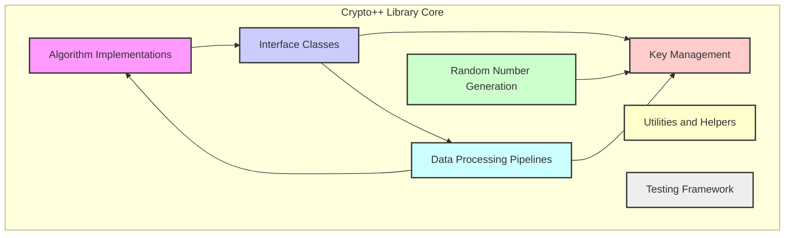
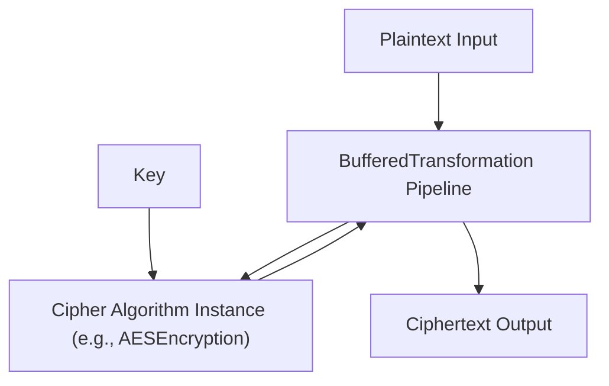
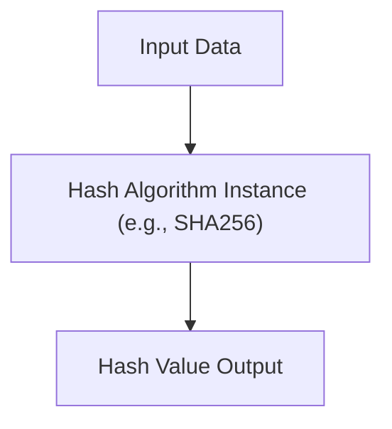

# Project Design Document: Crypto++ Library

**Version:** 1.1
**Date:** October 26, 2023
**Author:** AI Software Architect

## 1. Introduction

This document provides a detailed design overview of the Crypto++ library (as found at [https://github.com/weidai11/cryptopp](https://github.com/weidai11/cryptopp)). This document is intended to serve as a foundation for subsequent threat modeling activities. It outlines the library's purpose, architecture, key components, data flow, and security considerations.

## 2. Project Goals and Scope

*   **Goal:** To provide a comprehensive design overview of the Crypto++ library to facilitate effective threat modeling.
*   **Scope:** This document covers the core functionalities and architectural elements of the Crypto++ library as represented in the provided GitHub repository. It focuses on aspects relevant to security and potential vulnerabilities.

## 3. Overview of Crypto++

Crypto++ is a free C++ class library of cryptographic schemes. It provides a wide range of cryptographic algorithms and functionalities, including:

*   Symmetric and asymmetric encryption algorithms
*   Hash functions
*   Message authentication codes (MACs)
*   Key agreement protocols
*   Digital signatures
*   Random number generation
*   Various utilities for encoding, decoding, and data manipulation.

The library is designed to be portable and efficient, supporting a variety of platforms and compilers. It is widely used in various applications requiring cryptographic capabilities.

## 4. Architectural Design

The Crypto++ library follows a modular design, with different cryptographic algorithms and functionalities implemented as separate classes and components. The core architecture can be broadly categorized as follows:

*   Algorithm Implementations
*   Interface Classes
*   Key Management
*   Data Processing Pipelines
*   Random Number Generation
*   Utilities and Helpers
*   Testing Framework

## 5. Key Components and Their Interactions

Here's a more detailed look at some key components:

*   **Algorithm Classes:** These classes contain the core logic for specific cryptographic algorithms. Examples include:
    *   `AES`
    *   `SHA3`
    They typically implement interfaces defined in the "Interface Classes" category.
*   **Cipher Interfaces:** Abstract interfaces define the basic operations for encryption and decryption. Examples include:
    *   `BlockCipher`
    *   `StreamCipher`
    Concrete algorithm classes inherit from these interfaces.
*   **Hash Transformation Interface:** Defines the interface for hash functions, allowing different hash algorithms to be used interchangeably. Example:
    *   `HashTransformation`
*   **`AutoSeededRandomPool`:** A class for generating cryptographically secure random numbers, often used for key generation.
*   **`BufferedTransformation`:** A base class for processing data in chunks, used in various cryptographic operations.
*   **Key Objects:** Classes for storing and managing cryptographic keys securely in memory. Example:
    *   `SecByteBlock`

**Typical Data Flow for Encryption:**

1. "Plaintext Input"
2. "Cipher Algorithm Instance (e.g., AESEncryption)"
3. "Key"
4. "BufferedTransformation Pipeline"
5. "Ciphertext Output"

**Typical Data Flow for Hashing:**

1. "Input Data"
2. "Hash Algorithm Instance (e.g., SHA256)"
3. "Hash Value Output"

## 6. Security Considerations

Several security aspects are crucial to consider when using and analyzing Crypto++:

*   **Algorithm Security:** The inherent security of the implemented cryptographic algorithms. Staying up-to-date with cryptographic best practices and potential vulnerabilities in specific algorithms is essential.
*   **Key Management:** Secure generation, storage, and handling of cryptographic keys are paramount. Weak key management can negate the security of even the strongest algorithms.
*   **Random Number Generation:** The quality and unpredictability of the random number generator are critical for key generation and other security-sensitive operations. Using a cryptographically secure random number generator is essential.
*   **Side-Channel Attacks:** Implementations might be vulnerable to side-channel attacks (e.g., timing attacks, power analysis) if not carefully designed.
*   **Input Validation:** Proper validation of input data is necessary to prevent vulnerabilities like buffer overflows or format string bugs.
*   **Memory Management:** Secure memory management practices are crucial to prevent memory leaks and other memory-related vulnerabilities.
*   **Build Process Security:** The security of the build environment and dependencies can impact the overall security of the library.
*   **API Misuse:** Incorrect usage of the library's API by developers can introduce security vulnerabilities in applications using Crypto++.

## 7. Dependencies

The Crypto++ library has minimal external dependencies. It primarily relies on standard C++ libraries. However, specific build configurations or optional features might introduce dependencies on system libraries. Examples include:

*   Operating system specific threading libraries (for multi-threading support)
*   Hardware acceleration libraries (if enabled during build)

## 8. Deployment and Usage

Crypto++ is typically deployed as a static or dynamic library that is linked into applications requiring cryptographic functionality. Developers use the library's API to perform cryptographic operations within their applications. Common use cases include:

*   Secure communication protocols (e.g., TLS/SSL implementations)
*   Data encryption at rest solutions
*   Digital signature and authentication systems
*   Password hashing functionalities
*   Key exchange mechanisms in secure applications

## 9. Future Considerations (Relevant for Threat Modeling)

*   **New Algorithm Implementations:** The addition of new cryptographic algorithms might introduce new attack vectors if not implemented and reviewed carefully.
*   **Optimization and Performance Enhancements:** Changes aimed at improving performance could potentially introduce side-channel vulnerabilities.
*   **Refactoring and Code Changes:** Significant code refactoring might inadvertently introduce bugs or security flaws.
*   **Integration with New Platforms and Environments:** Porting the library to new platforms might require careful consideration of platform-specific security features and potential vulnerabilities.

## 10. Conclusion

This document provides a foundational understanding of the Crypto++ library's design and architecture. This information is crucial for conducting thorough threat modeling exercises to identify potential vulnerabilities and security risks associated with the library and its usage. The modular design and the clear separation of concerns within the library are beneficial for security analysis, allowing for focused examination of individual components and their interactions. Further analysis should delve into the specifics of each component and the potential threats relevant to their functionality and implementation.