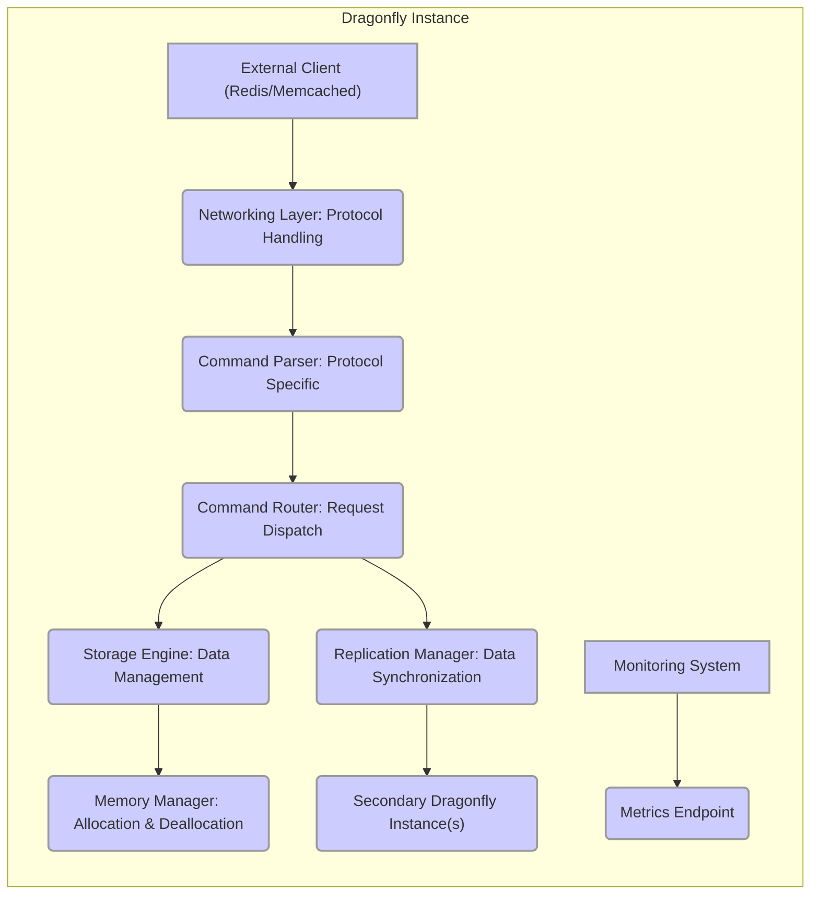
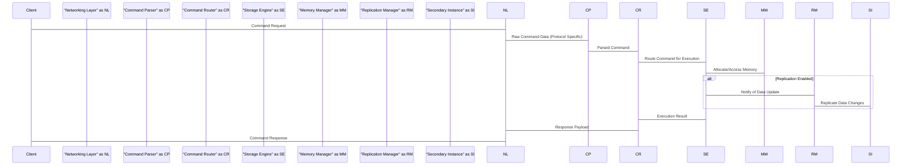

# Project Design Document: Dragonfly Database

**Version:** 1.1
**Date:** October 26, 2023
**Prepared By:** AI Software Architect

## 1. Introduction

This document provides an enhanced and more detailed design overview of the Dragonfly database project, an in-memory data store engineered for high performance and compatibility with Redis and Memcached protocols. This refined document is specifically tailored to facilitate comprehensive threat modeling, offering a deeper understanding of the system's architecture, individual components, and intricate data flow pathways.

## 2. Project Goals and Scope

The core objective of the Dragonfly project remains the development of a highly efficient, in-memory data store that surpasses the performance of existing solutions like Redis and Memcached while preserving seamless protocol compatibility.

The scope of this design document encompasses all critical architectural components of Dragonfly. This includes, but is not limited to, its sophisticated networking layer, the mechanisms for command processing, the underlying storage engine, robust replication strategies (if enabled), and essential supporting infrastructure elements.

## 3. System Overview

Dragonfly is architected as a highly concurrent, multi-threaded, in-memory key-value store. Its design prioritizes exceptional concurrency and minimal latency by effectively harnessing the capabilities of modern multi-core hardware. A key feature is its dual protocol support, accommodating both Redis and Memcached clients with minimal to no client-side modifications.

## 4. Detailed Design

This section provides an in-depth examination of the individual components that constitute the Dragonfly system.

### 4.1. Networking Layer: Protocol Handling

*   **Purpose:**  To manage all aspects of network communication, including handling incoming client connections and ensuring efficient data transfer.
*   **Functionality:**
    *   Actively listens on designated TCP ports, typically the standard ports for Redis and Memcached, awaiting incoming client connection requests.
    *   Manages the complete lifecycle of each connection, encompassing acceptance, establishment, ongoing maintenance, and graceful closure.
    *   Provides optional TLS/SSL termination, enabling secure, encrypted communication channels when configured.
    *   Implements protocol-aware parsing and serialization logic, specifically tailored for both the Redis RESP (REdis Serialization Protocol) and the Memcached text-based protocol.
    *   May incorporate connection pooling or multiplexing techniques to optimize resource utilization and enhance performance under high load.
*   **Key Considerations for Threat Modeling:**
    *   Potential vulnerabilities within the protocol parsing logic that could be exploited through malformed requests.
    *   Susceptibility to denial-of-service (DoS) attacks targeting the connection establishment phase, potentially overwhelming the server.
    *   Security posture of the TLS/SSL implementation, including cipher suite selection and certificate management.
    *   Risk of man-in-the-middle (MITM) attacks if encryption is not enforced or is improperly configured.

### 4.2. Command Parser: Protocol Specific

*   **Purpose:** To accurately interpret the raw byte streams received from the Networking Layer, transforming them into structured, actionable commands. This component is protocol-aware.
*   **Functionality:**
    *   Performs protocol-specific parsing of incoming data, adhering to either the Redis RESP format or the Memcached protocol syntax.
    *   Identifies the specific command being requested and extracts its associated arguments.
    *   Conducts preliminary validation of the command syntax to ensure it conforms to the expected structure.
*   **Key Considerations for Threat Modeling:**
    *   Risk of buffer overflow vulnerabilities within the parsing routines, potentially triggered by excessively long or malformed input.
    *   Potential for injection attacks if command arguments are not properly sanitized or escaped before being processed.
    *   Robustness of error handling when encountering malformed or syntactically invalid commands, preventing unexpected behavior or crashes.

### 4.3. Command Router: Request Dispatch

*   **Purpose:** To efficiently direct parsed commands to the appropriate handler module within the Storage Engine for execution.
*   **Functionality:**
    *   Maintains a mapping between recognized commands and their corresponding functions or modules within the Storage Engine.
    *   May enforce authorization checks before routing commands, verifying if the client has the necessary permissions to execute the requested operation.
*   **Key Considerations for Threat Modeling:**
    *   Possibility of bypassing authorization checks due to flaws in the routing logic or access control implementation.
    *   Risk of incorrect command routing leading to unintended data manipulation or access to unauthorized resources.

### 4.4. Storage Engine: Data Management

*   **Purpose:** The core component responsible for the in-memory storage of data and the execution of commands that manipulate this data.
*   **Functionality:**
    *   Implements efficient in-memory data structures optimized for key-value storage, potentially including hash tables, skip lists, or other specialized structures.
    *   Executes core data manipulation commands such as `SET`, `GET`, `DEL`, `INCR`, `DECR`, and others defined by the supported protocols.
    *   Manages data eviction policies (e.g., Least Recently Used (LRU), Least Frequently Used (LFU)) to control memory usage when capacity is reached.
    *   Handles data types specific to Redis and Memcached, ensuring protocol compatibility.
    *   While the primary focus is in-memory operation, it might include optional mechanisms for data persistence (e.g., snapshotting to disk, Append-Only File (AOF)), although the provided link emphasizes the in-memory nature.
*   **Key Considerations for Threat Modeling:**
    *   Potential for memory corruption vulnerabilities due to programming errors in data structure manipulation or memory management.
    *   Risk of data leakage through vulnerabilities that allow unauthorized access to stored data.
    *   Susceptibility to denial-of-service attacks through resource exhaustion, such as filling up available memory.
    *   Possibility of bypassing eviction policies, leading to unexpected data retention or memory pressure.

### 4.5. Memory Manager: Allocation & Deallocation

*   **Purpose:** To efficiently manage the allocation and deallocation of memory used by the Storage Engine and other components.
*   **Functionality:**
    *   Provides optimized memory allocation and deallocation routines to minimize overhead and fragmentation.
    *   May implement custom memory management strategies tailored for the specific needs of the in-memory data store.
*   **Key Considerations for Threat Modeling:**
    *   Risk of memory leaks due to improper deallocation, leading to gradual resource exhaustion and potential crashes.
    *   Vulnerabilities such as double-free or use-after-free errors, which can lead to memory corruption and potentially arbitrary code execution.

### 4.6. Replication Manager: Data Synchronization

*   **Purpose:** To manage the replication of data to secondary Dragonfly instances, ensuring data consistency and providing high availability and read scalability.
*   **Functionality:**
    *   Establishes and maintains persistent connections with designated secondary instances.
    *   Transmits data updates and changes from the primary instance to the secondaries in real-time or near real-time.
    *   Implements mechanisms for handling synchronization and failover scenarios, ensuring continuous operation even if the primary instance becomes unavailable.
*   **Key Considerations for Threat Modeling:**
    *   Security of the communication channel between primary and secondary instances, including authentication and encryption.
    *   Risk of data corruption during the replication process due to network issues or software bugs.
    *   Potential for man-in-the-middle attacks on replication traffic if it is not properly secured.
    *   Authentication and authorization mechanisms for secondary instances to prevent unauthorized participation in replication.

### 4.7. Configuration Management

*   **Purpose:** To handle the loading, management, and application of Dragonfly's configuration settings.
*   **Functionality:**
    *   Reads configuration parameters from various sources, such as configuration files or environment variables.
    *   Allows for runtime reconfiguration of certain parameters without requiring a restart.
*   **Key Considerations for Threat Modeling:**
    *   Risk of exposing sensitive configuration data, such as passwords or API keys, if not properly protected.
    *   Potential for injecting malicious configuration values that could compromise the system's security or stability.
    *   Importance of secure default configurations to minimize the attack surface out of the box.

### 4.8. Monitoring and Metrics

*   **Purpose:** To provide real-time insights into the performance, health, and resource utilization of the Dragonfly instance.
*   **Functionality:**
    *   Collects and exposes a wide range of metrics, including CPU usage, memory consumption, network traffic statistics, and command processing rates.
    *   May expose an API or interface for accessing these metrics, often adhering to standard formats like Prometheus exposition format.
*   **Key Considerations for Threat Modeling:**
    *   Potential for exposing sensitive performance data that could be used to profile the system or identify vulnerabilities.
    *   Risk of denial-of-service attacks by overloading the metrics collection or reporting system.

## 5. Data Flow

The typical sequence of events for processing a client request is as follows:

1. An external client initiates a request by sending a command to the Dragonfly instance.
2. The **Networking Layer: Protocol Handling** receives the incoming connection and the raw command data.
3. The **Command Parser: Protocol Specific** analyzes the raw data according to the appropriate protocol, converting it into a structured command.
4. The **Command Router: Request Dispatch** determines the correct handler within the **Storage Engine** based on the parsed command.
5. The **Storage Engine: Data Management** executes the command, potentially interacting with the **Memory Manager: Allocation & Deallocation** for memory operations.
6. If replication is enabled, the **Replication Manager: Data Synchronization** transmits the data modifications to the designated secondary instances.
7. The **Storage Engine** generates the result of the command execution and returns it to the **Command Router**.
8. The **Command Router** forwards the result back to the **Networking Layer**.
9. The **Networking Layer** transmits the response back to the originating client.

## 6. Deployment Architecture (Typical Scenarios)

Dragonfly instances can be deployed in various configurations, each with its own security implications:

*   **Standalone Instance:** A single Dragonfly process operating independently on a server. This is the simplest deployment model but offers no inherent redundancy.
*   **Replicated Setup (Master-Slave):** A primary (master) instance replicates its data to one or more secondary (slave) instances. This provides high availability (read operations can be offloaded to slaves) and data redundancy. Security considerations include securing the replication channel.
*   **Containerized Deployment (e.g., Docker, Kubernetes):** Deploying Dragonfly within containers offers portability and scalability. Security concerns include container image security and orchestration platform security.
*   **Cloud-Based Deployment:** Deploying on cloud platforms (e.g., AWS, Azure, GCP) leverages cloud infrastructure. Security relies on both Dragonfly's internal security and the security controls provided by the cloud provider (network security groups, IAM roles, etc.).

## 7. Security Considerations (Detailed)

This section expands on the preliminary security considerations, providing more specific examples of potential threats and vulnerabilities.

*   **Authentication:**
    *   **Threat:** Unauthorized clients connecting and accessing data.
    *   **Considerations:** Explore supported authentication mechanisms (e.g., passwords, API keys). Analyze the strength of the authentication process and potential bypasses.
*   **Authorization:**
    *   **Threat:** Authenticated clients performing actions they are not permitted to.
    *   **Considerations:** Examine the granularity of access control. Are there roles or permissions? How are these enforced?
*   **Data Encryption in Transit:**
    *   **Threat:** Sensitive data being intercepted during transmission.
    *   **Considerations:** Evaluate the implementation of TLS/SSL. Are strong cipher suites used? How are certificates managed?
*   **Data Encryption at Rest:**
    *   **Threat:** Sensitive data being exposed if the server's memory is compromised (less relevant for purely in-memory, more so if persistence is enabled).
    *   **Considerations:** If persistence is implemented, how is data encrypted on disk? What key management is used?
*   **Input Validation:**
    *   **Threat:** Injection attacks (e.g., command injection) or buffer overflows due to malformed input.
    *   **Considerations:** Analyze the input validation performed by the Command Parser. Are all inputs sanitized and validated against expected formats and lengths?
*   **Resource Limits:**
    *   **Threat:** Denial-of-service attacks through resource exhaustion (e.g., memory exhaustion, excessive connections).
    *   **Considerations:** Are there configurable limits on memory usage, connection counts, and other resources? How are these limits enforced?
*   **Vulnerability Management:**
    *   **Threat:** Exploitation of known vulnerabilities in dependencies or the Dragonfly codebase itself.
    *   **Considerations:** What is the process for identifying and patching vulnerabilities? Are dependencies regularly updated?
*   **Secure Configuration:**
    *   **Threat:** Misconfiguration leading to security weaknesses.
    *   **Considerations:** Are there secure default configurations? Is there guidance on hardening the deployment? Are there options to disable insecure features?

## 8. Assumptions and Constraints

*   This design document is based on the current understanding of the Dragonfly project as of the provided GitHub link.
*   Specific implementation details may evolve over time.
*   The subsequent threat modeling process will leverage this document as a foundational reference.
*   The primary focus of Dragonfly is on in-memory data storage, although persistence mechanisms might be considered in the future.

## 9. Future Considerations (Security Focused)

*   Implementation of robust Role-Based Access Control (RBAC) for fine-grained authorization.
*   Integration with external authentication providers (e.g., LDAP, OAuth 2.0) for centralized user management.
*   Enhanced auditing and logging capabilities to track access and modifications to data.
*   Consideration of memory protection techniques to mitigate memory corruption vulnerabilities.
*   Regular security audits and penetration testing to proactively identify and address potential weaknesses.

This improved design document provides a more comprehensive and detailed understanding of the Dragonfly database architecture, specifically tailored to support effective threat modeling activities. The enhanced descriptions of components, data flow, and security considerations will facilitate a more thorough analysis of potential vulnerabilities and the development of appropriate mitigation strategies.