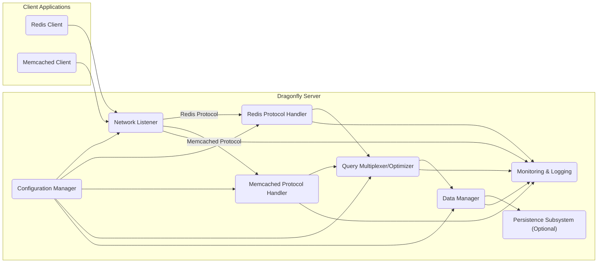
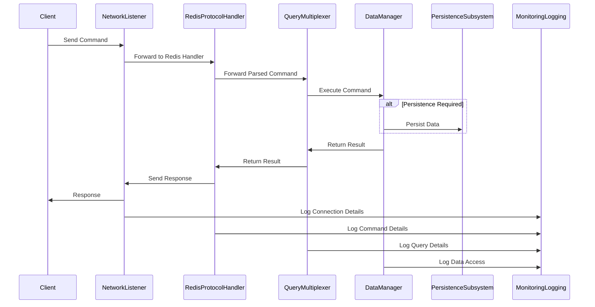

# Project Design Document: Dragonfly In-Memory Data Store

**Version:** 1.1
**Date:** October 26, 2023
**Author:** Gemini (AI Language Model)
**Project:** Dragonfly - High-Performance In-Memory Data Store

## 1. Introduction

This document provides a detailed architectural design of the Dragonfly in-memory data store project, as found on GitHub ([https://github.com/dragonflydb/dragonfly](https://github.com/dragonflydb/dragonfly)). This document aims to clearly outline the system's components, their interactions, and the data flow, serving as a robust foundation for subsequent threat modeling activities.

Dragonfly distinguishes itself as a modern in-memory data store engineered for high performance and efficiency, offering compatibility with both Redis and Memcached protocols. This design document delves into the core architectural elements crucial for understanding the system's operational mechanics and security posture.

## 2. Goals

*   Provide a clear, concise, and comprehensive description of the Dragonfly architecture.
*   Identify the key components, detailing their specific responsibilities and potential internal mechanisms.
*   Illustrate the data flow within the system using both a high-level diagram and a detailed sequence diagram.
*   Highlight potential areas of interest for security analysis and threat modeling, providing specific examples.
*   Serve as a definitive reference point for future development, security assessments, and onboarding new team members.

## 3. System Architecture

Dragonfly's architecture is modular, comprising several key components that interact to deliver its core functionality.

### 3.1 High-Level Architecture Diagram

### 3.2 Component Descriptions

*   **Client Applications:** External applications that initiate interactions with Dragonfly using either the Redis or Memcached protocol.
    *   Examples: Web application backends, caching layers, real-time analytics platforms, message brokers.
*   **Network Listener (NL):** The entry point for all client connections, responsible for managing network-level communication.
    *   Handles TCP/IP socket creation, binding, and listening for incoming connections.
    *   Performs initial connection acceptance and management.
    *   Identifies the protocol being used by the client (typically through initial handshake or negotiation).
    *   Directs the connection to the appropriate protocol handler based on the detected protocol.
*   **Redis Protocol Handler (PHR):**  Dedicated to processing commands adhering to the Redis protocol specification.
    *   Receives raw byte streams from the Network Listener.
    *   Parses and decodes Redis commands according to the RESP (REdis Serialization Protocol).
    *   Performs syntactic validation of the received commands.
    *   May perform basic authorization checks before forwarding to the Query Multiplexer.
    *   Encodes responses according to the RESP protocol for transmission back to the client.
*   **Memcached Protocol Handler (PHM):** Dedicated to processing commands adhering to the Memcached protocol specification.
    *   Receives raw byte streams from the Network Listener.
    *   Parses and decodes Memcached commands (typically text-based).
    *   Performs syntactic validation of the received commands.
    *   May perform basic authorization checks before forwarding to the Query Multiplexer.
    *   Encodes responses according to the Memcached protocol for transmission back to the client.
*   **Query Multiplexer/Optimizer (QM):** A central component responsible for routing and potentially optimizing queries before they reach the Data Manager.
    *   Receives parsed commands from both protocol handlers.
    *   May perform query optimization techniques to improve performance.
    *   Enforces any cross-protocol logic or constraints.
    *   Routes the processed command to the Data Manager for execution.
*   **Data Manager (DM):** The core of Dragonfly, responsible for the in-memory storage and manipulation of data.
    *   Manages the underlying data structures used to store data (e.g., hash tables, trees).
    *   Implements the logic for all data operations (set, get, delete, etc.).
    *   Handles different data types supported by Redis and Memcached (strings, lists, sets, etc.).
    *   May include advanced features like transactions or data eviction policies.
    *   Interacts with the optional Persistence Subsystem for data durability.
*   **Persistence Subsystem (PS) (Optional):** Provides mechanisms for persisting the in-memory data to non-volatile storage.
    *   May support various persistence strategies:
        *   **Snapshotting:** Periodically saving the entire dataset to disk.
        *   **Append-Only File (AOF):** Logging every write operation.
        *   Hybrid approaches combining both.
    *   Handles the mechanics of writing data to disk and potentially reading data during server startup.
    *   Interaction is initiated by the Data Manager based on configured persistence policies.
*   **Configuration Manager (CM):** Responsible for loading, managing, and providing access to the server's configuration parameters.
    *   Reads configuration from various sources (e.g., configuration files, environment variables, command-line arguments).
    *   Provides a centralized point for accessing configuration settings for all other components.
    *   May support dynamic configuration updates without requiring server restarts.
*   **Monitoring & Logging (ML):** Collects, processes, and stores system events, performance metrics, and logs for operational visibility and debugging.
    *   Records events such as client connections, command execution, errors, and performance statistics.
    *   May expose metrics through interfaces like Prometheus or StatsD.
    *   Provides logs in a structured format for analysis and auditing.

## 4. Data Flow

The typical data flow for a client request follows these steps:

1. A client application (either Redis or Memcached) initiates a connection to the Dragonfly server.
2. The **Network Listener** accepts the incoming connection and establishes a communication channel.
3. The **Network Listener** identifies the protocol being used by the client.
4. The connection is handed off to the appropriate **Protocol Handler** (either Redis Protocol Handler or Memcached Protocol Handler).
5. The **Protocol Handler** receives the command from the client.
6. The **Protocol Handler** parses and validates the syntax of the received command.
7. The **Protocol Handler** forwards the parsed command to the **Query Multiplexer/Optimizer**.
8. The **Query Multiplexer/Optimizer** may perform optimizations or routing decisions.
9. The **Query Multiplexer/Optimizer** sends the command to the **Data Manager**.
10. The **Data Manager** executes the command, performing the requested operation on the in-memory data structures.
11. If data persistence is enabled and the operation requires it, the **Data Manager** interacts with the **Persistence Subsystem** to update the persistent storage.
12. The **Data Manager** returns the result of the operation to the **Query Multiplexer/Optimizer**.
13. The **Query Multiplexer/Optimizer** forwards the result back to the appropriate **Protocol Handler**.
14. The **Protocol Handler** formats the response according to the client's protocol.
15. The **Network Listener** sends the formatted response back to the client application.
16. Throughout this process, various components may send relevant information (e.g., connection details, command details, performance metrics) to the **Monitoring & Logging** component.

## 5. Security Considerations (Detailed)

This section outlines potential security considerations for each component, providing a basis for threat modeling.

*   **Network Listener (NL):**
    *   **Denial of Service (DoS):** Susceptible to SYN flood attacks or connection exhaustion.
    *   **Unencrypted Communication:** If TLS/SSL is not enforced, communication is vulnerable to eavesdropping and man-in-the-middle attacks.
    *   **Unauthorized Access:** Lack of proper authentication at the connection level could allow unauthorized clients to connect.
*   **Protocol Handlers (PHR, PHM):**
    *   **Protocol Vulnerabilities:** Exploitation of known vulnerabilities in the Redis or Memcached protocols.
    *   **Command Injection:**  Improper parsing or validation of commands could allow malicious clients to inject arbitrary commands.
    *   **Buffer Overflows:**  Vulnerabilities in the parsing logic could lead to buffer overflows if overly long or malformed commands are sent.
*   **Query Multiplexer/Optimizer (QM):**
    *   **Logic Flaws:**  Errors in the optimization logic could lead to unexpected behavior or security vulnerabilities.
    *   **Access Control Bypass:** If not properly implemented, the multiplexer could be a point for bypassing access controls.
*   **Data Manager (DM):**
    *   **Memory Corruption:** Bugs in data structure management could lead to memory corruption vulnerabilities.
    *   **Data Breaches:** If not properly secured, in-memory data could be accessed by unauthorized processes (though OS-level security is a factor here).
    *   **Side-Channel Attacks:** Potential vulnerabilities related to timing or resource usage that could leak information.
*   **Persistence Subsystem (PS):**
    *   **Data at Rest Encryption:** Lack of encryption for persisted data exposes it to unauthorized access if the storage is compromised.
    *   **Integrity Issues:**  Mechanisms should be in place to ensure the integrity of persisted data.
    *   **Injection Attacks:** If file paths or commands are constructed from user input, it could be vulnerable to injection attacks.
*   **Configuration Manager (CM):**
    *   **Sensitive Information Exposure:** Configuration files may contain sensitive information like passwords or API keys and need to be protected.
    *   **Unauthorized Modification:**  If not properly secured, the configuration could be modified by unauthorized users, leading to security breaches.
    *   **Default Credentials:**  Using default or weak credentials in configuration can be a significant vulnerability.
*   **Monitoring & Logging (ML):**
    *   **Information Disclosure:** Logs may contain sensitive information that needs to be protected.
    *   **Log Tampering:** If logs are not properly secured, they could be tampered with, hindering security investigations.
    *   **Resource Exhaustion:** Excessive logging could lead to disk space exhaustion or performance issues.
*   **General Considerations:**
    *   **Authentication and Authorization:**  Robust mechanisms are needed to verify the identity of clients and control their access to data and commands.
    *   **Input Validation:** Rigorous validation of all inputs is crucial to prevent various types of attacks.
    *   **Dependency Management:**  Keeping dependencies up-to-date with security patches is essential.

## 6. Deployment Considerations

The deployment environment significantly impacts the security considerations for Dragonfly.

*   **Single Instance:**
    *   Security relies heavily on the host operating system's security measures.
    *   Network security (firewalls, network segmentation) is crucial.
*   **Clustered Deployment:**
    *   Inter-node communication needs to be secured (e.g., using mutual TLS).
    *   Data consistency and integrity across nodes are critical security considerations.
    *   Authentication and authorization between nodes need to be robust.
*   **Cloud Environments (AWS, Azure, GCP):**
    *   Leveraging cloud provider security services (e.g., VPCs, security groups, IAM roles) is essential.
    *   Proper configuration of cloud storage for persistence is critical.
    *   Integration with cloud monitoring and logging services can enhance security visibility.
    *   Consideration of data sovereignty and compliance requirements when choosing cloud regions.
*   **Containerized Deployments (Docker, Kubernetes):**
    *   Secure container image creation and management are important.
    *   Network policies within the container orchestration platform should be configured to restrict access.
    *   Secrets management for configuration parameters needs careful consideration.

## 7. Conclusion

This improved design document provides a more detailed and comprehensive understanding of the Dragonfly in-memory data store architecture. By elaborating on component responsibilities, refining the data flow, and providing specific security considerations, this document offers a stronger foundation for effective threat modeling. It serves as a valuable resource for identifying potential vulnerabilities and designing appropriate security mitigations to ensure the security and integrity of the Dragonfly project. Continuous review and updates to this document will be necessary as the project evolves.
