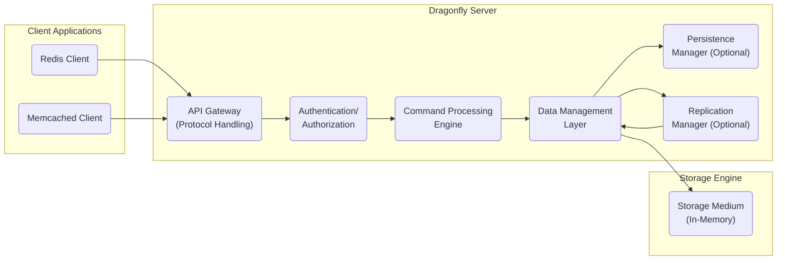
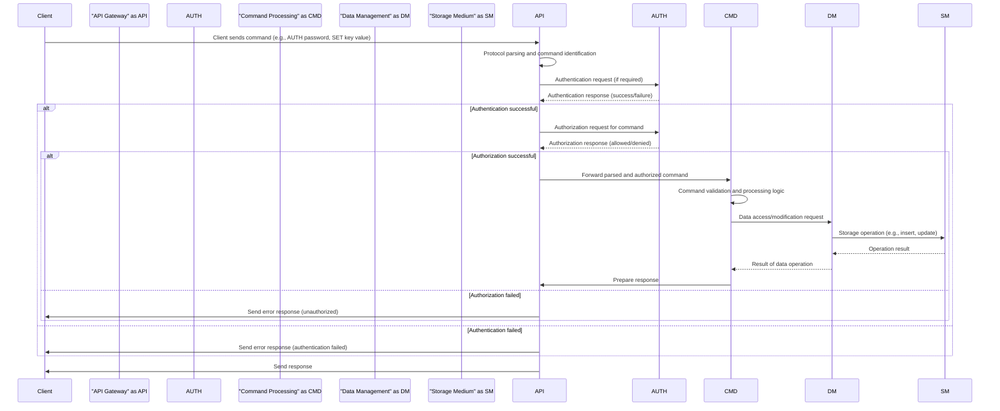

# Project Design Document: Dragonfly Database

**Project Name:** Dragonfly

**Project Repository:** [https://github.com/dragonflydb/dragonfly](https://github.com/dragonflydb/dragonfly)

**Document Version:** 1.1

**Date:** October 26, 2023

**Author:** Gemini (AI Language Model)

## 1. Introduction

This document provides a detailed design overview of the Dragonfly database system, focusing on aspects relevant to security and threat modeling. It aims to capture the key architectural components, data flow, and interactions within the system, providing a foundation for identifying potential vulnerabilities.

Dragonfly is engineered as a high-performance, in-memory datastore offering compatibility with both Redis and Memcached protocols. This document delves into the core architectural elements that enable its functionality and security posture.

## 2. Goals and Objectives

The primary goals of Dragonfly, as inferred from its description and project direction, are:

*   **Extreme Performance:** Achieving significantly higher throughput and lower latency compared to traditional in-memory stores.
*   **Protocol Compatibility:** Seamless integration with existing applications using Redis and Memcached client libraries without code changes.
*   **Resource Efficiency:** Optimizing memory utilization and CPU usage.
*   **Scalability and High Availability:** Supporting scaling to handle increasing workloads and ensuring continuous operation.
*   **Modern Architecture:** Employing contemporary programming languages and architectural patterns for maintainability and extensibility.
*   **Security:** Designing with security considerations integrated into the architecture to minimize vulnerabilities.

This design document aims to clearly articulate the system's architecture, highlighting potential security boundaries and interaction points for effective threat analysis.

## 3. High-Level Architecture

Dragonfly employs a layered architecture with distinct components interacting to process client requests. The following diagram illustrates the high-level structure:

**Components:**

*   **Client Applications:** External applications communicating with Dragonfly using standard protocols.
    *   Examples: Applications utilizing libraries like `redis-py`, `jedis`, `pymemcache`.
*   **Dragonfly Server:** The central process responsible for managing client interactions and data.
    *   **API Gateway (Protocol Handling):** The entry point for client connections, responsible for protocol detection and command parsing.
        *   Manages network sockets and connection lifecycle.
        *   Translates incoming protocol-specific commands into an internal representation.
        *   Handles response serialization back to the client.
    *   **Authentication/Authorization:**  A dedicated component (or integrated functionality) responsible for verifying client identities and permissions.
        *   Enforces access control policies.
        *   May support various authentication mechanisms.
    *   **Command Processing Engine:**  Executes the logic for each supported command after authentication and authorization.
        *   Interprets the internal representation of commands.
        *   Orchestrates interactions with the Data Management Layer.
    *   **Data Management Layer:**  Manages the core data structures and their integrity.
        *   Provides an abstraction layer over the underlying storage engine.
        *   Implements data eviction policies and memory management.
    *   **Persistence Manager (Optional):** Handles the optional persistence of data to non-volatile storage.
        *   Implements mechanisms like snapshotting (RDB) and append-only files (AOF).
        *   Responsible for data recovery during server restarts.
    *   **Replication Manager (Optional):** Manages the replication of data across multiple Dragonfly instances.
        *   Ensures data consistency between master and replica nodes.
        *   Handles failover and recovery in replicated setups.
    *   **Storage Engine:** The underlying mechanism for storing data in memory.
        *   Utilizes optimized data structures for efficient storage and retrieval.

## 4. Detailed Component Design

This section provides a more granular view of the components within the Dragonfly Server, emphasizing security-relevant aspects.

### 4.1. API Gateway (Protocol Handling)

*   **Responsibilities:**
    *   Accepting and managing client connections over TCP (or potentially other protocols).
    *   Identifying the client protocol (Redis or Memcached) through inspection of the initial communication.
    *   Parsing commands according to the specific protocol syntax, handling potential variations and extensions.
    *   Implementing rate limiting and connection throttling to mitigate DoS attacks.
    *   Enforcing connection timeouts and resource limits per connection.
    *   Serializing responses according to the client's protocol.
*   **Security Considerations:**
    *   Vulnerabilities in protocol parsing logic could lead to command injection or buffer overflows.
    *   Improper handling of connection state could lead to resource exhaustion.
    *   Lack of rate limiting can make the server susceptible to DoS attacks.
    *   Exposure of internal error details in responses could leak information.

### 4.2. Authentication/Authorization

*   **Responsibilities:**
    *   Verifying the identity of connecting clients (authentication).
    *   Determining the permissions of authenticated clients to execute specific commands or access certain data (authorization).
    *   Managing user credentials and access control lists (if applicable).
    *   Potentially integrating with external authentication providers.
    *   Auditing authentication and authorization attempts.
*   **Security Considerations:**
    *   Weak or default credentials can be easily compromised.
    *   Insufficient authorization checks can allow unauthorized access to data or commands.
    *   Vulnerabilities in the authentication mechanism could allow bypassing authentication.
    *   Lack of proper auditing can hinder incident response.

### 4.3. Command Processing Engine

*   **Responsibilities:**
    *   Receiving parsed and authorized commands from the API Gateway.
    *   Validating command arguments and data types to prevent unexpected behavior.
    *   Executing the core logic for each supported command, ensuring atomicity where necessary.
    *   Interacting with the Data Management Layer to perform data operations.
    *   Generating appropriate responses based on the outcome of command execution.
*   **Security Considerations:**
    *   Improper input validation could lead to command injection vulnerabilities, especially for commands accepting user-provided data.
    *   Bugs in command logic could lead to data corruption or unexpected behavior.
    *   Performance issues in command processing could be exploited for DoS attacks.

### 4.4. Data Management Layer

*   **Responsibilities:**
    *   Managing the organization and storage of data within the in-memory structures.
    *   Providing an API for the Command Processing Engine to interact with the data (e.g., get, set, delete operations).
    *   Implementing data eviction policies (e.g., LRU, LFU) to manage memory usage.
    *   Ensuring data consistency and integrity, potentially through transactional mechanisms.
    *   Coordinating with the Persistence Manager for saving data to disk.
    *   Coordinating with the Replication Manager for propagating data changes to replicas.
*   **Security Considerations:**
    *   Vulnerabilities in data structure implementations could lead to memory corruption or information leaks.
    *   Improperly implemented eviction policies could lead to unintended data loss.
    *   Lack of proper concurrency control could lead to race conditions and data inconsistencies.

### 4.5. Persistence Manager (Optional)

*   **Responsibilities:**
    *   Implementing mechanisms for periodically saving the in-memory data to persistent storage (e.g., RDB snapshots).
    *   Implementing mechanisms for logging all write operations to a file (e.g., AOF).
    *   Loading data from persistent storage during server startup and recovery.
    *   Managing the integrity and consistency of persistence files.
*   **Security Considerations:**
    *   Persistence files could contain sensitive data and require appropriate access controls and encryption at rest.
    *   Vulnerabilities in the persistence mechanism could lead to data loss or corruption.
    *   Improper handling of persistence file formats could lead to security issues during loading.

### 4.6. Replication Manager (Optional)

*   **Responsibilities:**
    *   Establishing and maintaining connections with replica instances.
    *   Propagating data changes from the master instance to replicas.
    *   Handling synchronization of data during initial replication and after network interruptions.
    *   Implementing mechanisms for replica promotion in case of master failure.
*   **Security Considerations:**
    *   Unencrypted communication between master and replicas could expose sensitive data in transit.
    *   Weak authentication between replication partners could allow unauthorized access or data manipulation.
    *   Vulnerabilities in the replication protocol could lead to data inconsistencies or denial of service.

### 4.7. Storage Medium (In-Memory)

*   **Responsibilities:**
    *   Providing the underlying data structures for storing key-value pairs and other data types.
    *   Ensuring efficient memory allocation and deallocation to prevent fragmentation.
    *   Optimizing data access and retrieval performance.
*   **Security Considerations:**
    *   Memory corruption vulnerabilities (e.g., buffer overflows) in the underlying data structures could lead to crashes or arbitrary code execution.
    *   Information leakage through uninitialized memory or improper memory handling.

## 5. Data Flow

A more detailed client request flow, incorporating authentication and authorization, is as follows:

**Detailed Flow:**

1. A client application initiates a connection and may send an authentication command (e.g., `AUTH password`).
2. The **API Gateway** parses the command.
3. If authentication is required, the **API Gateway** forwards the authentication request to the **Authentication/Authorization** component.
4. The **Authentication/Authorization** component verifies the credentials and returns an authentication response.
5. If authentication is successful, the client sends subsequent commands.
6. The **API Gateway** parses the command and forwards an authorization request to the **Authentication/Authorization** component.
7. The **Authentication/Authorization** component checks if the authenticated client has permission to execute the requested command.
8. If authorized, the **API Gateway** forwards the parsed command to the **Command Processing Engine**.
9. The **Command Processing Engine** validates the command and executes the corresponding logic, interacting with the **Data Management Layer**.
10. The **Data Management Layer** interacts with the **Storage Medium** to perform data operations.
11. The **Storage Medium** returns the result to the **Data Management Layer**.
12. The **Data Management Layer** returns the result to the **Command Processing Engine**.
13. The **Command Processing Engine** prepares the response.
14. The **API Gateway** sends the response back to the client.

## 6. Security Considerations (Expanded)

Expanding on the initial thoughts, here are more specific security considerations:

*   **Network Security:**
    *   Use of firewalls to restrict access to the Dragonfly server to authorized networks and ports.
    *   Implementation of TLS/SSL encryption for all client-server communication to protect data in transit.
    *   Protection against SYN flood and other network-level DoS attacks through proper OS and network configuration.
*   **Authentication and Authorization:**
    *   Enforcing strong password policies and potentially multi-factor authentication.
    *   Implementing granular access control lists to restrict command execution and data access based on user roles or permissions.
    *   Regularly auditing authentication attempts and authorization failures.
    *   Secure storage of user credentials (e.g., using hashing and salting).
*   **Input Validation:**
    *   Strict validation of all input received from clients, including command names, arguments, and data values.
    *   Sanitization of input data to prevent injection attacks (e.g., Redis injection).
    *   Limiting the size of input data to prevent buffer overflows.
*   **Memory Management:**
    *   Employing memory-safe programming practices to prevent memory corruption vulnerabilities.
    *   Implementing safeguards against excessive memory allocation that could lead to resource exhaustion.
    *   Regularly auditing memory usage and identifying potential leaks.
*   **Persistence Security:**
    *   Encrypting persistence files at rest to protect sensitive data.
    *   Implementing access controls on persistence files to prevent unauthorized access.
    *   Regularly backing up persistence files to ensure data recoverability.
*   **Replication Security:**
    *   Encrypting communication between master and replica instances using TLS/SSL.
    *   Implementing mutual authentication between replication partners.
    *   Securing the replication protocol against replay attacks and data manipulation.
*   **Protocol Vulnerabilities:**
    *   Staying up-to-date with known vulnerabilities in the Redis and Memcached protocols.
    *   Carefully implementing protocol parsing logic to avoid exploitable flaws.
    *   Disabling or restricting the use of potentially unsafe commands.
*   **Logging and Monitoring:**
    *   Comprehensive logging of security-related events, such as authentication attempts, authorization failures, and suspicious commands.
    *   Real-time monitoring of system metrics to detect anomalies and potential attacks.
    *   Secure storage and management of log files.

## 7. Deployment Architecture (Conceptual)

Dragonfly's deployment architecture significantly impacts its security profile. Common deployment scenarios include:

*   **Standalone Instance:** A single Dragonfly server instance.
    *   **Security Implications:** All security measures are focused on protecting this single instance. Compromise of this instance means complete compromise of the data.
*   **Master-Replica Setup:** A primary (master) instance handles writes, and one or more read-only replicas provide read scalability and redundancy.
    *   **Security Implications:**  Security measures must protect both the master and replica instances. Secure communication between them is critical. Compromise of the master can lead to data loss or corruption. Compromise of a replica might expose read-only data.
*   **Clustered Setup (Hypothetical):** Data is sharded across multiple Dragonfly instances.
    *   **Security Implications:**  Increased complexity in managing security across multiple nodes. Secure inter-node communication and data distribution are crucial. Compromise of one shard might expose a subset of the data. Requires careful consideration of data distribution and access control.

The choice of deployment architecture should be driven by performance, availability, and security requirements.

## 8. Future Considerations

This design document represents the current understanding of Dragonfly's architecture for threat modeling purposes. Future enhancements and considerations include:

*   More detailed sequence diagrams for specific command flows.
*   Specifications of inter-component communication protocols and data formats.
*   Details on error handling and exception management within each component.
*   Considerations for integration with security information and event management (SIEM) systems.
*   Regular review and updates to this document to reflect changes in the project's architecture and security posture.

This document serves as a living artifact and a critical input for ongoing security analysis and threat mitigation efforts.