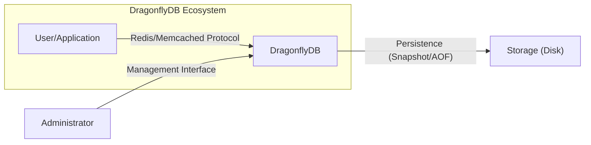
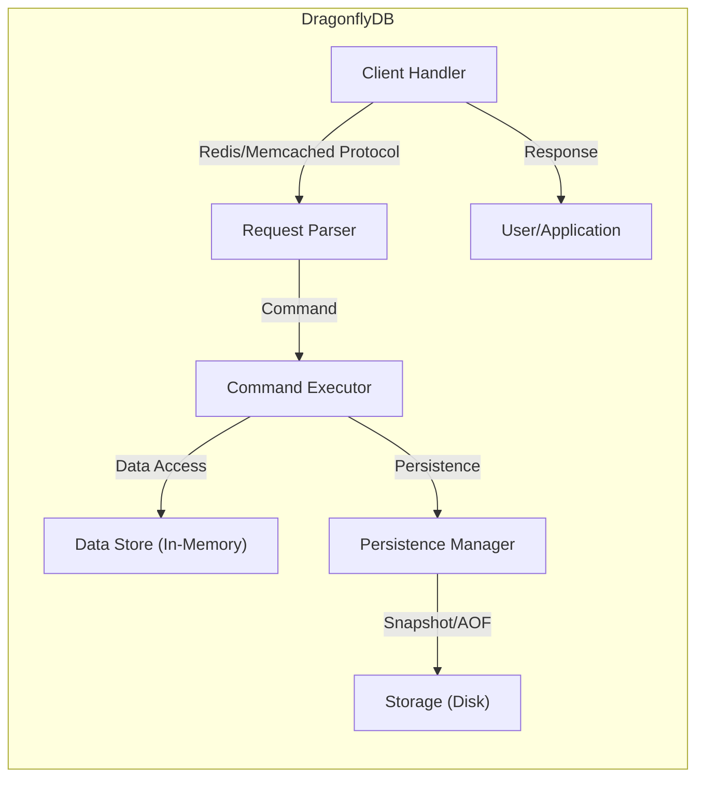
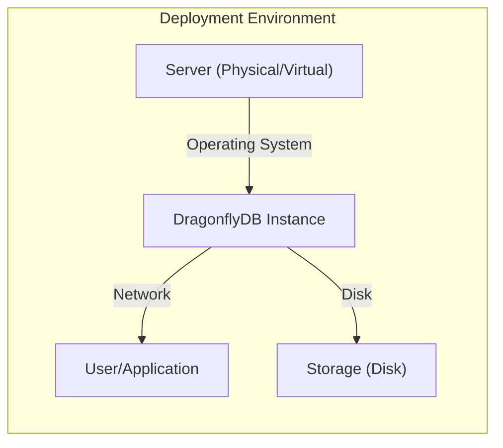

# BUSINESS POSTURE

DragonflyDB is positioning itself as a modern, in-memory data store designed to be a drop-in replacement for Redis and Memcached. Its primary business goals appear to be:

*   Provide a significantly faster and more efficient in-memory store than existing solutions.
*   Offer seamless compatibility with Redis and Memcached APIs, minimizing migration effort for users.
*   Achieve high scalability and throughput to handle demanding workloads.
*   Maintain operational simplicity and ease of use.
*   Build a strong open-source community and ecosystem around the project.

Business priorities are centered around performance, compatibility, and scalability. The project aims to disrupt the existing in-memory data store market by offering a superior alternative.

Most important business risks:

*   Data loss or corruption: As an in-memory data store, data loss due to crashes or power outages is a major risk. While DragonflyDB implements snapshotting and potentially AOF (Append-Only File) persistence, the frequency and reliability of these mechanisms are crucial.
*   Security vulnerabilities: Exploitable vulnerabilities could lead to data breaches, unauthorized access, or denial-of-service attacks. Given its role as a data store, the impact of such vulnerabilities could be significant.
*   Compatibility issues: While aiming for full Redis/Memcached compatibility, subtle differences or unsupported features could break existing applications or workflows.
*   Performance regressions: New releases or features could inadvertently introduce performance bottlenecks, negating the core value proposition.
*   Lack of adoption: If the project fails to gain traction and a substantial user base, its long-term viability and support may be at risk.
*   Competition: Existing, well-established solutions like Redis and Memcached have large communities and ecosystems. DragonflyDB needs to differentiate itself effectively and overcome the inertia of existing deployments.

# SECURITY POSTURE

Existing security controls (based on the GitHub repository):

*   security control: Network access control: DragonflyDB listens on a configurable network port, allowing administrators to restrict access using firewalls or network policies. (Described in documentation and command-line options).
*   security control: Snapshotting: DragonflyDB supports periodic snapshotting of data to disk, providing a basic level of data durability. (Described in documentation and configuration options).
*   security control: Authentication: Dragonfly supports password authentication, similar to Redis. (Described in documentation).
*   security control: TLS support: Dragonfly supports TLS encryption for secure client-server communication. (Described in documentation).

Accepted risks:

*   accepted risk: Data loss in case of sudden power failure or crash between snapshots. The duration of potential data loss depends on the snapshotting frequency.
*   accepted risk: Lack of fine-grained access control (RBAC). DragonflyDB, like Redis, primarily relies on a single password for authentication, without support for different user roles or permissions.
*   accepted risk: Limited protection against denial-of-service (DoS) attacks. While network access controls can help, DragonflyDB itself may not have robust mechanisms to mitigate sophisticated DoS attacks.
*   accepted risk: No built-in encryption at rest. Data stored in snapshots is not encrypted by default.
*   accepted risk: Potential for supply chain attacks. Dependencies on third-party libraries could introduce vulnerabilities.

Recommended security controls (high priority):

*   Implement Append-Only File (AOF) persistence: AOF logging, in addition to snapshotting, would significantly reduce the window of potential data loss.
*   Introduce Role-Based Access Control (RBAC): RBAC would allow for finer-grained control over data access and administrative operations, limiting the impact of compromised credentials.
*   Implement rate limiting and connection limits: These measures would help mitigate denial-of-service attacks.
*   Provide options for encryption at rest: Encrypting data stored in snapshots would enhance data security in case of unauthorized access to the storage medium.
*   Implement regular security audits and penetration testing: Proactive security assessments would help identify and address vulnerabilities before they can be exploited.
*   Develop a clear security policy and vulnerability disclosure process: This would provide transparency and build trust with users.

Security Requirements:

*   Authentication:
    *   Support strong password authentication.
    *   Consider supporting multi-factor authentication (MFA) in the future.
    *   Provide mechanisms for secure password storage and management.
*   Authorization:
    *   Implement Role-Based Access Control (RBAC) to restrict access based on user roles.
    *   Define clear permissions for different operations (e.g., read, write, admin).
*   Input Validation:
    *   Validate all client inputs to prevent injection attacks or unexpected behavior.
    *   Implement robust parsing of Redis and Memcached protocols to avoid vulnerabilities.
*   Cryptography:
    *   Use strong, well-vetted cryptographic algorithms for TLS encryption and password hashing.
    *   Provide options for data encryption at rest.
    *   Ensure proper key management practices.

# DESIGN

## C4 CONTEXT

Element descriptions:

*   Element:
    *   Name: User/Application
    *   Type: External entity (user or application)
    *   Description: Represents any client application or user interacting with DragonflyDB using the Redis or Memcached protocol.
    *   Responsibilities: Sending requests to DragonflyDB, receiving responses, processing data.
    *   Security controls: Authentication (password), TLS encryption (optional, configured on the client-side).

*   Element:
    *   Name: DragonflyDB
    *   Type: System (the project itself)
    *   Description: The core in-memory data store.
    *   Responsibilities: Handling client connections, processing commands, managing data in memory, persisting data to storage (snapshotting/AOF).
    *   Security controls: Network access control, authentication (password), TLS encryption, snapshotting.

*   Element:
    *   Name: Storage
    *   Type: External system (storage medium)
    *   Description: The persistent storage where DragonflyDB saves data snapshots and potentially AOF logs.
    *   Responsibilities: Storing data persistently.
    *   Security controls: Operating system-level access controls, disk encryption (if enabled).

*   Element:
    *   Name: Administrator
    *   Type: External entity (human administrator)
    *   Description: A person responsible for managing and configuring the DragonflyDB instance.
    *   Responsibilities: Starting/stopping the server, configuring settings, monitoring performance, managing backups.
    *   Security controls: Authentication (password), secure access to the management interface (e.g., SSH, restricted network access).

## C4 CONTAINER

Element descriptions:

*   Element:
    *   Name: Client Handler
    *   Type: Container (component within DragonflyDB)
    *   Description: Handles incoming client connections and manages network communication.
    *   Responsibilities: Accepting connections, reading requests, sending responses, managing TLS encryption (if enabled).
    *   Security controls: Network access control, TLS encryption.

*   Element:
    *   Name: Request Parser
    *   Type: Container (component within DragonflyDB)
    *   Description: Parses incoming requests according to the Redis/Memcached protocol.
    *   Responsibilities: Validating request format, extracting commands and arguments.
    *   Security controls: Input validation.

*   Element:
    *   Name: Command Executor
    *   Type: Container (component within DragonflyDB)
    *   Description: Executes the parsed commands against the data store.
    *   Responsibilities: Implementing the logic for each supported command, interacting with the data store.
    *   Security controls: Authorization (future RBAC).

*   Element:
    *   Name: Data Store (In-Memory)
    *   Type: Container (component within DragonflyDB)
    *   Description: The core in-memory data structure that stores the data.
    *   Responsibilities: Storing and retrieving data efficiently.
    *   Security controls: None directly, relies on other components for security.

*   Element:
    *   Name: Persistence Manager
    *   Type: Container (component within DragonflyDB)
    *   Description: Handles data persistence to disk (snapshotting and/or AOF).
    *   Responsibilities: Creating snapshots, writing AOF logs, managing data recovery.
    *   Security controls: None directly, relies on operating system-level access controls for the storage medium.

*   Element:
    *   Name: Storage
    *   Type: External system (storage medium)
    *   Description: The persistent storage where DragonflyDB saves data snapshots and potentially AOF logs.
    *   Responsibilities: Storing data persistently.
    *   Security controls: Operating system-level access controls, disk encryption (if enabled).

*   Element:
    *   Name: User/Application
    *   Type: External entity
    *   Description: Client application.
    *   Responsibilities: Sending requests, receiving responses.
    *   Security controls: Authentication.

## DEPLOYMENT

Possible deployment solutions:

1.  Single instance deployment: A single instance of DragonflyDB running on a single server.
2.  Master-replica deployment: A master instance for writes and multiple replica instances for read scaling.
3.  Clustered deployment: Multiple DragonflyDB instances working together as a cluster for horizontal scaling and high availability.
4.  Kubernetes deployment: Deploying DragonflyDB using Kubernetes for container orchestration.

Chosen solution (for detailed description): Single instance deployment.

Element descriptions:

*   Element:
    *   Name: Server (Physical/Virtual)
    *   Type: Infrastructure node
    *   Description: The physical or virtual server hosting the DragonflyDB instance.
    *   Responsibilities: Providing compute resources (CPU, memory, network).
    *   Security controls: Operating system hardening, firewall, intrusion detection/prevention system.

*   Element:
    *   Name: Operating System
    *   Type: Software
    *   Description: The operating system running on the server (e.g., Linux).
    *   Responsibilities: Managing system resources, providing a platform for DragonflyDB.
    *   Security controls: OS-level security updates, user account management, access controls.

*   Element:
    *   Name: DragonflyDB Instance
    *   Type: Software instance
    *   Description: A single running instance of the DragonflyDB software.
    *   Responsibilities: Handling client connections, processing commands, managing data.
    *   Security controls: Network access control, authentication, TLS encryption, snapshotting.

*   Element:
    *   Name: Network
    *   Type: Infrastructure
    *   Description: Network connection.
    *   Responsibilities: Connecting client with DragonflyDB instance.
    *   Security controls: Firewall.

*   Element:
    *   Name: Storage (Disk)
    *   Type: Infrastructure node
    *   Description: The local disk storage used for snapshotting.
    *   Responsibilities: Storing data persistently.
    *   Security controls: Operating system-level access controls, disk encryption (if enabled).

*   Element:
    *   Name: User/Application
    *   Type: External entity
    *   Description: Client application.
    *   Responsibilities: Sending requests, receiving responses.
    *   Security controls: Authentication.

## BUILD

DragonflyDB uses a CMake-based build system. The build process involves compiling the C++ source code, linking necessary libraries, and producing the DragonflyDB executable.

Security controls in the build process:

*   security control: Dependency management: The project lists its dependencies, allowing for vulnerability scanning of these dependencies.
*   security control: Compiler warnings and errors: The build process should be configured to treat warnings as errors, ensuring that potential code quality issues are addressed.
*   security control: Static analysis (potential): The GitHub repository does not explicitly mention static analysis tools, but it's highly recommended to integrate tools like Clang Static Analyzer or other SAST tools into the build pipeline.
*   security control: Code signing (potential): The project does not appear to implement code signing for releases. This is a recommended security control to ensure the integrity of distributed binaries.

```mermaid
graph LR
    Developer["Developer"] -- "Writes Code" --> SourceCode["Source Code (GitHub)"]
    SourceCode -- "CMake Build" --> BuildSystem["Build System (CMake)"]
    BuildSystem -- "Compiles & Links" --> Compiler["Compiler (e.g., GCC, Clang)"]
    Compiler -- "Produces Executable" --> DragonflyExecutable["DragonflyDB Executable"]
    DragonflyExecutable -- "Packages (Optional)" --> Package["Package (e.g., .deb, .rpm)"]
```

# RISK ASSESSMENT

Critical business processes to protect:

*   Data availability: Ensuring that the data store remains accessible to client applications.
*   Data integrity: Preventing data corruption or unauthorized modification.
*   Data confidentiality: Protecting sensitive data from unauthorized access.
*   Service continuity: Maintaining the operation of the data store even in the face of failures or attacks.

Data to protect and sensitivity:

*   User data stored in DragonflyDB: The sensitivity of this data depends entirely on the specific use case. It could range from non-sensitive (e.g., caching public web content) to highly sensitive (e.g., storing user credentials, financial data, or personal information).
*   Configuration data: This includes settings like passwords, network configurations, and persistence settings. This data is sensitive as it could be used to compromise the system.
*   Snapshot/AOF files: These files contain a copy of the in-memory data and should be treated with the same level of sensitivity as the live data.

# QUESTIONS & ASSUMPTIONS

Questions:

*   What are the specific performance targets and scalability requirements for DragonflyDB?
*   What are the expected data retention policies and backup strategies?
*   What are the target deployment environments (e.g., cloud providers, on-premises)?
*   What level of support and maintenance is planned for the project?
*   Are there any specific compliance requirements (e.g., GDPR, HIPAA) that need to be considered?
*   What is the process for handling security vulnerabilities and incidents?
*   Is there a plan for integrating with monitoring and logging systems?
*   What are the specific use cases that DragonflyDB is targeting?
*   What is the long-term vision for the project's features and capabilities?

Assumptions:

*   BUSINESS POSTURE: The primary goal is to provide a high-performance, drop-in replacement for Redis and Memcached.
*   BUSINESS POSTURE: The project is targeting users who are already familiar with Redis or Memcached.
*   BUSINESS POSTURE: The project is prioritizing performance and compatibility over advanced features initially.
*   SECURITY POSTURE: Security is a concern, but the initial focus is on basic security controls like authentication and network access control.
*   SECURITY POSTURE: Users are responsible for securing the underlying infrastructure and network.
*   SECURITY POSTURE: Data loss between snapshots is acceptable within certain limits.
*   DESIGN: The single-instance deployment model is sufficient for many initial use cases.
*   DESIGN: The build process is relatively standard and relies on CMake.
*   DESIGN: The project is primarily intended for Linux-based systems.