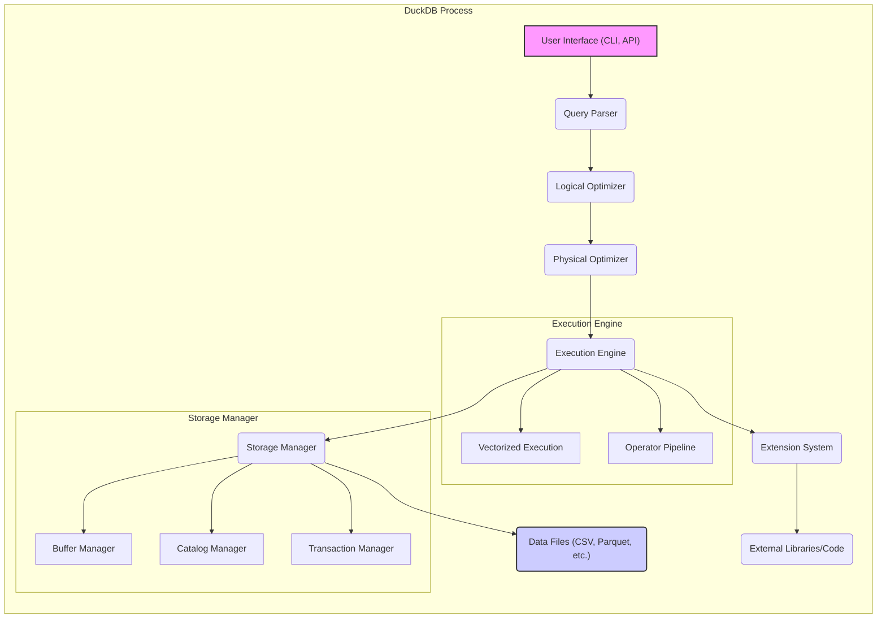
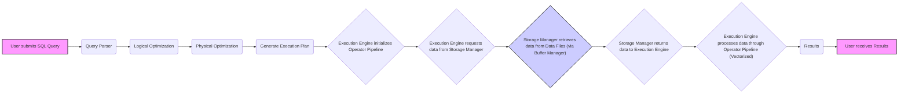

## Project Design Document: DuckDB (Improved)

**1. Project Overview**

DuckDB is an in-process SQL OLAP database management system engineered for speed, efficiency, and ease of use, particularly for analytical workloads. It operates directly on various data file formats (e.g., CSV, Parquet, JSON) without requiring a separate server process. DuckDB aims to deliver the capabilities of a robust analytical database within the confines of a single process, making it highly portable and embeddable. This document provides an enhanced architectural overview and data flow description of DuckDB, serving as a more detailed foundation for subsequent threat modeling activities.

**2. Goals and Objectives**

*   Provide a more granular and detailed architectural overview of DuckDB's internal components.
*   Elaborate on the responsibilities and interactions of key components.
*   Present a more comprehensive description of the data flow within the system, including internal processes.
*   Offer more specific security considerations relevant to individual components for targeted threat modeling.
*   Serve as an improved and more informative reference document for security assessments, development, and understanding DuckDB's internals.

**3. Target Audience**

*   Security engineers and architects responsible for in-depth threat modeling of DuckDB.
*   Developers contributing to or integrating DuckDB into other systems.
*   Researchers and individuals seeking a thorough understanding of DuckDB's internal mechanisms and potential security implications.

**4. System Architecture**

The following diagram illustrates a more detailed architecture of DuckDB:

**5. Key Components (Detailed)**

*   **User Interface (CLI, API):** The primary entry point for user interaction.
    *   Receives SQL queries and commands from users or applications.
    *   Performs initial input validation and potentially some basic sanitization.
    *   Formats and presents query results back to the user.
    *   APIs exist for various programming languages (Python, R, Java, etc.).

*   **Query Parser:** Transforms the raw SQL query string into a structured internal representation.
    *   Performs lexical analysis and syntax checking to ensure the query is valid SQL.
    *   Builds an Abstract Syntax Tree (AST) representing the query structure.
    *   Identifies tables, columns, operators, and functions used in the query.

*   **Logical Optimizer:** Analyzes the AST and applies logical transformations to improve query efficiency without considering physical execution details.
    *   Performs rule-based optimizations like predicate pushdown, constant folding, and join reordering.
    *   Aims to reduce the amount of data that needs to be processed in later stages.
    *   Generates a logical query plan.

*   **Physical Optimizer:** Takes the logical query plan and determines the optimal physical execution strategy.
    *   Selects specific algorithms for operations like joins (e.g., hash join, sort-merge join), sorts, and aggregations.
    *   Considers factors like data size, available memory, and potential parallelism.
    *   Generates a physical query plan, which is a sequence of operations to be executed.

*   **Execution Engine:** The core component responsible for executing the physical query plan.
    *   **Vectorized Execution:** Processes data in large batches (vectors) for improved performance.
    *   **Operator Pipeline:** Executes the physical plan as a pipeline of operators, where the output of one operator feeds into the next.
    *   Manages the flow of data between operators.
    *   Interacts with the Storage Manager to retrieve and process data.

*   **Storage Manager:** Manages how data is stored, retrieved, and persisted.
    *   **Buffer Manager:**  Manages in-memory buffers for caching data blocks from disk, improving access times.
    *   **Catalog Manager:** Stores metadata about tables, columns, indexes, and other database objects.
    *   **Transaction Manager:** Ensures ACID properties (Atomicity, Consistency, Isolation, Durability) for data modifications.
    *   Handles reading and writing data from various file formats (CSV, Parquet, JSON, etc.).

*   **Data Files (CSV, Parquet, etc.):** The external files where the actual data resides.
    *   DuckDB can directly query these files without requiring data loading into a separate database instance.
    *   The format of these files dictates how the Storage Manager reads and interprets the data.

*   **Extension System:** Allows extending DuckDB's functionality through loadable modules.
    *   Extensions can add support for new file formats, data types, functions, or integrations with other systems.
    *   Provides a mechanism for users to customize and enhance DuckDB's capabilities.

*   **External Libraries/Code:** Extensions may depend on external libraries or execute arbitrary code.
    *   This allows for integration with existing ecosystems and specialized functionalities.

**6. Data Flow (Detailed)**

The following diagram illustrates a more detailed data flow for a query execution in DuckDB:

**Detailed Data Flow Description:**

1. **User submits SQL Query:** The user provides a SQL query through the CLI or an API.
2. **Query Parser:** The Query Parser analyzes the SQL query, checks its syntax, and builds an Abstract Syntax Tree (AST).
3. **Logical Optimization:** The Logical Optimizer transforms the AST to create a more efficient logical query plan.
4. **Physical Optimization:** The Physical Optimizer selects the best physical algorithms and generates a detailed execution plan.
5. **Generate Execution Plan:** The Physical Optimizer outputs a concrete execution plan that outlines the sequence of operations.
6. **Execution Engine initializes Operator Pipeline:** The Execution Engine sets up the pipeline of operators based on the execution plan.
7. **Execution Engine requests data from Storage Manager:**  Operators in the pipeline request data needed for their operations from the Storage Manager.
8. **Storage Manager retrieves data from Data Files (via Buffer Manager):** The Storage Manager uses the Buffer Manager to efficiently retrieve data blocks from the relevant data files. If the data is in the buffer cache, it's retrieved from there; otherwise, it's read from disk.
9. **Storage Manager returns data to Execution Engine:** The Storage Manager provides the requested data to the Execution Engine.
10. **Execution Engine processes data through Operator Pipeline (Vectorized):** The Execution Engine processes the data in vectors through the pipeline of operators, performing operations like filtering, joining, and aggregation.
11. **Results:** The final results of the query are assembled.
12. **User receives Results:** The results are formatted and returned to the user.

**7. Security Considerations (Component-Specific)**

This section provides more specific security considerations for each component, aiding in targeted threat modeling:

*   **User Interface (CLI, API):**
    *   **Threat:** Command injection vulnerabilities if input is not properly sanitized before being passed to underlying system commands (less likely in core DuckDB, more relevant in wrappers or integrations).
    *   **Threat:** Authentication and authorization bypass if APIs do not have proper access controls (more relevant when embedding DuckDB in applications with user management).

*   **Query Parser:**
    *   **Threat:** SQL injection vulnerabilities if the parser fails to properly handle malicious or crafted SQL queries.
    *   **Threat:** Denial of Service (DoS) through excessively complex or malformed queries that consume excessive parsing resources.

*   **Logical Optimizer:**
    *   **Threat:**  Exploiting optimizer bugs to create inefficient plans that lead to DoS.
    *   **Threat:**  Information leakage if the optimizer reveals internal query structures or data access patterns through error messages or side channels.

*   **Physical Optimizer:**
    *   **Threat:**  Similar to the logical optimizer, exploiting bugs to cause inefficient execution and DoS.
    *   **Threat:**  Potential for information leakage based on the chosen physical execution strategy (e.g., timing attacks).

*   **Execution Engine:**
    *   **Threat:** Memory safety vulnerabilities (buffer overflows, use-after-free) in the C++ code, potentially leading to arbitrary code execution.
    *   **Threat:**  DoS through resource exhaustion by crafting queries that consume excessive memory or CPU during execution.
    *   **Threat:**  Vulnerabilities in specific operators that could be exploited.

*   **Storage Manager:**
    *   **Threat:**  Bypassing access controls to directly access or modify data files if permissions are not properly enforced.
    *   **Threat:**  Vulnerabilities in the handling of different file formats (e.g., parsing vulnerabilities in CSV or Parquet readers).
    *   **Threat:**  Issues in the Buffer Manager leading to data corruption or information leakage.
    *   **Threat:**  Transaction management vulnerabilities that could lead to data inconsistency or loss.
    *   **Threat:**  Exploiting vulnerabilities in the Catalog Manager to gain unauthorized information about database structure.

*   **Data Files (CSV, Parquet, etc.):**
    *   **Threat:**  Maliciously crafted data files that exploit parsing vulnerabilities in the Storage Manager.
    *   **Threat:**  Unauthorized access or modification of data files at the file system level.

*   **Extension System:**
    *   **Threat:**  Loading and executing malicious or vulnerable extensions that can compromise the entire DuckDB process or the underlying system.
    *   **Threat:**  Lack of proper sandboxing or isolation for extensions, allowing them to access resources they shouldn't.
    *   **Threat:**  Vulnerabilities in the extension loading mechanism itself.

*   **External Libraries/Code:**
    *   **Threat:**  Vulnerabilities in external libraries used by extensions that could be exploited.
    *   **Threat:**  Supply chain attacks targeting external dependencies.

**8. Deployment Considerations**

*   DuckDB is primarily deployed as an embedded library within applications or used via its command-line interface.
*   Security considerations heavily depend on the context of deployment.
    *   **Embedded:** Security relies on the security of the host application. Permissions and access controls of the application process are crucial.
    *   **CLI:** Security depends on the user's permissions and the security of the environment where the CLI is executed.
*   Consider the principle of least privilege when granting file system access to the process running DuckDB.

**9. Future Considerations**

*   Potential development of more robust access control mechanisms within DuckDB itself.
*   Enhanced sandboxing or isolation for extensions.
*   Integration of security scanning tools into the development pipeline.
*   Exploration of encryption at rest and in transit for sensitive data.
*   Further hardening of core components against memory safety vulnerabilities.

This improved design document provides a more detailed and nuanced understanding of DuckDB's architecture and data flow, offering a stronger foundation for comprehensive threat modeling and security analysis.