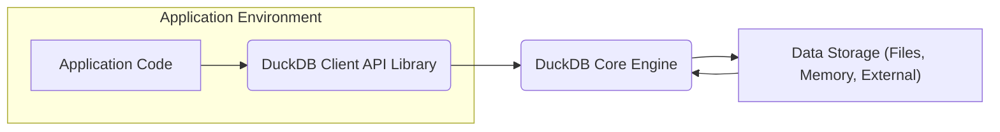
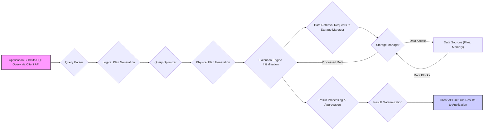

## Project Design Document: DuckDB (Improved)

**1. Introduction**

This document provides an enhanced architectural overview of the DuckDB project, an in-process SQL Online Analytical Processing (OLAP) database management system. The primary purpose of this document is to serve as a robust foundation for subsequent threat modeling exercises. It details the key components, data flows, and architectural decisions crucial for understanding potential security vulnerabilities and attack surfaces.

**2. Goals and Objectives**

The core design goals of DuckDB are to deliver:

* **High-Performance Analytical Query Processing:** Specifically optimized for complex analytical workloads requiring fast query execution.
* **Seamless In-Process Execution:** Designed to run directly within the application's process space, minimizing overhead associated with inter-process communication and data serialization.
* **Developer-Friendly Integration:** Offers simple and intuitive Application Programming Interfaces (APIs) for integration with various programming languages (e.g., Python, Java, C++, Go).
* **Embedded Database Functionality:**  Suitable for embedding directly within applications, eliminating the need for separate database server deployments.
* **Standard SQL Compliance:**  Adheres closely to SQL standards, ensuring broad compatibility and ease of use for developers familiar with SQL.
* **Extensibility and Customization:**  Provides mechanisms for extending functionality through custom functions, table functions, and data type definitions.
* **Minimal External Dependencies:** Engineered to have zero or very few external runtime dependencies, simplifying deployment and reducing potential dependency conflicts and vulnerabilities.

**3. Architecture Overview**

DuckDB's architecture is centered around a single-process, embedded design. The high-level interaction between the application and DuckDB can be visualized as:

* **Application Environment:** Represents the user's application and its runtime environment.
* **Application Code:** The portion of the application that initiates interactions with the DuckDB database.
* **DuckDB Client API Library:** Provides language-specific bindings and functions that the application code uses to communicate with the DuckDB Core. This acts as an interface layer.
* **DuckDB Core Engine:** The central component encompassing all core database functionalities, including query processing, optimization, execution, and storage management.
* **Data Storage (Files, Memory, External):** Represents the various locations where data resides, including local files (CSV, Parquet, JSON, etc.), in-memory data structures, and potentially external data sources accessed via extensions.

**4. Component Details**

The DuckDB Core Engine is composed of several interconnected components, each with a specific responsibility:

* **Query Parser:** Takes the SQL query string from the Client API and transforms it into an internal, structured representation known as a logical plan. This involves lexical analysis and syntactic analysis.
* **Query Optimizer:** Analyzes the logical plan to identify opportunities for performance improvement. This involves applying various optimization rules, such as predicate pushdown, join reordering, and common subexpression elimination, to generate an optimized physical execution plan.
* **Execution Engine:**  Interprets and executes the optimized physical plan. It coordinates the retrieval of data from the Storage Manager and performs the operations defined in the plan (e.g., filtering, sorting, aggregation, joining).
* **Storage Manager:** Responsible for managing how data is stored and retrieved. DuckDB uses a columnar storage format, which is beneficial for analytical queries. The Storage Manager handles data layout on disk, manages in-memory data structures, and interacts with different storage formats (e.g., Parquet, CSV). It also handles transactional aspects like concurrency control.
* **Catalog Manager:** Maintains metadata about all database objects, including tables, views, indexes, functions, and schemas. This information is crucial for query planning and execution. It also stores information about data types and constraints.
* **Type System:** Defines the set of data types supported by DuckDB (e.g., INTEGER, VARCHAR, DATE, TIMESTAMP). It ensures type consistency and correctness during query processing and data storage.
* **Expression Evaluation Engine:**  Evaluates expressions within SQL queries, including arithmetic operations, logical comparisons, and function calls. This component is used extensively during query execution.
* **Extension Framework:** Provides a mechanism for extending DuckDB's core functionality. Users can develop and load extensions to add support for new data formats, functions, table functions, and even custom storage mechanisms.
* **Concurrency Control (MVCC):** Implements Multi-Version Concurrency Control to manage concurrent access to the database, ensuring transactional integrity and isolation between concurrent queries and updates.
* **Memory Management:**  Handles the allocation and deallocation of memory used by DuckDB during its operation, including query processing and data storage. Efficient memory management is critical for performance.

**5. Data Flow (Detailed)**

A more detailed view of the data flow during query execution within DuckDB is as follows:

* **Application Submits SQL Query via Client API:** The application sends an SQL query string through the appropriate client API function.
* **Query Parser:** The Query Parser analyzes the SQL string, verifying its syntax and structure.
* **Logical Plan Generation:** The parser creates a logical representation of the query, outlining the operations to be performed without specifying the exact execution order or algorithms.
* **Query Optimizer:** The Optimizer takes the logical plan and applies optimization rules to generate a more efficient physical execution plan.
* **Physical Plan Generation:** The Optimizer produces a physical plan that specifies the exact steps and algorithms the Execution Engine should use to execute the query.
* **Execution Engine Initialization:** The Execution Engine is initialized based on the physical plan.
* **Data Retrieval Requests to Storage Manager:** The Execution Engine sends requests to the Storage Manager to retrieve the necessary data blocks.
* **Storage Manager:** The Storage Manager handles the interaction with the underlying data sources.
* **Data Sources (Files, Memory):** The actual data is read from files on disk, in-memory structures, or potentially external sources.
* **Data Blocks:** The Storage Manager returns the requested data blocks to the Execution Engine.
* **Result Processing & Aggregation:** The Execution Engine processes the retrieved data according to the physical plan, performing operations like filtering, joining, and aggregation.
* **Result Materialization:** The final results of the query are assembled and formatted.
* **Client API Returns Results to Application:** The Client API sends the query results back to the calling application.

**6. Security Considerations (Expanded)**

Considering DuckDB's architecture, the following security aspects are crucial:

* **Data at Rest Security:** DuckDB, being an in-process database, relies heavily on the security measures of the underlying file system or storage mechanism.
    * **Threat:** Unauthorized access to the files containing the database data.
    * **Mitigation:** Employing file system encryption (e.g., LUKS, BitLocker), access control lists (ACLs), and secure storage practices.
* **Data in Transit Security (Internal):** Within the application process, data transfer occurs in memory.
    * **Threat:** Memory corruption vulnerabilities within the application or DuckDB itself could expose data.
    * **Mitigation:**  Employing memory-safe programming practices, regular security audits of the DuckDB codebase, and using memory protection features of the operating system.
* **Data in Transit Security (External via Extensions):** If extensions enable client/server functionality, network security becomes a concern.
    * **Threat:** Interception of data transmitted over the network.
    * **Mitigation:** Using secure communication protocols like TLS/SSL for network connections.
* **Access Control Limitations:** DuckDB's core has limited built-in user authentication and authorization.
    * **Threat:** Unauthorized users or applications gaining access to the database.
    * **Mitigation:**  Relying on the host application's authentication and authorization mechanisms to control access to the DuckDB instance. Consider extensions that might offer more granular control if needed.
* **SQL Injection Vulnerabilities:**
    * **Threat:** Malicious SQL code injected through application inputs, potentially leading to data breaches or manipulation.
    * **Mitigation:**  Strictly using parameterized queries or prepared statements to prevent the interpretation of user-supplied data as SQL code. Implement robust input validation and sanitization.
* **Denial of Service (DoS) Attacks:**
    * **Threat:** Maliciously crafted, resource-intensive queries that can overwhelm the application or the underlying system.
    * **Mitigation:** Implementing query timeouts, resource usage limits, and rate limiting at the application level.
* **Extension Security Risks:**
    * **Threat:** Malicious or poorly written extensions introducing vulnerabilities or compromising the integrity of the database.
    * **Mitigation:**  Carefully vetting and auditing extensions before deployment. Consider using code signing and sandboxing techniques for extensions.
* **Supply Chain Security:**
    * **Threat:** Compromised dependencies or malicious code injected into the DuckDB library itself.
    * **Mitigation:**  Downloading DuckDB from trusted sources, verifying checksums, and monitoring for security advisories.
* **Memory Safety Issues:**
    * **Threat:** Memory corruption bugs in the C++ codebase potentially leading to crashes or exploitable vulnerabilities.
    * **Mitigation:**  Rigorous testing, static and dynamic analysis of the codebase, and addressing any identified memory safety issues promptly.
* **Code Injection via User-Defined Functions (UDFs) in Extensions:**
    * **Threat:** Malicious code embedded within UDFs executed within the DuckDB process.
    * **Mitigation:**  Implementing strict sandboxing and validation mechanisms for UDFs provided by extensions.

**7. Deployment Considerations (Refined)**

Common deployment scenarios for DuckDB include:

* **Directly Embedded within Applications:** The most frequent use case, where the DuckDB library is linked directly into the application's executable. This simplifies deployment but necessitates careful consideration of the application's security posture.
* **Command-Line Interface (CLI) Usage:** Developers and administrators can interact with DuckDB using its command-line tool for ad-hoc querying and scripting. Security relies on the security of the environment where the CLI is executed.
* **Client/Server Architectures (via Extensions):** Certain extensions can enable client/server communication, allowing remote applications to connect to a DuckDB instance. This introduces network security considerations and the need for authentication and authorization mechanisms provided by the extension.

**8. Future Considerations (Security Focused)**

Potential future developments in DuckDB that could impact security include:

* **Implementation of Built-in Authentication and Authorization Mechanisms:** Providing native user management and permission controls within DuckDB.
* **Native Encryption for Data at Rest:**  Integrating encryption capabilities directly into the DuckDB core to protect data stored on disk.
* **Enhanced Extension Security Features:**  Developing more robust sandboxing and security policies for extensions.
* **Improved Auditing and Logging Capabilities:**  Providing more detailed logs of database activity for security monitoring and incident response.

This enhanced design document provides a more in-depth understanding of DuckDB's architecture and its security implications. This detailed information is crucial for effective threat modeling and for developing strategies to mitigate potential security risks.