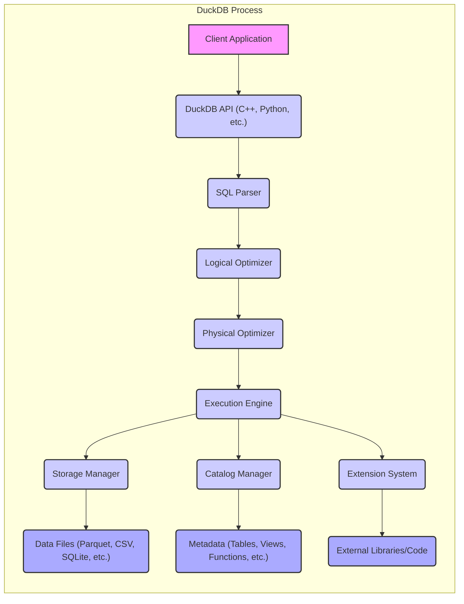

## Project Design Document: DuckDB (Improved)

**1. Project Overview**

DuckDB is a high-performance, in-process SQL OLAP database management system. It is designed to be directly embedded within applications, offering analytical query capabilities without the overhead of a separate database server. DuckDB prioritizes performance, ease of integration, and support for various data formats. This document provides a detailed architectural overview of DuckDB, focusing on components and data flows relevant for threat modeling.

**2. Goals and Objectives**

* Provide a comprehensive and detailed architectural description of DuckDB.
* Clearly identify the key components within the DuckDB system and their interactions.
* Illustrate the flow of data during query processing and other operations.
* Serve as a robust foundation for conducting thorough threat modeling activities.
* Enable security engineers and developers to understand the potential attack surface and security considerations of the system.

**3. Target Audience**

* Security Engineers responsible for threat modeling and security assessments.
* Software Architects designing systems that integrate with DuckDB.
* Developers contributing to or utilizing the DuckDB library.
* Penetration Testers evaluating the security posture of applications using DuckDB.

**4. System Architecture**

DuckDB's architecture is optimized for in-process execution and efficient data processing. The core components work together seamlessly to handle SQL queries and manage data.

**5. Data Flow Diagram**

The following diagram illustrates the typical data flow for executing a SQL query within DuckDB, highlighting key interactions between components.

```mermaid
graph LR
    A["Client Application"] -- "SQL Query" --> B("DuckDB API");
    B -- "SQL Query" --> C("SQL Parser");
    C -- "Parse Tree" --> D("Logical Optimizer");
    D -- "Optimized Logical Plan" --> E("Physical Optimizer");
    E -- "Optimized Physical Plan" --> F("Execution Engine");
    F -- "Metadata Requests" --> G("Catalog Manager");
    F -- "Data Read/Write Requests" --> H("Storage Manager");
    H -- "Data Read/Write" --> I("Data Files");
    F -- "Extension Function Calls" --> J("Extension System");
    J -- "External Code Execution" --> K("External Libraries/Code");
    F -- "Results" --> B;
    B -- "Results" --> A;

    style A fill:#f9f,stroke:#333,stroke-width:2px
    style B fill:#ccf,stroke:#333,stroke-width:2px
    style C fill:#ccf,stroke:#333,stroke-width:2px
    style D fill:#ccf,stroke:#333,stroke-width:2px
    style E fill:#ccf,stroke:#333,stroke-width:2px
    style F fill:#ccf,stroke:#333,stroke-width:2px
    style G fill:#ccf,stroke:#333,stroke-width:2px
    style H fill:#ccf,stroke:#333,stroke-width:2px
    style I fill:#aaf,stroke:#333,stroke-width:2px
    style J fill:#ccf,stroke:#333,stroke-width:2px
    style K fill:#aaf,stroke:#333,stroke-width:2px
```

**6. Key Components**

* **Client Application:** The external application that embeds and interacts with the DuckDB library. This can be written in various languages like Python, C++, Java, etc., using the provided language bindings.
* **DuckDB API:** The programming interface exposed by the DuckDB library. It provides functions for establishing connections, executing SQL queries (both synchronous and asynchronous), retrieving results, and managing database objects. Different language bindings offer variations of this API.
* **SQL Parser:** This component is responsible for taking the raw SQL query string as input and converting it into a structured internal representation, typically an Abstract Syntax Tree (AST) or a similar parse tree. It performs syntax validation and error checking.
* **Logical Optimizer:**  Operates on the parse tree to apply high-level, logical optimizations that improve the efficiency of the query without considering the physical execution details. Examples include predicate pushdown, constant folding, and view inlining.
* **Physical Optimizer:** Takes the optimized logical plan and transforms it into a physical execution plan. This involves selecting specific algorithms for operations (e.g., different join algorithms), determining the order of operations, and considering data access methods and parallelism.
* **Execution Engine:** The core of the query processing system. It interprets and executes the physical plan, coordinating the execution of individual operators. DuckDB utilizes a vectorized execution model for performance. It interacts with the Storage Manager and Catalog Manager to access data and metadata.
* **Storage Manager:** Responsible for managing how data is stored and retrieved. It handles interactions with various storage formats, including:
    *  Local files (Parquet, CSV, JSON, etc.)
    *  SQLite databases
    *  In-memory data structures
    *  Potentially external data sources through extensions.
    It manages buffering, caching, and transaction management (ACID properties).
* **Catalog Manager:**  Maintains metadata about all database objects, such as:
    *  Tables (schemas, column definitions, constraints)
    *  Views (definitions)
    *  Indexes
    *  Functions (both built-in and user-defined)
    *  Data types
    It provides a central repository for schema information used by other components.
* **Extension System:** Allows users to extend DuckDB's functionality by loading external libraries or code. Extensions can provide:
    *  New scalar and aggregate functions
    *  New table functions (for accessing external data sources)
    *  New file system handlers
    *  Custom data types
    Extensions are typically written in C++ and compiled into shared libraries.
* **Data Files:** The persistent storage locations where the actual data resides. The format of these files depends on the storage mechanism being used (e.g., Parquet files are columnar and optimized for analytical queries, CSV files are plain text).
* **Metadata:** Information describing the structure and properties of the data, managed by the Catalog Manager. This includes table schemas, data types, and other database object definitions.
* **External Libraries/Code:**  Shared libraries or code loaded via the Extension System. These can introduce external dependencies and potential security risks if not properly vetted.

**7. Security Considerations**

Given DuckDB's architecture and deployment model, several security considerations are important:

* **Input Validation and SQL Injection:**
    *  The primary entry point for external input is through SQL queries.
    *  Insufficient validation of user-provided input within the Client Application before constructing SQL queries can lead to SQL injection vulnerabilities.
    *  Care must be taken when using string formatting or concatenation to build SQL queries. Parameterized queries should be preferred.
* **File System Security:**
    *  DuckDB relies on the underlying file system for storing data files.
    *  Inadequate file permissions can allow unauthorized users or processes to read, modify, or delete data files.
    *  The security of the file system directly impacts the confidentiality and integrity of the data.
* **Extension Security:**
    *  Extensions introduce external code into the DuckDB process.
    *  Malicious or vulnerable extensions can potentially:
        *  Execute arbitrary code within the DuckDB process.
        *  Access sensitive data.
        *  Cause denial of service.
        *  Compromise the host system.
    *  Careful vetting and potentially sandboxing of extensions are crucial.
* **Denial of Service (DoS):**
    *  Maliciously crafted SQL queries can consume excessive resources (CPU, memory, disk I/O), leading to denial of service.
    *  This can impact the performance and availability of the embedding application.
    *  Resource limits and query timeouts can help mitigate this risk.
* **Memory Safety:**
    *  As DuckDB is implemented in C++, memory safety vulnerabilities (e.g., buffer overflows, use-after-free) are potential risks.
    *  These vulnerabilities could be exploited to achieve arbitrary code execution.
* **Data Integrity:**
    *  Ensuring the integrity of data stored in files is important.
    *  Mechanisms for detecting and potentially recovering from data corruption should be considered.
    *  Transaction management within DuckDB helps maintain data consistency.
* **Information Disclosure:**
    *  Error messages or logging information might inadvertently reveal sensitive data or internal details.
    *  Care should be taken to sanitize error messages and control the level of logging in production environments.
* **Dependency Management:**
    *  DuckDB relies on various third-party libraries.
    *  Vulnerabilities in these dependencies could potentially impact DuckDB's security.
    *  Regularly updating dependencies and monitoring for known vulnerabilities is important.
* **Side-Channel Attacks:**
    *  While less likely in an embedded database, potential side-channel attacks (e.g., timing attacks) could theoretically leak information.

**8. Deployment Considerations**

DuckDB's deployment model as an embedded library has specific security implications:

* **In-Process Execution:** DuckDB shares the same process space as the host application. This means security boundaries are primarily at the process level. A compromise of the host application could directly lead to a compromise of the DuckDB instance and its data.
* **File-Based Storage:** The security of the data largely depends on the security of the file system where the data files are stored.
* **Configuration:**  Configuration options can influence security, such as enabling or disabling certain features or setting resource limits. Secure default configurations are important.
* **Language Bindings:** The security of the language binding used (e.g., Python, C++) can also be a factor. Vulnerabilities in the binding could potentially be exploited.

**9. Future Considerations**

* **Enhanced Access Control Mechanisms:** Implementing more granular access control within DuckDB itself, beyond relying solely on file system permissions, could improve security.
* **Sandboxing for Extensions:**  Developing a robust sandboxing mechanism for extensions would significantly mitigate the risks associated with untrusted or vulnerable extension code.
* **Encryption at Rest:** Adding built-in support for encrypting data at rest would enhance the confidentiality of sensitive data.
* **Auditing Capabilities:** Implementing auditing features would allow tracking of data access and modifications, aiding in security monitoring and incident response.
* **Secure Multi-tenancy (Limited Applicability):** While primarily an embedded database, exploring options for securely isolating data and resources in scenarios where multiple logical databases are used within the same process could be considered.

This improved design document provides a more detailed and comprehensive overview of DuckDB's architecture, specifically tailored for threat modeling purposes. It highlights key components, data flows, and potential security considerations, enabling security professionals to conduct more effective risk assessments.