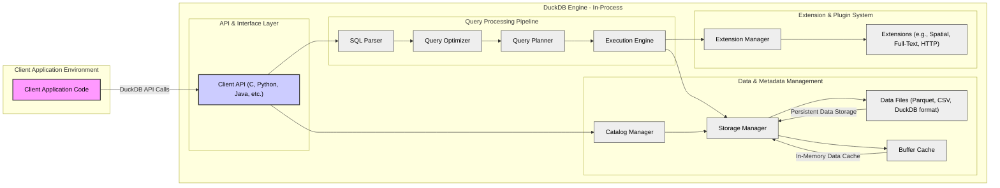

# Project Design Document: DuckDB - For Threat Modeling

**Version:** 1.1
**Date:** 2023-10-27
**Author:** Gemini (AI Expert)
**Project:** DuckDB - In-Process SQL OLAP Database Management System
**GitHub Repository:** [https://github.com/duckdb/duckdb](https://github.com/duckdb/duckdb)

## 1. Project Overview

DuckDB is an in-process SQL OLAP database management system meticulously engineered for high-performance analytical workloads. Its core design principles emphasize speed, ease of integration, and an embedded architecture. DuckDB distinguishes itself by delivering robust database capabilities directly within applications, eliminating the complexities and overhead associated with separate database server deployments.  This design choice significantly reduces latency and simplifies data access for analytical tasks.

Key characteristics that define DuckDB include:

*   **In-Process Architecture:**  Operating within the application's process space minimizes inter-process communication, leading to substantial performance gains by reducing data serialization and context switching overhead. This is a core architectural decision impacting both performance and security boundaries.
*   **Optimized for Analytical Processing (OLAP):**  DuckDB is purpose-built for complex analytical queries. It leverages columnar storage, vectorized query execution, and other OLAP-centric optimizations to achieve exceptional query performance on large datasets.
*   **Standard SQL Compliance:**  DuckDB offers broad compatibility with the SQL standard, ensuring a familiar and accessible interface for users and developers accustomed to relational database systems. This reduces the learning curve and facilitates seamless integration into existing SQL-based workflows.
*   **Embedded and Lightweight:**  Designed for effortless integration into diverse applications and programming environments. Its small footprint and minimal dependencies simplify deployment and reduce resource consumption.
*   **Extensibility through Extensions:**  DuckDB's architecture supports a flexible extension mechanism, allowing users to augment its core functionality with custom features, data types, and integrations. This extensibility is powerful but introduces security considerations.
*   **Minimal External Dependencies (Core Engine):**  The core DuckDB engine is designed with a strong focus on minimizing external dependencies. This reduces the attack surface associated with third-party libraries and simplifies dependency management, enhancing stability and security.

This document serves as a detailed architectural blueprint of DuckDB, specifically tailored to facilitate comprehensive threat modeling and security analysis. It focuses on design elements and component interactions that are most relevant to security considerations, providing a foundation for identifying potential vulnerabilities and attack vectors.

## 2. System Architecture

The following diagram provides a high-level visual representation of DuckDB's architecture, illustrating the key components and their interactions.

## 3. Component Description

This section provides a detailed description of each component within the DuckDB architecture, emphasizing their functionality and security implications. Understanding these components is crucial for effective threat modeling.

### 3.1. Client Application Code

*   **Description:** This represents the external application that integrates and interacts with the DuckDB engine. It is the entry point for user interaction and can be developed in various programming languages supported by DuckDB's client APIs. The client application is responsible for initiating database connections, executing SQL queries, and handling results.
*   **Security Relevance:** The client application's security posture is paramount. Vulnerabilities within the client application, such as insecure coding practices, dependency vulnerabilities, or improper input handling, can be exploited to compromise the embedded DuckDB instance and potentially the underlying system. Secure coding practices, input validation, and principle of least privilege should be rigorously applied in client application development.

### 3.2. Client API (C, Python, Java, etc.)

*   **Description:** The Client API serves as the communication bridge between the client application and the core DuckDB engine. DuckDB offers APIs in multiple languages, each acting as a wrapper around the core C++ engine. These APIs handle tasks such as connection management, query submission, result retrieval, and data type conversion.
*   **Security Relevance:** The Client API layer must be designed with security in mind. It is responsible for securely transmitting data and commands between the client application and the engine. Potential vulnerabilities in API bindings could include:
    *   **Injection vulnerabilities:** Improper handling of input from the client application could lead to SQL injection or other command injection attacks.
    *   **Memory safety issues:**  API bindings, especially in languages like C and C++, must be carefully implemented to avoid memory leaks, buffer overflows, and other memory-related vulnerabilities.
    *   **API abuse:**  APIs should be designed to prevent misuse or abuse that could lead to denial-of-service or unauthorized access.

### 3.3. SQL Parser

*   **Description:** The SQL Parser is the first stage in the query processing pipeline. It receives SQL queries as text input from the Client API and transforms them into an internal Abstract Syntax Tree (AST) representation. This process involves lexical analysis, syntax validation, and semantic analysis to ensure the query conforms to the SQL language grammar and is structurally sound.
*   **Security Relevance:** The SQL Parser is a critical security component and a primary target for **SQL Injection attacks**. If the parser fails to correctly validate and sanitize input, malicious SQL code embedded within user-supplied queries could be parsed and subsequently executed by the engine, leading to severe consequences such as:
    *   **Data breaches:** Unauthorized access to sensitive data.
    *   **Data manipulation:**  Modification or deletion of data.
    *   **Privilege escalation:**  Gaining elevated privileges within the database.
    *   **Denial of Service:**  Causing the database to crash or become unresponsive.
    The parser must be rigorously tested and designed to strictly adhere to the defined SQL grammar, rejecting any invalid or potentially harmful constructs.  Techniques like parameterized queries and prepared statements, when supported by the Client API, are crucial for mitigating SQL injection risks.

### 3.4. Query Optimizer

*   **Description:** The Query Optimizer takes the AST generated by the parser and aims to transform it into a more efficient and performant execution plan. It employs various optimization techniques, including:
    *   **Query rewriting:**  Transforming the query into an equivalent but more efficient form.
    *   **Join reordering:**  Determining the optimal order for join operations.
    *   **Index selection (future):**  Choosing appropriate indexes to speed up data retrieval (currently limited in DuckDB but a potential future feature).
    *   **Algorithm selection:**  Selecting the most efficient algorithms for operations like joins and aggregations.
*   **Security Relevance:** While primarily focused on performance, the Query Optimizer has indirect security implications:
    *   **Denial of Service (DoS):**  Inefficient query plans generated by a flawed optimizer could lead to excessive resource consumption (CPU, memory, I/O), potentially causing denial-of-service.
    *   **Logical errors:**  Bugs in the optimization logic could, in rare cases, lead to incorrect query results. While not directly a security vulnerability in the traditional sense, incorrect data can have security consequences in applications relying on data integrity.
    *   **Information Leakage (indirect):** In extreme cases of optimization errors, if the system behaves unexpectedly, it *could* potentially leak information through timing differences or resource usage patterns, although this is highly unlikely in practice.

### 3.5. Query Planner

*   **Description:** The Query Planner takes the optimized query representation from the Query Optimizer and translates it into a concrete, executable plan. This plan breaks down the query into a sequence of low-level operations that the Execution Engine can understand and execute. The plan specifies the order of operations, data access methods, and resource allocation.
*   **Security Relevance:** The Query Planner's correctness and security are vital:
    *   **Access Control Enforcement (future):** If access control mechanisms are implemented in DuckDB in the future, the Query Planner would be responsible for ensuring that the execution plan respects these controls, preventing unauthorized data access.
    *   **Plan Integrity:**  Errors in plan generation could lead to unexpected behavior, incorrect data access, or even system instability. The planner must generate plans that are both correct and secure.
    *   **Resource Management:** The planner might play a role in resource allocation for query execution.  A malicious planner (due to vulnerabilities) could potentially be exploited to create plans that consume excessive resources, leading to DoS.

### 3.6. Execution Engine

*   **Description:** The Execution Engine is the core runtime component of DuckDB. It is responsible for executing the query plan generated by the Query Planner. It fetches data from the Storage Manager, performs the operations specified in the plan (filtering, aggregation, joins, etc.), and returns the final query results to the Client API. DuckDB's execution engine is vectorized and columnar, designed for high-performance analytical query processing.
*   **Security Relevance:** The Execution Engine is the most critical component from a security perspective as it directly handles data access and manipulation. Key security considerations include:
    *   **Memory Safety:**  The Execution Engine, being written in C++, must be meticulously designed to prevent memory-related vulnerabilities such as buffer overflows, use-after-free errors, and memory leaks. These vulnerabilities could be exploited for arbitrary code execution or denial-of-service.
    *   **Data Integrity:**  The engine must ensure data integrity throughout query execution. Operations must be performed correctly to avoid data corruption or manipulation.
    *   **Access Control Enforcement (future):** If access control is implemented, the Execution Engine would be responsible for enforcing these controls during data access operations, ensuring that users only access data they are authorized to see.
    *   **Resource Management:** The engine must manage resources (CPU, memory, I/O) effectively to prevent resource exhaustion and denial-of-service attacks.  Malicious queries or extensions could potentially be crafted to overload the engine.
    *   **Side-channel attacks:**  While less likely in an in-process database, consider potential side-channel attacks (e.g., timing attacks) if sensitive data is processed.

### 3.7. Catalog Manager

*   **Description:** The Catalog Manager is responsible for managing metadata about the database. This metadata includes information about:
    *   **Tables:** Table schemas, column definitions, data types.
    *   **Views:** View definitions.
    *   **Functions:**  Definitions of built-in and user-defined functions.
    *   **Extensions:**  Information about loaded extensions.
    *   **Data types:**  Definitions of data types supported by the database.
    The Catalog Manager provides this metadata to other components, particularly the Query Planner and Execution Engine, to facilitate query processing and data access.
*   **Security Relevance:** The Catalog Manager holds sensitive metadata that is crucial for the database's operation and security:
    *   **Metadata Integrity:**  The integrity of the catalog metadata is paramount. Corruption or unauthorized modification of the catalog could lead to database instability, incorrect query results, or even security breaches.
    *   **Unauthorized Access to Metadata:**  While DuckDB currently lacks explicit user authentication, unauthorized access to the catalog metadata itself could reveal sensitive information about the database structure and data organization, potentially aiding attackers in planning attacks.
    *   **Catalog Injection (less likely but consider):**  Although less common than SQL injection, vulnerabilities in catalog management operations *could* potentially lead to "catalog injection" where malicious metadata is injected, potentially altering database behavior or creating backdoors.

### 3.8. Storage Manager

*   **Description:** The Storage Manager handles the physical storage and retrieval of data. Its responsibilities include:
    *   **Data File Management:**  Reading and writing data to persistent storage files in various formats (DuckDB's internal format, Parquet, CSV, etc.).
    *   **Buffer Cache Management:**  Implementing and managing an in-memory Buffer Cache to cache frequently accessed data blocks, reducing disk I/O and improving query performance.
    *   **Data Format Handling:**  Managing the specifics of different data storage formats and ensuring data consistency across formats.
*   **Security Relevance:** The Storage Manager is responsible for **data at rest security** and plays a crucial role in data integrity and availability:
    *   **Data at Rest Encryption:**  If data at rest encryption is implemented (currently not a core feature but could be added via extensions or future core features), the Storage Manager would be responsible for encryption and decryption operations. Lack of encryption means data files are vulnerable if physical access is compromised.
    *   **Access Control to Data Files:**  While DuckDB itself doesn't manage OS-level file permissions, the security of the underlying file system and access controls to data files are critical. Unauthorized access to data files bypasses any database-level security mechanisms.
    *   **Buffer Cache Security:**  Sensitive data resides in the Buffer Cache in memory.  Proper memory management and protection of the cache from unauthorized access are important.  Cache poisoning attacks (injecting malicious data into the cache) are a theoretical concern, though less likely in DuckDB's architecture.
    *   **Data Integrity on Disk:**  The Storage Manager must ensure data integrity when writing to and reading from disk. File corruption or errors during I/O operations could lead to data loss or inconsistencies.

### 3.9. Data Files (Parquet, CSV, DuckDB format)

*   **Description:** These are the physical files where the actual database data is persistently stored on disk. DuckDB supports a variety of file formats, allowing users to choose formats based on performance, interoperability, and storage requirements.
*   **Security Relevance:** Data Files represent the persistent storage of sensitive data and are a prime target for attackers if physical or logical access is compromised:
    *   **Data Confidentiality:**  If data files are not encrypted at rest, they are vulnerable to unauthorized access if an attacker gains access to the storage media.
    *   **Data Integrity:**  Data files must be protected from unauthorized modification or corruption. File system permissions and integrity checks are important.
    *   **Physical Security:**  The physical security of the storage media where data files are stored is a fundamental security control.

### 3.10. Buffer Cache

*   **Description:** The Buffer Cache is an in-memory cache managed by the Storage Manager. It stores frequently accessed data blocks from data files to minimize disk I/O and accelerate query performance. The cache operates transparently to other components of the engine.
*   **Security Relevance:** While primarily a performance optimization, the Buffer Cache has security implications:
    *   **Data in Memory:**  Sensitive data resides in the Buffer Cache in memory, making it potentially vulnerable to memory dumping or cold boot attacks if physical access to the system is compromised.
    *   **Cache Management Vulnerabilities:**  Bugs in cache management logic could potentially lead to vulnerabilities, although this is less common.
    *   **Cache Poisoning (theoretical):**  While less likely in DuckDB's design, theoretically, a cache poisoning attack could attempt to inject malicious data into the cache to influence query results.

### 3.11. Extension Manager

*   **Description:** The Extension Manager is responsible for loading, managing, and unloading extensions to DuckDB. Extensions are dynamically loadable modules that can extend DuckDB's functionality with new features, data types, functions, and integrations.
*   **Security Relevance:** Extensions represent a significant security attack surface in DuckDB. **Malicious or poorly written extensions can introduce severe vulnerabilities** into the core engine and the system as a whole:
    *   **Code Injection:**  Malicious extensions could inject arbitrary code into the DuckDB process, gaining full control over the engine and potentially the underlying system.
    *   **Memory Safety Issues:**  Extensions written in C++ (or other languages with memory management complexities) can introduce memory leaks, buffer overflows, and other memory-related vulnerabilities.
    *   **Functionality Abuse:**  Even non-malicious but poorly designed extensions could introduce vulnerabilities through insecure functionalities or unintended side effects.
    *   **Dependency Vulnerabilities:**  Extensions may introduce their own dependencies, which could have known vulnerabilities.
    *   **Lack of Sandboxing (current):**  Currently, DuckDB extensions run within the same process space as the core engine without strong sandboxing. This means an extension has broad access to system resources and can potentially compromise the entire system.
    *   **Extension Verification and Trust:**  Mechanisms for verifying the integrity and trustworthiness of extensions are crucial.  Without proper vetting, users could unknowingly load malicious extensions.

### 3.12. Extensions (e.g., Spatial, Full-Text, HTTP)

*   **Description:** Extensions are plug-in modules that extend DuckDB's capabilities. Examples include extensions for spatial data processing, full-text search, HTTP access, cloud storage integration, and more. Extensions are typically distributed as shared libraries or dynamically linked libraries.
*   **Security Relevance:** As highlighted in the Extension Manager section, extensions are a major security concern. They operate within the DuckDB process and can potentially access all resources available to the engine.  Security vulnerabilities in extensions can directly and severely impact the security of the entire DuckDB system.  Robust extension management, sandboxing (future enhancement), and careful vetting of extensions are essential for mitigating these risks.  The security of extensions is heavily dependent on the quality and security practices of the extension developers.

## 4. Data Flow

The following diagram illustrates the typical data flow for executing a SQL query within DuckDB. Understanding this flow is crucial for identifying potential security touchpoints.

```mermaid
graph LR
    A["Client Application"] --> B["Client API"];
    B -- "SQL Query Request" --> C["SQL Parser"];
    C -- "Abstract Syntax Tree (AST)" --> D["Query Optimizer"];
    D -- "Optimized AST" --> E["Query Planner"];
    E -- "Execution Plan" --> F["Execution Engine"];
    F -- "Data Access Request" --> H["Storage Manager"];
    H -- "Data Blocks (from Files/Cache)" --> F;
    F -- "Query Results" --> B;
    B -- "Results Delivery" --> A;

    style A fill:#f9f,stroke:#333,stroke-width:2px,color:#000
    style B fill:#ccf,stroke:#333,stroke-width:2px,color:#000
    style C fill:#eee,stroke:#333,stroke-width:1px,color:#000
    style D fill:#eee,stroke:#333,stroke-width:1px,color:#000
    style E fill:#eee,stroke:#333,stroke-width:1px,color:#000
    style F fill:#eee,stroke:#333,stroke-width:1px,color:#000
    style H fill:#eee,stroke:#333,stroke-width:1px,color:#000
```

**Data Flow Description:**

1.  **Client Application** initiates a SQL query execution by sending a **SQL Query Request** to the **Client API**.
2.  The **Client API** forwards the SQL query string to the **SQL Parser**.
3.  The **SQL Parser** parses the SQL query, performs syntax and semantic analysis, and generates an **Abstract Syntax Tree (AST)** representing the query's structure.
4.  The **AST** is passed to the **Query Optimizer**.
5.  The **Query Optimizer** analyzes the AST and applies optimization techniques to produce an **Optimized AST** for efficient execution.
6.  The **Optimized AST** is then processed by the **Query Planner**.
7.  The **Query Planner** translates the optimized AST into a concrete **Execution Plan**, detailing the sequence of operations for query execution.
8.  The **Execution Plan** is handed over to the **Execution Engine**.
9.  The **Execution Engine** executes the plan, issuing **Data Access Requests** to the **Storage Manager** as needed to retrieve data.
10. The **Storage Manager** fetches **Data Blocks** from either persistent **Data Files** or the **Buffer Cache** and provides them to the **Execution Engine**.
11. The **Execution Engine** processes the retrieved data according to the execution plan and generates **Query Results**.
12. The **Query Results** are returned to the **Client API**.
13. The **Client API** performs any necessary formatting or conversion and completes the **Results Delivery** back to the **Client Application**.

**Security Touchpoints in Data Flow (and Potential Threats):**

*   **SQL Query Request (Client API to SQL Parser):**  **SQL Injection Vulnerability**. Malicious SQL code injected here can compromise the entire database. Input validation and parameterized queries are crucial mitigations.
*   **Data Access Request (Execution Engine to Storage Manager):** **Access Control Enforcement Point (future)**. If access control is implemented, checks would occur here to ensure the Execution Engine is authorized to access the requested data. Currently, no explicit access control within DuckDB itself.
*   **Data Blocks (Storage Manager to Execution Engine):** **Data Integrity and Confidentiality**. Ensure data retrieved from storage is not corrupted or tampered with. If encryption at rest is implemented, decryption would occur around this point.
*   **Query Results (Execution Engine to Client API):** **Information Disclosure**. Ensure only authorized data is returned to the client application.  In scenarios with potential future access control, filtering of results based on user privileges would be relevant here.

## 5. Technology Stack

*   **Core Engine & Most Extensions:** C++ (Emphasis on performance and control, but requires careful memory management for security)
*   **Client APIs:** C, Python, Java, R, Node.js, WASM, Go, Ruby (Variety of interfaces increases accessibility but requires secure API binding implementations for each language)
*   **Storage Formats:** DuckDB internal format (optimized for performance), Parquet, CSV, JSON, Arrow, and potentially others via extensions (Format diversity increases flexibility but introduces complexity in handling and potential format-specific vulnerabilities).
*   **Operating Systems:** Cross-platform compatibility (Windows, macOS, Linux, etc.) (Broad platform support increases reach but requires addressing platform-specific security considerations).
*   **Build System:** CMake (Industry-standard build system, but build process security is still important to prevent supply chain attacks).
*   **Dependency Management:**  Generally minimal core dependencies, but extensions can introduce dependencies (Minimal core dependencies reduce attack surface, but extension dependencies need careful management).

**Security Relevance of Technology Stack Details:**

*   **C++ Core:**  While C++ provides performance and fine-grained control, it demands rigorous memory management to prevent common vulnerabilities like buffer overflows, use-after-free errors, and memory leaks. Secure C++ coding practices, static analysis, and dynamic testing are essential.
*   **Multiple Client APIs:**  Each Client API binding must be meticulously developed to avoid introducing vulnerabilities in the interface between the client language and the core C++ engine.  API design should prioritize security and prevent injection attacks or other forms of malicious input.  Consistent security practices across all APIs are crucial.
*   **External Libraries & Dependencies:** DuckDB's core engine aims for minimal external dependencies, which is a positive security feature. However, extensions and some functionalities might rely on external libraries.  Dependency management is critical.  Regularly auditing and updating dependencies to address known vulnerabilities is essential.  Supply chain security for dependencies should be considered.
*   **Cross-Platform Nature:**  Cross-platform compatibility requires careful consideration of platform-specific security features and potential vulnerabilities.  Testing and validation across different platforms are necessary to ensure consistent security.

## 6. Security Considerations (For Threat Modeling - Categorized)

This section outlines key security considerations, categorized for clarity, to guide the threat modeling process.

**Confidentiality:**

*   **Data at Rest Encryption:** Lack of built-in encryption for data files is a significant confidentiality risk. Consider the need for encryption at rest, especially for sensitive data.
*   **Data in Memory (Buffer Cache):** Sensitive data resides in the Buffer Cache. Consider risks of memory access if physical security is compromised.
*   **Unauthorized Metadata Access:**  While no user authentication, unauthorized access to catalog metadata could reveal sensitive database structure information.
*   **Information Leakage through Errors:** Ensure error messages do not leak sensitive information.

**Integrity:**

*   **SQL Injection:**  Primary integrity threat. Successful SQL injection can lead to data modification or deletion. Robust parser and parameterized queries are essential.
*   **Data File Integrity:**  Protect data files from unauthorized modification or corruption. File system permissions and integrity checks are relevant.
*   **Catalog Integrity:**  Maintain the integrity of the catalog metadata. Corruption can lead to database instability and incorrect behavior.
*   **Extension Integrity:**  Ensure extensions are from trusted sources and have not been tampered with. Code signing and verification mechanisms are needed.
*   **Memory Corruption:**  Memory safety vulnerabilities in C++ code (core engine and extensions) can lead to data corruption and unpredictable behavior.

**Availability:**

*   **Denial of Service (DoS) - Query Based:**  Maliciously crafted queries could consume excessive resources (CPU, memory, I/O), leading to DoS. Implement query timeouts and resource limits.
*   **Denial of Service (DoS) - Extension Based:**  Malicious or poorly written extensions could cause crashes or resource exhaustion, leading to DoS. Extension sandboxing and resource limits are needed.
*   **Resource Exhaustion:**  General resource exhaustion due to legitimate but resource-intensive queries or workloads. Implement resource management and monitoring.
*   **Data File Availability:** Ensure data files are accessible and protected from deletion or damage. Backup and recovery mechanisms are important.
*   **Catalog Availability:**  Ensure the catalog is available and protected from corruption. Catalog backup and recovery are needed.

**Other Security Considerations:**

*   **Extension Security:**  As repeatedly emphasized, extensions are a major attack surface. Implement robust extension management, sandboxing, vetting, and update mechanisms.
*   **Dependency Management:**  Proactive dependency management and vulnerability patching for both core engine dependencies (minimal) and extension dependencies (potentially significant).
*   **Memory Safety in C++:**  Rigorous development practices, code reviews, static analysis, and dynamic testing to mitigate memory safety vulnerabilities in C++ code.
*   **Error Handling and Logging:**  Implement robust error handling to prevent crashes and information leakage.  Comprehensive and security-sensitive logging for auditing and incident response.
*   **Physical Security:**  For persistent data, physical security of the storage media is a fundamental control.
*   **Supply Chain Security:** Consider security of the build process and distribution channels to prevent supply chain attacks.

This improved design document provides a more detailed and security-focused foundation for conducting a thorough threat model of DuckDB. By systematically analyzing each component, data flow, and security consideration, a comprehensive security assessment can be performed to identify, prioritize, and mitigate potential vulnerabilities, ultimately enhancing the security posture of DuckDB.