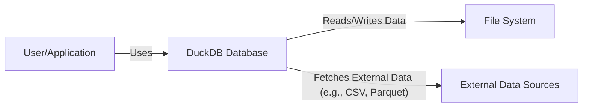
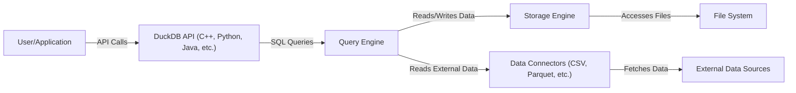
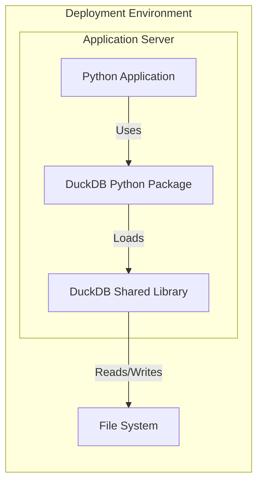
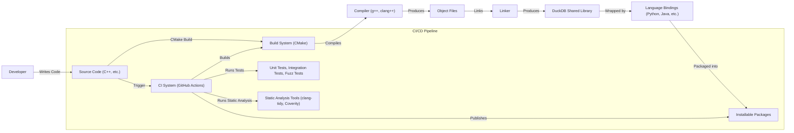

# BUSINESS POSTURE

DuckDB is an in-process SQL OLAP database management system. It's designed to be fast, reliable, and easy to use. It's positioned as an embedded database, similar to SQLite, but focused on analytical workloads.

Business Priorities:

- Performance: Provide fast query execution for analytical workloads.
- Ease of Use: Simple installation and usage, with minimal dependencies.
- Compatibility: Support standard SQL and integrate with various data ecosystems.
- Reliability: Ensure data integrity and consistent results.
- Cost-Effectiveness: Minimize resource consumption (CPU, memory, storage).
- Embeddability: Seamless integration into other applications and systems.

Business Goals:

- Become a leading choice for embedded analytical processing.
- Enable fast, local data analysis without the need for a separate database server.
- Facilitate data-intensive applications and workflows.
- Provide a free and open-source alternative to commercial analytical databases.

Most Important Business Risks:

- Data Corruption: Given that it's an in-process database, any crashes or errors in the host application could potentially lead to data loss or corruption.
- Security Vulnerabilities: As an embedded database, vulnerabilities in DuckDB could be exploited through the host application, potentially leading to unauthorized data access or system compromise.
- Performance Bottlenecks: Unexpected performance issues with specific queries or data sets could hinder adoption and user satisfaction.
- Compatibility Issues: Incompatibilities with specific SQL dialects or data formats could limit its applicability.
- Lack of Concurrency Control for Multiple Writers: While DuckDB supports concurrent reads, concurrent writes from multiple processes are not fully supported, which can be a limitation in some use cases.

# SECURITY POSTURE

Existing Security Controls:

- security control: Secure Coding Practices: The project uses C++11 and emphasizes code quality and correctness. This is evident in their contribution guidelines and coding style documentation. (Described in CONTRIBUTING.md and docs/dev/coding_style.md)
- security control: Static Analysis: The project uses static analysis tools like clang-tidy and Coverity Scan to identify potential bugs and vulnerabilities. (Described in .github/workflows/lint.yml and docs/dev/building.md)
- security control: Fuzz Testing: DuckDB employs fuzz testing (OSS-Fuzz) to find potential crashes and vulnerabilities by providing invalid or unexpected inputs. (Described in tools/ossfuzz)
- security control: Regular Updates: The project has a frequent release cycle, allowing for timely patching of security vulnerabilities.
- security control: Dependency Management: The project carefully manages its dependencies to minimize the risk of supply chain attacks. They have a relatively small number of external dependencies.
- security control: Memory Safety: As a C++ project, memory safety is a concern. The project uses techniques like smart pointers and RAII to mitigate memory management issues.
- security control: Input Validation: DuckDB performs input validation to prevent SQL injection and other injection attacks. This is inherent in the design of a SQL database.

Accepted Risks:

- accepted risk: Single-Process Limitation: DuckDB is primarily designed for single-process use. While multiple processes can read from the same database file concurrently, concurrent writes are not fully supported and require external locking mechanisms. This is a known limitation and a trade-off for performance and simplicity.
- accepted risk: Host Application Security: As an embedded database, DuckDB's security relies heavily on the security of the host application. Vulnerabilities in the host application can potentially compromise DuckDB.
- accepted risk: Limited Access Control: DuckDB does not have built-in user management or granular access control mechanisms. It relies on the operating system's file permissions for access control.

Recommended Security Controls:

- security control: Enhanced Sandboxing: Explore options for sandboxing DuckDB within the host application to limit the impact of potential vulnerabilities.
- security control: Authentication and Authorization: While complex access control might not be a primary goal, consider adding basic authentication and authorization mechanisms for scenarios where multiple users or processes interact with the same database.
- security control: Data Encryption at Rest: Implement encryption at rest to protect data stored on disk.

Security Requirements:

- Authentication: Not a primary requirement due to the embedded nature. However, basic authentication mechanisms could be considered for specific use cases.
- Authorization: Limited authorization based on file system permissions. More granular authorization is not a core requirement.
- Input Validation: Strict input validation is crucial to prevent SQL injection and other injection attacks. This is already a core part of DuckDB's design.
- Cryptography:
    - Data in transit: Not directly applicable as it's an in-process database.
    - Data at rest: Encryption at rest should be considered as a recommended security control.
    - Hashing: Used for data integrity checks and potentially for password storage if authentication is added.

# DESIGN

## C4 CONTEXT

Element Descriptions:

-   Name: User/Application
    -   Type: User/External System
    -   Description: Represents the user or application that interacts with DuckDB.
    -   Responsibilities:
        -   Initiates queries and data manipulation operations.
        -   Provides input data.
        -   Receives and processes query results.
    -   Security controls:
        -   Authentication and authorization mechanisms (if applicable) within the application.
        -   Input validation to prevent malicious data from being passed to DuckDB.

-   Name: DuckDB Database
    -   Type: System
    -   Description: The DuckDB in-process database management system.
    -   Responsibilities:
        -   Parses and executes SQL queries.
        -   Manages data storage and retrieval.
        -   Provides an API for interacting with the database.
    -   Security controls:
        -   Input validation to prevent SQL injection.
        -   Secure coding practices.
        -   Static analysis and fuzz testing.

-   Name: File System
    -   Type: External System
    -   Description: The underlying file system where DuckDB stores its data.
    -   Responsibilities:
        -   Provides persistent storage for database files.
    -   Security controls:
        -   Operating system file permissions.
        -   Disk encryption (if applicable).

-   Name: External Data Sources
    -   Type: External System
    -   Description: External data sources that DuckDB can read from, such as CSV files, Parquet files, etc.
    -   Responsibilities:
        -   Provide data to be queried by DuckDB.
    -   Security controls:
        -   Data source-specific security mechanisms (e.g., access controls, encryption).

## C4 CONTAINER

Element Descriptions:

-   Name: DuckDB API (C++, Python, Java, etc.)
    -   Type: Container
    -   Description: The API layer that provides access to DuckDB's functionality.
    -   Responsibilities:
        -   Provides a programmatic interface for interacting with DuckDB.
        -   Handles connection management.
        -   Translates API calls into SQL queries.
    -   Security controls:
        -   Input validation.
        -   Parameter sanitization.

-   Name: Query Engine
    -   Type: Container
    -   Description: The component responsible for parsing, optimizing, and executing SQL queries.
    -   Responsibilities:
        -   Parses SQL queries into an abstract syntax tree.
        -   Optimizes the query plan for efficient execution.
        -   Executes the query plan.
    -   Security controls:
        -   SQL injection prevention.
        -   Secure coding practices.

-   Name: Storage Engine
    -   Type: Container
    -   Description: The component responsible for managing data storage and retrieval.
    -   Responsibilities:
        -   Reads and writes data to the file system.
        -   Manages data buffers and caching.
        -   Ensures data integrity.
    -   Security controls:
        -   Data integrity checks.
        -   Error handling and recovery mechanisms.

-   Name: File System
    -   Type: External System (same as in Context Diagram)
    -   Description: The underlying file system.
    -   Responsibilities:
        -   Provides persistent storage.
    -   Security controls:
        -   Operating system file permissions.

-   Name: Data Connectors (CSV, Parquet, etc.)
    -   Type: Container
    -   Description: Components responsible for reading data from external sources.
    -   Responsibilities:
        -   Connects to external data sources.
        -   Reads data in various formats.
        -   Converts data into DuckDB's internal format.
    -   Security controls:
        -   Input validation.
        -   Secure handling of external data.

-   Name: External Data Sources
    -   Type: External System (same as in Context Diagram)
    -   Description: External data sources.
    -   Responsibilities:
        -   Provide data.
    -   Security controls:
        -   Data source-specific security.

## DEPLOYMENT

Possible Deployment Solutions:

1.  Embedded within a C++ application: DuckDB is linked directly into the application's executable.
2.  Embedded within a Python application: DuckDB is used via the `duckdb` Python package.
3.  Embedded within a Java application: DuckDB is used via the JDBC driver.
4.  Other language bindings (R, Ruby, etc.): Similar to Python and Java, DuckDB is used via language-specific bindings.

Chosen Deployment Solution (Example: Python Application):

Element Descriptions:

-   Name: Python Application
    -   Type: Software System
    -   Description: The application that embeds DuckDB.
    -   Responsibilities:
        -   Performs the main application logic.
        -   Uses DuckDB for data processing.
    -   Security controls:
        -   Application-level security controls.

-   Name: DuckDB Python Package
    -   Type: Library
    -   Description: The Python package that provides bindings to DuckDB.
    -   Responsibilities:
        -   Provides a Python API for interacting with DuckDB.
    -   Security controls:
        -   Input validation in the Python bindings.

-   Name: DuckDB Shared Library
    -   Type: Library
    -   Description: The compiled DuckDB library.
    -   Responsibilities:
        -   Executes SQL queries and manages data.
    -   Security controls:
        -   All DuckDB security controls (as described previously).

-   Name: File System
    -   Type: Infrastructure
    -   Description: The file system where DuckDB stores data.
    -   Responsibilities:
        -   Provides persistent storage.
    -   Security controls:
        -   Operating system file permissions.

## BUILD

DuckDB uses a CMake-based build system. The build process involves compiling the C++ source code into a shared library and generating language-specific bindings (e.g., for Python, Java).

Security Controls in Build Process:

-   security control: Static Analysis: The CI pipeline integrates static analysis tools (clang-tidy, Coverity) to identify potential code vulnerabilities.
-   security control: Fuzz Testing: OSS-Fuzz is used for continuous fuzz testing to discover potential crashes and vulnerabilities.
-   security control: Compiler Warnings: The build process is configured to treat warnings as errors, ensuring that potential issues are addressed.
-   security control: Dependency Management: Dependencies are carefully managed and reviewed to minimize supply chain risks.
-   security control: Automated Testing: A comprehensive suite of unit and integration tests is run as part of the CI pipeline to ensure code correctness and prevent regressions.
-   security control: Reproducible Builds: Efforts are made to ensure that builds are reproducible, meaning that the same source code and build environment will always produce the same output.

# RISK ASSESSMENT

Critical Business Processes:

-   Data Analysis: The primary business process is enabling fast and efficient data analysis.
-   Data Storage and Retrieval: DuckDB is responsible for storing and retrieving data reliably.
-   Integration with Applications: Seamless integration with various applications and programming languages is crucial.

Data to Protect and Sensitivity:

-   User Data: The data stored and processed by DuckDB can vary greatly in sensitivity depending on the specific use case. It could range from non-sensitive public data to highly confidential business data.
-   Database Metadata: Metadata about the database schema, tables, and columns should be protected.
-   Sensitivity: The sensitivity of the data is determined by the user and the application that embeds DuckDB. DuckDB itself does not have inherent knowledge of data sensitivity.

# QUESTIONS & ASSUMPTIONS

Questions:

-   What are the specific threat models or attack scenarios that are of greatest concern?
-   Are there any specific regulatory compliance requirements (e.g., GDPR, HIPAA) that need to be considered?
-   What is the expected scale of data and query complexity?
-   Will DuckDB be used in environments with untrusted users or applications?
-   What level of access do developers have to production systems?

Assumptions:

-   BUSINESS POSTURE: The primary use case is for embedded analytical processing in trusted environments.
-   SECURITY POSTURE: The host application is responsible for managing user authentication and authorization.
-   DESIGN: DuckDB is primarily used by a single process at a time, although multiple processes can read concurrently.
-   DESIGN: The file system is trusted and provides adequate access control.
-   DESIGN: External data sources are trusted or have their own security mechanisms.