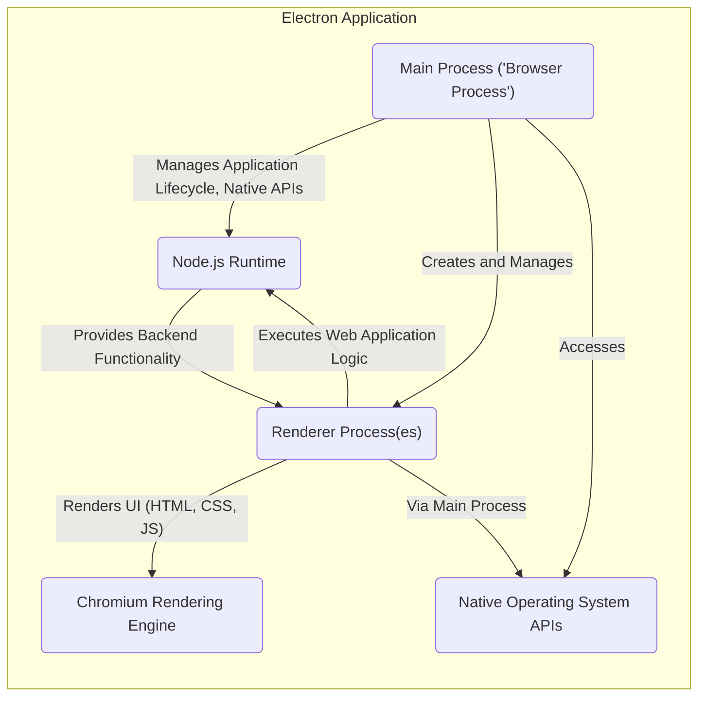
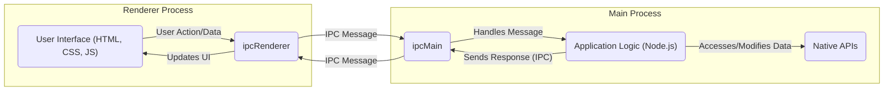

## Project Design Document: Electron Framework

**Version:** 1.1
**Date:** October 26, 2023
**Author:** AI Software Architect

### 1. Introduction

This document provides an enhanced architectural design of the Electron framework, based on the project hosted at [https://github.com/electron/electron](https://github.com/electron/electron). This revised document aims to provide a more detailed and clearer understanding of the framework's structure and components, specifically for use in subsequent threat modeling activities. It outlines the key components, their interactions, and the overall architecture of the Electron framework with improved clarity and detail.

### 2. Project Overview

Electron is an open-source framework that empowers developers to build cross-platform desktop applications using familiar web technologies such as JavaScript, HTML, and CSS. By embedding the Chromium rendering engine and the Node.js runtime, Electron allows for the creation of native applications that can run seamlessly on Windows, macOS, and Linux operating systems.

### 3. Architectural Overview

Electron applications are built upon a multi-process architecture, primarily composed of a single **Main Process** (often referred to as the Browser Process) and multiple **Renderer Processes**. These distinct processes communicate and coordinate using Inter-Process Communication (IPC) mechanisms.

### 4. Key Components

*   **Main Process ('Browser Process'):**
    *   Serves as the central control point and the initial entry point for the Electron application.
    *   Manages the overall application lifecycle, including startup, shutdown, and handling system-level events.
    *   Responsible for creating, managing, and destroying Renderer Processes.
    *   Possesses full access to Node.js APIs and the underlying native operating system APIs, enabling interaction with system resources.
    *   Handles the application's menu bar, dialogs, and other global UI elements.
    *   Listens for and processes events from the operating system, dispatching relevant information to Renderer Processes.
*   **Renderer Process(es):**
    *   Each Renderer Process hosts an isolated instance of the Chromium rendering engine.
    *   Dedicated to rendering the user interface of the application using standard web technologies (HTML for structure, CSS for styling, and JavaScript for interactivity).
    *   Executes the JavaScript code that constitutes the core logic of the web application's front-end.
    *   Has restricted access to Node.js APIs by default for security reasons; specific APIs can be selectively enabled.
    *   Relies on Inter-Process Communication (IPC) to communicate with the Main Process for accessing native resources or performing actions requiring elevated privileges.
*   **Chromium Rendering Engine:**
    *   Provides the fundamental capabilities for rendering and displaying web-based content within the application windows.
    *   Manages the parsing of HTML, the application of CSS styles, the execution of JavaScript code, and the handling of network requests initiated within the Renderer Process.
    *   Incorporates the V8 JavaScript engine for high-performance JavaScript execution.
*   **Node.js Runtime:**
    *   Offers a JavaScript runtime environment that operates on the server-side, enabling access to system-level functionalities.
    *   Provides a rich set of built-in modules for tasks such as file system manipulation, network communication, and process management.
    *   Primarily utilized within the Main Process to handle backend logic and interact with the operating system.
*   **Inter-Process Communication (IPC):**
    *   The essential mechanism facilitating communication and data exchange between the Main Process and Renderer Processes.
    *   Electron provides the `ipcMain` module (used in the Main Process) and the `ipcRenderer` module (used in Renderer Processes) for sending and receiving messages.
    *   Supports both synchronous (blocking) and asynchronous (non-blocking) communication patterns.
*   **Native Modules (Addons):**
    *   Enable developers to extend the functionality of Electron applications by incorporating native code written in languages like C or C++.
    *   These modules can be loaded into either the Main Process or Renderer Processes, depending on their purpose and required access.
    *   Offer a way to access platform-specific features or implement performance-critical operations.
*   **Auto Updater:**
    *   A built-in module designed to streamline the process of updating Electron applications to newer versions.
    *   Typically involves checking for updates on a remote server, downloading the latest version, and applying the update, often with minimal user intervention.
*   **Packaging and Distribution:**
    *   Electron provides tools and utilities to package the application's code, assets, and dependencies into platform-specific installers or executable files for distribution to end-users.

### 5. Data Flow

The primary data flow within an Electron application centers around the interaction between the Renderer Process (responsible for the user interface and user interactions) and the Main Process (managing application logic, native resources, and privileged operations).

**Detailed Data Flow Examples:**

*   **Scenario: User interacts with a button in the Renderer Process requiring a native operation.**
    1. JavaScript code within the Renderer Process detects the user's click action.
    2. The Renderer Process utilizes the `ipcRenderer.send()` method to transmit a message to the Main Process, indicating the requested action and any relevant data.
    3. The Main Process receives this message through the `ipcMain.on()` event listener.
    4. The Main Process's application logic processes the received message, potentially interacting with native APIs or performing other privileged operations.
    5. The Main Process then sends a response back to the originating Renderer Process using `ipcMain.send()` or `event.sender.send()`, including any results or status information.
    6. The Renderer Process receives the response via its `ipcRenderer.on()` listener.
    7. JavaScript code in the Renderer Process updates the user interface based on the received response, providing feedback to the user.
*   **Scenario: Application Auto-Update process.**
    1. The Main Process, based on a configured schedule or user request, initiates a check for available updates by contacting a remote update server.
    2. If a new version is available, the Main Process downloads the necessary update files.
    3. The Main Process may then notify the user about the available update and prompt for permission to install it.
    4. Upon user confirmation, the Main Process proceeds with the update installation process, which might involve replacing application files and potentially restarting the application.

### 6. Security Considerations (Pre-Threat Modeling)

Given the architecture of Electron, several potential security concerns should be carefully considered during the threat modeling process:

*   **Cross-Site Scripting (XSS) Vulnerabilities in Renderer Processes:** Since Renderer Processes render web content, they are susceptible to XSS attacks if input data is not properly sanitized or output is not correctly encoded. Malicious scripts could be injected and executed within the context of the application.
*   **Remote Code Execution (RCE) through Chromium or Node.js Exploits:** Vulnerabilities present in the underlying Chromium rendering engine or the Node.js runtime could be exploited by attackers to execute arbitrary code on the user's machine.
*   **Insecure Inter-Process Communication (IPC):** If IPC channels are not adequately secured, malicious or compromised Renderer Processes could potentially send unauthorized commands or messages to the Main Process, leading to privilege escalation or other malicious actions.
*   **Risks Associated with Node.js Integration:** Improperly exposing Node.js APIs to Renderer Processes can create significant security vulnerabilities, allowing Renderer Processes to perform actions they should not have access to, such as file system access or executing system commands.
*   **Vulnerabilities in Native Modules:** Security flaws within native modules or the insecure usage of native APIs can introduce vulnerabilities that could be exploited to compromise the application or the user's system.
*   **Auto-Update Mechanism Exploits:** If the auto-update mechanism is compromised, attackers could potentially distribute malicious updates to users, leading to widespread compromise. This includes vulnerabilities in the update server, the download process, or the verification of updates.
*   **Supply Chain Security Concerns:** Compromised dependencies, such as npm packages or third-party native modules, could introduce vulnerabilities into the application without the developers' explicit knowledge.
*   **Bypassing Security Features:** Attackers may attempt to circumvent Electron's built-in security features, such as context isolation or the sandbox, to gain unauthorized access or execute malicious code.
*   **Information Disclosure:** Sensitive information could be unintentionally exposed through insecure logging practices, verbose error handling, or insecure communication over IPC channels.

### 7. Assumptions and Constraints

*   This design document provides a general overview of the Electron framework's architecture. Specific applications built using Electron will have their own unique designs, features, and security considerations that are not covered in detail here.
*   The threat modeling process should take into account the specific version of Electron being used, as security features, default configurations, and known vulnerabilities can vary across different versions.
*   It is assumed that developers building Electron applications adhere to general best practices for web development and secure coding principles within the Renderer Processes to mitigate common web-based vulnerabilities.
*   The effectiveness of Electron's security features is contingent upon their correct configuration and proper usage by the application developers. Misconfigurations or improper implementation can weaken the security posture of the application.

### 8. Future Considerations

*   A more in-depth analysis of specific Electron APIs and modules that are particularly relevant to security, such as `webContents`, `BrowserWindow`, and the various IPC methods.
*   A detailed examination of the security features provided by Electron, including context isolation, the sandbox environment for Renderer Processes, and mechanisms for securing IPC communication.
*   An exploration of common attack vectors targeting Electron applications and the corresponding mitigation strategies and best practices for developers.

This enhanced document provides a more comprehensive understanding of the Electron framework's architecture, which is essential for conducting a thorough and effective threat modeling exercise. The detailed descriptions of components, clarified data flows, and expanded security considerations will serve as valuable inputs for identifying potential vulnerabilities and designing appropriate security controls for Electron-based applications.
