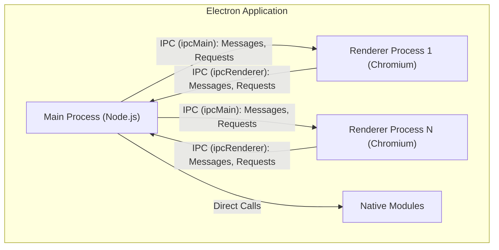
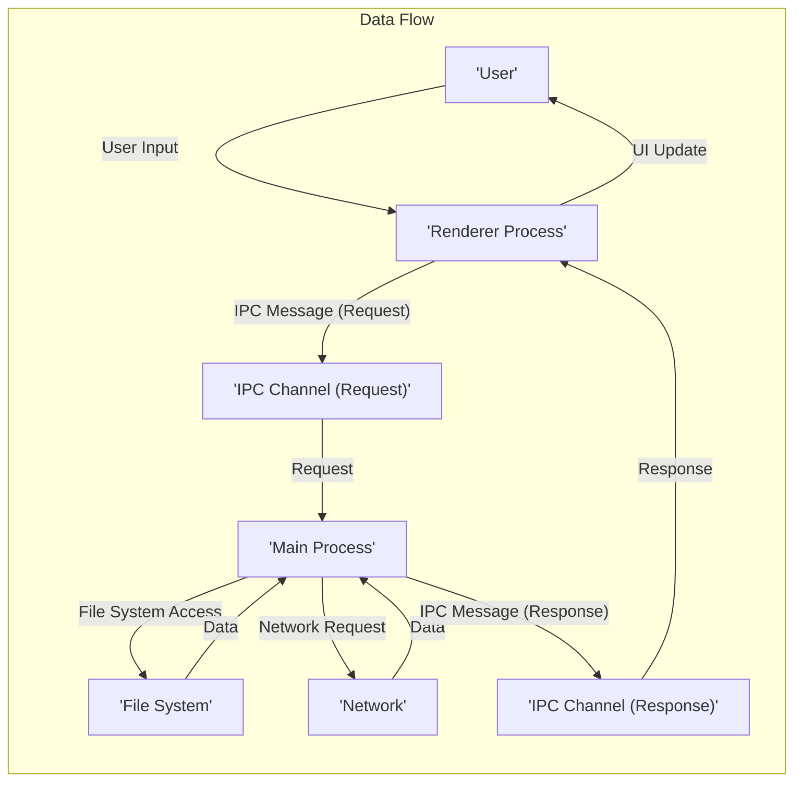

# Project Design Document: Electron Framework

**Version:** 1.1
**Date:** October 26, 2023
**Author:** AI Software Architect

## 1. Introduction

This document provides an enhanced architectural overview of the Electron framework, specifically tailored for threat modeling. It details the key components, their interactions, and data flows within an Electron application, emphasizing aspects relevant to security vulnerabilities and attack surfaces.

Electron is an open-source framework developed and maintained by GitHub. It enables developers to build cross-platform desktop applications using web technologies such as JavaScript, HTML, and CSS. Electron achieves this by embedding the Chromium rendering engine for UI display and the Node.js runtime for backend functionalities within a single application. This combination allows web developers to leverage their existing skills to create desktop experiences.

## 2. Goals and Objectives

The primary goal of this document is to provide a comprehensive and clear understanding of the Electron framework's architecture specifically for the purpose of threat modeling. Improved objectives include:

*   Clearly identifying the core components of Electron and their respective security boundaries.
*   Precisely describing the interactions and communication pathways between these components, highlighting potential trust boundaries.
*   Illustrating the flow of data, including sensitive information, within an Electron application.
*   Emphasizing key areas and functionalities that are particularly relevant to security considerations and potential attack vectors.
*   Providing visual representations of the system's architecture and data flow to aid in understanding complex interactions.

## 3. System Architecture

Electron applications utilize a multi-process architecture, fundamentally comprising a single **Main Process** and one or more **Renderer Processes**. This separation is crucial for stability and security.

### 3.1. Main Process

*   Serves as the central control point and entry for every Electron application.
*   Its primary responsibilities include the creation and management of Renderer processes.
*   Operates within a Node.js environment, granting access to the full range of Node.js APIs and modules.
*   Handles interactions with the native operating system, including:
    *   Managing application windows, menus, and dialogs.
    *   Controlling the application's lifecycle events (startup, shutdown, etc.).
    *   Directly interacting with the file system (read, write, execute).
    *   Accessing system resources (e.g., clipboard, notifications).
*   Facilitates communication with Renderer processes through Inter-Process Communication (IPC).
*   Typically, only one Main Process exists per Electron application, acting as a privileged entity.

### 3.2. Renderer Process

*   Dedicated to rendering and displaying the application's user interface.
*   Each Renderer process embeds its own isolated instance of the Chromium rendering engine.
*   Responsible for interpreting and displaying web content (HTML, CSS, JavaScript), similar to a tab in a web browser.
*   Executes JavaScript code within the context of the loaded web page.
*   Isolated from other Renderer processes, enhancing security and preventing crashes in one renderer from affecting others.
*   Relies on the Main Process for actions requiring elevated privileges or access to native resources, communicating via IPC.
*   An Electron application can launch multiple Renderer processes to display different parts of the application or separate windows.

### 3.3. Inter-Process Communication (IPC)

*   The essential mechanism enabling communication between the privileged Main Process and the less privileged Renderer processes. This communication crosses security boundaries.
*   Electron provides two primary modules for IPC:
    *   `ipcMain`: Used within the Main Process to listen for and respond to messages from Renderer processes.
    *   `ipcRenderer`: Used within Renderer processes to send messages to the Main Process and receive responses.
*   Supports both synchronous (blocking) and asynchronous (non-blocking) communication patterns. Asynchronous communication is generally preferred for performance and responsiveness.
*   Crucially, IPC allows Renderer processes to request actions that require elevated privileges or access to protected resources, which are then handled by the Main Process. This mechanism is a key area for security considerations.

### 3.4. Native Modules

*   Electron allows extending its functionality by incorporating native Node.js modules.
*   These modules are typically written in C or C++ and provide access to operating system-level APIs or performance-critical functionalities not available through standard JavaScript APIs.
*   Native modules execute within the Main Process's Node.js environment, inheriting its privileges.
*   The use of native modules introduces potential security risks if these modules contain vulnerabilities or are not properly vetted.

### 3.5. Chromium

*   Provides the core rendering engine responsible for displaying web content within Renderer processes.
*   Handles the parsing of HTML, styling with CSS, execution of JavaScript, and the overall rendering pipeline.
*   Incorporates numerous security features inherent in the Chromium project, including sandboxing for Renderer processes to limit their access to system resources. However, vulnerabilities within Chromium itself can still pose a risk.

### 3.6. Node.js

*   Provides the JavaScript runtime environment for the Main Process.
*   Grants access to Node.js core modules (e.g., `fs`, `net`, `child_process`) and the vast ecosystem of npm packages.
*   Handles backend-like functionalities within the Main Process, such as file system operations, network communication, and process management. Security vulnerabilities in Node.js or its modules can impact the entire application.

## 4. Key Components and Interactions

*   **Main Process (Node.js):** The central hub, managing application lifecycle, privileged operations, and communication. It acts as a broker between Renderer processes and system resources.
*   **Renderer Process (Chromium):** Responsible for the user interface, executing web application code within a sandboxed environment. Relies on the Main Process for privileged actions.
*   **IPC (Inter-Process Communication):** The crucial communication channel between the Main and Renderer processes. Secure implementation of IPC handlers is paramount to prevent exploitation.
*   **Native Modules:** Extensions to the Main Process providing access to native functionalities. Require careful vetting due to their direct access to system resources.

## 5. Data Flow

The flow of data within an Electron application typically involves the following stages, with security implications at each step:

1. **User Interaction:** A user interacts with the application through the UI rendered in a Renderer process (e.g., clicking a button, entering text). This input is initially handled within the Renderer process.
2. **Renderer Process Logic:** JavaScript code within the Renderer process processes user events and executes application logic. Sensitive data might be handled here, making client-side security important.
3. **IPC Communication (Request):** When a Renderer process needs to perform an action requiring elevated privileges or access to protected resources (e.g., saving a file, accessing hardware), it sends a message to the Main Process via IPC. This message might contain sensitive data.
4. **Main Process Handling and Validation:** The Main Process receives the IPC message. Crucially, it should validate the request to prevent unauthorized actions. This is a critical security checkpoint.
5. **Data Retrieval/Modification:** The Main Process performs the requested action, potentially interacting with the file system, network, or other system resources. Data accessed or modified here could be sensitive.
6. **IPC Communication (Response):** The Main Process sends a response back to the originating Renderer process via IPC, indicating the success or failure of the operation, and potentially including requested data.
7. **Renderer Process Update:** The Renderer process receives the response and updates the UI accordingly, potentially displaying sensitive information.

## 6. Security Considerations (Preliminary)

This section outlines potential areas of security concern within the Electron framework, providing a starting point for detailed threat modeling.

*   **Remote Code Execution (RCE) in Renderer Processes:** Exploiting vulnerabilities in the Chromium rendering engine or application code within Renderer processes could allow attackers to execute arbitrary code within the renderer's sandbox.
*   **Cross-Site Scripting (XSS):** If the application displays untrusted content within a Renderer process without proper sanitization, it can be vulnerable to XSS attacks, potentially leading to session hijacking or information disclosure.
*   **Insecure IPC Communication:** Improperly implemented IPC handlers in the Main Process, lacking sufficient validation or authorization checks, can be exploited by malicious Renderer processes to perform unauthorized actions with elevated privileges. This is a primary attack vector.
*   **Node.js Module Vulnerabilities:** Security vulnerabilities present in third-party npm packages used within the Main Process can be exploited to compromise the application's integrity and access sensitive data. Regular dependency audits are crucial.
*   **Native Module Security:**  Vulnerabilities or malicious code within custom native modules can introduce severe security risks due to their direct access to system resources. Thorough code review and vetting are essential.
*   **Bypass of Security Features:** Misconfigurations or vulnerabilities in Electron's security features, such as the sandbox or context isolation, could allow attackers to bypass intended security boundaries.
*   **Insecure Packaging and Distribution:** Tampering with the application package during the distribution process can introduce malicious code that users unknowingly install. Code signing and integrity checks are vital.
*   **Auto-Updater Vulnerabilities:** An insecure auto-update mechanism can be exploited by attackers to deliver malicious updates to users, compromising their systems. Secure update channels and signature verification are necessary.
*   **Lack of Input Validation:** Insufficient validation of data received through IPC or from external sources can lead to various vulnerabilities, including command injection and path traversal.
*   **Privilege Escalation:** Exploiting vulnerabilities in the IPC communication or native modules to gain elevated privileges beyond the intended scope of the Renderer process.
*   **webContents Manipulation:**  Improper handling of `webContents` can lead to security issues if not carefully managed, potentially allowing access to sensitive information or unintended actions.
*   **Cookie and Session Management:**  Insecure management of cookies and session data can lead to unauthorized access and session hijacking.

## 7. Assumptions and Constraints

*   This document assumes a basic understanding of web technologies (HTML, CSS, JavaScript), Node.js, and general security principles.
*   The focus is on the inherent architectural components and their interactions within the Electron framework. Specific application logic and third-party integrations are not exhaustively covered.
*   The subsequent threat modeling process will build upon the information presented in this document to identify specific vulnerabilities and attack scenarios.
*   This document reflects the general architecture of Electron. Specific implementations and security configurations may vary depending on the application's requirements and development practices.

## 8. Conclusion

This enhanced design document provides a more detailed and security-focused understanding of the Electron framework's architecture. By clearly outlining the key components, their interactions, and data flow, with specific emphasis on potential security implications, this document serves as a robust foundation for conducting thorough threat modeling. The multi-process architecture and the critical role of IPC communication are central to understanding the attack surface and potential vulnerabilities within Electron-based applications. This document will be a valuable resource for security analysts and developers involved in building and securing applications using the Electron framework.