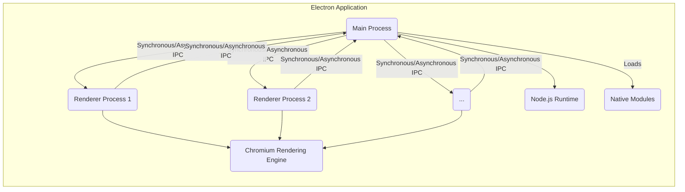
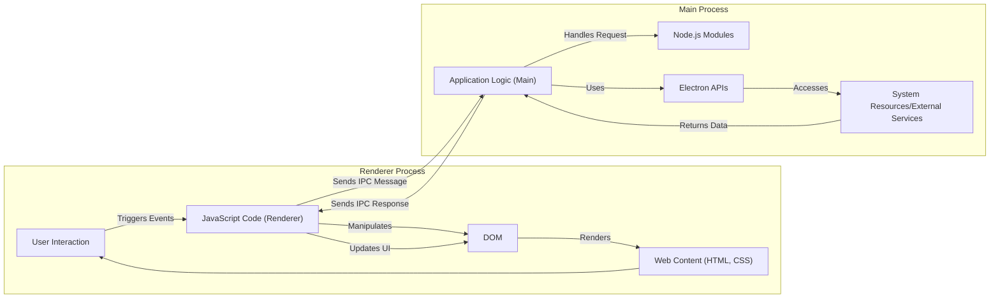

# Project Design Document: Electron

**Document Version:** 1.1
**Date:** October 26, 2023
**Author:** AI Software Architect

## 1. Introduction

This document provides an enhanced and detailed design overview of the Electron framework. It aims to describe the architecture, key components, and data flow within Electron applications with greater clarity and depth. This document will serve as a robust foundation for subsequent threat modeling activities, enabling a comprehensive understanding of potential security vulnerabilities and attack surfaces.

## 2. Goals

* Provide a clear, concise, and more detailed description of the Electron architecture.
* Identify the key components and their interactions, including specific communication pathways.
* Outline the data flow within an Electron application, highlighting data transformations and security boundaries.
* Serve as a robust and informative basis for identifying potential security threats, vulnerabilities, and attack vectors.

## 3. Target Audience

This document is intended for:

* Security engineers and architects involved in threat modeling, security assessments, and penetration testing.
* Software developers working with Electron, particularly those involved in architectural decisions and security implementation.
* DevOps engineers responsible for deploying, configuring, and maintaining Electron applications in a secure manner.

## 4. Project Overview

Electron is an open-source framework developed and maintained by GitHub, enabling developers to build cross-platform desktop applications using standard web technologies such as JavaScript, HTML, and CSS. Electron achieves this by embedding the Chromium rendering engine (for UI) and the Node.js runtime (for backend functionality) into a single application bundle. This approach allows web developers to leverage their existing skills to create native-like desktop experiences without needing to delve into platform-specific development.

## 5. Architectural Overview

Electron applications operate with a multi-process architecture, primarily consisting of a single **Main Process** and one or more **Renderer Processes**. Communication between these processes is facilitated through Inter-Process Communication (IPC). This separation of concerns is crucial for stability and security.

## 6. Component Breakdown

This section provides a more detailed breakdown of the key components within an Electron application.

* **Main Process:**
    * Serves as the central control point and the entry point for the Electron application.
    * Responsible for the application's lifecycle management, including startup, shutdown, and event handling.
    * Creates, manages, and destroys Renderer processes.
    * Executes Node.js code, granting it full access to operating system APIs and resources.
    * Handles global application events, such as menu interactions, system notifications, and dialogs.
    * Interacts directly with the operating system's windowing system to create and manage application windows.
    * Can load and utilize native modules to extend functionality or access platform-specific features.
    * Typically implements the application's core business logic and interacts with external services.

* **Renderer Process:**
    * Dedicated to rendering and displaying the application's user interface.
    * Runs in a sandboxed environment, enhancing security by limiting its access to system resources.
    * Utilizes the Chromium rendering engine to interpret and display web content (HTML, CSS, JavaScript).
    * Provides access to the Document Object Model (DOM) and standard browser APIs for manipulating the user interface.
    * Communicates with the Main Process via IPC to request privileged operations or access data outside its sandbox.
    * Each browser window, `<iframe>`, or `<webview>` typically runs within its own isolated Renderer process, improving stability.

* **Chromium Rendering Engine:**
    * The core component responsible for rendering web content within Renderer processes.
    * Handles HTML parsing, CSS styling, JavaScript execution, and layout rendering.
    * Incorporates security features like a sandbox to isolate Renderer processes and prevent malicious code from accessing system resources directly.
    * Manages network requests and enforces web security policies (e.g., Same-Origin Policy).
    * Provides APIs for interacting with browser features and hardware.

* **Node.js Runtime:**
    * Provides the JavaScript runtime environment for the Main Process, enabling server-side JavaScript execution.
    * Offers access to a wide range of system APIs, including file system operations, network communication, and process management.
    * Allows the Main Process to leverage the vast ecosystem of Node.js modules available through npm.
    * Facilitates the development of backend logic and integration with external services.

* **Inter-Process Communication (IPC):**
    * The essential mechanism for secure and controlled communication between the Main Process and Renderer Processes.
    * Electron provides two primary modules: `ipcMain` (used in the Main Process) and `ipcRenderer` (used in Renderer Processes).
    * Supports both synchronous (blocking) and asynchronous (non-blocking) message passing.
    * Enables Renderer Processes to request actions that require elevated privileges from the Main Process.
    * Requires careful implementation to prevent security vulnerabilities arising from insecure message handling.

* **Native Modules:**
    * Dynamically linked libraries (DLLs or shared objects) written in C or C++ that can be loaded into the Node.js runtime within the Main Process.
    * Provide a way to access platform-specific APIs, interact with hardware, or improve performance for computationally intensive tasks.
    * Can be a source of security vulnerabilities if not developed or used carefully.
    * Direct access from Renderer Processes is generally discouraged due to security implications.

* **Electron APIs:**
    * A rich set of JavaScript APIs provided by the Electron framework to interact with the operating system and manage the application's behavior.
    * Examples include APIs for:
        * Window management (`BrowserWindow`)
        * Menu creation (`Menu`, `MenuItem`)
        * Dialogs (`dialog`)
        * System notifications (`Notification`)
        * Clipboard access (`clipboard`)
        * Shell integration (`shell`)
        * Application lifecycle events (`app`)
    * These APIs provide a bridge between the web technologies and the native operating system.

## 7. Data Flow

The following diagram illustrates the typical data flow within an Electron application, emphasizing the separation between processes and the role of IPC.

* **User Interaction:** The user interacts with the application through the rendered UI in a Renderer Process.
* **Renderer Process Logic:** JavaScript code within the Renderer Process handles user events and manipulates the DOM to update the user interface.
* **IPC Request:** When the Renderer Process needs to perform an action requiring elevated privileges or access data managed by the Main Process, it sends an IPC message to the Main Process.
* **Main Process Handling:** The Main Process receives the IPC message and executes the corresponding application logic. This may involve using Node.js modules or Electron APIs to interact with system resources or external services.
* **System Resource Access:** The Main Process can access system resources, such as the file system, network, or hardware, based on the request.
* **IPC Response:** The Main Process sends an IPC response back to the originating Renderer Process, potentially containing data or a confirmation of the action.
* **Renderer Update:** The Renderer Process receives the IPC response and updates the user interface accordingly, reflecting the outcome of the requested action.

## 8. Key Technologies

* **Chromium:** Provides the rendering engine and browser functionalities for Renderer Processes.
* **Node.js:** Offers the JavaScript runtime environment and access to system APIs for the Main Process.
* **JavaScript:** The primary programming language used for both frontend (Renderer) and backend (Main) logic.
* **HTML:** Defines the structure and content of the user interface.
* **CSS:** Styles the visual presentation of the user interface.
* **C/C++:** Used for developing native modules and the core Electron framework itself.
* **Blink:** The rendering engine within Chromium.
* **V8:** The JavaScript engine within Chromium and Node.js.

## 9. Security Considerations (Detailed)

This section provides a more detailed overview of security considerations relevant to Electron applications, highlighting potential threats and mitigation strategies.

* **Remote Code Execution (RCE):**
    * **Threat:** Exploiting vulnerabilities in the Chromium rendering engine or through insecure handling of IPC messages could allow attackers to execute arbitrary code on the user's machine.
    * **Mitigation:** Keep Electron updated to the latest stable version to patch known Chromium vulnerabilities. Sanitize and validate all data received through IPC. Avoid using `webview` with `nodeIntegration` enabled for untrusted content. Implement robust input validation in both Main and Renderer processes.

* **Cross-Site Scripting (XSS):**
    * **Threat:** If the application displays untrusted web content without proper sanitization, attackers can inject malicious scripts that execute in the context of the application.
    * **Mitigation:** Sanitize all user-provided content before displaying it in the UI. Utilize Content Security Policy (CSP) to restrict the sources from which the application can load resources. Avoid dynamically generating HTML from untrusted sources.

* **Insecure IPC Communication:**
    * **Threat:** Improperly secured IPC channels can be exploited to bypass security restrictions, inject malicious commands into the Main Process, or leak sensitive information.
    * **Mitigation:** Carefully design IPC interfaces and validate all messages received. Avoid exposing sensitive APIs directly to Renderer Processes. Implement authentication and authorization mechanisms for IPC communication where necessary. Consider using contextBridge for safer exposure of APIs to Renderer processes.

* **Node.js Module Vulnerabilities:**
    * **Threat:** Dependencies used in the Main Process might contain security vulnerabilities that could be exploited by attackers.
    * **Mitigation:** Regularly audit and update Node.js dependencies using tools like `npm audit` or `yarn audit`. Use a Software Bill of Materials (SBOM) to track dependencies. Consider using dependency scanning tools in your CI/CD pipeline.

* **Lack of Input Validation:**
    * **Threat:** Insufficient validation of data received from Renderer Processes, external sources, or user input can lead to various vulnerabilities, including command injection, path traversal, and SQL injection (if interacting with databases).
    * **Mitigation:** Implement strict input validation and sanitization in both Main and Renderer processes. Use parameterized queries when interacting with databases.

* **Exposure of Sensitive APIs:**
    * **Threat:** Improperly exposing powerful Electron APIs (e.g., file system access, shell execution) to Renderer Processes can create significant security risks.
    * **Mitigation:** Follow the principle of least privilege. Only expose necessary APIs to Renderer Processes using secure mechanisms like `contextBridge`. Carefully review the security implications of each exposed API.

* **Binary Planting/DLL Hijacking:**
    * **Threat:** If the application loads external libraries insecurely, attackers might be able to place malicious DLLs in locations where the application will load them, allowing for code execution.
    * **Mitigation:** Ensure that the application loads libraries from trusted locations. Use code signing to verify the integrity of executable files and libraries.

* **Insecure Protocol Handling:**
    * **Threat:** Mishandling of protocols like `file://` or custom protocols can introduce vulnerabilities, allowing attackers to access local files or execute arbitrary code.
    * **Mitigation:** Avoid loading arbitrary `file://` URLs. Carefully validate and sanitize URLs before loading them. Be cautious when implementing custom protocols.

* **Outdated Dependencies:**
    * **Threat:** Using outdated versions of Electron, Chromium, or Node.js exposes the application to known and potentially actively exploited vulnerabilities.
    * **Mitigation:** Implement a regular update schedule for Electron and its dependencies. Monitor security advisories and apply patches promptly.

## 10. Conclusion

This enhanced document provides a more detailed and comprehensive design overview of the Electron framework, elaborating on its architecture, key components, and data flow. The expanded security considerations section offers a deeper understanding of potential threats and mitigation strategies. This information is crucial for building secure Electron applications and serves as a valuable and informative input for thorough threat modeling activities, enabling a more effective security assessment and the development of robust security controls.