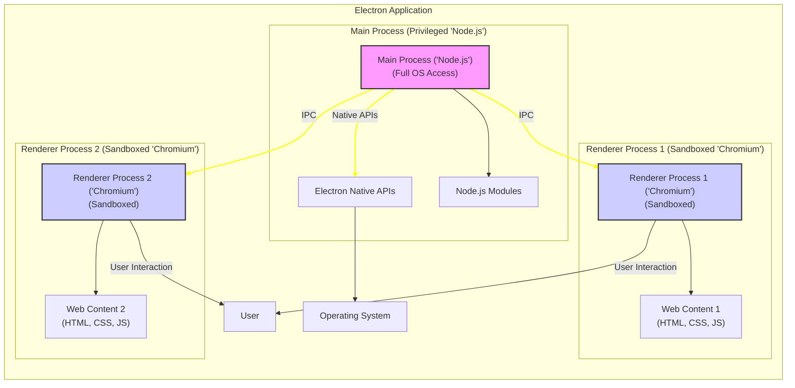
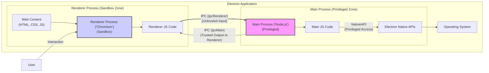

# Project Design Document: Electron Framework for Threat Modeling (Improved)

**Project Name:** Electron Framework

**Project Repository:** [https://github.com/electron/electron](https://github.com/electron/electron)

**Document Version:** 1.1
**Date:** 2023-10-27
**Author:** AI Software Architect

## 1. Introduction

This document provides an enhanced and more detailed design overview of the Electron framework, specifically tailored for advanced threat modeling activities. Building upon the initial version, this document delves deeper into the security-relevant aspects of Electron's architecture, components, and data flow.  It aims to provide security engineers, developers, and anyone interested in Electron security with a robust foundation for identifying and mitigating potential threats within Electron applications and the framework itself.

This improved document incorporates more granular details on security boundaries, inter-process communication mechanisms, and potential attack vectors. It will serve as a more effective and comprehensive resource for subsequent threat modeling exercises, leading to more precise and actionable security recommendations.

## 2. Project Overview

Electron empowers developers to build cross-platform desktop applications using web technologies. Its core strength lies in bridging the gap between web development ease and native desktop capabilities by embedding Chromium and Node.js. This architecture allows for rapid development and code reuse across different operating systems.

**Key Features of Electron (Security Relevant Highlights):**

*   **Process Isolation:** Electron employs a multi-process architecture, isolating Renderer Processes within Chromium's sandbox, enhancing security by limiting the impact of vulnerabilities in web content.
*   **Inter-Process Communication (IPC):**  The controlled communication channel between Renderer and Main processes is a critical security boundary and a key area for threat analysis.
*   **Node.js Integration (with OS Access):**  The Main Process's access to Node.js and native APIs provides powerful capabilities but also introduces potential risks if not managed securely.
*   **Content Security Policy (CSP) Support:** Electron supports CSP, allowing developers to control the sources of content loaded by Renderer Processes, mitigating XSS attacks.
*   **Context Isolation:**  Electron offers context isolation for Renderer Processes, further separating Renderer process JavaScript execution environment from Node.js and Electron API access, enhancing security.

**Target Audience for this Document:**

*   Security engineers and architects performing in-depth threat modeling of Electron-based applications and the Electron framework.
*   Developers seeking to build secure Electron applications and understand advanced security implications.
*   Researchers and auditors analyzing the security architecture of cross-platform desktop application frameworks.

## 3. Architectural Overview (Enhanced)

Electron's architecture, inspired by Chromium, is designed around process separation for security and stability. The clear distinction and controlled communication between the Main Process and Renderer Processes are fundamental to its security model.

*   **Main Process (Browser Process - Privileged):**  This process is the backbone of the Electron application. It's a Node.js environment with full operating system privileges. It manages application windows, menus, dialogs, and all interactions with the OS through native APIs.  It is responsible for bootstrapping the application and controlling the lifecycle of Renderer Processes.

*   **Renderer Processes (Web Page Processes - Sandboxed):** Each BrowserWindow operates within a separate Renderer Process. These processes are Chromium rendering engines, sandboxed to limit their access to system resources and native APIs. They are designed to render and execute web content securely. Communication with the Main Process is strictly mediated through IPC.

**Enhanced Architecture Diagram (Mermaid):**

**Explanation of Enhanced Diagram:**

*   **Privilege Separation:** The diagram explicitly highlights the privilege difference between the Main Process (privileged) and Renderer Processes (sandboxed).
*   **Key Components within Processes:**  It shows "Node.js Modules" and "Electron Native APIs" residing within the Main Process, and "Web Content" within Renderer Processes.
*   **IPC Emphasis:** The "IPC" communication links are visually emphasized to highlight their importance as security boundaries.
*   **Sandbox Indication:**  "(Sandboxed)" is added to Renderer Process nodes for clarity.

## 4. Key Components and Data Flow (Detailed)

This section provides a more in-depth look at the key components, focusing on their security implications and potential vulnerabilities.

**4.1. Chromium Engine (Security Focus):**

*   **Functionality:**  Renders web content, executes JavaScript, and enforces web security standards.  Crucially, it provides a **sandbox** environment for Renderer Processes, limiting their access to system resources. Chromium's sandbox is multi-layered, employing OS-level sandboxing features.
*   **Security Relevance:** The Chromium sandbox is a critical defense against vulnerabilities in web content. However, sandbox escapes are possible, though rare and often high-severity.  Renderer processes are vulnerable to typical web application vulnerabilities like XSS if not properly secured by the application developer (e.g., through CSP).
*   **Data Flow (Security Perspective):**
    *   **Input:** Receives potentially untrusted web content from various sources (local files, network). Input validation and sanitization are crucial *before* content reaches Chromium.
    *   **Processing:** Renders and executes JavaScript within the sandbox.  JavaScript execution is subject to Chromium's security policies and browser security features.
    *   **Output (Limited):**  Renderer Processes have restricted access to system resources.  Output is primarily rendered UI and communication via IPC.  Attempts to access restricted resources are blocked by the sandbox.

**4.2. Node.js Runtime (Security Focus):**

*   **Functionality:** Provides a JavaScript runtime with **full operating system access** in the Main Process. Enables access to Node.js core modules and npm packages, allowing for powerful system-level operations.
*   **Security Relevance:** The Main Process is a highly privileged environment. Vulnerabilities in Node.js itself, insecure npm packages, or insecure coding practices in the Main Process can lead to complete system compromise.  **Least privilege principles** should be strictly applied in the Main Process.
*   **Data Flow (Security Perspective):**
    *   **Input:** Receives potentially untrusted data from Renderer Processes via IPC, user input, network requests initiated by the Main Process, and external files.  **Input validation is paramount** for all data entering the Main Process.
    *   **Processing:** Executes application logic, interacts with the OS through Native APIs and Node.js modules.  **Secure coding practices** are essential to prevent vulnerabilities like command injection, path traversal, etc.
    *   **Output:**  Controls Renderer Processes via IPC, interacts with the OS, and can potentially affect the entire system.

**4.3. Electron Native APIs (Security Focus):**

*   **Functionality:**  Bridge between JavaScript and native OS functionalities.  Provide access to features like file system, clipboard, menus, dialogs, notifications, window management, etc.
*   **Security Relevance:** Native APIs represent a direct interface to the operating system.  **Vulnerabilities in Native API implementations within Electron** or **misuse of Native APIs by application developers** can bypass security boundaries and grant Renderer Processes unintended privileges.  Careful auditing of Native API usage is crucial.
*   **Data Flow (Security Perspective):**
    *   **Input:**  Main Process receives requests to use Native APIs, often originating from Renderer Processes via IPC.  **Authorization and validation of these requests are critical.**
    *   **Processing:** Electron's native code executes the requested OS operation.
    *   **Output:**  Results of Native API calls are returned to the Main Process and potentially relayed back to Renderer Processes via IPC.

**4.4. Inter-Process Communication (IPC) (Security Focus):**

*   **Functionality:**  The sole channel for communication between Renderer Processes (sandboxed) and the Main Process (privileged).  Electron provides `ipcRenderer` and `ipcMain` modules for message passing.  Mechanisms include `send`, `invoke`, `handle`, `on`, etc.
*   **Security Relevance:** IPC is the **most critical security boundary** in Electron.  **Insecure IPC implementations are a primary attack vector.**  Vulnerabilities can arise from:
    *   **Insufficient input validation:**  Renderer Processes sending malicious data to the Main Process.
    *   **Lack of authorization:** Renderer Processes requesting privileged operations without proper checks.
    *   **Message spoofing/injection:**  Exploiting vulnerabilities in the IPC mechanism itself.
    *   **Exposing privileged APIs via IPC:**  Unnecessarily exposing powerful Native APIs to Renderer Processes.
*   **Data Flow (Security Perspective):**
    *   **Renderer to Main:** Renderer Process sends IPC messages (potentially malicious).  **Main Process MUST validate and sanitize all incoming IPC messages.**
    *   **Main to Renderer:** Main Process sends IPC messages (should be carefully crafted to avoid vulnerabilities in Renderer Processes, though less critical from a privilege escalation perspective).

**4.5. Packaging and Distribution (Security Focus):**

*   **Functionality:**  Bundles application code, Electron runtime, and resources into platform-specific executables.
*   **Security Relevance:**  The integrity of the packaged application is crucial.  **Tampering with the package can lead to malware distribution.**  Secure distribution channels and code signing are essential.  **Update mechanisms must also be secure** to prevent "man-in-the-middle" attacks delivering malicious updates.
*   **Data Flow (Security Perspective):**
    *   **Packaging:** Developer creates a package.  **Secure build processes** are important to prevent injection of malicious code during packaging.
    *   **Distribution:** Package is distributed to users. **Secure channels (HTTPS, trusted app stores) should be used.**
    *   **Installation/Update:** User installs/updates the application. **Verification of package integrity (code signing) is crucial.**

**Detailed Data Flow Diagram with Security Zones (Mermaid):**

**Explanation of Security Zone Data Flow Diagram:**

*   **Sandbox and Privileged Zones:**  Diagram explicitly labels "Sandbox Zone" for Renderer Process and "Privileged Zone" for Main Process.
*   **Untrusted Input via IPC:**  The IPC link from Renderer to Main is marked as "(Untrusted Input)" and styled red to highlight the security risk.
*   **Privileged Access via Native APIs:** The Native API link is marked as "(Privileged Access)" to emphasize its sensitive nature.

## 5. Technology Stack (Security Implications)

*   **Chromium (C++):**  Large and complex codebase.  Vulnerabilities in Chromium are regularly discovered and patched.  Staying up-to-date with Electron versions is crucial to benefit from Chromium security updates.
*   **Node.js (C++ & JavaScript):**  Node.js itself can have vulnerabilities.  Furthermore, the vast npm ecosystem introduces supply chain risks.  Dependency management and vulnerability scanning are essential.
*   **C++ (Electron Core):**  Vulnerabilities in Electron's C++ core can have significant security impact.  Security audits and community contributions are important for identifying and fixing these.
*   **JavaScript (Application Logic):**  JavaScript code in both Renderer and Main processes can introduce vulnerabilities if not written securely (XSS, insecure Node.js code).
*   **Operating System Specific Native Code:** Platform-specific code can have vulnerabilities.  Security testing should be performed on all target platforms.

## 6. Security Considerations (Granular)

This section expands on the high-level security considerations, providing more specific examples and potential attack vectors.

*   **Cross-Site Scripting (XSS) in Renderer Processes:**
    *   **Attack Vector:** Injecting malicious JavaScript into web content loaded in Renderer Processes.
    *   **Mitigation:** Content Security Policy (CSP), input sanitization, using secure templating engines, avoiding `eval()` and similar unsafe JavaScript constructs.
*   **Remote Code Execution (RCE) via Chromium Vulnerabilities:**
    *   **Attack Vector:** Exploiting vulnerabilities in the embedded Chromium engine to execute arbitrary code within the Renderer Process sandbox (or potentially escape the sandbox).
    *   **Mitigation:** Keeping Electron and Chromium versions up-to-date, enabling site isolation features in Chromium (if applicable and supported by Electron).
*   **Remote Code Execution (RCE) via Node.js Vulnerabilities in Main Process:**
    *   **Attack Vector:** Exploiting vulnerabilities in Node.js itself or insecure Node.js modules used in the Main Process to execute arbitrary code with full OS privileges.
    *   **Mitigation:** Keeping Node.js version up-to-date, vulnerability scanning of npm dependencies, using secure coding practices in the Main Process, minimizing npm dependencies.
*   **Insecure IPC leading to Privilege Escalation:**
    *   **Attack Vector:** Renderer Process sending malicious IPC messages to the Main Process to bypass security restrictions and execute privileged operations or arbitrary code in the Main Process.
    *   **Mitigation:** **Strict input validation and sanitization of all IPC messages in the Main Process.**  **Principle of least privilege for IPC handlers in the Main Process.**  **Authorization checks before performing privileged operations requested via IPC.**  **Minimize exposed IPC APIs.**
*   **Native API Misuse/Vulnerabilities:**
    *   **Attack Vector:**  Application developers misusing Native APIs in a way that creates vulnerabilities (e.g., insecure file system access, command injection via shell execution APIs).  Vulnerabilities in the implementation of Native APIs within Electron itself.
    *   **Mitigation:**  Thoroughly review and audit Native API usage in application code.  Stay updated with Electron security advisories and patches.  Use secure coding practices when using Native APIs.
*   **Dependency Vulnerabilities (npm packages):**
    *   **Attack Vector:** Exploiting vulnerabilities in npm packages used in the Main Process.
    *   **Mitigation:**  Regularly scan npm dependencies for vulnerabilities using tools like `npm audit` or `yarn audit`.  Keep dependencies updated.  Carefully evaluate and select npm packages, considering their security track record and maintenance status.
*   **Insecure Defaults:**
    *   **Attack Vector:** Relying on insecure default settings in Electron, such as disabling context isolation or not implementing CSP.
    *   **Mitigation:**  **Actively configure Electron applications for security.**  **Enable context isolation.**  **Implement and enforce a strong CSP.**  **Disable Node.js integration in Renderer Processes if not strictly necessary.**
*   **Update Mechanism Vulnerabilities:**
    *   **Attack Vector:** "Man-in-the-middle" attacks during application updates, leading to the installation of malicious updates.
    *   **Mitigation:**  **Use HTTPS for update downloads.**  **Implement code signing for updates and verify signatures before applying updates.**  **Use a secure update framework (e.g., Electron's autoUpdater, Squirrel.Mac, Squirrel.Windows).**
*   **Third-Party Code Risks:**
    *   **Attack Vector:**  Vulnerabilities or malicious code in third-party npm packages or external web content loaded by the application.
    *   **Mitigation:**  Carefully vet third-party dependencies and external content sources.  Use subresource integrity (SRI) for external resources.  Implement strong CSP to limit the capabilities of external content.

## 7. Deployment Model (Security Considerations)

*   **Direct Download:**  Requires user trust in the download source.  Vulnerable to "watering hole" attacks if the download website is compromised.  Code signing is crucial for verifying integrity.
*   **Application Stores:**  App stores provide a degree of vetting and security checks, but vulnerabilities can still slip through.  Distribution through official app stores generally increases user trust.
*   **Enterprise Deployment:**  Internal deployment within an organization allows for greater control over the distribution channel but still requires secure packaging and update mechanisms.
*   **Auto-Update Mechanisms:**  Convenient for users but introduce security risks if not implemented securely (as discussed in Security Considerations).

## 8. Threat Modeling Focus Areas (Actionable)

This section provides more actionable focus areas for threat modeling, suggesting specific questions to ask.

*   **Inter-Process Communication (IPC):**
    *   **Questions:**
        *   What IPC channels are exposed by the application?
        *   What data is exchanged over IPC? Is any of it sensitive?
        *   Is input validation performed on all IPC messages in the Main Process?
        *   Are authorization checks in place before performing privileged operations requested via IPC?
        *   Could a Renderer Process send malicious messages to the Main Process to gain unauthorized access or execute code?
        *   Are IPC handlers in the Main Process designed with the principle of least privilege?
*   **Electron Native APIs:**
    *   **Questions:**
        *   Which Native APIs are used by the application?
        *   Is the usage of Native APIs necessary? Could alternatives be used?
        *   Are Native APIs used securely, avoiding potential misuse like command injection or path traversal?
        *   Are there any known vulnerabilities in the specific Native APIs being used in the Electron version?
*   **Chromium Security:**
    *   **Questions:**
        *   What version of Chromium is embedded in the Electron application? Is it up-to-date with security patches?
        *   Does the application leverage Chromium's security features effectively (e.g., sandbox, site isolation)?
        *   Are there any known Chromium vulnerabilities that could affect the application?
        *   Is CSP implemented to mitigate XSS risks in Renderer Processes?
*   **Node.js Security:**
    *   **Questions:**
        *   What version of Node.js is used in the Main Process? Is it up-to-date with security patches?
        *   Are npm dependencies scanned for vulnerabilities?
        *   Are secure coding practices followed in the Main Process to prevent Node.js specific vulnerabilities?
        *   Is Node.js integration disabled in Renderer Processes where not absolutely necessary?
*   **Third-Party Dependencies:**
    *   **Questions:**
        *   What third-party npm packages are used in the Main Process?
        *   Are these packages actively maintained and reputable?
        *   Are these packages scanned for vulnerabilities?
        *   Are there alternative, more secure packages available?
*   **Update Mechanism:**
    *   **Questions:**
        *   How are application updates delivered? Is HTTPS used?
        *   Is code signing implemented for updates? Are signatures verified?
        *   Is the update process resilient to "man-in-the-middle" attacks?
        *   Is the update framework itself secure?
*   **Application Packaging and Distribution:**
    *   **Questions:**
        *   Is the application package signed?
        *   Are secure build processes used to prevent tampering during packaging?
        *   Are distribution channels secure and trustworthy?
*   **Content Security Policy (CSP):**
    *   **Questions:**
        *   Is CSP implemented in Renderer Processes?
        *   Is the CSP policy strong enough to effectively mitigate XSS risks?
        *   Is CSP properly configured and enforced?
*   **Context Isolation:**
    *   **Questions:**
        *   Is context isolation enabled in Renderer Processes?
        *   If not, why not? What are the security implications of disabling context isolation?
*   **Remote Content Loading:**
    *   **Questions:**
        *   Does the application load remote content? From what sources?
        *   Is remote content loaded over HTTPS?
        *   Is the integrity of remote content verified (e.g., using SRI)?
        *   Is CSP configured to restrict the capabilities of remote content?

## 9. Secure Electron Development Practices (Brief Overview)

*   **Enable Context Isolation:**  Crucial for separating Renderer Process JavaScript environment from Node.js and Electron APIs.
*   **Implement Content Security Policy (CSP):**  Essential for mitigating XSS attacks in Renderer Processes.
*   **Validate and Sanitize All Inputs:**  Especially critical for IPC messages in the Main Process and any data handled by Node.js code.
*   **Principle of Least Privilege:**  Grant Renderer Processes only the necessary privileges. Minimize the exposure of Native APIs via IPC.  Run Main Process code with minimal required privileges where possible (though often requires full OS access).
*   **Secure IPC Design:**  Design IPC APIs carefully, minimizing exposed functionality and implementing robust authorization and input validation.
*   **Regular Dependency Scanning and Updates:**  Keep Electron, Node.js, Chromium, and npm dependencies up-to-date with security patches.
*   **Code Signing and Secure Updates:**  Implement code signing for application packages and secure update mechanisms.
*   **Regular Security Audits and Penetration Testing:**  Conduct security assessments to identify and address potential vulnerabilities.
*   **Follow Electron Security Best Practices:**  Refer to the official Electron security documentation and community best practices.

## 10. Conclusion

This improved design document provides a more detailed and security-focused analysis of the Electron framework. By delving deeper into the architecture, components, data flow, and security considerations, it offers a more robust foundation for threat modeling. The actionable threat modeling focus areas and the overview of secure development practices aim to empower security professionals and developers to build and analyze Electron applications with a stronger security posture. This document should be used as a living resource, updated as Electron evolves and new security insights emerge.  The next step is to apply threat modeling methodologies using this document to identify specific threats and develop concrete mitigation strategies for the Electron framework and applications built upon it.