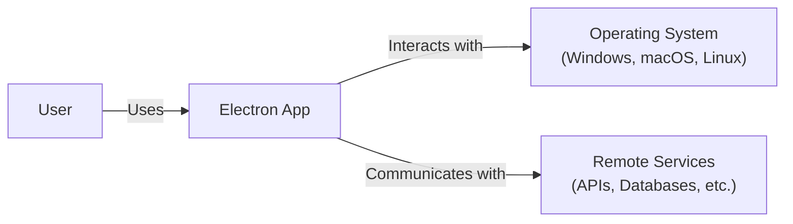
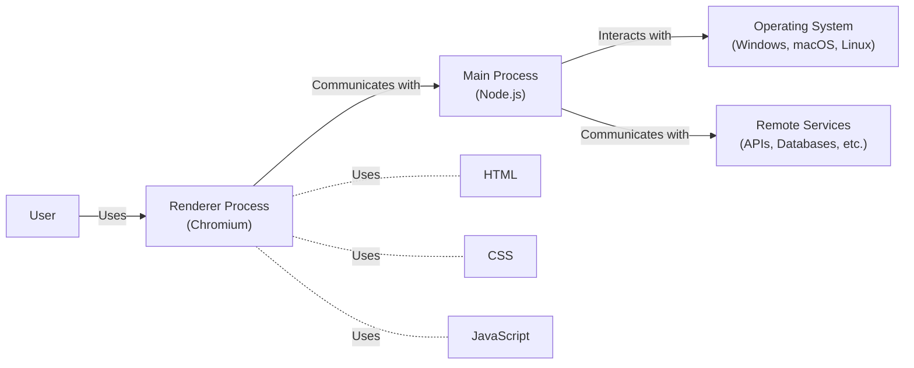
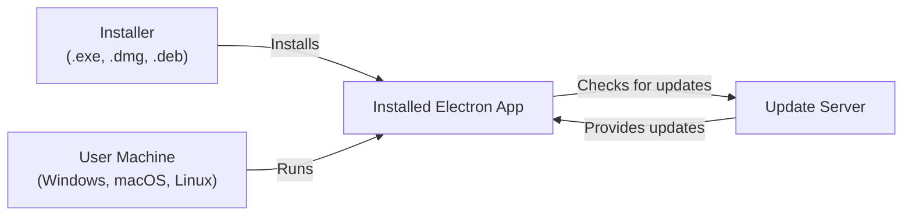
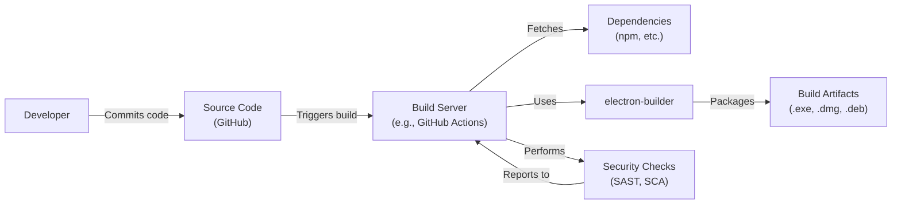

# BUSINESS POSTURE

Electron is a framework for building cross-platform desktop applications with web technologies (JavaScript, HTML, and CSS). It's used by many companies, from startups to large enterprises, to deliver applications that work consistently across Windows, macOS, and Linux.

Business Priorities and Goals:

*   Enable developers to use web technologies to create desktop applications, reducing the need for platform-specific native code.
*   Provide a consistent application experience across different operating systems.
*   Reduce development time and cost by leveraging a single codebase for multiple platforms.
*   Offer a rich set of APIs for accessing native operating system functionalities.
*   Maintain an active and supportive open-source community.
*   Ensure the framework is secure and reliable for building production-ready applications.

Most Important Business Risks:

*   Security vulnerabilities in the framework could expose user data or compromise user systems.
*   Incompatibility with future operating system updates could break existing applications.
*   Performance issues could lead to a poor user experience.
*   Lack of features or APIs could limit the capabilities of applications built with Electron.
*   Competition from alternative cross-platform frameworks could reduce Electron's market share.
*   Maintaining the open-source project and community requires significant effort and resources.

# SECURITY POSTURE

Existing Security Controls:

*   security control: Sandboxing: Electron uses Chromium's sandboxing features to isolate application processes and limit their access to system resources. Described in Electron documentation and Chromium documentation.
*   security control: Context Isolation: Electron provides context isolation to prevent web content from directly accessing Node.js APIs. Described in Electron documentation.
*   security control: Web Security: Electron applications are subject to the same web security policies as regular web browsers, such as the Same-Origin Policy. Described in Chromium documentation.
*   security control: Regular Security Updates: The Electron team regularly releases updates to address security vulnerabilities in Chromium and Node.js. Described in Electron releases and security advisories.
*   security control: Community Security Audits: The open-source nature of Electron allows for community scrutiny and security audits.
*   security control: Documentation and Best Practices: Electron provides documentation and best practices for building secure applications. Described in Electron documentation.

Accepted Risks:

*   accepted risk: Reliance on Chromium: Electron's security is heavily dependent on the security of Chromium. Vulnerabilities in Chromium can directly impact Electron applications.
*   accepted risk: Node.js Integration: The integration with Node.js provides powerful capabilities but also introduces potential security risks if not used carefully.
*   accepted risk: Third-Party Modules: Electron applications often rely on third-party Node.js modules, which may have their own security vulnerabilities.
*   accepted risk: Complexity: The complexity of the framework and its underlying components can make it challenging to identify and address all potential security issues.

Recommended Security Controls:

*   security control: Implement a Content Security Policy (CSP) to mitigate the risk of cross-site scripting (XSS) attacks.
*   security control: Enable Node.js integration only when necessary and use contextBridge to expose specific APIs to the renderer process.
*   security control: Carefully vet and audit any third-party Node.js modules used in the application.
*   security control: Use a secure communication channel (e.g., HTTPS) for any network requests.
*   security control: Implement code signing to verify the authenticity and integrity of the application.
*   security control: Regularly update Electron and all dependencies to the latest versions.
*   security control: Consider using a static analysis tool to identify potential security vulnerabilities in the codebase.

Security Requirements:

*   Authentication:
    *   If the application requires user authentication, it should use a secure authentication mechanism, such as OAuth 2.0 or OpenID Connect.
    *   Credentials should be stored securely, using appropriate hashing and salting techniques.
    *   Implement multi-factor authentication where appropriate.
*   Authorization:
    *   The application should implement appropriate authorization controls to restrict access to sensitive data and functionality based on user roles and permissions.
    *   Follow the principle of least privilege.
*   Input Validation:
    *   All user input should be validated to prevent injection attacks, such as XSS and SQL injection.
    *   Use a whitelist approach to input validation, allowing only known good characters and patterns.
*   Cryptography:
    *   Use strong, industry-standard cryptographic algorithms for encryption and hashing.
    *   Manage cryptographic keys securely.
    *   Use HTTPS for all network communication.

# DESIGN

## C4 CONTEXT

Element Descriptions:

*   Element:
    *   Name: User
    *   Type: Person
    *   Description: A person who interacts with the Electron application.
    *   Responsibilities: Uses the application to perform tasks.
    *   Security controls: N/A (External to the system)

*   Element:
    *   Name: Electron App
    *   Type: Software System
    *   Description: The desktop application built using the Electron framework.
    *   Responsibilities: Provides the application's functionality to the user.
    *   Security controls: Sandboxing, Context Isolation, Web Security, CSP, Secure Communication, Code Signing.

*   Element:
    *   Name: Operating System
    *   Type: Software System
    *   Description: The underlying operating system (Windows, macOS, or Linux) on which the Electron application runs.
    *   Responsibilities: Provides the platform and resources for the Electron application to run.
    *   Security controls: OS-level security features (e.g., user accounts, file permissions, process isolation).

*   Element:
    *   Name: Remote Services
    *   Type: Software System
    *   Description: Any remote services (APIs, databases, etc.) that the Electron application interacts with.
    *   Responsibilities: Provides data or services to the Electron application.
    *   Security controls: Authentication, Authorization, Encryption, Input Validation (implemented by the remote services themselves).

## C4 CONTAINER

Element Descriptions:

*   Element:
    *   Name: User
    *   Type: Person
    *   Description: A person who interacts with the Electron application.
    *   Responsibilities: Uses the application to perform tasks.
    *   Security controls: N/A (External to the system)

*   Element:
    *   Name: Main Process
    *   Type: Container (Node.js runtime)
    *   Description: The main process in the Electron application. Manages application lifecycle, creates renderer processes, and interacts with the operating system.
    *   Responsibilities: Application lifecycle management, creating and managing windows, interacting with native OS APIs, communicating with renderer processes.
    *   Security controls: Context Isolation, Secure Communication, Access Control to OS APIs.

*   Element:
    *   Name: Renderer Process
    *   Type: Container (Chromium browser)
    *   Description: A renderer process in the Electron application. Renders the user interface and handles user interactions.
    *   Responsibilities: Rendering the UI, handling user input, communicating with the main process.
    *   Security controls: Sandboxing, Web Security, CSP, Input Validation.

*   Element:
    *   Name: Operating System
    *   Type: Software System
    *   Description: The underlying operating system (Windows, macOS, or Linux).
    *   Responsibilities: Provides the platform and resources.
    *   Security controls: OS-level security features.

*   Element:
    *   Name: Remote Services
    *   Type: Software System
    *   Description: Any remote services the application interacts with.
    *   Responsibilities: Provides data or services.
    *   Security controls: Authentication, Authorization, Encryption, Input Validation (implemented by the remote services).

*   Element:
    *   Name: HTML
    *   Type: Technology
    *   Description: Markup language for the user interface.
    *   Responsibilities: N/A
    *   Security controls: N/A

*   Element:
    *   Name: CSS
    *   Type: Technology
    *   Description: Style sheets for the user interface.
    *   Responsibilities: N/A
    *   Security controls: N/A

*   Element:
    *   Name: JavaScript
    *   Type: Technology
    *   Description: Programming language for user interface and application logic.
    *   Responsibilities: N/A
    *   Security controls: N/A

## DEPLOYMENT

Electron applications can be deployed in several ways:

1.  Manual Installation: Users download an installer (e.g., .exe, .dmg, .deb) and install the application manually.
2.  App Store Distribution: Applications can be distributed through app stores like the Microsoft Store, Mac App Store, and Snapcraft.
3.  Auto-Updating: Electron applications can be configured to automatically update themselves using built-in or third-party update mechanisms.

Chosen Deployment Solution: Manual Installation with Auto-Updating

Element Descriptions:

*   Element:
    *   Name: User Machine
    *   Type: Infrastructure Node
    *   Description: The user's computer running Windows, macOS, or Linux.
    *   Responsibilities: Runs the installed Electron application.
    *   Security controls: OS-level security features, Antivirus software.

*   Element:
    *   Name: Installer
    *   Type: Software
    *   Description: The installer file (e.g., .exe, .dmg, .deb) used to install the application.
    *   Responsibilities: Installs the application files and sets up necessary configurations.
    *   Security controls: Code Signing.

*   Element:
    *   Name: Installed Electron App
    *   Type: Software
    *   Description: The installed Electron application on the user's machine.
    *   Responsibilities: Provides the application's functionality.
    *   Security controls: All application-level security controls (Sandboxing, Context Isolation, etc.).

*   Element:
    *   Name: Update Server
    *   Type: Software System
    *   Description: A server that provides updates to the Electron application.
    *   Responsibilities: Hosts update files and provides metadata for checking updates.
    *   Security controls: Secure Communication (HTTPS), Code Signing of update files.

## BUILD

Electron applications are typically built using a combination of tools and scripts. The build process often involves packaging the application code, dependencies, and the Electron runtime into a distributable package.

Build Process Description:

1.  Developer commits code changes to the source code repository (e.g., GitHub).
2.  The commit triggers a build process on a build server (e.g., GitHub Actions, Jenkins).
3.  The build server fetches the source code and dependencies (e.g., using npm).
4.  The build server uses a tool like electron-builder to package the application code, dependencies, and the Electron runtime into distributable artifacts (e.g., .exe, .dmg, .deb).
5.  Security checks, such as Static Application Security Testing (SAST) and Software Composition Analysis (SCA), are performed during the build process.
6.  The build artifacts are created and made available for distribution.

Security Controls in Build Process:

*   security control: Dependency Management: Use a package manager (e.g., npm) to manage dependencies and ensure they are up-to-date.
*   security control: Software Composition Analysis (SCA): Use SCA tools to identify known vulnerabilities in third-party dependencies.
*   security control: Static Application Security Testing (SAST): Use SAST tools to identify potential security vulnerabilities in the application code.
*   security control: Build Automation: Use a build server (e.g., GitHub Actions, Jenkins) to automate the build process and ensure consistency.
*   security control: Code Signing: Sign the build artifacts to verify their authenticity and integrity.
*   security control: Secure Build Environment: Ensure the build server is secure and protected from unauthorized access.

# RISK ASSESSMENT

Critical Business Processes:

*   Application Functionality: The core functionality of the Electron application must be protected to ensure it operates as intended and provides value to users.
*   User Data Handling: If the application handles user data, protecting the confidentiality, integrity, and availability of that data is critical.
*   Application Updates: The update mechanism must be secure to prevent attackers from distributing malicious updates.

Data Sensitivity:

*   User Data: If the application collects or processes user data, the sensitivity of that data will vary depending on the nature of the application. Data could range from non-sensitive (e.g., application preferences) to highly sensitive (e.g., personal information, financial data).
*   Application Code: The application code itself may be considered sensitive intellectual property.
*   Configuration Data: Configuration data, such as API keys or database credentials, should be treated as highly sensitive.

# QUESTIONS & ASSUMPTIONS

Questions:

*   What specific types of user data will the Electron application handle?
*   Will the application require user authentication?
*   Will the application interact with any remote services? If so, what are the security requirements for those services?
*   What is the expected deployment model for the application (e.g., manual installation, app store distribution)?
*   What is the acceptable level of risk for security vulnerabilities?
*   What are the specific regulatory or compliance requirements for the application?

Assumptions:

*   BUSINESS POSTURE: The primary goal is to create a cross-platform desktop application using web technologies. Cost and time to market are important considerations.
*   SECURITY POSTURE: The Electron framework's built-in security features (sandboxing, context isolation) will be utilized. Regular security updates will be applied. Third-party dependencies will be carefully vetted.
*   DESIGN: The application will follow a standard Electron architecture with a main process and renderer processes. The application may interact with remote services. The deployment model will likely involve manual installation and auto-updating. The build process will be automated and include security checks.