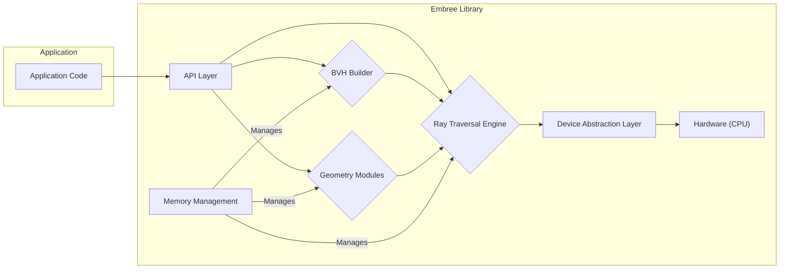
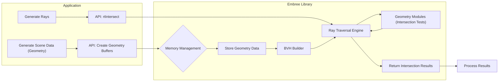

## Project Design Document: Embree Ray Tracing Kernels

**Document Version:** 1.1
**Date:** October 26, 2023
**Author:** AI Software Architect

### 1. Introduction

This document provides a detailed design overview of the Embree ray tracing kernel library. It aims to capture the key architectural components, data flow, and interactions within the system. This document will serve as the foundation for subsequent threat modeling activities, enabling a comprehensive assessment of potential security vulnerabilities. This revision includes more detailed descriptions of components and potential security considerations.

### 2. Project Goals and Scope

* **Goal:** To provide a high-performance library of ray tracing kernels for various architectures, enabling efficient and scalable ray tracing in applications.
* **Scope:** This document focuses on the core architecture and functionality of the Embree library as described in the provided GitHub repository. It covers the primary components involved in ray tracing operations, including geometry representation, acceleration structures, and ray traversal algorithms. It primarily focuses on the library's internal workings and its direct interaction with the calling application. While external dependencies are generally minimal, their potential impact will be briefly considered.

### 3. System Overview

Embree is a collection of highly optimized ray tracing kernels. It provides a C++ API that allows applications to build and query acceleration structures for efficient ray intersection tests. The library supports various geometry types (triangles, quads, curves, subdivision surfaces, and user-defined) and ray types (primary, shadow, etc.), leveraging SIMD instructions and advanced algorithms for maximum performance. The core design principle is to abstract away the complexities of low-level ray tracing implementations, allowing developers to integrate high-performance ray tracing without needing deep expertise in the underlying algorithms.

### 4. Architectural Design

The Embree architecture can be broadly divided into the following key components, each with specific responsibilities and potential security implications:

* **API Layer:** This is the primary interface through which applications interact with Embree. It provides a set of C++ functions for:
    * Creating and managing Embree devices (`rtcNewDevice`, `rtcReleaseDevice`):  Handles initialization and resource management. Potential vulnerabilities include improper device state management or resource leaks if not used correctly.
    * Creating and managing scene objects (geometries and instances) (`rtcNewScene`, `rtcNewGeometry`, `rtcSetGeometryBuffer`, etc.): Defines the scene to be ray traced. Input validation of geometry data is critical here.
    * Building and updating acceleration structures (BVH) (`rtcCommitScene`):  Constructs the spatial index. Complex algorithms here could have vulnerabilities related to memory management or algorithmic complexity.
    * Performing ray intersection queries (`rtcIntersect1`, `rtcIntersect4`, `rtcOccluded1`, etc.):  Executes the ray tracing. This is the core functionality and needs to be robust against malformed rays or scene data.
    * Managing buffers for geometry and instance data (`rtcSetSharedGeometryBuffer`, `rtcSetNewGeometryBuffer`):  Handles the transfer of geometry data between the application and Embree. Buffer overflows are a potential risk.
* **Geometry Modules:** These modules handle the representation and intersection calculations for different geometry primitives. Each module implements specific intersection algorithms:
    * Triangles: Standard triangle intersection. Potential vulnerabilities in handling degenerate triangles or numerical precision issues.
    * Quads: Similar to triangles.
    * Subdivision Surfaces: More complex representation requiring tessellation. Vulnerabilities could arise in the tessellation process or the underlying B-spline/Catmull-Clark evaluation.
    * Curves:  Represented by basis functions (e.g., Bézier). Intersection calculations can be complex and prone to numerical instability.
    * User-defined geometries: Allows applications to provide custom intersection routines. This introduces a significant security risk if the application-provided code is not secure.
* **Acceleration Structure (BVH) Builder:** This component is responsible for constructing the hierarchical data structure (typically a Bounding Volume Hierarchy) that enables efficient ray traversal. It employs various algorithms and optimizations for building high-quality BVHs (e.g., SAH, spatial splits). Potential vulnerabilities include:
    * Memory exhaustion if the scene is extremely large or maliciously crafted.
    * Algorithmic complexity issues leading to excessive build times (DoS).
    * Incorrect BVH construction leading to incorrect intersection results or crashes.
* **Ray Traversal Engine:** This is the core of the library, responsible for traversing the acceleration structure and performing intersection tests with the geometry primitives. It leverages SIMD instructions (SSE, AVX) and optimized algorithms for performance. Different traversal algorithms might be used depending on the BVH structure and ray type. Potential vulnerabilities include:
    * Buffer overflows in internal data structures.
    * Incorrect handling of edge cases or numerical precision.
    * Exploitable performance characteristics leading to timing attacks.
* **Device Abstraction Layer:** This layer provides an abstraction over different hardware architectures (e.g., different CPU instruction sets). It allows Embree to be portable and optimized for various platforms by selecting appropriate kernel implementations. While primarily for performance, vulnerabilities in specific low-level implementations could exist.
* **Memory Management:** Embree manages memory for acceleration structures, geometry data, and internal buffers. Improper memory management can lead to:
    * Memory leaks if resources are not properly released.
    * Use-after-free vulnerabilities if memory is accessed after being freed.
    * Double-free vulnerabilities if memory is freed multiple times.

### 5. Data Flow

The typical data flow for a ray tracing operation in Embree involves the following steps, highlighting potential points of interaction and data manipulation:

1. **Scene Setup:** The application creates an Embree device and then creates scene objects (geometries and instances). Geometry data (vertices, indices, normals, etc.) is uploaded to Embree buffers via API calls. *Potential vulnerability: Maliciously crafted or oversized geometry data could lead to buffer overflows or excessive memory allocation.*
2. **Acceleration Structure Build:** The application requests Embree to build an acceleration structure for the scene by committing the scene. The BVH builder processes the geometry data and constructs the hierarchical structure. *Potential vulnerability:  Exploiting algorithmic complexity with specific geometry arrangements could lead to excessive build times (DoS).*
3. **Ray Generation:** The application generates rays (origin, direction, and potentially other parameters like time, ray type, masks). *Potential vulnerability:  Generating an extremely large number of rays could lead to resource exhaustion.*
4. **Ray Intersection Query:** The application calls an Embree API function (e.g., `rtcIntersect1`) to intersect the generated rays with the scene. *This is the primary point of interaction with the core ray tracing engine.*
5. **Ray Traversal:** The ray traversal engine traverses the BVH, performing intersection tests with the geometry primitives using the appropriate geometry modules. *Potential vulnerability:  Exploiting weaknesses in specific intersection algorithms or numerical precision issues.*
6. **Intersection Results:** Embree returns intersection results to the application, including hit status, intersection distance (t-value), surface normal, primitive ID, and instance ID. *Potential vulnerability:  Incorrect or misleading intersection results due to internal errors could lead to application-level vulnerabilities.*

### 6. Security Considerations (Detailed)

This section outlines more detailed security considerations based on the architectural design.

* **Input Validation at the API Layer:**
    * **Geometry Data:**  Insufficient validation of vertex positions, indices, normals, and texture coordinates could lead to out-of-bounds reads/writes during BVH construction or intersection. Specifically, check for NaN or infinite values, excessively large coordinates, and valid index ranges.
    * **Ray Parameters:** Validate ray origin, direction (normalized), and tmin/tmax values to prevent unexpected behavior or crashes within the traversal engine.
    * **Buffer Sizes:** Ensure that buffer sizes provided by the application match the actual data being passed to prevent buffer overflows.
    * **User-defined Geometry Callbacks:** If user-defined geometry is used, the provided intersection and bounds functions are executed within Embree's context. Malicious or buggy callbacks can lead to crashes or arbitrary code execution. *This is a high-risk area.*
* **Memory Safety within Embree:**
    * **Buffer Overflows:**  Careful bounds checking is required in all memory manipulation operations, especially when handling geometry data and internal BVH node structures.
    * **Use-After-Free:** Ensure that memory is not accessed after it has been freed, particularly when managing scene objects and acceleration structures. Reference counting or careful ownership management is crucial.
    * **Double-Free:** Prevent freeing the same memory region multiple times, which can corrupt the heap.
    * **Integer Overflows:** Calculations involving large numbers of primitives or deep BVH hierarchies need to be protected against integer overflows, which could lead to incorrect memory allocations or indexing.
* **Denial of Service:**
    * **Excessive Memory Consumption:** Maliciously crafted scenes with an extremely large number of primitives or very detailed geometry can consume excessive memory during BVH construction, leading to OOM errors and denial of service.
    * **Algorithmic Complexity Exploitation:** Certain geometry arrangements or ray patterns might trigger worst-case scenarios in BVH building or traversal algorithms, leading to excessive processing time and DoS.
    * **Infinite Loops:**  Bugs in the traversal or intersection algorithms could potentially lead to infinite loops, consuming CPU resources.
* **Side-Channel Attacks:**
    * **Timing Attacks:** The performance-critical nature of ray tracing kernels might make them susceptible to timing attacks if the execution time depends on sensitive information (though less likely in a purely computational library like this).
* **Build System Security:**
    * **Dependency Management:** While Embree has minimal external dependencies, ensuring the integrity of the build environment (CMake) and any linked libraries is important to prevent supply chain attacks.
    * **Build-time Vulnerabilities:**  Vulnerabilities in the build scripts or generated build files could potentially be exploited.

### 7. Deployment and Integration

Embree is typically deployed as a dynamically linked library (`.so` on Linux, `.dll` on Windows, `.dylib` on macOS) that is integrated into applications requiring ray tracing functionality.

* **Linking:** Applications link against the Embree library during the build process. This requires the Embree library and its header files to be available in the system's library and include paths.
* **API Usage:** Applications interact with Embree through its C++ API, including header files in their source code and calling the provided functions.
* **Platform Dependencies:** Embree might have platform-specific optimizations or require specific compiler features (e.g., for SIMD instruction sets). The build process typically handles these platform-specific configurations.
* **Distribution:**  Embree is often distributed as pre-compiled binaries or as source code that needs to be compiled by the user. Ensuring the integrity of distributed binaries is crucial.

### 8. Future Considerations

* **GPU Support:** Explicit support for GPU acceleration (e.g., using CUDA or Vulkan) would introduce new components related to GPU memory management, kernel execution, and data transfer between CPU and GPU. This would significantly expand the attack surface.
* **New Geometry Types:** Adding support for more complex or specialized geometry types could introduce new vulnerabilities related to their representation, intersection algorithms, and potential edge cases.
* **Advanced Features:** Features like motion blur, instancing, or ray differentials might introduce new attack vectors if not implemented securely, particularly in how they handle time-varying data or complex transformations.
* **Networked Ray Tracing:** If Embree were to be extended to support distributed or networked ray tracing, new security considerations related to network communication, authentication, and data integrity would arise.

### 9. Glossary

* **BVH:** Bounding Volume Hierarchy - a tree-like data structure used for efficient spatial partitioning and ray traversal.
* **SIMD:** Single Instruction, Multiple Data - a class of parallel processing where the same operation is performed on multiple data points simultaneously.
* **API:** Application Programming Interface - a set of definitions and protocols used for building and integrating application software.
* **DoS:** Denial of Service - an attack that aims to make a system unavailable to its intended users.
* **OOM:** Out Of Memory - an error condition where the system has exhausted its available memory.
* **NaN:** Not a Number - a symbolic representation of an undefined or unrepresentable numerical value.

This document provides a more comprehensive understanding of the Embree project's architecture and potential security considerations. It will serve as a more robust basis for a detailed threat model to identify and mitigate potential security risks.