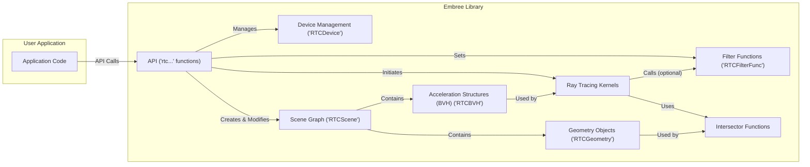
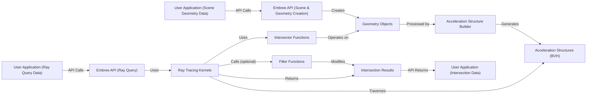

# Project Design Document: Embree Ray Tracing Library

**Version:** 1.1
**Date:** October 26, 2023
**Prepared By:** Gemini (AI Language Model)

## 1. Introduction

This document provides an enhanced design overview of the Embree ray tracing library, focusing on aspects relevant to security threat modeling. It details the architectural components, data flow, and key technologies, with a particular emphasis on potential vulnerability points.

Embree is a library of high-performance ray tracing kernels developed by Intel. Its primary function is to accelerate ray intersection computations within rendering applications. Understanding its internal structure and interaction points is paramount for identifying and mitigating potential security vulnerabilities introduced during integration.

## 2. Project Goals

*   Deliver highly optimized and efficient ray tracing algorithms.
*   Offer a well-defined and flexible API for seamless integration into diverse rendering engines.
*   Support a wide range of geometric primitives and scene representations.
*   Maintain consistent high performance across various hardware architectures.
*   Provide a robust and reliable library suitable for production rendering environments.
*   Offer a clear and documented API to minimize misuse.

## 3. Target Audience

*   Rendering engine developers responsible for integrating high-performance ray tracing capabilities.
*   Security engineers tasked with performing threat assessments on systems incorporating Embree.
*   Researchers exploring advanced rendering techniques and the underlying ray tracing implementations.
*   Software engineers interested in the intricacies of ray tracing algorithm implementation and optimization.

## 4. System Architecture

Embree is primarily implemented in C++ and provides a C API to facilitate integration with a broader range of programming languages. The architecture is centered around managing geometric scenes and efficiently executing ray intersection queries.

### 4.1. Core Components

*   **Device Management (`RTCDevice`):** Responsible for initializing and managing underlying hardware resources (CPU cores, SIMD units) and threading models. This includes setting up error handling and control flags.
*   **Scene Graph (`RTCScene`):**  Represents the geometric scene to be rendered. Key aspects include:
    *   **Geometry Objects (`RTCGeometry`):**  Representations of geometric primitives such as triangles, curves, subdivisions, and instances. Each geometry type has specific data layouts and access patterns.
    *   **Acceleration Structures (BVH) (`RTCBVH`):** Hierarchical data structures (Bounding Volume Hierarchies) used to accelerate the process of finding intersections between rays and primitives. Embree supports various BVH algorithms (e.g., SAH, BVH8) with different performance characteristics and memory footprints. The BVH build process involves complex algorithms that could be susceptible to issues if input data is malicious.
    *   **Instance Geometry:** Allows for efficient reuse of geometry by referencing existing geometry objects with different transformations.
*   **Ray Tracing Kernels:** Implement the core algorithms for intersecting rays with different primitive types, leveraging SIMD instructions for parallel processing. These kernels are highly optimized and operate directly on the BVH and geometry data.
*   **Filter Functions (`RTCFilterFunc`):** Allow user-defined callbacks to filter intersection results based on application-specific criteria (e.g., visibility testing, shadow rays). These functions are called by Embree and execute user-provided code, representing a potential point for introducing vulnerabilities if not carefully implemented.
*   **Intersector Functions:** Low-level functions responsible for performing the geometric intersection tests between a ray and a specific primitive type.
*   **API (Application Programming Interface):** Provides a set of functions for interacting with Embree:
    *   Device lifecycle management (`rtcNewDevice`, `rtcReleaseDevice`).
    *   Scene creation and modification (`rtcNewScene`, `rtcCommitScene`).
    *   Geometry creation and management (`rtcNewGeometry`, `rtcSetSharedGeometryBuffer`).
    *   Building and updating acceleration structures (`rtcCommitScene`).
    *   Performing ray queries (`rtcIntersect1`, `rtcIntersect4`, `rtcOccluded1`, etc.).
    *   Setting and managing filter functions (`rtcSetIntersectionFilter`).
    *   Error handling (`rtcGetDeviceError`).

### 4.2. Component Interactions

*   The **User Application** interacts with the **Embree Library** exclusively through its **API**.
*   The **API** manages the **Device Management** component, which handles hardware initialization.
*   Scene creation and modification through the **API** populate the **Scene Graph**.
*   The **Scene Graph** holds **Geometry Objects** representing the primitives and builds **Acceleration Structures (BVH)** for efficient ray tracing.
*   Ray queries initiated via the **API** are processed by the **Ray Tracing Kernels**.
*   **Ray Tracing Kernels** traverse the **Acceleration Structures** and utilize specific **Intersector Functions** to test for intersections with **Geometry Objects**.
*   Optionally, the **Ray Tracing Kernels** can call user-defined **Filter Functions** to modify intersection results.

## 5. Data Flow

The primary data flow within Embree involves the processing of scene geometry to build acceleration structures and the subsequent execution of ray queries.

1. **Scene Data Input:** The user application provides geometric data (vertices, indices, etc.) and parameters to the Embree API for scene construction. This input data is a potential source of vulnerabilities if not validated.
2. **Geometry Object Creation:** Embree creates internal representations of the geometry based on the input data.
3. **Acceleration Structure Build:** Embree builds the BVH by processing the geometry data. This involves complex algorithms that partition the scene and create a hierarchical representation. Maliciously crafted geometry could potentially cause excessive memory allocation or computation during this phase.
4. **Ray Query Input:** The user application provides ray information (origin, direction, ranges, flags) to the Embree API to initiate a ray query.
5. **Traversal and Intersection:** Embree's ray tracing kernels traverse the BVH, efficiently identifying potential intersection candidates. Intersector functions perform precise intersection tests.
6. **Filter Function Execution (Optional):** If a filter function is set, it is called with the intersection data, allowing the user application to influence the results.
7. **Intersection Result Output:** The intersection results (hit distance, geometry ID, primitive ID, etc.) are returned to the user application through the API.

## 6. Key Technologies

*   **C++:** The primary implementation language, requiring careful memory management to avoid vulnerabilities.
*   **SIMD Instructions (SSE, AVX, AVX-512):**  Heavy reliance on SIMD for performance. Incorrect usage or assumptions about data alignment could lead to vulnerabilities.
*   **Multi-threading:** Utilizes threading for parallel BVH construction and ray tracing. Concurrency issues like race conditions are potential concerns.
*   **Bounding Volume Hierarchies (BVHs):** The core acceleration data structure. Vulnerabilities could arise in the BVH construction algorithms or traversal logic.
*   **Vectorization:** Data structures and algorithms are designed for vector processing. Incorrect handling of vector data could lead to issues.

## 7. Deployment Considerations

Embree is typically deployed as a dynamically linked library within a rendering application's process.

*   **Operating Systems:** Windows, Linux, macOS.
*   **Architectures:** x86, x64, ARM.
*   **Integration:** Directly linked into the rendering application's address space, meaning vulnerabilities in Embree could directly impact the host application.

## 8. Security Considerations (Pre-Threat Model)

Integrating Embree into an application introduces several security considerations that need to be addressed through a comprehensive threat modeling process.

*   **Memory Corruption Vulnerabilities:**
    *   **Buffer Overflows:** Potential in API calls that accept size parameters or when handling geometry data. For example, providing a size larger than the allocated buffer for vertex data.
    *   **Use-After-Free:**  Possible if the user application incorrectly manages the lifetime of Embree objects (e.g., releasing geometry while it's still being referenced by the scene).
    *   **Double-Free:**  Occurring if `rtcRelease...` functions are called multiple times on the same object.
    *   **Integer Overflows:** Calculations involving large scene sizes (e.g., number of primitives) or ray counts could overflow, leading to unexpected behavior or memory corruption.
*   **Denial of Service (DoS):**
    *   **Excessive Memory Consumption:** Maliciously crafted scenes with an extremely large number of primitives or deep BVH hierarchies could exhaust available memory.
    *   **Computational Exhaustion:**  Complex scenes or specific ray configurations could lead to extremely long computation times, effectively stalling the rendering application.
*   **Input Validation Failures:**
    *   **Malformed Geometry Data:** Providing invalid or out-of-range values for vertices, indices, or other geometric parameters could lead to crashes or unexpected behavior during BVH construction or ray tracing.
    *   **Invalid API Usage:** Calling API functions in an incorrect sequence or with invalid parameters could lead to undefined behavior.
*   **Filter Function Vulnerabilities:**
    *   Since filter functions execute user-provided code, they represent a direct injection point for malicious logic if the rendering application allows untrusted code to be used as filter functions.
    *   Bugs in filter functions could lead to incorrect intersection results or crashes.
*   **Concurrency Issues:**
    *   **Race Conditions:** Potential in multi-threaded operations within Embree, especially during BVH construction or scene updates if not properly synchronized.
    *   **Deadlocks:**  Possible if the user application interacts with Embree in a way that creates circular dependencies on locks.
*   **Dependency Vulnerabilities:**  While Embree has minimal external dependencies, any dependencies it does have could introduce vulnerabilities if they are not kept up-to-date and patched.
*   **Side-Channel Attacks:**  While less likely in typical rendering scenarios, timing variations in ray tracing computations could potentially leak information in highly sensitive contexts.

This enhanced design document provides a more detailed understanding of the Embree ray tracing library, specifically tailored for security threat modeling. The identified components, data flows, and potential vulnerabilities serve as a strong foundation for a comprehensive security assessment.