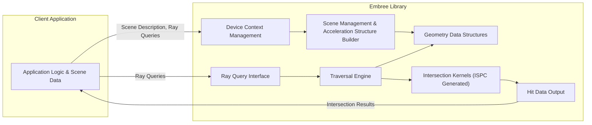
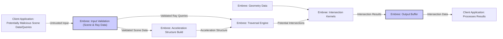

## Project Design Document: Embree Ray Tracing Kernels (Improved)

**1. Introduction**

This document provides an enhanced design overview of the Embree ray tracing kernel library, focusing on aspects relevant for security threat modeling. It details the architectural components, data flows, and interfaces, providing a foundation for identifying potential vulnerabilities.

**2. Goals of this Document**

*   Provide a clear and comprehensive description of Embree's architecture and design.
*   Identify key components, their functionalities, and interdependencies.
*   Detail the flow of data within the system, highlighting potential data transformation points.
*   Document critical APIs and interfaces used for interacting with Embree.
*   Offer sufficient technical detail to enable effective and targeted threat modeling activities.

**3. Scope**

This document focuses on the core runtime architecture and functionality of the Embree library as a software component, specifically from a security perspective. It covers:

*   The main functional components of Embree and their security-relevant responsibilities.
*   The data structures used for representing scenes and ray queries, with emphasis on potential vulnerabilities.
*   The primary APIs exposed to client applications, highlighting potential misuse scenarios.
*   The interaction between Embree and the host application environment.

This document does *not* cover:

*   In-depth implementation details of specific ray tracing algorithms or optimizations.
*   Performance benchmarking or optimization strategies within Embree.
*   The intricacies of the build process, compiler flags, or static analysis.
*   The internal workings of the ISPC compiler or its specific integration details beyond its role in kernel generation.
*   Detailed hardware-level interactions beyond the general reliance on CPU features.

**4. High-Level Architecture**

Embree functions as a library integrated into client applications to provide high-performance ray tracing capabilities. The architecture emphasizes modularity and performance.

*   **Client Application:** The external software utilizing Embree, responsible for providing scene data and initiating ray tracing operations.
*   **Device Context Management:** Handles the initialization and management of Embree devices, which encapsulate resources and settings.
*   **Scene Management & Acceleration Structure Builder:**  Organizes scene geometry and constructs efficient spatial acceleration structures (e.g., BVHs) for fast ray traversal. This component is crucial for performance and has implications for memory usage and potential vulnerabilities related to malformed input.
*   **Geometry Data Structures:**  Stores the geometric primitives (triangles, curves, etc.) in optimized data structures. The integrity and validity of this data are critical.
*   **Ray Query Interface:** Provides the API for submitting ray queries to Embree. This is a key interaction point with the client application and a potential attack surface.
*   **Traversal Engine:** Implements the algorithms for traversing the acceleration structures to find potential ray-primitive intersections.
*   **Intersection Kernels (ISPC Generated):**  Highly optimized kernels, often generated using ISPC, for calculating precise ray-primitive intersections. These kernels operate on the raw geometry data and are performance-critical.
*   **Hit Data Output:**  Structures containing the results of ray intersection tests, including hit status, distance, and other relevant information.

**5. Detailed Design**

This section provides a more granular view of the key components, emphasizing security-relevant aspects.

*   **Device Context Management:**
    *   Manages global Embree state and resources.
    *   Handles error reporting and potentially security-related configuration (though limited).
    *   Improper device initialization or resource management could lead to instability.

*   **Scene Management & Acceleration Structure Builder:**
    *   Responsible for validating input scene data (e.g., vertex counts, indices, geometry types). Insufficient validation can lead to crashes or memory corruption.
    *   Builds acceleration structures (e.g., BVH). Vulnerabilities in the build process could lead to incorrect structures, causing incorrect intersection results or denial of service.
    *   Manages memory allocation for scene data and acceleration structures. Memory exhaustion or fragmentation due to malicious input is a concern.

*   **Geometry Data Structures:**
    *   Stores raw vertex and index data. Buffer overflows are possible if input data exceeds allocated buffer sizes.
    *   Different geometry types have specific data layouts. Incorrectly specified geometry types could lead to misinterpretation of data and potential crashes.
    *   Supports user-defined geometry, which introduces a significant security risk if callbacks are not handled securely.

*   **Ray Query Interface:**
    *   Entry point for ray tracing operations. Input validation of ray origins, directions, and query flags is crucial.
    *   Supports different query types (e.g., first hit, any hit, multiple hits). Incorrect usage or manipulation of query flags could lead to unexpected behavior.
    *   Handles potential for denial-of-service attacks through excessive or malformed ray queries.

*   **Traversal Engine:**
    *   Navigates the acceleration structure. Bugs in the traversal logic could lead to infinite loops or incorrect intersection results.
    *   Performance optimizations might introduce subtle vulnerabilities if not implemented carefully.

*   **Intersection Kernels (ISPC Generated):**
    *   Highly optimized code operating directly on geometry data. Vulnerabilities here could lead to memory corruption or incorrect results.
    *   Relies on the correctness of the ISPC compiler and the generated code.
    *   Potential for vulnerabilities related to floating-point precision and handling of edge cases.

*   **Hit Data Output:**
    *   Stores intersection results. Buffer overflows are possible if the output buffer is not sized correctly.
    *   The format and content of the hit data should be carefully considered to prevent information leakage.

**6. Data Flow (Security Perspective)**

This data flow highlights potential points where data integrity and security can be compromised.

1. **Client Application (Untrusted Input):** The client application provides scene data and ray queries, which could be maliciously crafted.
2. **Embree: Input Validation:** Embree attempts to validate the incoming scene and ray data. This is a critical security boundary. Insufficient validation can allow malicious data to propagate.
3. **Embree: Acceleration Structure Build:**  Validated scene data is used to build the acceleration structure. Vulnerabilities here could lead to corrupted structures.
4. **Embree: Traversal Engine:** Validated ray queries are used to traverse the acceleration structure.
5. **Embree: Geometry Data:**  The internal representation of the scene geometry.
6. **Embree: Intersection Kernels:**  The traversal engine identifies potential intersections, and the intersection kernels perform the precise calculations using the geometry data. Vulnerabilities in the kernels could lead to memory corruption.
7. **Embree: Output Buffer:** Intersection results are stored in the output buffer. Buffer overflows are possible if the buffer size is not handled correctly.
8. **Client Application: Processes Results:** The client application receives the intersection results.

**7. Key Interfaces (Security Focus)**

The Embree API is the primary interface for interaction and represents a significant attack surface.

*   **Device Management:**
    *   `rtcNewDevice()`: Potential for resource exhaustion if called excessively.
    *   `rtcSetDeviceErrorFunction()`:  Care must be taken with error handling callbacks to prevent vulnerabilities.

*   **Scene Management:**
    *   `rtcNewScene()`:  Resource exhaustion possible.
    *   `rtcAttachGeometry()`:  Attaching a large number of geometries could lead to performance issues or memory exhaustion.
    *   `rtcCommitScene()`:  A computationally intensive operation. Maliciously crafted scenes could lead to excessive processing time (DoS).

*   **Geometry Creation and Modification:**
    *   `rtcNewGeometry()`:  Potential for integer overflows when specifying large numbers of primitives.
    *   `rtcSetSharedGeometryBuffer()`:  **Critical for security.**  Providing incorrect buffer sizes or pointers can lead to buffer overflows or out-of-bounds access. The `format` parameter must be carefully validated.
    *   `rtcSetUserData()`:  User data pointers should be handled with caution to avoid dangling pointers or use-after-free vulnerabilities.
    *   `rtcSetGeometryBoundsFunction()` and `rtcSetGeometryIntersectFunctionN()`:  **Major security risk.** User-provided callbacks must be treated as untrusted code and sandboxed appropriately. Lack of proper sandboxing can lead to arbitrary code execution.

*   **Ray Tracing Queries:**
    *   `rtcIntersect1()`, `rtcIntersectN()`:  Submitting a large number of rays could lead to denial of service.
    *   `RTCRay` and `RTCHit` structures:  Ensure proper initialization and handling of these structures to prevent information leakage or unexpected behavior.

*   **Instance Management:**
    *   `rtcNewInstance()`:  Potential for resource exhaustion.
    *   `rtcSetInstanceTransform()`:  While less direct, incorrect transformations could potentially be used to cause issues in subsequent rendering or analysis.

**8. Deployment Considerations (Security Implications)**

The deployment environment can influence the security posture of Embree.

*   **Dynamically Linked Library:**  Requires ensuring the integrity of the Embree library file to prevent tampering.
*   **Operating System and Hardware Dependencies:**  Vulnerabilities in the underlying OS or hardware could potentially be exploited through Embree.
*   **Sandboxing:**  If Embree is used in a security-sensitive context, consider running it within a sandbox to limit the impact of potential vulnerabilities.

**9. Security Considerations (Detailed)**

This section expands on potential security vulnerabilities based on the design.

*   **Input Validation Failures:** Insufficient validation of scene geometry data (vertex positions, indices, normals, UVs), ray origins, and directions can lead to buffer overflows, out-of-bounds reads, and crashes.
*   **Memory Corruption:** Bugs in memory management (allocations, deallocations, buffer handling) can lead to heap overflows, use-after-free vulnerabilities, and other memory safety issues. This is particularly relevant in the geometry data structures and intersection kernels.
*   **Integer Overflows:** Calculations involving large numbers of primitives, vertices, or rays could result in integer overflows, leading to incorrect memory allocations or buffer sizes.
*   **Denial of Service (DoS):** Maliciously crafted scenes with extreme complexity (e.g., very large numbers of primitives, deeply nested instances) or excessive ray queries can consume excessive CPU and memory resources, leading to denial of service.
*   **Unsafe User Callbacks:** The ability to provide custom intersection and bounds computation callbacks introduces a significant risk. If these callbacks are not properly sandboxed, they can be exploited for arbitrary code execution.
*   **Concurrency Vulnerabilities:** If Embree utilizes multi-threading internally, race conditions or deadlocks could lead to incorrect results or denial of service.
*   **Side-Channel Attacks:** Timing variations in ray tracing operations, influenced by scene geometry or ray parameters, could potentially leak sensitive information.
*   **Information Disclosure:**  Errors or incorrect handling of hit data could potentially leak information about the scene geometry.
*   **Dependency Vulnerabilities:**  While not explicitly detailed in the scope, vulnerabilities in any libraries that Embree depends on could also pose a risk.

**10. Assumptions and Constraints**

*   The client application is responsible for providing valid memory pointers to the Embree API, except where explicitly noted for validation within Embree.
*   Embree relies on the underlying operating system for memory management and thread scheduling.
*   Performance is a primary design goal, which can sometimes conflict with security considerations if not carefully addressed.
*   The ISPC compiler is assumed to generate correct and safe code.

This improved design document provides a more detailed and security-focused overview of the Embree ray tracing kernel library. It highlights potential vulnerabilities and serves as a strong foundation for subsequent threat modeling activities.