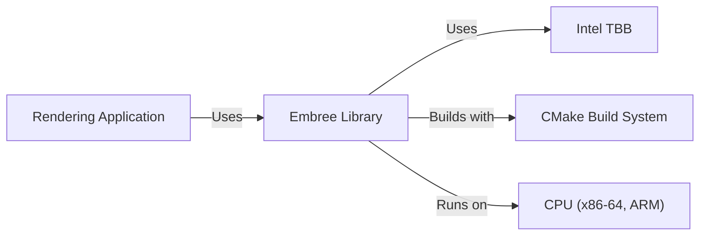
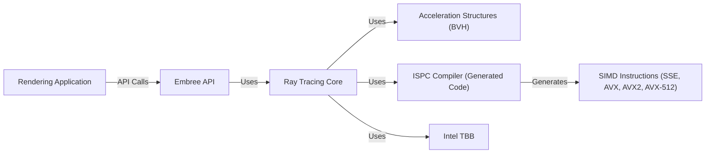
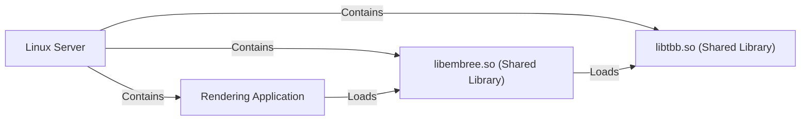
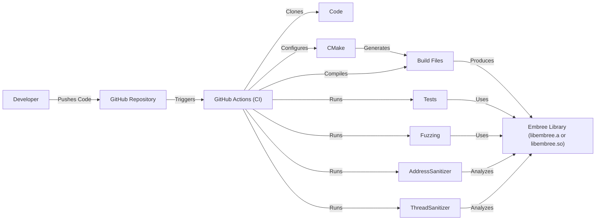

# BUSINESS POSTURE

Business Priorities and Goals:

*   Provide high-performance ray tracing kernels for 3D rendering applications.
*   Support a wide range of CPU architectures and instruction sets (SSE, AVX, AVX2, AVX-512).
*   Maintain an open-source and permissive license (Apache 2.0) to encourage adoption and contribution.
*   Provide a stable and well-documented API for integration into rendering software.
*   Achieve high performance and efficiency to minimize rendering times.

Business Risks:

*   Vulnerabilities in the ray tracing kernels could lead to denial-of-service or potentially arbitrary code execution in rendering applications that utilize Embree.
*   Performance regressions could negatively impact the performance of rendering applications.
*   Lack of support for new CPU architectures or instruction sets could limit adoption.
*   Incompatibility with specific rendering software or workflows could hinder adoption.
*   Security vulnerabilities in dependencies could be inherited by Embree.

# SECURITY POSTURE

Existing Security Controls:

*   security control: Fuzzing: The project uses fuzzing extensively (as seen in the `fuzzing/` directory) to identify potential vulnerabilities.
*   security control: Continuous Integration (CI): GitHub Actions are used for CI, which likely includes build checks and potentially some static analysis (implied by the presence of `.github/workflows/`).
*   security control: Code Reviews: As an open-source project on GitHub, it benefits from community code reviews, although the rigor and consistency may vary.
*   security control: AddressSanitizer (ASan): Mentioned in build instructions, ASan is used to detect memory errors.
*   security control: ThreadSanitizer (TSan): Mentioned in build instructions, TSan is used to detect data races in multithreaded code.

Accepted Risks:

*   accepted risk: The project relies on external dependencies (e.g., TBB), which may introduce their own security risks.
*   accepted risk: While fuzzing is used, it may not cover all possible code paths or vulnerability types.
*   accepted risk: The project primarily targets performance, and while security is considered, it might not be the absolute top priority in all design decisions.

Recommended Security Controls:

*   security control: Static Analysis: Integrate static analysis tools (e.g., Coverity, SonarQube) into the CI pipeline to identify potential vulnerabilities early in the development process.
*   security control: Software Composition Analysis (SCA): Implement SCA tools (e.g., Dependabot, Snyk) to track and manage vulnerabilities in dependencies.
*   security control: Regular Security Audits: Conduct periodic security audits by internal or external experts to identify potential vulnerabilities that may be missed by automated tools.
*   security control: Hardening build process: Ensure build process is reproducible and all dependencies are pinned to specific versions.

Security Requirements:

*   Authentication: Not directly applicable, as Embree is a library, not a service. Authentication is the responsibility of the application using Embree.
*   Authorization: Not directly applicable. Authorization is the responsibility of the application using Embree.
*   Input Validation:
    *   Geometry data (vertices, indices) should be validated to prevent buffer overflows or other memory corruption issues.
    *   Scene description parameters should be validated to ensure they are within expected ranges.
    *   API input parameters should be validated to prevent unexpected behavior or crashes.
*   Cryptography: Not directly applicable, as Embree focuses on ray tracing, not encryption. If the application using Embree requires cryptography, it should handle it separately.
*   Memory safety: Prevent memory corruption vulnerabilities, such as buffer overflows, use-after-free, and double-free errors.

# DESIGN

## C4 CONTEXT

Element Descriptions:

*   Element:
    *   Name: Rendering Application
    *   Type: External System
    *   Description: Any software application that utilizes Embree for ray tracing.
    *   Responsibilities:
        *   Provides scene data (geometry, materials, lights) to Embree.
        *   Calls Embree API functions to perform ray tracing.
        *   Handles the results of ray tracing (e.g., rendering an image).
    *   Security controls:
        *   Input validation of data passed to Embree.
        *   Secure handling of Embree's output.
        *   Authentication and authorization mechanisms if applicable to the rendering application.

*   Element:
    *   Name: Embree Library
    *   Type: Project
    *   Description: The Embree ray tracing kernel library.
    *   Responsibilities:
        *   Provides high-performance ray tracing algorithms.
        *   Manages scene data and acceleration structures.
        *   Exposes an API for integration into rendering applications.
    *   Security controls:
        *   Fuzzing.
        *   Continuous Integration (CI).
        *   Code Reviews.
        *   AddressSanitizer (ASan).
        *   ThreadSanitizer (TSan).

*   Element:
    *   Name: Intel TBB
    *   Type: External Dependency
    *   Description: Intel Threading Building Blocks library for parallel processing.
    *   Responsibilities:
        *   Provides task scheduling and parallel execution capabilities.
    *   Security controls:
        *   Reliance on TBB's security posture and updates.

*   Element:
    *   Name: CMake Build System
    *   Type: External Tool
    *   Description: Cross-platform build system used to configure and build Embree.
    *   Responsibilities:
        *   Generates build files for various platforms and compilers.
        *   Manages dependencies.
    *   Security controls:
        *   Reliance on CMake's security posture.

*   Element:
    *   Name: CPU (x86-64, ARM)
    *   Type: Hardware
    *   Description: The central processing unit on which Embree runs.
    *   Responsibilities:
        *   Executes Embree's code.
    *   Security controls:
        *   Hardware-level security features (e.g., memory protection).
        *   Operating system security controls.

## C4 CONTAINER

Since Embree is a library, the container diagram is essentially an expansion of the context diagram, focusing on the internal components of the library itself.

Element Descriptions:

*   Element:
    *   Name: Embree API
    *   Type: API
    *   Description: The public API exposed by the Embree library.
    *   Responsibilities:
        *   Provides functions for scene creation, ray tracing, and data management.
        *   Handles input validation.
    *   Security controls:
        *   Input validation of API parameters.

*   Element:
    *   Name: Ray Tracing Core
    *   Type: Component
    *   Description: The core ray tracing algorithms and logic.
    *   Responsibilities:
        *   Implements ray-object intersection tests.
        *   Traverses acceleration structures.
        *   Manages ray tracing state.
    *   Security controls:
        *   Fuzzing.
        *   Code Reviews.

*   Element:
    *   Name: Acceleration Structures (BVH)
    *   Type: Component
    *   Description: Data structures (Bounding Volume Hierarchies) used to accelerate ray tracing.
    *   Responsibilities:
        *   Organizes scene geometry for efficient traversal.
    *   Security controls:
        *   Input validation of geometry data during BVH construction.

*   Element:
    *   Name: ISPC Compiler (Generated Code)
    *   Type: Tool/Component
    *   Description: Intel SPMD Program Compiler, used to generate highly optimized SIMD code.
    *   Responsibilities:
        *   Generates SIMD instructions for different CPU architectures.
    *   Security controls:
        *   Reliance on ISPC's security posture.

*   Element:
    *   Name: SIMD Instructions (SSE, AVX, AVX2, AVX-512)
    *   Type: Hardware/Instruction Set
    *   Description: Single Instruction, Multiple Data instructions used for parallel processing.
    *   Responsibilities:
        *   Perform parallel computations on multiple data elements.
    *   Security controls:
        *   Correctness of ISPC-generated code.

*   Element:
    *   Name: Intel TBB
    *   Type: External Dependency
    *   Description: Intel Threading Building Blocks library for parallel processing.
    *   Responsibilities:
        *   Provides task scheduling and parallel execution capabilities.
    *   Security controls:
        *   Reliance on TBB's security posture and updates.

## DEPLOYMENT

Embree is a library, so "deployment" in the traditional sense (like deploying a web server) doesn't apply. Instead, "deployment" refers to how Embree is integrated into a rendering application and how that application is then deployed.

Possible Deployment Scenarios:

1.  **Statically Linked Library:** Embree is compiled and linked directly into the rendering application's executable.
2.  **Dynamically Linked Library:** Embree is compiled as a shared library (e.g., .so, .dll) and loaded by the rendering application at runtime.
3.  **Embedded System:** Embree might be cross-compiled and deployed as part of a larger system on an embedded device.

Chosen Scenario (for detailed description): Dynamically Linked Library on a Linux Server

Element Descriptions:

*   Element:
    *   Name: Linux Server
    *   Type: Operating System/Environment
    *   Description: The server environment where the rendering application and Embree are deployed.
    *   Responsibilities:
        *   Provides the runtime environment for the application and libraries.
    *   Security controls:
        *   Operating system security updates and hardening.
        *   Firewall rules.
        *   Intrusion detection/prevention systems.

*   Element:
    *   Name: Rendering Application
    *   Type: Application
    *   Description: The application that uses Embree for ray tracing.
    *   Responsibilities:
        *   Loads and uses the Embree shared library.
    *   Security controls:
        *   Application-level security controls (e.g., input validation, output sanitization).

*   Element:
    *   Name: libembree.so (Shared Library)
    *   Type: Library
    *   Description: The compiled Embree library as a shared object.
    *   Responsibilities:
        *   Provides ray tracing functionality.
    *   Security controls:
        *   Built with security flags (e.g., stack protection, PIE).
        *   Regularly updated to address vulnerabilities.

*   Element:
    *   Name: libtbb.so (Shared Library)
    *   Type: Library
    *   Description: The compiled Intel TBB library as a shared object.
    *   Responsibilities:
        *   Provides parallel processing capabilities.
    *   Security controls:
        *   Built with security flags.
        *   Regularly updated to address vulnerabilities.

## BUILD

Embree uses CMake as its build system. The build process involves configuring the build with CMake, compiling the source code, and optionally running tests.  The following diagram illustrates a typical build process using GitHub Actions, which is implied by the presence of `.github/workflows` in the repository.

Security Controls in the Build Process:

*   security control: Continuous Integration (GitHub Actions): Automates the build and testing process, ensuring that every code change is checked.
*   security control: Fuzzing: Used to identify potential vulnerabilities by providing invalid or unexpected inputs.
*   security control: AddressSanitizer (ASan): Detects memory errors during testing.
*   security control: ThreadSanitizer (TSan): Detects data races in multithreaded code during testing.
*   security control: Compiler Flags: The CMake configuration likely includes compiler flags to enable security features (e.g., stack protection, PIE).  These should be reviewed and hardened.
*   security control: Dependency Management: Dependencies (like TBB) should be pinned to specific versions to avoid supply chain attacks. This should be enforced in the build process.

# RISK ASSESSMENT

Critical Business Processes:

*   Providing high-performance ray tracing capabilities to rendering applications.
*   Maintaining a stable and reliable library for integration into various software.

Data to Protect:

*   Scene data (geometry, materials, textures): Sensitivity varies depending on the application.  Could range from non-sensitive test scenes to highly confidential models.  Embree itself doesn't store this data persistently, but it processes it in memory.
*   Source code: Publicly available, but integrity is important to prevent malicious modifications.
*   Build artifacts: Integrity is important to prevent distribution of compromised binaries.

# QUESTIONS & ASSUMPTIONS

Questions:

*   What are the specific security requirements of the rendering applications that will use Embree? (e.g., are there any compliance requirements?)
*   Are there any specific performance constraints or targets that might impact security decisions?
*   What is the process for reporting and handling security vulnerabilities discovered in Embree?
*   What level of assurance is required for the correctness and security of the ISPC-generated code?
*   How are dependencies (like TBB) managed and updated? Are there specific versions or configurations required?
*   Is there a threat model for Embree or any related documentation?

Assumptions:

*   BUSINESS POSTURE: The primary goal is performance, but security is a significant concern.
*   SECURITY POSTURE: The existing security controls (fuzzing, ASan, TSan) are in place and actively used.
*   DESIGN: The rendering application is responsible for handling sensitive data securely before passing it to Embree.
*   DESIGN: The build process is automated and reproducible.
*   DESIGN: Developers are aware of secure coding practices.
*   DESIGN: The project follows a secure development lifecycle, even if it's not formally documented.