## Project Design Document: Envoy Proxy for Threat Modeling (Improved)

**1. Introduction**

This document provides an enhanced and detailed design overview of the Envoy Proxy, an open-source edge and service proxy, specifically tailored for threat modeling. It outlines the key architectural components, data flows, and trust boundaries within the Envoy ecosystem to facilitate comprehensive security analysis. This document is based on publicly available information, official documentation, and general architectural understanding of the Envoy project.

**2. System Overview**

Envoy is a high-performance, extensible, and programmable L7 proxy and communication bus designed for modern cloud-native applications. Its core purpose is to abstract network complexities from applications, providing features like service discovery, load balancing, traffic management, observability, and robust security controls. Envoy can operate as an edge proxy, a sidecar proxy within a service mesh, or as a standalone application proxy. Its architecture emphasizes dynamic configuration and observability.

**3. Architectural Components (Detailed)**

This section expands on the core components, providing more detail relevant to security considerations:

*   **Listeners:**
    *   Represent network sockets bound to specific IP addresses and ports, awaiting incoming connections.
    *   Configuration includes protocol types (e.g., TCP, HTTP), TLS settings, and associated filter chains.
    *   Crucial entry points for external traffic and define initial security policies.
*   **Filter Chains:**
    *   Ordered lists of network filters applied to incoming connections on a listener.
    *   Execution is sequential, allowing for layered processing and security enforcement.
    *   Can contain filters for TLS handling, protocol parsing, connection management, and routing.
    *   The order of filters is significant and can impact security outcomes.
*   **Network Filters:**
    *   Individual modules within a filter chain operating at the network (L3/L4) level.
    *   Examples:
        *   **TLS Inspector:** Examines the Server Name Indication (SNI) or ALPN to determine the intended destination without decrypting the traffic.
        *   **TCP Proxy:** Forwards raw TCP connections to upstream clusters.
        *   **Client Certificate Filter:** Authenticates clients based on provided certificates.
        *   **External Authorization (gRPC/HTTP):** Delegates authorization decisions to an external service.
*   **HTTP Connection Manager (HCM):**
    *   A specialized network filter responsible for handling HTTP/1.1, HTTP/2, and HTTP/3 traffic.
    *   Manages HTTP sessions, request/response parsing, and invokes HTTP filters.
    *   Configuration includes route configuration, access logging settings, and HTTP-specific security policies.
*   **HTTP Filters:**
    *   Modules within the HCM operating on HTTP requests and responses (L7).
    *   Examples:
        *   **Router:** Matches incoming requests to defined routes and selects upstream clusters.
        *   **Authentication Filters (e.g., JWT, OAuth2):** Verifies the identity of the requester based on provided credentials.
        *   **Authorization Filters (e.g., RBAC):** Enforces access control policies based on user roles or attributes.
        *   **Rate Limit Filter:** Controls the rate of incoming requests to protect upstream services.
        *   **Header Manipulation Filters:** Adds, removes, or modifies HTTP headers for various purposes.
        *   **CORS Filter:** Implements Cross-Origin Resource Sharing policies.
        *   **Fault Injection Filter:** Introduces delays or errors for testing resilience.
*   **Routes:**
    *   Define rules for matching incoming requests based on criteria like path, headers, and query parameters.
    *   Map matched requests to specific upstream clusters.
    *   Can include transformations, redirects, and other traffic management policies.
    *   Misconfigured routes can lead to unintended access or routing vulnerabilities.
*   **Clusters:**
    *   Represent logical groupings of upstream endpoints providing a specific service.
    *   Configuration includes service discovery mechanisms, health check settings, load balancing policies, and connection pool parameters.
    *   Security settings can include TLS configuration for upstream connections and authentication credentials.
*   **Endpoints:**
    *   Individual instances of backend services (IP address and port) within a cluster.
    *   Health status is actively monitored by Envoy.
*   **Health Checks:**
    *   Probes sent by Envoy to upstream endpoints to determine their health status.
    *   Various protocols supported (e.g., HTTP, TCP, gRPC).
    *   Configuration defines frequency, timeouts, and success criteria.
    *   Incorrectly configured health checks can lead to routing traffic to unhealthy instances or prematurely removing healthy ones.
*   **Service Discovery:**
    *   Mechanisms for Envoy to dynamically discover the location of upstream endpoints.
    *   Examples: DNS, static configuration, Kubernetes service discovery, Consul, etc.
    *   The security of the service discovery mechanism is critical to prevent routing to malicious endpoints.
*   **Load Balancers:**
    *   Algorithms used to distribute traffic across healthy endpoints within a cluster.
    *   Examples: Round Robin, Least Request, Random, Maglev.
    *   Load balancing policies can impact performance and resilience.
*   **Stats Sinks:**
    *   Components that collect and export metrics about Envoy's performance, traffic, and health.
    *   Examples: Prometheus, StatsD, OpenTelemetry.
    *   Can expose sensitive information if not properly secured.
*   **Admin Interface:**
    *   An HTTP interface providing runtime access to Envoy's configuration, stats, health information, and debugging tools.
    *   Requires strong authentication and authorization to prevent unauthorized access and manipulation.
*   **Secret Discovery Service (SDS):**
    *   An API used to securely distribute sensitive information like TLS certificates and keys to Envoy.
    *   Integrates with secret management systems (e.g., HashiCorp Vault, Kubernetes Secrets).
    *   The security of the SDS implementation is paramount.
*   **Access Log Service (ALS):**
    *   An API used to stream detailed access logs to external systems for auditing and analysis.
    *   Configuration determines the format and content of the logs.
    *   Sensitive data in logs needs careful consideration.
*   **Trace Service:**
    *   Integration points for distributed tracing systems (e.g., Jaeger, Zipkin, OpenTelemetry).
    *   Allows Envoy to participate in request tracing, providing insights into request flow and latency.
    *   Can expose sensitive information if trace data is not handled securely.
*   **Runtime Discovery Service (RTDS):**
    *   An API used to dynamically update certain runtime parameters of Envoy without requiring a full restart.
    *   Changes can affect routing, timeouts, and other operational aspects.
    *   Requires secure authentication and authorization.
*   **Extension Mechanisms (Wasm, Native Filters):**
    *   Envoy is highly extensible through WebAssembly (Wasm) and native C++ filters.
    *   Allows developers to add custom functionality.
    *   Introduces a trust boundary, as the security of these extensions is the responsibility of the developer.

**4. Data Flow (Detailed)**

The following diagram illustrates a more detailed data flow for an incoming HTTP request through Envoy, highlighting security-relevant steps:

```mermaid
graph LR
    A["Client"] --> B("Listener (TLS Termination?)");
    B -- "Encrypted Connection (Optional)" --> C{"Network Filter Chain"};
    C --> D{"TLS Inspector (SNI/ALPN)"};
    D --> E{"Client Certificate Filter (mTLS?)"};
    E --> F{"TCP Proxy / HCM"};
    F -- "HTTP Request" --> G{"HTTP Filter Chain"};
    G --> H{"Authentication Filter"};
    H --> I{"Authorization Filter"};
    I --> J{"Rate Limit Filter"};
    J --> K{"Header Manipulation"};
    K --> L{"Router"};
    L --> M{"Cluster Manager (Service Discovery, Health Checks)"};
    M -- "Upstream Selection" --> N("Upstream Service (mTLS?)");
    N -- "Response" --> M;
    M --> L;
    L --> K;
    K --> J;
    J --> I;
    I --> H;
    H --> G;
    G --> F;
    F -- "Response" --> E;
    E --> D;
    D --> C;
    C -- "Encrypted Response (Optional)" --> B;
    B --> A;
```

**Detailed Data Flow Steps with Security Focus:**

1. **Client Connection:** A client initiates a connection to Envoy on a configured listener. The listener configuration determines if TLS termination occurs at this point.
2. **Listener Processing and Network Filter Chain:** The listener accepts the connection and passes it through the configured network filter chain.
    *   **TLS Inspection (Optional):** The TLS Inspector filter may examine the SNI or ALPN to route the connection to the appropriate filter chain without decrypting the entire stream.
    *   **Client Certificate Filter (Optional):** If configured for mutual TLS (mTLS), this filter authenticates the client based on the presented certificate.
3. **Protocol Handling (TCP Proxy/HCM):** Based on the listener configuration or TLS inspection, the connection is handed off to either the TCP Proxy for raw TCP traffic or the HTTP Connection Manager (HCM) for HTTP traffic.
4. **HTTP Filter Chain Execution (for HTTP traffic):** The HCM processes the HTTP request and applies the configured HTTP filters sequentially.
    *   **Authentication Filter:** Verifies the client's identity using configured mechanisms (e.g., JWT validation, OAuth2 token verification). Failure may result in request rejection.
    *   **Authorization Filter:** Enforces access control policies, determining if the authenticated user is permitted to access the requested resource. Failure results in request rejection.
    *   **Rate Limit Filter:** Checks if the request exceeds configured rate limits. If so, the request may be delayed or rejected.
    *   **Header Manipulation:** Filters may add, remove, or modify HTTP headers for security or routing purposes.
5. **Routing:** The Router filter matches the incoming request against configured routes to determine the appropriate upstream cluster. Misconfigurations here can lead to requests being routed to unintended or vulnerable services.
6. **Cluster Manager and Upstream Selection:** The Cluster Manager uses service discovery mechanisms to identify healthy endpoints within the selected cluster. Health checks ensure only healthy instances receive traffic.
7. **Upstream Connection (Optional mTLS):** Envoy establishes a connection to the selected upstream endpoint. This connection can also be secured with mutual TLS (mTLS) for enhanced security between Envoy and the backend service.
8. **Request Forwarding:** Envoy forwards the request to the upstream service.
9. **Response Processing:** The upstream service processes the request and sends a response back to Envoy.
10. **Reverse Filter Chain Execution:** HTTP and network filters are applied to the response in reverse order. This can include adding security headers, logging, or modifying the response.
11. **Client Response:** Envoy sends the response back to the client. This connection may be TLS encrypted based on the listener configuration.

**5. Trust Boundaries (Expanded)**

This section provides more context and examples for each trust boundary:

*   **Client to Envoy:** This boundary separates the potentially untrusted client network from the controlled environment of the Envoy proxy.
    *   **Security Concerns:** Unauthorized access, eavesdropping, man-in-the-middle attacks.
    *   **Mitigation:** TLS encryption, client authentication, input validation.
*   **Envoy to Upstream Service:** This boundary exists between the Envoy proxy and the backend services it protects. The level of trust depends on the network environment.
    *   **Security Concerns:** Unauthorized access to backend services, data breaches, lateral movement.
    *   **Mitigation:** Mutual TLS (mTLS), network segmentation, authorization policies.
*   **Envoy Control Plane (if applicable):** When Envoy is managed by a control plane (e.g., Istio, Consul Connect), the communication channel between the control plane and Envoy is a critical trust boundary.
    *   **Security Concerns:** Configuration tampering, unauthorized control over Envoy, injection of malicious configurations.
    *   **Mitigation:** Secure communication channels (e.g., gRPC with TLS), mutual authentication, authorization of control plane actions.
*   **Envoy Admin Interface:** Access to the Envoy admin interface grants significant control over the proxy.
    *   **Security Concerns:** Unauthorized configuration changes, exposure of sensitive information (stats, secrets).
    *   **Mitigation:** Strong authentication (e.g., API keys, mTLS), network access control (limiting access to authorized IPs).
*   **Secret Storage (SDS):** The system responsible for storing and delivering secrets to Envoy.
    *   **Security Concerns:** Secret leakage, unauthorized access to secrets, compromise of the secret store.
    *   **Mitigation:** Secure secret storage solutions (e.g., HashiCorp Vault), encryption at rest and in transit, access control policies.
*   **Extension Code (Wasm, Native Filters):** Custom filters and extensions operate within the Envoy process and have access to its data and resources.
    *   **Security Concerns:** Vulnerabilities in extension code, malicious extensions, data leakage.
    *   **Mitigation:** Code reviews, security testing, sandboxing (for Wasm), secure development practices.

**6. Key Security Considerations (Detailed)**

This section elaborates on potential security considerations and mitigation strategies:

*   **TLS Configuration:**
    *   **Considerations:** Weak cipher suites, outdated TLS versions, improper certificate management.
    *   **Mitigation:** Enforce strong cipher suites, use current TLS versions (1.2 or higher), automate certificate rotation, use trusted certificate authorities.
*   **Mutual TLS (mTLS):**
    *   **Considerations:** Complex configuration, certificate management overhead.
    *   **Mitigation:** Automate certificate issuance and rotation, implement robust certificate revocation mechanisms.
*   **Authentication and Authorization:**
    *   **Considerations:** Weak or missing authentication, overly permissive authorization policies, bypass vulnerabilities.
    *   **Mitigation:** Use strong authentication protocols (e.g., OAuth 2.0, OpenID Connect), implement principle of least privilege for authorization, regularly review and update policies.
*   **Rate Limiting:**
    *   **Considerations:** Insufficiently configured rate limits, bypass vulnerabilities.
    *   **Mitigation:** Implement appropriate rate limits based on expected traffic patterns, consider different rate limiting strategies (e.g., global, per-client).
*   **Input Validation:**
    *   **Considerations:** Vulnerabilities in filters that process request headers or bodies (e.g., injection attacks).
    *   **Mitigation:** Implement robust input validation and sanitization within custom filters, leverage existing Envoy filters for header validation.
*   **Admin Interface Security:**
    *   **Considerations:** Unauthorized access leading to configuration changes or information disclosure.
    *   **Mitigation:** Restrict access to trusted networks, use strong authentication (API keys, mTLS), disable the admin interface in production if not needed.
*   **Secret Management:**
    *   **Considerations:** Secrets stored in insecure locations, exposed in configuration files, leaked through logs.
    *   **Mitigation:** Utilize SDS for secure secret distribution, avoid storing secrets directly in configuration, implement proper logging controls.
*   **Supply Chain Security:**
    *   **Considerations:** Compromised Envoy binaries or dependencies.
    *   **Mitigation:** Use official Envoy releases, verify checksums, scan dependencies for vulnerabilities.
*   **Extension Security:**
    *   **Considerations:** Vulnerabilities in custom filters, malicious code execution.
    *   **Mitigation:** Conduct thorough security reviews and testing of custom extensions, leverage Wasm sandboxing, enforce code signing.
*   **Logging and Monitoring:**
    *   **Considerations:** Insufficient logging, logs containing sensitive information, lack of monitoring for security events.
    *   **Mitigation:** Implement comprehensive access logging, redact sensitive data from logs, integrate with security information and event management (SIEM) systems.
*   **Vulnerability Management:**
    *   **Considerations:** Running outdated versions of Envoy with known vulnerabilities.
    *   **Mitigation:** Regularly update Envoy to the latest stable version, subscribe to security advisories, implement a vulnerability scanning process.

**7. Assumptions**

*   A general understanding of network security principles is assumed.
*   The document focuses on the core Envoy proxy functionality. Specific integrations with management planes are considered conceptually but not detailed.
*   The information is based on the current understanding of Envoy's architecture and may evolve with future releases.

**8. Out of Scope**

*   Detailed configuration examples for specific deployment scenarios.
*   In-depth analysis of every individual Envoy filter or extension.
*   Performance testing and benchmarking.
*   Specific deployment infrastructure details (e.g., Kubernetes manifests).
*   Detailed code-level analysis of Envoy's source code.

This improved design document provides a more comprehensive foundation for threat modeling the Envoy proxy. By understanding the detailed architecture, data flow with security considerations, and trust boundaries, security professionals can more effectively identify potential threats and develop appropriate mitigation strategies.
