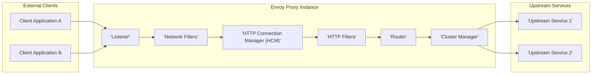

# Project Design Document: Envoy Proxy

**Version:** 1.1
**Date:** October 26, 2023
**Author:** AI Cloud & Security Architect

## 1. Introduction

This document provides an enhanced design overview of the Envoy Proxy, a high-performance, open-source edge and service proxy designed for modern cloud-native applications. It details Envoy's architecture, core components, and the flow of network traffic, specifically tailored to facilitate comprehensive threat modeling. This document serves as a blueprint for understanding Envoy's internal workings and identifying potential security vulnerabilities.

## 2. Goals and Objectives

The primary design goals of the Envoy Proxy project are centered around:

* **High Performance and Low Latency:**  Efficiently processing a high volume of network traffic with minimal delay.
* **Comprehensive Observability:** Providing rich and granular telemetry data, including metrics, distributed tracing, and detailed logging, for effective monitoring, debugging, and security analysis.
* **Dynamic Configuration and Extensibility:**  Supporting dynamic updates to its configuration without restarts and offering a robust filter chain architecture for extending functionality.
* **Enhanced Reliability and Resilience:** Ensuring stable and dependable operation in production environments, including features for health checking and circuit breaking.
* **Support for Modern Protocols:**  Native support for a wide array of contemporary application protocols, such as HTTP/2, gRPC, WebSocket, and HTTP/3.

## 3. High-Level Architecture

Envoy acts as a layer 7 proxy, strategically positioned between client applications and backend services. It intercepts incoming network requests, applies a series of configurable policies, and intelligently routes these requests to the appropriate upstream services.

## 4. Detailed Component Design

This section provides a more in-depth look at the key components within the Envoy Proxy architecture, highlighting their functionalities and security implications.

### 4.1. Listeners

* **Function:**  Listeners are responsible for binding to specified IP addresses and ports, actively listening for and accepting incoming network connections.
* **Configuration:**  Defined with a specific protocol type (e.g., HTTP, TCP, TLS), the network address and port to bind to, and an ordered chain of network filters that will process incoming connections.
* **Security Relevance:**  Listener configuration directly determines the network interfaces exposed by Envoy and the initial security measures applied to incoming connections. Misconfigurations can lead to unintended exposure.

### 4.2. Network Filters

* **Function:** Network filters operate at the transport layer (layers 3 and 4 of the OSI model), processing raw bytes of data flowing through a connection.
* **Examples:** TLS termination (handling encryption and decryption), TCP proxy (forwarding raw TCP streams), rate limiting at the connection level, and raw socket handling.
* **Configuration:**  An ordered list of filters applied sequentially to each connection accepted by a listener. The order is crucial as filters can depend on the actions of preceding filters.
* **Security Relevance:**  Critical for implementing fundamental security controls such as encryption (TLS), connection-level access control, and basic DoS protection. Vulnerabilities in network filters or their configuration can have significant security impacts.

### 4.3. HTTP Connection Manager (HCM)

* **Function:** The HCM is a network filter responsible for parsing and managing HTTP connections, supporting various HTTP versions (HTTP/1.1, HTTP/2, HTTP/3). It upgrades raw byte streams to HTTP-aware streams.
* **Configuration:** Configures HTTP-specific settings, including timeouts (idle, request, etc.), maximum header sizes, support for HTTP/2 and HTTP/3, and crucially, the chain of HTTP filters to be applied to requests and responses.
* **Security Relevance:**  Responsible for enforcing HTTP protocol compliance, mitigating HTTP-specific attacks (e.g., oversized headers), and setting the stage for application-level security policies implemented by HTTP filters.

### 4.4. HTTP Filters

* **Function:** HTTP filters operate at the application layer (layer 7), processing HTTP requests and responses. They enable complex transformations, routing decisions, policy enforcement, and observability enhancements.
* **Examples:** Authentication (verifying user identity), authorization (controlling access to resources), request and response modification (header injection, body transformation), content-based routing, traffic shadowing, and injecting custom logic.
* **Configuration:** An ordered list of filters applied sequentially to each HTTP request and response processed by the HCM. The order of filters is critical for correct policy enforcement.
* **Security Relevance:**  The primary mechanism for implementing application-level security policies within Envoy. Vulnerabilities in custom filters or misconfigurations in standard filters can introduce significant security risks.

### 4.5. Router

* **Function:** The router is an HTTP filter responsible for matching incoming requests to configured routes and selecting an appropriate upstream cluster to forward the request to.
* **Configuration:** Uses a routing configuration (often defined in a separate configuration file or through an API) that specifies rules based on various request attributes like headers, paths, methods, and query parameters.
* **Security Relevance:**  Incorrect or overly permissive routing configurations can lead to requests being routed to unintended or unauthorized backend services. This component is crucial for enforcing access control at the application level.

### 4.6. Cluster Manager

* **Function:** The cluster manager is responsible for managing the pool of upstream services (clusters) that Envoy can connect to. It handles service discovery, health checking, load balancing, and connection pooling for these upstream services.
* **Configuration:** Defines the endpoints (IP addresses and ports) of upstream service instances, the service discovery mechanism (e.g., static, DNS, service registry), health check configurations (active and passive), load balancing policies (e.g., round robin, least request), and connection pool settings (maximum connections, timeouts).
* **Security Relevance:**  Ensures secure and reliable connections to backend services. Proper configuration prevents routing to unhealthy or potentially compromised instances. Secure service discovery mechanisms are essential to prevent man-in-the-middle attacks.

### 4.7. Clusters

* **Function:** A cluster represents a logical grouping of identical upstream service instances that can handle requests.
* **Configuration:** Includes details about the service discovery type, health check settings (intervals, timeouts, health check paths), load balancing policy, TLS settings for connections to the upstream services, and outlier detection configurations.
* **Security Relevance:**  Proper cluster configuration is vital for ensuring requests are routed to healthy, authorized, and appropriately secured backend instances. TLS configuration within the cluster defines the security of communication with upstream services.

### 4.8. Endpoints

* **Function:** An endpoint represents a specific, addressable instance of an upstream service within a cluster (typically an IP address and port).
* **Configuration:** Endpoints are often discovered dynamically through the configured service discovery mechanism.
* **Security Relevance:**  Endpoints are the ultimate destination of requests. Ensuring secure communication channels (e.g., TLS with proper certificate validation) to these endpoints is paramount.

## 5. Data Flow

A typical request journey through Envoy follows these steps:

1. **Client Establishes a Connection:** A client application initiates a network connection to Envoy's configured listener address and port.
2. **Listener Accepts the Connection:** The designated listener accepts the incoming connection.
3. **Network Filters Process the Connection:** The configured chain of network filters is applied to the raw bytes of the connection. This might involve TLS handshake and termination.
4. **HTTP Connection Manager Handles the HTTP Stream:** The HCM takes over, parsing the raw byte stream into HTTP requests and responses.
5. **HTTP Filters Process the Request:** The ordered chain of HTTP filters is applied to the incoming HTTP request. This is where authentication, authorization, request modification, and other application-level policies are enforced.
6. **Router Matches the Request to a Route:** The router examines the request headers, path, and other attributes to match it against defined routing rules.
7. **Cluster Manager Selects an Upstream Host:** Based on the matched route and the configured load balancing policy for the target cluster, the cluster manager selects a healthy endpoint from the upstream cluster.
8. **Envoy Establishes Connection to Upstream (if necessary):** If a connection to the selected upstream host doesn't already exist in the connection pool, Envoy establishes a new connection, potentially using TLS based on the cluster configuration.
9. **Request is Forwarded to the Upstream Host:** Envoy forwards the processed HTTP request to the selected upstream host.
10. **Response is Received from the Upstream Host:** The upstream host processes the request and sends an HTTP response back to Envoy.
11. **HTTP Filters Process the Response:** The configured HTTP filter chain is applied to the outgoing HTTP response. This might involve response modification or logging.
12. **Network Filters Process the Response:** The network filter chain processes the response data before it's sent back to the client.
13. **Response is Sent Back to the Client:** Envoy sends the processed HTTP response back to the originating client application.

## 6. Security Considerations for Threat Modeling

This section highlights key security considerations relevant for threat modeling Envoy deployments:

* **TLS Configuration and Management:**
    * **Threat:** Weak TLS configurations, use of outdated protocols, improper certificate management, and exposure of private keys.
    * **Considerations:**  Strong cipher suites, regular certificate rotation, secure key storage (e.g., using secrets management systems), and enforcement of mutual TLS (mTLS) where appropriate.
* **Authentication and Authorization Mechanisms:**
    * **Threat:** Bypass of authentication or authorization checks, privilege escalation, and unauthorized access to backend services.
    * **Considerations:**  Robust authentication protocols (e.g., OAuth 2.0, OpenID Connect), fine-grained authorization policies, secure storage of credentials, and regular review of access controls.
* **Rate Limiting and DoS Protection:**
    * **Threat:**  Application-level and connection-level denial-of-service attacks, resource exhaustion.
    * **Considerations:**  Appropriate rate limiting configurations at various layers (connection, request), connection limits, request size limits, and timeouts to prevent resource exhaustion.
* **Observability and Security Monitoring:**
    * **Threat:**  Delayed detection of security incidents, difficulty in tracing malicious activity.
    * **Considerations:**  Comprehensive logging of requests, responses, and security-related events, integration with security information and event management (SIEM) systems, and implementation of distributed tracing for identifying attack paths.
* **Extensibility and Custom Filters:**
    * **Threat:**  Vulnerabilities introduced by custom-developed filters, insecure third-party filters.
    * **Considerations:**  Rigorous security review and testing of custom filters, secure development practices, and careful selection and validation of third-party extensions.
* **Configuration Security:**
    * **Threat:**  Unauthorized modification of Envoy's configuration leading to security breaches.
    * **Considerations:**  Secure storage and management of Envoy's configuration files (e.g., using version control, encryption at rest), access control for configuration updates, and validation of configuration changes.
* **Service Discovery Security:**
    * **Threat:**  Man-in-the-middle attacks during service discovery, routing to malicious endpoints.
    * **Considerations:**  Secure service discovery mechanisms (e.g., using authenticated and encrypted communication with service registries), and validation of discovered endpoints.
* **Supply Chain Security:**
    * **Threat:**  Compromised dependencies or build artifacts.
    * **Considerations:**  Regularly scanning dependencies for vulnerabilities, using trusted build pipelines, and verifying the integrity of Envoy binaries.

## 7. Deployment Considerations

Envoy's deployment strategy significantly impacts its security posture:

* **Sidecar Proxy (Service Mesh):** Deployed alongside each application instance, managing all ingress and egress traffic for that instance. This model enhances security by providing consistent policy enforcement and mTLS within the mesh.
* **Edge Proxy (API Gateway/Ingress Controller):** Deployed at the network edge to handle external traffic entering the system. This requires careful configuration of security policies to protect internal services from external threats.

## 8. Future Considerations

Ongoing development and potential future enhancements include:

* **Advanced Security Features:**  Integration with more sophisticated security protocols, such as WebAssembly-based security policies and advanced threat detection capabilities.
* **Enhanced Observability and Analytics:**  Further improvements in telemetry data collection and analysis for proactive security monitoring.
* **Performance and Efficiency Optimizations:**  Continuous efforts to improve Envoy's performance and resource utilization.
* **Support for Emerging Standards:**  Adapting to new network and application protocols and security best practices.

This enhanced design document provides a more detailed and security-focused overview of the Envoy Proxy architecture. This information is crucial for conducting thorough threat modeling and implementing appropriate security controls to protect applications and infrastructure utilizing Envoy.