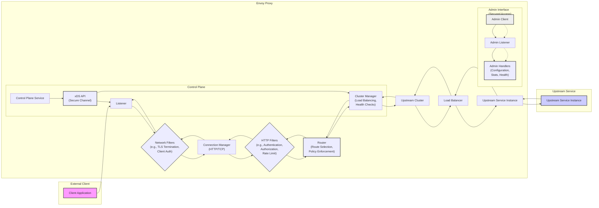

# Project Design Document: Envoy Proxy for Threat Modeling (Improved)

**Project Name:** Envoy Proxy

**Project Repository:** [https://github.com/envoyproxy/envoy](https://github.com/envoyproxy/envoy)

**Document Version:** 1.1

**Date:** 2023-10-27

**Author:** AI Cloud & Security Expert

## 1. Introduction

This document provides an enhanced design overview of the Envoy Proxy project, specifically tailored for security threat modeling. It details the architectural components, data flow, and key security considerations to facilitate a comprehensive threat analysis. This document is intended for security professionals and will serve as the primary input for subsequent threat modeling exercises. The focus is on identifying potential vulnerabilities and attack vectors within the Envoy Proxy ecosystem.

## 2. Project Overview

Envoy Proxy is a high-performance, open-source edge and service proxy designed for modern cloud-native applications. It functions as a universal data plane, offering critical functionalities including service discovery, intelligent load balancing, advanced traffic management, comprehensive observability, and robust security features.  Envoy is designed for deployment alongside application services, abstracting complex network functionalities and providing a consistent, secure, and observable network layer. Configuration is dynamically managed via xDS APIs from a Control Plane.

**Key Security Features:**

*   **TLS Termination and Origination:** Secure communication termination and initiation.
*   **Authentication and Authorization:**  Support for various authentication mechanisms (e.g., JWT, mTLS) and authorization policies.
*   **Rate Limiting:** Protection against denial-of-service attacks.
*   **Access Logging:** Detailed logging for security auditing and incident response.
*   **Security Filters:** Pluggable filters for implementing custom security logic.

## 3. Architectural Overview

Envoy's architecture is modular and event-driven, built around core components that interact to process network traffic. Understanding these components and their interactions is crucial for effective threat modeling.

*   **Listeners:** Entry points for network traffic, configured to listen on specific IP addresses and ports.
*   **Filter Chains:** Ordered lists of network filters applied to connections accepted by listeners.
*   **Connection Manager:** Handles protocol-specific processing (e.g., HTTP, TCP) after network filters.
*   **HTTP Filters:**  Ordered lists of filters applied to HTTP requests and responses within the Connection Manager.
*   **Router:**  Matches incoming requests to defined routes and directs them to upstream clusters.
*   **Clusters:**  Represent logical groupings of upstream service instances.
*   **Cluster Manager:** Manages upstream clusters, including discovery, load balancing, and health checking.
*   **Admin Interface:** A local HTTP interface for management, monitoring, and debugging.
*   **Control Plane (xDS):**  External system responsible for dynamically configuring Envoy via xDS APIs.

The following diagram illustrates the high-level architecture and data flow, emphasizing security-relevant components:

## 4. Key Components and Functionality (Security Focused)

### 4.1. Listeners

*   **Functionality:** Network entry points, responsible for accepting connections.
*   **Security Relevance:**  First line of defense. Misconfiguration can lead to exposure of internal services or denial of service.
*   **Threats:**
    *   **Unintended Exposure:** Binding to public interfaces when only internal access is required.
    *   **Port Misconfiguration:** Listening on privileged ports without proper permissions.
    *   **DoS:**  Resource exhaustion through excessive connection attempts if not properly rate-limited at the network filter level.

### 4.2. Network Filters

*   **Functionality:** Operate at the TCP/IP layer, processing raw data. Implement connection-level security features.
*   **Examples:** TLS termination, client certificate authentication, IP filtering, connection rate limiting.
*   **Security Relevance:** Critical for establishing secure connections and basic access control. Vulnerabilities can bypass security mechanisms.
*   **Threats:**
    *   **TLS Vulnerabilities:** Weak cipher suites, protocol downgrade attacks, improper certificate validation.
    *   **Authentication Bypass:** Flaws in client certificate authentication logic.
    *   **IP Spoofing:**  If IP-based filtering is solely relied upon without proper source IP validation.
    *   **DoS:**  Inefficient or vulnerable network filters causing performance degradation or crashes.

### 4.3. Connection Manager (HTTP/TCP)

*   **Functionality:** Protocol handling and connection management. Parses HTTP requests and responses, or manages raw TCP streams.
*   **Security Relevance:** Protocol parsing vulnerabilities can lead to request smuggling or other protocol-level attacks.
*   **Threats:**
    *   **HTTP Request Smuggling:** Exploiting discrepancies in how Envoy and upstream servers parse HTTP requests.
    *   **Protocol Confusion:**  Exploiting vulnerabilities by sending unexpected protocols.
    *   **Header Injection:**  Manipulating headers during parsing to bypass security checks.
    *   **DoS:**  Resource exhaustion through malformed requests or excessive connection multiplexing.

### 4.4. HTTP Filters

*   **Functionality:** Application-layer security and traffic manipulation. Implement authentication, authorization, routing, header manipulation, and more.
*   **Examples:** JWT authentication, external authorization, rate limiting, header-based routing, CORS policy enforcement.
*   **Security Relevance:** Enforce application-level security policies. Vulnerabilities or misconfigurations can directly compromise application security.
*   **Threats:**
    *   **Authentication Bypass:**  Flaws in authentication filter logic or configuration.
    *   **Authorization Bypass:**  Incorrectly configured authorization policies or vulnerabilities in authorization filters.
    *   **Injection Attacks:**  Vulnerabilities in filters that manipulate or process request/response bodies or headers (e.g., XSS, SQL injection if filters interact with databases).
    *   **Rate Limit Bypass:**  Circumventing rate limiting mechanisms due to filter misconfiguration or vulnerabilities.
    *   **CORS Bypass:**  Misconfigured CORS policies allowing unauthorized cross-origin access.

### 4.5. Router

*   **Functionality:**  Directs requests to upstream clusters based on route matching. Enforces routing policies.
*   **Security Relevance:** Controls traffic flow and access to upstream services. Misconfigurations can lead to unintended access or routing loops.
*   **Threats:**
    *   **Route Misconfiguration:**  Accidental exposure of sensitive upstream services due to overly permissive routes.
    *   **Routing Loops:**  Incorrect route configurations causing requests to loop indefinitely, leading to DoS.
    *   **Path Traversal:**  Vulnerabilities in route matching logic allowing access to unintended resources.
    *   **Policy Bypass:**  Circumventing security policies enforced at the route level due to misconfiguration.

### 4.6. Cluster Manager

*   **Functionality:** Manages upstream clusters, including service discovery, load balancing, and health checking.
*   **Security Relevance:**  Manages connections to upstream services. Misconfigurations can weaken security posture of upstream communication.
*   **Threats:**
    *   **Insecure Upstream Communication:**  Lack of TLS or authentication when connecting to upstream services.
    *   **Man-in-the-Middle (MITM) Attacks:**  If communication to upstream services is not properly secured.
    *   **Service Discovery Manipulation:**  Compromising service discovery mechanisms to redirect traffic to malicious endpoints.
    *   **Load Balancing Exploitation:**  Manipulating load balancing algorithms to target specific upstream instances for DoS or other attacks.

### 4.7. Upstream Clusters and Services

*   **Functionality:** Backend services that handle requests proxied by Envoy.
*   **Security Relevance:**  The ultimate target of many attacks. Envoy's security measures aim to protect these services. Their inherent security posture is also critical.
*   **Threats:**
    *   **Vulnerabilities in Upstream Services:**  Exploiting vulnerabilities in backend applications directly.
    *   **Data Breaches:**  Compromising upstream services to access sensitive data.
    *   **Lateral Movement:**  Using compromised upstream services to pivot to other parts of the infrastructure.

### 4.8. Admin Interface

*   **Functionality:** Local management and monitoring interface.
*   **Security Relevance:** Provides sensitive information and control. Unauthorized access is a high-severity vulnerability.
*   **Threats:**
    *   **Unauthorized Access:**  Gaining access to the Admin Interface without proper authentication.
    *   **Information Disclosure:**  Leaking sensitive configuration, statistics, or health information.
    *   **Configuration Manipulation:**  Modifying Envoy's configuration to weaken security or disrupt service.
    *   **Denial of Service:**  Using Admin Interface endpoints to overload Envoy.

### 4.9. Control Plane (xDS)

*   **Functionality:** Dynamically configures Envoy via xDS APIs.
*   **Security Relevance:**  Critical control point. Compromise can lead to widespread security breaches. Secure communication and authorization are paramount.
*   **Threats:**
    *   **Control Plane Compromise:**  Attacking the Control Plane itself to manipulate Envoy configurations.
    *   **xDS Channel Interception:**  Eavesdropping or tampering with xDS communication if not properly secured (e.g., lack of mTLS).
    *   **Configuration Injection:**  Injecting malicious configurations via xDS to redirect traffic, bypass security, or cause DoS.
    *   **Replay Attacks:**  Replaying old xDS configuration updates to revert to a vulnerable state.

## 5. Data Flow (Security Intersections)

The data flow highlights where security checks and transformations occur:

1.  **Client Request:** Client initiates a request.
2.  **Listener & Network Filters (Security Entry Point):** Listener accepts connection. Network filters (e.g., TLS termination, client auth) establish secure connection and perform initial access control.
3.  **Connection Manager:** Protocol handling. Potential for protocol-level attacks if vulnerabilities exist.
4.  **HTTP Filter Chain (Application Security Enforcement):** HTTP filters (authentication, authorization, rate limiting, etc.) enforce application-level security policies.
5.  **Router (Policy-Based Routing):** Routes requests based on configured policies, further controlling access.
6.  **Cluster Manager & Upstream Communication (Upstream Security):**  Establishes connection to upstream services. Security depends on configured upstream connection settings (e.g., TLS, authentication).
7.  **Upstream Service:** Request is processed by the backend service. Security depends on the upstream service's own security measures.
8.  **Response Flow (Reverse Path):** Response traverses back through filters and network layers, potentially undergoing transformations (e.g., response header manipulation).

## 6. Security Considerations for Threat Modeling (CIA Triad Focused)

When threat modeling Envoy Proxy, consider threats against the CIA Triad (Confidentiality, Integrity, Availability):

**Confidentiality:**

*   **Threats:** Information disclosure through Admin Interface, logging sensitive data, insecure upstream communication, TLS vulnerabilities, header leakage.
*   **Examples:** Unauthorized access to Admin Interface revealing configuration, logs exposing PII, unencrypted communication to upstream services exposing data in transit, weak TLS ciphers allowing eavesdropping.

**Integrity:**

*   **Threats:** Configuration manipulation via compromised Control Plane or Admin Interface, request/response tampering, routing manipulation, filter bypass leading to data modification.
*   **Examples:** Attacker modifying routes to redirect traffic to a malicious service, injecting malicious headers to alter application behavior, bypassing authorization filters to modify data, Control Plane compromise leading to widespread configuration changes.

**Availability:**

*   **Threats:** Denial-of-service attacks targeting Envoy itself or upstream services, routing loops, misconfigurations leading to service disruptions, vulnerabilities in filters causing crashes, Control Plane unavailability impacting Envoy configuration updates.
*   **Examples:**  DoS attacks exploiting vulnerabilities in network filters, routing loops causing resource exhaustion, misconfigured rate limits blocking legitimate traffic, Control Plane outage preventing Envoy from adapting to changes.

## 7. Actionable Threat Modeling Questions

To guide threat modeling exercises, consider these questions for each component and data flow stage:

**Listeners & Network Filters:**

*   Are listeners exposed unnecessarily?
*   Are network filters configured to prevent common network-level attacks (e.g., SYN flood)?
*   Is TLS properly configured with strong ciphers and certificate validation?
*   Is client authentication (if used) robust and correctly implemented?

**Connection Manager & HTTP Filters:**

*   Are there potential HTTP request smuggling vulnerabilities?
*   Are authentication and authorization filters correctly configured and effective?
*   Are input validation filters in place to prevent injection attacks?
*   Are rate limiting filters configured to protect against DoS?
*   Are custom filters thoroughly reviewed for security vulnerabilities?

**Router & Cluster Manager:**

*   Are routes configured to prevent unintended access to upstream services?
*   Are there potential routing loops?
*   Is communication to upstream services secured (e.g., mTLS)?
*   Is service discovery mechanism secure and resistant to manipulation?

**Admin Interface:**

*   Is the Admin Interface access strictly controlled and authenticated?
*   Is the Admin Interface exposed to untrusted networks?
*   Are there any sensitive endpoints exposed on the Admin Interface that could leak information?

**Control Plane (xDS):**

*   Is the communication channel between Control Plane and Envoy secured (e.g., mTLS)?
*   Is the Control Plane properly authenticated and authorized to configure Envoy?
*   Are there mechanisms to prevent malicious configuration injection via xDS?
*   Is the Control Plane itself secured against compromise?

## 8. Conclusion

This improved design document provides a more security-focused and actionable overview of Envoy Proxy for threat modeling. By focusing on key components, data flow, security considerations within the CIA triad, and actionable threat modeling questions, security professionals can conduct a more effective and comprehensive threat analysis. This document should be used as a living document, updated as the Envoy Proxy project evolves and new security insights emerge.  Further analysis should involve deep dives into specific filter configurations, xDS implementation details, and the security posture of the surrounding infrastructure.