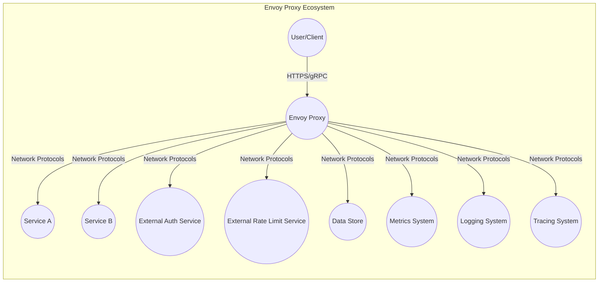
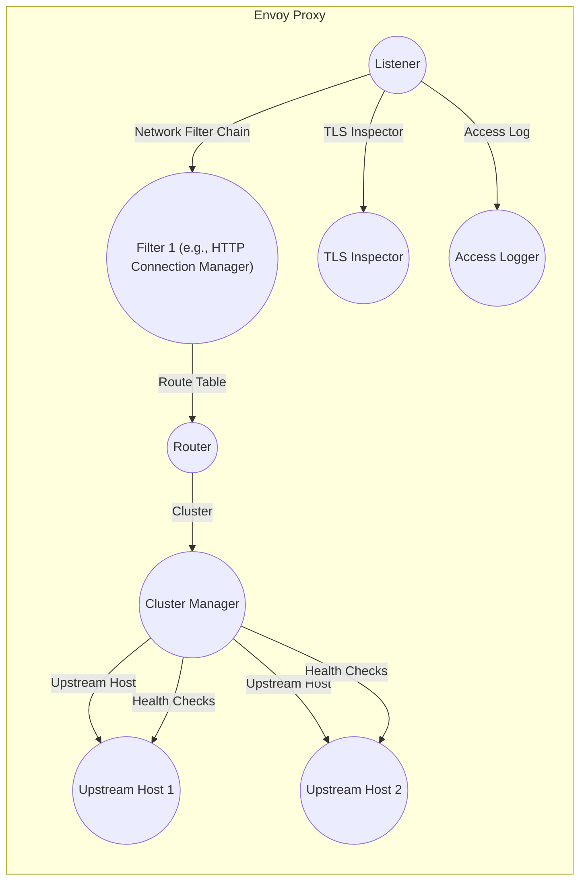
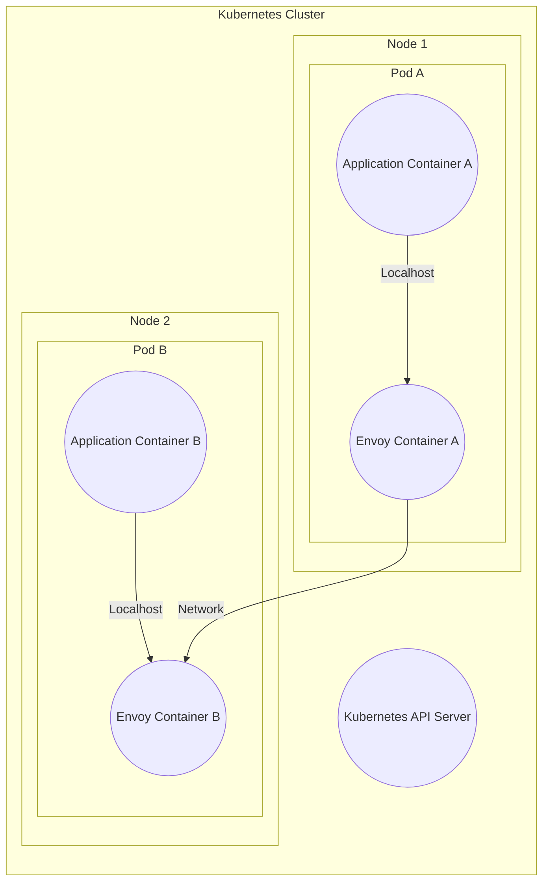
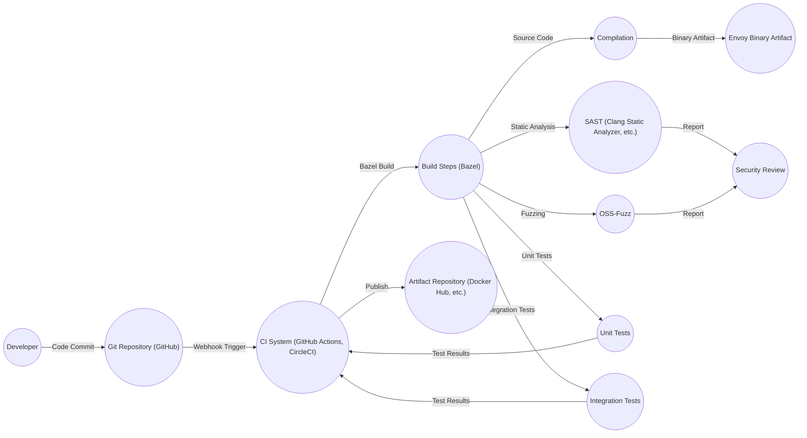

Okay, let's create a design document for the Envoy Proxy project, keeping in mind its purpose and potential deployment contexts. I will follow the instructions precisely.

# BUSINESS POSTURE

Envoy is a high-performance, open-source edge and service proxy, designed for cloud-native applications.  It's often used as a foundational component in microservice architectures, handling network traffic between services.

Business Priorities and Goals:

*   Reliability: Envoy must operate reliably with minimal downtime, as it's often in the critical path for application traffic.
*   Performance:  Low latency and high throughput are essential, as Envoy's performance directly impacts the performance of the applications it serves.
*   Scalability: Envoy needs to scale horizontally to handle increasing traffic loads.
*   Observability:  Detailed metrics, logging, and tracing are crucial for monitoring and troubleshooting.
*   Extensibility:  The ability to extend Envoy's functionality through filters and plugins is a key feature.
*   Security:  Protecting sensitive data in transit and providing robust access control are paramount.
*   Operability: Easy to configure, deploy, and manage.

Most Important Business Risks:

*   Service disruption due to Envoy misconfiguration or failure.
*   Performance bottlenecks impacting application responsiveness.
*   Security vulnerabilities exposing sensitive data or allowing unauthorized access.
*   Inability to scale to meet peak demand.
*   Lack of visibility into traffic patterns, hindering troubleshooting and optimization.
*   Supply chain attacks.

# SECURITY POSTURE

Existing Security Controls (as gleaned from the repository and general knowledge of the project):

*   security control: Secure Development Practices: The Envoy project follows secure coding practices, including code reviews, static analysis, and fuzzing (OSS-Fuzz integration). Implemented in development process and CI pipelines.
*   security control: TLS/SSL Support: Envoy provides robust support for TLS/SSL encryption, including certificate management, SNI, and ALPN. Described in documentation and configuration examples.
*   security control: Access Control: Envoy supports various access control mechanisms, including RBAC (Role-Based Access Control) filters, JWT validation, and external authorization integration. Described in documentation and configuration examples.
*   security control: Rate Limiting: Envoy can be configured to enforce rate limits, protecting against denial-of-service attacks. Described in documentation and configuration examples.
*   security control: Input Validation: Envoy performs input validation on configuration files and incoming requests to prevent injection attacks. Implemented in core code and filter implementations.
*   security control: Regular Security Audits: The project undergoes periodic security audits by third-party firms.
*   security control: Active Community and Vulnerability Reporting: A large and active community contributes to identifying and fixing security issues. A clear vulnerability reporting process is in place.
*   security control: Sandboxing: Some extensions are designed to run in sandboxed environments (e.g., WebAssembly).

Accepted Risks:

*   accepted risk: Complexity of Configuration: Envoy's configuration can be complex, increasing the risk of misconfiguration that could lead to security vulnerabilities.
*   accepted risk: Reliance on Third-Party Libraries: Envoy depends on external libraries, which could introduce vulnerabilities.
*   accepted risk: Potential for Zero-Day Exploits: As with any software, there's always a risk of undiscovered vulnerabilities.

Recommended Security Controls:

*   Network Segmentation: Deploy Envoy instances in segmented networks to limit the impact of potential breaches.
*   Intrusion Detection/Prevention Systems (IDS/IPS): Integrate with IDS/IPS to detect and block malicious traffic.
*   Regular Penetration Testing: Conduct regular penetration tests to identify vulnerabilities.
*   Secrets Management: Integrate with a secure secrets management solution (e.g., HashiCorp Vault) to protect sensitive configuration data.
*   Supply Chain Security: Implement robust supply chain security measures to verify the integrity of Envoy builds and dependencies.

Security Requirements:

*   Authentication:
    *   Support for mutual TLS (mTLS) to authenticate clients and servers.
    *   Integration with identity providers (IdPs) for user authentication (e.g., OAuth 2.0, OpenID Connect).
    *   Support for JWT validation.
*   Authorization:
    *   Fine-grained access control based on roles, attributes, and other criteria.
    *   Integration with external authorization services.
    *   Support for RBAC and ABAC (Attribute-Based Access Control).
*   Input Validation:
    *   Strict validation of all incoming data, including headers, query parameters, and request bodies.
    *   Protection against common web vulnerabilities (e.g., XSS, SQL injection, CSRF).
*   Cryptography:
    *   Use of strong cryptographic algorithms and protocols (e.g., TLS 1.3, AES-256).
    *   Secure key management practices.
    *   Support for hardware security modules (HSMs).

# DESIGN

## C4 CONTEXT

Element Descriptions:

*   Element:
    *   Name: User/Client
    *   Type: External Entity (Person or System)
    *   Description: Represents an end-user or another system initiating requests that are handled by Envoy.
    *   Responsibilities: Initiates requests to services.
    *   Security Controls: May use TLS/SSL for secure communication.

*   Element:
    *   Name: Envoy Proxy
    *   Type: System
    *   Description: The core Envoy proxy instance, handling traffic routing, filtering, and observability.
    *   Responsibilities: Traffic management, load balancing, service discovery, health checking, authentication, authorization, rate limiting, observability.
    *   Security Controls: TLS/SSL termination, access control, input validation, rate limiting, JWT validation, external authorization integration.

*   Element:
    *   Name: Service A
    *   Type: System
    *   Description: A backend service that Envoy routes traffic to.
    *   Responsibilities: Provides specific application functionality.
    *   Security Controls: Application-specific security controls.

*   Element:
    *   Name: Service B
    *   Type: System
    *   Description: Another backend service that Envoy routes traffic to.
    *   Responsibilities: Provides specific application functionality.
    *   Security Controls: Application-specific security controls.

*   Element:
    *   Name: External Auth Service
    *   Type: System
    *   Description: An external service used for authentication and authorization.
    *   Responsibilities: Authenticates users/services and provides authorization decisions.
    *   Security Controls: Secure communication with Envoy, robust authentication and authorization mechanisms.

*   Element:
    *   Name: External Rate Limit Service
    *   Type: System
    *   Description: An external service used for rate limiting.
    *   Responsibilities: Provides rate limiting decisions.
    *   Security Controls: Secure communication with Envoy.

*   Element:
    *   Name: Data Store
    *   Type: System
    *   Description: A database or other data storage system used by backend services.
    *   Responsibilities: Stores and retrieves data.
    *   Security Controls: Data encryption at rest and in transit, access control.

*   Element:
    *   Name: Metrics System
    *   Type: System
    *   Description: A system for collecting and storing metrics (e.g., Prometheus).
    *   Responsibilities: Collects, stores, and provides access to metrics.
    *   Security Controls: Secure communication with Envoy.

*   Element:
    *   Name: Logging System
    *   Type: System
    *   Description: A system for collecting and storing logs (e.g., ELK stack, Splunk).
    *   Responsibilities: Collects, stores, and provides access to logs.
    *   Security Controls: Secure communication with Envoy.

*   Element:
    *   Name: Tracing System
    *   Type: System
    *   Description: A system for distributed tracing (e.g., Jaeger, Zipkin).
    *   Responsibilities: Collects and visualizes traces.
    *   Security Controls: Secure communication with Envoy.

## C4 CONTAINER

Element Descriptions:

*   Element:
    *   Name: Listener
    *   Type: Container
    *   Description: Listens for incoming connections on a specific port and protocol.
    *   Responsibilities: Accepts connections, handles TLS termination, initiates filter chain processing.
    *   Security Controls: TLS configuration, certificate management.

*   Element:
    *   Name: Network Filter Chain
    *   Type: Container
    *   Description: A chain of network-level filters that process incoming requests.
    *   Responsibilities: Performs tasks like TLS inspection, access logging, and connection management.
    *   Security Controls: Filter-specific security controls (e.g., TLS Inspector).

*   Element:
    *   Name: Filter 1 (e.g., HTTP Connection Manager)
    *   Type: Container
    *   Description: An example filter, such as the HTTP Connection Manager, which handles HTTP-specific processing.
    *   Responsibilities: Parses HTTP requests, manages connections, interacts with the router.
    *   Security Controls: HTTP-specific security controls (e.g., header sanitization, request validation).

*   Element:
    *   Name: Router
    *   Type: Container
    *   Description: Determines which upstream cluster to route a request to based on the route table.
    *   Responsibilities: Matches requests to routes, selects an upstream cluster.
    *   Security Controls: Route configuration, access control based on routes.

*   Element:
    *   Name: Cluster Manager
    *   Type: Container
    *   Description: Manages connections to upstream hosts within a cluster.
    *   Responsibilities: Load balancing, health checking, circuit breaking.
    *   Security Controls: Upstream TLS configuration, health check configuration.

*   Element:
    *   Name: Upstream Host 1
    *   Type: Container
    *   Description: An instance of a backend service.
    *   Responsibilities: Handles requests from Envoy.
    *   Security Controls: Application-specific security controls.

*   Element:
    *   Name: Upstream Host 2
    *   Type: Container
    *   Description: Another instance of a backend service.
    *   Responsibilities: Handles requests from Envoy.
    *   Security Controls: Application-specific security controls.

*   Element:
    *   Name: TLS Inspector
    *   Type: Container
    *   Description: Inspects TLS connections to extract information like SNI.
    *   Responsibilities: Examines TLS handshakes.
    *   Security Controls: TLS configuration.

*   Element:
    *   Name: Access Logger
    *   Type: Container
    *   Description: Logs information about incoming requests.
    *   Responsibilities: Records request details.
    *   Security Controls: Configuration of logged data, secure storage of logs.

## DEPLOYMENT

Possible Deployment Solutions:

1.  Standalone Proxy: Envoy running as a standalone process on a virtual machine or bare-metal server.
2.  Sidecar Proxy: Envoy running alongside an application container within a pod in Kubernetes.
3.  Gateway Proxy: Envoy running as an edge proxy at the entry point of a network (e.g., Kubernetes Ingress).
4.  Service Mesh: Envoy deployed as part of a service mesh (e.g., Istio, Linkerd, Consul Connect).

Chosen Solution (for detailed description): Sidecar Proxy in Kubernetes

Element Descriptions:

*   Element:
    *   Name: Kubernetes Cluster
    *   Type: Deployment Environment
    *   Description: The Kubernetes cluster where the application and Envoy are deployed.
    *   Responsibilities: Orchestrates container deployment, scaling, and management.
    *   Security Controls: Kubernetes RBAC, network policies, pod security policies.

*   Element:
    *   Name: Node 1
    *   Type: Node
    *   Description: A worker node in the Kubernetes cluster.
    *   Responsibilities: Runs pods.
    *   Security Controls: Node-level security configurations.

*   Element:
    *   Name: Node 2
    *   Type: Node
    *   Description: Another worker node in the Kubernetes cluster.
    *   Responsibilities: Runs pods.
    *   Security Controls: Node-level security configurations.

*   Element:
    *   Name: Pod A
    *   Type: Pod
    *   Description: A Kubernetes pod containing the application container and the Envoy sidecar container.
    *   Responsibilities: Runs the application and its associated proxy.
    *   Security Controls: Pod-level security contexts.

*   Element:
    *   Name: Pod B
    *   Type: Pod
    *   Description: Another Kubernetes pod with a similar setup.
    *   Responsibilities: Runs the application and its associated proxy.
    *   Security Controls: Pod-level security contexts.

*   Element:
    *   Name: Application Container A
    *   Type: Container
    *   Description: The container running the application code.
    *   Responsibilities: Handles application logic.
    *   Security Controls: Application-specific security controls.

*   Element:
    *   Name: Application Container B
    *   Type: Container
    *   Description: The container running the application code.
    *   Responsibilities: Handles application logic.
    *   Security Controls: Application-specific security controls.

*   Element:
    *   Name: Envoy Container A
    *   Type: Container
    *   Description: The Envoy proxy container running as a sidecar.
    *   Responsibilities: Handles network traffic for the application container.
    *   Security Controls: Envoy's security features (TLS, access control, etc.).

*   Element:
    *   Name: Envoy Container B
    *   Type: Container
    *   Description: The Envoy proxy container running as a sidecar.
    *   Responsibilities: Handles network traffic for the application container.
    *   Security Controls: Envoy's security features (TLS, access control, etc.).

*   Element:
    *   Name: Kubernetes API Server
    *   Type: System
    *   Description: The control plane component for Kubernetes.
    *   Responsibilities: Manages the cluster state.
    *   Security Controls: Authentication and authorization for API access.

## BUILD

Envoy uses a sophisticated build system based on Bazel. The build process is highly automated and includes numerous security checks.

Build Process Description:

1.  Developers commit code to the GitHub repository.
2.  A webhook triggers the CI system (GitHub Actions and CircleCI are used).
3.  The CI system initiates a Bazel build.
4.  Bazel orchestrates the build steps, including:
    *   Compilation of the source code.
    *   Static analysis using tools like Clang Static Analyzer.
    *   Fuzzing using OSS-Fuzz.
    *   Execution of unit and integration tests.
5.  The results of the security checks (SAST and fuzzing) are reviewed.
6.  If all checks pass, the build produces an Envoy binary artifact.
7.  The CI system publishes the artifact to a repository (e.g., Docker Hub).

Security Controls in Build Process:

*   security control: Static Analysis (SAST): Automated static analysis tools are used to identify potential vulnerabilities in the code.
*   security control: Fuzzing: OSS-Fuzz is integrated to continuously fuzz Envoy and find potential crashes and vulnerabilities.
*   security control: Unit and Integration Tests: Extensive test suites ensure code correctness and prevent regressions.
*   security control: Build Automation: The entire build process is automated, reducing the risk of manual errors.
*   security control: Dependency Management: Bazel manages dependencies and helps ensure that only approved versions are used.
*   security control: Code Review: All code changes are reviewed by other developers before being merged.

# RISK ASSESSMENT

Critical Business Processes:

*   Service-to-service communication within a microservices architecture.
*   Ingress traffic handling for applications.
*   Secure communication between clients and services.

Data Sensitivity:

*   Data in transit: This can include highly sensitive data, such as personally identifiable information (PII), financial data, and authentication credentials. The sensitivity depends on the specific applications using Envoy.
*   Configuration data: Envoy's configuration files may contain secrets, such as TLS certificates and API keys.
*   Logs and metrics: While not always directly sensitive, logs and metrics can reveal information about application behavior and traffic patterns, which could be exploited by attackers.

# QUESTIONS & ASSUMPTIONS

Questions:

*   What specific compliance requirements (e.g., PCI DSS, HIPAA) apply to the environments where Envoy will be deployed?
*   What are the specific threat models for the applications that will be using Envoy?
*   What are the existing security controls in the target deployment environments (e.g., network firewalls, intrusion detection systems)?
*   What is the process for managing and rotating secrets used by Envoy?
*   What level of access will different teams/individuals have to Envoy's configuration?

Assumptions:

*   BUSINESS POSTURE: The organization has a moderate to high risk aversion, given Envoy's critical role in application infrastructure.
*   SECURITY POSTURE: There is a dedicated security team responsible for reviewing and approving Envoy configurations.
*   DESIGN: Envoy will be deployed primarily as a sidecar proxy in a Kubernetes environment, although other deployment models may also be used. The organization uses a modern CI/CD pipeline with automated security checks.