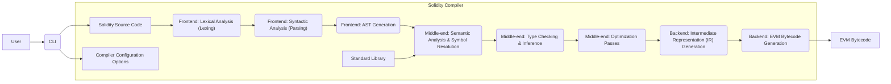
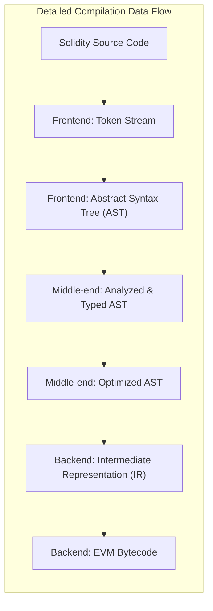

## Project Design Document: Solidity Compiler (Improved)

**1. Introduction**

This document provides an enhanced architectural overview of the Solidity compiler project, as found in the GitHub repository [https://github.com/ethereum/solidity](https://github.com/ethereum/solidity). This improved document aims to provide a more detailed and precise description of the compiler's components and processes, making it a more effective foundation for subsequent threat modeling activities. It outlines the key components, data flow, and technologies involved in the compilation process with greater clarity and specificity.

**2. Project Overview**

The Solidity compiler is a critical piece of infrastructure for the Ethereum ecosystem. It translates human-readable Solidity source code into bytecode executable by the Ethereum Virtual Machine (EVM). The compiler's complexity necessitates a thorough understanding of its architecture to effectively identify and mitigate potential security vulnerabilities. This document expands on the previous version by providing more granular details about each stage of the compilation process.

**3. Architectural Overview**

The Solidity compiler employs a multi-stage architecture, each with specific responsibilities in transforming source code into executable bytecode.

*   **Frontend:** Responsible for the initial processing of the Solidity source code, including lexical analysis and syntactic parsing to construct an Abstract Syntax Tree (AST).
*   **Middle-end:** Performs in-depth analysis of the AST, including semantic checks, type resolution, and various optimization passes to improve the efficiency and correctness of the code.
*   **Backend:** Translates the optimized AST into EVM bytecode, the low-level instructions understood by the Ethereum Virtual Machine.
*   **Standard Library Interface:** Provides access to pre-compiled Solidity contracts and utility functions that can be incorporated into user code. The compiler needs to resolve and integrate these libraries.
*   **Command-Line Interface (CLI):** The primary user interface for interacting with the compiler, allowing users to specify input files, compiler options, and output destinations.
*   **Build System:**  The set of tools and scripts used to compile the Solidity compiler itself from its source code.

**4. Detailed Component Description**

*   **Frontend:**
    *   **Lexical Analysis (Lexing):**  Scans the input Solidity source code character by character, grouping them into meaningful units called tokens (e.g., keywords, identifiers, operators).
    *   **Syntactic Analysis (Parsing):** Takes the stream of tokens from the lexer and structures them according to the grammar rules of the Solidity language, verifying the code's syntax.
    *   **AST Generation:**  Constructs an Abstract Syntax Tree (AST), a hierarchical representation of the program's structure, capturing the relationships between different code elements.

*   **Middle-end:**
    *   **Semantic Analysis & Symbol Resolution:** Analyzes the meaning of the code, ensuring that variables are declared, functions are defined, and that all symbols are correctly resolved within their scope.
    *   **Type Checking & Inference:** Verifies that the types used in the code are consistent and valid according to Solidity's type system. It may also infer types where they are not explicitly specified.
    *   **Optimization Passes:** Applies various transformations to the AST to improve the performance and efficiency of the generated bytecode. These can include:
        *   Constant folding
        *   Dead code elimination
        *   Inlining
        *   Other EVM-specific optimizations

*   **Backend:**
    *   **Intermediate Representation (IR) Generation:**  Translates the optimized AST into an intermediate representation (IR), which is a lower-level representation of the code that is easier to translate into machine code. (The specific IR used by Solidity should be investigated further).
    *   **EVM Bytecode Generation:**  Generates the final EVM bytecode from the intermediate representation. This involves mapping Solidity language constructs and IR operations to specific EVM opcodes.

*   **Standard Library Interface:**
    *   Provides a mechanism for the compiler to locate and integrate pre-compiled contracts and functions from the Solidity standard library.
    *   This involves resolving dependencies and ensuring that the correct bytecode for library functions is included or linked.

*   **Command-Line Interface (CLI):**
    *   Provides a command-line interface for users to interact with the compiler.
    *   Accepts various options, including:
        *   Input file paths
        *   Output directory specifications
        *   Optimization level settings
        *   EVM version targets
        *   Metadata settings
        *   Static analysis options
    *   Handles the overall compilation process based on user-provided options.

*   **Build System:**
    *   Utilizes tools like CMake to manage the build process across different platforms.
    *   Defines dependencies on external libraries (e.g., Boost).
    *   Specifies the compilation steps for each component of the compiler.
    *   May involve scripts for code generation or other build-time tasks.

**5. Data Flow**

The compilation process involves a sequential flow of data transformations through the compiler's components:

*   The user provides Solidity source code and configuration options to the CLI.
*   The CLI passes the source code to the Frontend.
*   The Frontend performs lexical and syntactic analysis, generating an AST.
*   The AST is passed to the Middle-end for semantic analysis, type checking, and optimization. The Middle-end may interact with the Standard Library interface to resolve dependencies.
*   The optimized AST is then passed to the Backend.
*   The Backend generates an intermediate representation (IR).
*   The IR is used to generate the final EVM bytecode.
*   The generated bytecode is the primary output of the compilation process.

**6. Technologies and Dependencies**

The Solidity compiler relies on several technologies and external libraries:

*   **Primary Programming Language:** C++
*   **Build System:** CMake
*   **Lexer Generator:** Potentially a custom-built lexer or a tool like Flex. (Needs verification from the codebase).
*   **Parser Generator:** Potentially a custom-built parser or a tool like Bison. (Needs verification from the codebase).
*   **Boost Libraries:** Used extensively for various utilities, data structures, and algorithms. Specific Boost libraries used should be identified (e.g., `boost::filesystem`, `boost::optional`).
*   **Potentially LLVM:** While historically having its own backend, the Solidity compiler might integrate with LLVM for certain optimization passes or for supporting different target architectures in the future. This needs investigation.
*   **Potentially z3:** Used for formal verification and static analysis features within the compiler. This needs investigation.

**7. Security Considerations (More Specific)**

This section provides more specific security considerations for each component, relevant for threat modeling:

*   **Frontend:**
    *   **Lexer vulnerabilities:**  Potential for denial-of-service through maliciously crafted input that causes excessive resource consumption during tokenization.
    *   **Parser vulnerabilities:**  Susceptibility to stack overflows or other memory corruption issues due to deeply nested or malformed code structures.
    *   **Injection attacks:**  Although less direct, vulnerabilities here could potentially influence later stages if not handled correctly.

*   **Middle-end:**
    *   **Semantic analysis bypasses:**  Flaws in semantic checks could allow invalid or unsafe code to proceed to later stages.
    *   **Type confusion vulnerabilities:**  Errors in type checking could lead to incorrect assumptions about data types, potentially causing unexpected behavior or security issues.
    *   **Optimizer bugs:**  Introduction of vulnerabilities through incorrect or unsafe optimizations (e.g., incorrect assumptions leading to out-of-bounds access).

*   **Backend:**
    *   **Incorrect bytecode generation:**  Mapping errors from the IR to EVM opcodes could result in bytecode that behaves differently than intended, potentially leading to vulnerabilities.
    *   **Gas cost miscalculations:**  Errors in estimating gas costs during bytecode generation could lead to denial-of-service vulnerabilities.
    *   **Reentrancy vulnerabilities:**  The backend must correctly handle constructs that can lead to reentrancy issues in the generated bytecode.

*   **Standard Library Interface:**
    *   **Vulnerabilities in standard library contracts:**  If the compiler relies on vulnerable standard library contracts, user contracts using them will also be vulnerable.
    *   **Incorrect linking or inclusion of library code:**  Errors in how the compiler integrates standard library code could lead to unexpected behavior.

*   **Command-Line Interface (CLI):**
    *   **Command injection vulnerabilities:**  If the CLI improperly handles user-provided input, it could be susceptible to command injection attacks.
    *   **Path traversal vulnerabilities:**  Improper handling of file paths could allow attackers to access or overwrite arbitrary files.

*   **Build System:**
    *   **Supply chain attacks:**  Compromised dependencies or build tools could introduce malicious code into the compiler itself.
    *   **Insecure build configurations:**  Incorrectly configured build settings could introduce vulnerabilities.

**8. Future Considerations**

*   Detailed diagrams illustrating the internal workings of each major component (Frontend, Middle-end, Backend).
*   Comprehensive documentation of the intermediate representation (IR) used by the compiler.
*   Analysis of specific data structures and algorithms used within each component.
*   Detailed mapping of source code modules to the architectural components.
*   In-depth analysis of external interfaces and dependencies, including specific versions and potential vulnerabilities.
*   Exploration of static analysis tools and techniques integrated into the compiler.

This improved design document provides a more comprehensive and detailed understanding of the Solidity compiler's architecture, enhancing its value as a foundation for thorough threat modeling activities. The increased granularity and specificity in the component descriptions and security considerations will facilitate a more effective identification and mitigation of potential security risks.
