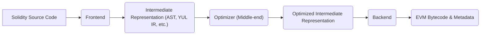

## Project Design Document: Solidity Compiler

**Document Version:** 1.1
**Date:** October 26, 2023
**Author:** AI Software Architecture Expert

### 1. Introduction

This document provides a detailed design overview of the Solidity compiler project, as represented by the codebase at [https://github.com/ethereum/solidity](https://github.com/ethereum/solidity). This document aims to capture the key architectural components, data flows, and technologies involved in the compilation process. It will serve as a foundation for subsequent threat modeling activities, providing the necessary context to identify potential vulnerabilities.

### 2. Goals

The primary goals of the Solidity compiler are:

*   To accurately and efficiently translate Solidity source code into Ethereum Virtual Machine (EVM) bytecode, ensuring the generated bytecode behaves as intended by the source code.
*   To provide developers with a robust, reliable, and well-documented toolchain for creating secure and functional smart contracts.
*   To offer various levels of optimization, allowing developers to fine-tune the balance between gas costs, deployment size, and execution speed based on their specific needs.
*   To provide comprehensive and informative error and warning messages during compilation, enabling developers to identify and rectify issues in their code effectively.
*   To maintain an extensible and modular architecture, facilitating the incorporation of new language features, support for evolving EVM versions, and integration with other tools.

### 3. Scope

This design document focuses on the core compilation process within the Solidity compiler. It covers the major stages from the initial input of source code to the final output of EVM bytecode and associated metadata. The scope includes:

*   The overall layered architecture of the compiler, highlighting the distinct phases of compilation.
*   Detailed descriptions of the key components within each phase and their specific responsibilities.
*   The detailed flow of data and transformations applied at each stage of the compilation pipeline.
*   The primary technologies, libraries, and external dependencies utilized by the compiler.

This document does not cover:

*   The formal specification of the Solidity programming language itself.
*   The low-level details of the Ethereum Virtual Machine (EVM) instruction set.
*   In-depth explanations of specific optimization algorithms implemented within the optimizer.
*   The detailed implementation of the compiler's testing framework and testing methodologies.
*   The processes involved in building, packaging, and deploying the Solidity compiler itself.

### 4. High-Level Architecture

The Solidity compiler employs a multi-phase architecture, characteristic of many modern compilers. This design promotes modularity and allows for focused development and optimization of each stage. The main phases are:

*   **Frontend:**  Parses the Solidity source code and constructs an initial representation of the program.
*   **Middle-end (Optimizer):**  Analyzes and transforms the intermediate representation to improve the efficiency and cost-effectiveness of the generated bytecode.
*   **Backend:**  Generates the final EVM bytecode from the optimized intermediate representation, along with necessary metadata.

### 5. Component Details

This section provides a more detailed breakdown of the key components within each phase, outlining their specific functions and interactions.

#### 5.1. Frontend

The frontend is responsible for understanding the input Solidity code and converting it into a structured, machine-readable format.

*   **Lexer (Scanner):**
    *   Scans the input source code character by character.
    *   Groups characters into tokens (e.g., keywords, identifiers, operators, literals).
    *   Identifies and reports lexical errors such as invalid characters or malformed tokens.
    *   Example: Transforming `"contract MyContract {"` into tokens like `"keyword 'contract'"`, `"identifier 'MyContract'"`, `"punctuation '{'"`.
*   **Parser:**
    *   Takes the stream of tokens from the lexer as input.
    *   Constructs an Abstract Syntax Tree (AST) based on the grammar rules of the Solidity language.
    *   Enforces the syntactic structure of the language.
    *   Identifies and reports syntax errors, such as missing semicolons or mismatched parentheses.
    *   Example: Organizing tokens into a tree structure representing the contract definition, function declarations, and statements.
*   **Semantic Analyzer:**
    *   Traverses the AST to perform static analysis and ensure the code adheres to the semantic rules of Solidity.
    *   Checks type compatibility of expressions, validates variable declarations, and verifies function call signatures.
    *   Performs name resolution, associating identifiers with their declarations.
    *   Identifies and reports semantic errors and warnings, such as undeclared variables or type mismatches.
    *   Example: Ensuring that a variable used in an expression has been declared with a compatible type.
*   **Type Checker:**
    *   Specifically focuses on verifying the types of expressions and variables throughout the code.
    *   Enforces strong typing rules and handles implicit and explicit type conversions.
    *   Ensures that operations are performed on compatible data types.
    *   Example: Checking if the arguments passed to a function match the declared parameter types.
*   **Resolver:**
    *   Manages the resolution of symbolic names and dependencies between different parts of the codebase, including imported files and contract inheritance.
    *   Ensures that all references to contracts, libraries, and other program elements are valid.
    *   Example: Locating the definition of an imported contract or library.

#### 5.2. Middle-end (Optimizer)

The optimizer aims to improve the efficiency of the generated bytecode by applying various transformations to the intermediate representation.

*   **IR (Intermediate Representation) Generator:**
    *   Transforms the AST (or a semantically enriched version of it) into one or more intermediate representations suitable for optimization.
    *   Common IRs used include Static Single Assignment (SSA) form or a specialized IR like YUL IR.
    *   This stage lowers the level of abstraction, making the code more amenable to optimization passes.
    *   Example: Converting high-level Solidity constructs into lower-level operations in YUL IR.
*   **Optimization Passes:**
    *   A collection of algorithms and transformations applied sequentially or iteratively to the IR.
    *   Each pass focuses on a specific type of optimization.
    *   Examples of optimization passes include:
        *   **Constant Folding:** Evaluating constant expressions at compile time.
        *   **Dead Code Elimination:** Removing code that has no effect on the program's output.
        *   **Common Subexpression Elimination:** Identifying and reusing the results of identical computations.
        *   **Inlining:** Replacing function calls with the body of the called function.
        *   **Jump Threading:** Optimizing control flow by eliminating unnecessary jumps.
        *   **SSTORE/SLOAD Optimization:** Reducing the cost of storage operations.
    *   The specific optimization passes applied and their order can be configured.
*   **Control Flow Graph (CFG) Builder:**
    *   Constructs a representation of the control flow within functions, depicting the possible execution paths.
    *   Used by various optimization passes that rely on analyzing the flow of execution.
    *   Example: Representing conditional statements and loops as branches and cycles in the graph.

#### 5.3. Backend

The backend is responsible for generating the final EVM bytecode and associated metadata.

*   **Code Generator:**
    *   Translates the optimized intermediate representation (often YUL IR) into a sequence of EVM opcodes.
    *   Handles register allocation and memory management within the constraints of the EVM.
    *   Implements the mapping between IR instructions and EVM opcodes.
    *   Example: Converting a YUL `add` instruction into the corresponding EVM `ADD` opcode.
*   **Bytecode Assembler:**
    *   Assembles the generated opcodes into the final raw bytecode.
    *   Resolves symbolic addresses and performs necessary linking operations.
    *   May involve encoding opcode arguments and creating the final byte sequence.
*   **Metadata Generator:**
    *   Generates metadata associated with the compiled contract, providing information for deployment and interaction.
    *   Key components of the metadata include:
        *   **ABI (Application Binary Interface):**  Describes the functions and events of the contract, enabling interaction with external entities.
        *   **Compiler Version Information:**  Indicates the version of the Solidity compiler used.
        *   **Storage Layout:**  Details the organization of contract storage variables.
        *   **License Information:**  Specifies the license under which the contract is released.
    *   This metadata is often appended to the bytecode or stored separately.
*   **Gas Estimator:**
    *   Estimates the gas cost of deploying and executing the contract based on the generated bytecode.
    *   This estimation is crucial for developers to understand the cost implications of their contracts.
    *   The accuracy of the gas estimation can vary depending on the complexity of the code and the EVM version.

### 6. Data Flow

The data progresses through the compiler in a series of transformations, starting with the source code and culminating in the deployable bytecode.

1. **Input:** The compiler receives Solidity source code as a text file or input stream.
2. **Lexing:** The lexer analyzes the source code and produces a stream of tokens, representing the basic building blocks of the language.
3. **Parsing:** The parser consumes the token stream and constructs an Abstract Syntax Tree (AST), reflecting the grammatical structure of the code.
4. **Semantic Analysis & Type Checking:** The semantic analyzer and type checker traverse the AST, performing checks for semantic correctness and type consistency, resulting in an annotated AST.
5. **Resolution:** The resolver analyzes the annotated AST, resolving symbolic names and dependencies between different parts of the code, producing a resolved AST.
6. **IR Generation:** The IR generator transforms the resolved AST into one or more intermediate representations (e.g., YUL IR), suitable for optimization.
7. **Optimization:** The optimizer applies various optimization passes to the intermediate representation, transforming it into an optimized IR.
8. **Code Generation:** The code generator translates the optimized IR into a sequence of low-level EVM opcodes.
9. **Assembly:** The bytecode assembler combines the generated opcodes into the final EVM bytecode, ready for deployment on the Ethereum blockchain.
10. **Metadata Generation:** The metadata generator creates associated metadata (ABI, compiler version, etc.) that accompanies the bytecode.
11. **Output:** The compiler outputs the generated EVM bytecode and associated metadata, which can be used to deploy and interact with the smart contract.

```mermaid
graph LR
    A["Solidity Source Code"] --> B("Lexer: Stream of Tokens");
    B --> C("Parser: Abstract Syntax Tree (AST)");
    C --> D("Semantic Analyzer & Type Checker: Annotated AST");
    D --> E("Resolver: Resolved AST");
    E --> F("IR Generator: Intermediate Representation (e.g., YUL IR)");
    F --> G("Optimizer: Optimized IR");
    G --> H("Code Generator: EVM Opcodes");
    H --> I("Bytecode Assembler: EVM Bytecode");
    I --> J("Metadata Generator: Contract Metadata (ABI, etc.)");
    J --> K("EVM Bytecode & Metadata Output");
```

### 7. Key Technologies

The Solidity compiler leverages several key technologies and libraries for its implementation and functionality.

*   **C++:** The primary programming language used for implementing the compiler. C++ provides the performance and control necessary for compiler development.
*   **CMake:** A cross-platform build system generator used to manage the compiler's build process, ensuring consistent builds across different environments.
*   **Boost Libraries:** A collection of high-quality, peer-reviewed C++ libraries providing support for various tasks, such as data structures, algorithms, and file system operations, enhancing the compiler's functionality and efficiency.
*   **ANTLR (or similar parser generator):**  While the specific parser generator might vary across versions, a tool like ANTLR is likely used to generate the lexer and parser components from a grammar definition, simplifying the development of these crucial frontend components.
*   **LLVM (potentially):**  In some versions or configurations, the Solidity compiler integrates with the LLVM compiler infrastructure, particularly for advanced optimization and code generation tasks. LLVM provides a modular and powerful framework for compiler development.
*   **JSON (JavaScript Object Notation):** A lightweight data-interchange format used for representing structured data, particularly for generating the ABI and other contract metadata, facilitating interoperability with other tools and systems.

### 8. Security Considerations (Initial)

Understanding the compiler's architecture is crucial for identifying potential security vulnerabilities. This section outlines some initial security considerations that warrant further investigation during threat modeling.

*   **Input Validation Vulnerabilities:**
    *   **Lexer/Parser Exploits:** Maliciously crafted Solidity code could exploit vulnerabilities in the lexer or parser, leading to crashes, hangs, or unexpected behavior.
    *   **Denial of Service:**  Large or deeply nested code could exhaust compiler resources during parsing.
*   **Semantic Analysis and Type Checking Bypass:**
    *   Flaws in the semantic analysis or type checking logic could allow invalid code to pass through to later stages, potentially leading to incorrect bytecode generation.
*   **Optimizer Vulnerabilities:**
    *   **Incorrect Optimizations:** Aggressive or flawed optimization passes could introduce bugs or unexpected behavior in the generated bytecode.
    *   **Gas Cost Manipulation:** Vulnerabilities in optimization logic might be exploited to artificially inflate or deflate gas costs.
*   **Backend and Code Generation Errors:**
    *   **Incorrect Bytecode Generation:** Errors in the code generation phase could lead to bytecode that does not accurately reflect the intended semantics of the Solidity code, potentially introducing critical vulnerabilities in the deployed contracts.
    *   **Metadata Tampering:**  Vulnerabilities in metadata generation could lead to incorrect ABI information, hindering contract interaction.
*   **Dependency Vulnerabilities:**
    *   Using outdated or vulnerable versions of external libraries (e.g., Boost) could introduce security risks into the compiler itself.
*   **Integer Overflow/Underflow in Compiler Logic:**
    *   Internal calculations within the compiler, especially during optimization or code generation, could be susceptible to integer overflow or underflow, potentially leading to incorrect behavior or crashes.
*   **Information Disclosure:**
    *   The compiler might inadvertently leak sensitive information (e.g., internal paths, environment variables) in error messages or logs.
*   **Supply Chain Attacks:**
    *   Compromising the compiler's build process or distribution channels could allow attackers to inject malicious code into the compiler itself.

This design document provides a comprehensive overview of the Solidity compiler's architecture and data flow. This information serves as a critical foundation for conducting thorough threat modeling exercises to identify and mitigate potential security vulnerabilities within the compilation process.