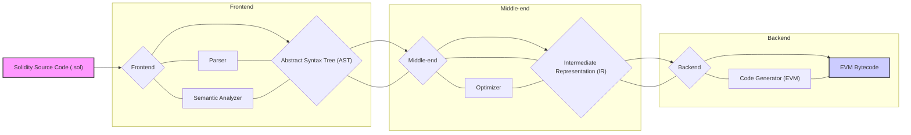
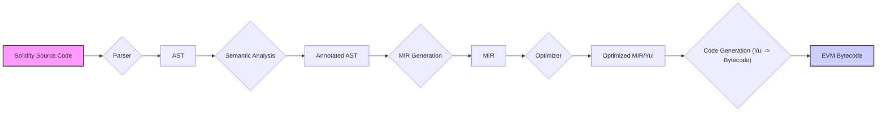

# Project Design Document: Solidity Compiler

**Version:** 1.1
**Date:** October 26, 2023
**Author:** AI Software Architect

## 1. Introduction

This document provides an enhanced and more detailed design overview of the Solidity compiler project, as hosted on GitHub at [https://github.com/ethereum/solidity](https://github.com/ethereum/solidity). Building upon the previous version, this document aims to provide an even more comprehensive understanding of the compiler's architecture, components, and data flow, specifically tailored for effective threat modeling activities.

## 2. Goals and Non-Goals

### 2.1. Goals

*   Provide a clear, detailed, and enhanced description of the Solidity compiler's architecture and key components, including internal sub-components.
*   Elaborate on the data flow and interactions between different parts of the compiler, including intermediate representations.
*   Identify key functionalities and their relationships with a stronger focus on security-relevant aspects.
*   Establish a robust foundation for conducting thorough and targeted threat modeling.
*   Describe the build process and key external dependencies.

### 2.2. Non-Goals

*   Provide a line-by-line code explanation of the entire codebase.
*   Detail every single micro-optimization pass within the compiler.
*   Cover the complete historical evolution of every feature in the compiler.
*   Include deployment or operational aspects of the compiler infrastructure itself (e.g., CI/CD pipelines).

## 3. High-Level Architecture

The Solidity compiler architecture can be broadly divided into a frontend, middle-end, and backend, reflecting the stages of compilation.

**Architectural Layers:**

*   **Frontend:** Responsible for parsing the source code and performing semantic analysis.
*   **Middle-end:** Focuses on optimizing the intermediate representation.
*   **Backend:** Generates the final EVM bytecode.

**Key Components:**

*   **Solidity Source Code (.sol):** The input to the compiler.
*   **Frontend:**
    *   **Parser:** Converts source code into an Abstract Syntax Tree (AST).
    *   **Semantic Analyzer:** Performs static analysis, type checking, and symbol resolution on the AST.
*   **Abstract Syntax Tree (AST):** A structured representation of the source code.
*   **Middle-end:**
    *   **Optimizer:** Applies various optimization techniques to the IR.
*   **Intermediate Representation (IR):** A lower-level representation used for optimization and code generation (Solidity uses multiple internal IRs, including Yul).
*   **Backend:**
    *   **Code Generator (EVM):** Translates the optimized IR into EVM bytecode.
*   **EVM Bytecode:** The final output, executable on the Ethereum Virtual Machine.

## 4. Component Details

This section provides a more granular description of the key components within the Solidity compiler.

### 4.1. Frontend

*   **Purpose:** To process the high-level Solidity source code and prepare it for further stages.
*   **Sub-components:**
    *   **Parser:**
        *   **Functionality:** Takes the raw Solidity source code as input and generates an Abstract Syntax Tree (AST).
        *   **Implementation:** Uses a custom parser.
        *   **Key Responsibilities:**
            *   Lexical analysis (tokenization).
            *   Syntactic analysis (grammar checking).
            *   Building the Abstract Syntax Tree.
            *   Error reporting for syntax errors, including location information.
    *   **Semantic Analyzer:**
        *   **Functionality:** Analyzes the AST to ensure semantic correctness and enriches it with type information.
        *   **Key Responsibilities:**
            *   **Type Checking:** Ensures operations are performed on compatible types, including implicit and explicit conversions.
            *   **Symbol Resolution:** Maps identifiers (variables, functions, etc.) to their declarations, handling scoping rules.
            *   **Scope Analysis:** Determines the visibility and lifetime of variables and other symbols.
            *   **Immutability and Constant Analysis:** Enforces rules related to `immutable` and `constant` variables.
            *   **Function Overload Resolution:** Determines the correct function to call based on argument types.
            *   **Error Reporting:** Detects and reports semantic errors, such as type mismatches, undeclared variables, and access violations.

### 4.2. Abstract Syntax Tree (AST)

*   **Functionality:** A hierarchical tree structure representing the syntactic structure of the Solidity source code.
*   **Key Characteristics:**
    *   Nodes represent language constructs (e.g., statements, expressions, declarations).
    *   Edges represent relationships between these constructs.
    *   Annotated with source code location information, crucial for error reporting and debugging.
    *   Serves as the primary data structure passed from the frontend to the middle-end.

### 4.3. Middle-end

*   **Purpose:** To optimize the intermediate representation of the code, improving its efficiency.
*   **Key Components:**
    *   **Optimizer:**
        *   **Functionality:** Applies various transformations to the IR to reduce gas consumption, improve execution speed, and potentially reduce bytecode size.
        *   **Optimization Passes:**
            *   **Constant Folding:** Evaluates constant expressions at compile time.
            *   **Dead Code Elimination:** Removes code that is never executed.
            *   **Common Subexpression Elimination:** Identifies and reuses identical computations.
            *   **Jump Threading:** Optimizes control flow by eliminating unnecessary jumps.
            *   **SSTORE/SLOAD Optimization:** Optimizes interactions with contract storage.
            *   **Inlining:** Replaces function calls with the function body.
            *   **Other specialized EVM optimizations.**
        *   **Intermediate Representations:** Operates on various internal IRs, including Yul.

### 4.4. Intermediate Representation (IR)

*   **Functionality:** A lower-level representation of the code, facilitating optimization and code generation. Solidity utilizes multiple IRs internally:
    *   **AST (considered an initial IR):** The output of the parser.
    *   **MIR (Middle-level IR):** An internal representation used for some optimization passes.
    *   **Yul:** A stack-based intermediate language used as a target for many optimization passes and the final code generation stage.
*   **Key Characteristics:**
    *   More abstract than EVM bytecode but less abstract than the AST.
    *   Allows for platform-independent optimizations (to some extent).
    *   Provides a structured format for applying transformations.

### 4.5. Backend

*   **Purpose:** To generate the final EVM bytecode from the optimized intermediate representation.
*   **Key Components:**
    *   **Code Generator (EVM):**
        *   **Functionality:** Translates the optimized IR (primarily Yul) into EVM bytecode instructions.
        *   **Key Responsibilities:**
            *   Mapping IR operations to specific EVM opcodes.
            *   Managing the EVM stack, memory, and storage.
            *   Generating code for function calls, control flow structures (loops, conditionals), and event emissions.
            *   Handling data layout and ABI encoding/decoding.
            *   Producing the final deployable bytecode, including metadata.

## 5. Data Flow

The following diagram illustrates the more detailed flow of data through the Solidity compiler:

**Detailed Data Flow Description:**

*   The compilation process begins with the **Solidity Source Code**.
*   The **Parser** performs lexical and syntactic analysis, generating the **AST**.
*   The **Semantic Analysis** stage processes the **AST**, performing type checking and symbol resolution, resulting in an **Annotated AST**.
*   **MIR Generation** transforms the **Annotated AST** into the **MIR**.
*   The **Optimizer** operates on the **MIR** and potentially transforms it into **Yul** for further optimization, resulting in **Optimized MIR/Yul**.
*   Finally, the **Code Generation** stage translates the **Optimized MIR/Yul** into the final **EVM Bytecode**.

## 6. Key Interactions

*   **Parser and Lexer:** The parser relies on a lexer to break the source code into tokens.
*   **Semantic Analyzer and AST:** The semantic analyzer traverses and annotates the AST, adding type information and resolving symbols.
*   **Optimizer and Various IRs:** The optimizer interacts with different intermediate representations (MIR, Yul) to apply transformations.
*   **Code Generator and Yul:** The code generator primarily consumes the Yul IR to produce EVM bytecode.
*   **Error Reporting Mechanism:** Each stage can report errors, which are collected and presented to the user, often including source location information.

## 7. Security Considerations

This section expands on the initial security considerations, providing more specific examples relevant for threat modeling.

*   **Frontend:**
    *   **Parser Vulnerabilities:**
        *   Denial of Service (DoS) through maliciously crafted input that causes excessive resource consumption.
        *   Bypassing syntax checks leading to invalid ASTs.
    *   **Semantic Analysis Vulnerabilities:**
        *   Type confusion due to incorrect type checking, potentially leading to unexpected behavior.
        *   Symbol resolution errors that could allow access to unintended variables or functions.
        *   Bypassing immutability or constant checks.
*   **Middle-end (Optimizer):**
    *   **Optimizer Bugs:**
        *   Generating incorrect bytecode that behaves differently than intended.
        *   Introducing vulnerabilities through incorrect optimizations.
        *   Potential for non-determinism if optimizations are not carefully implemented.
*   **Backend (Code Generator):**
    *   **Code Generation Errors:**
        *   Incorrect mapping of IR operations to EVM opcodes, leading to faulty logic.
        *   Stack underflow or overflow issues due to incorrect stack management.
        *   Incorrect memory or storage access patterns.
        *   Vulnerabilities related to ABI encoding/decoding.
*   **General Considerations:**
    *   **Dependency Vulnerabilities:** Security flaws in external libraries used by the compiler.
    *   **Build Process Security:** Compromised build environments could lead to the injection of malicious code into the compiler.
    *   **Integer Overflow/Underflow:** While Solidity has built-in checks, the compiler's internal operations should also be robust against these issues.
    *   **Reentrancy:** Although primarily a smart contract concern, the compiler's handling of function calls and state modifications could have indirect implications.

## 8. Build Process

The Solidity compiler build process typically involves the following steps:

*   **Prerequisites:** Installation of necessary tools like CMake, a C++ compiler (e.g., g++, clang), and potentially Node.js for certain utilities.
*   **Configuration:** Using CMake to configure the build environment based on the target platform and desired options.
*   **Compilation:** Compiling the C++ source code of the compiler.
*   **Testing:** Running unit and integration tests to ensure the compiler functions correctly.
*   **Artifact Generation:** Producing the final compiler executables (`solc`).

**Security Considerations for the Build Process:**

*   **Dependency Management:** Ensuring the integrity of downloaded dependencies.
*   **Build Environment Security:** Protecting the build machines from unauthorized access and malware.
*   **Reproducible Builds:** Aiming for reproducible builds to ensure the same source code always produces the same output.
*   **Code Signing:** Signing the compiler executables to verify their authenticity.

## 9. External Dependencies

The Solidity compiler relies on several external libraries and tools:

*   **CMake:** Used for build system configuration.
*   **Boost:** A collection of C++ libraries providing various utilities.
*   **z3:** A theorem prover used for static analysis and constraint solving.
*   **libsolidity:**  The core Solidity library.
*   Potentially other libraries for specific functionalities.

**Security Considerations for External Dependencies:**

*   **Vulnerability Scanning:** Regularly scanning dependencies for known vulnerabilities.
*   **Dependency Pinning:** Using specific versions of dependencies to avoid unexpected changes or vulnerabilities.
*   **License Compliance:** Ensuring compliance with the licenses of external dependencies.

## 10. Assumptions and Constraints

*   This design document focuses on the core compilation pipeline.
*   The description reflects the general architecture and may not capture every implementation detail or ongoing refactoring efforts.
*   A basic understanding of compiler design and blockchain concepts is assumed.

## 11. Future Considerations

*   Detailed analysis of specific optimization passes and their potential security implications.
*   In-depth examination of the compiler's error handling and recovery mechanisms.
*   Further investigation into the security of internal data structures and algorithms.
*   Analysis of the impact of new EVM features on the compiler's design and security.

This improved design document provides a more comprehensive and detailed understanding of the Solidity compiler, making it a more effective resource for threat modeling activities. The added details on internal components, data flow, build process, and external dependencies offer a broader perspective for identifying potential security vulnerabilities.