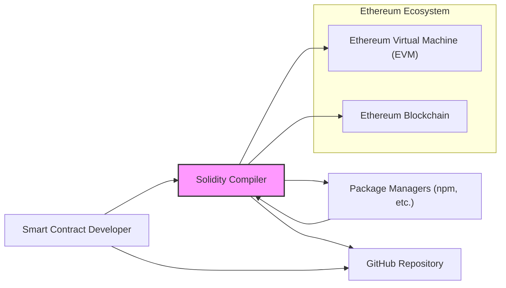
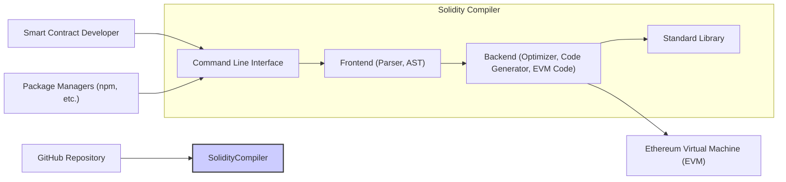
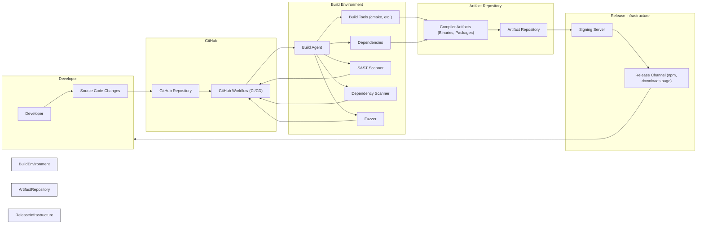

# BUSINESS POSTURE

- Business Priorities and Goals:
 - Enable developers to write smart contracts for the Ethereum Virtual Machine (EVM).
 - Provide a reliable, efficient, and secure compiler for the Solidity language.
 - Support the growth and adoption of the Ethereum ecosystem by providing a robust development tool.
- Business Risks:
 - Compiler vulnerabilities could lead to exploitable smart contracts, causing financial losses and reputational damage to the Ethereum ecosystem.
 - Poor compiler performance could hinder development and adoption of complex smart contracts.
 - Lack of trust in the compiler's security and reliability could discourage developers from using Solidity and Ethereum.

# SECURITY POSTURE

- Existing Security Controls:
 - security control: Public GitHub repository for transparency and community review. Implemented in: GitHub.
 - security control: Bug bounty program to incentivize vulnerability reporting. Implemented in: Publicly announced bug bounty programs.
 - security control: Code review process for contributions. Implemented in: GitHub pull request workflow.
 - security control: Version control using Git. Implemented in: GitHub.
- Accepted Risks:
 - accepted risk: Open source nature means vulnerabilities may be publicly disclosed before a patch is available.
 - accepted risk: Reliance on community contributions introduces potential security risks if contributions are not thoroughly vetted.
- Recommended Security Controls:
 - security control: Implement automated static analysis security testing (SAST) in the CI/CD pipeline.
 - security control: Integrate dependency scanning to identify and manage vulnerable dependencies.
 - security control: Implement fuzz testing to discover unexpected compiler behavior and potential vulnerabilities.
 - security control: Secure the release process, including signing compiler binaries to ensure authenticity and integrity.
- Security Requirements:
 - Authentication: Not directly applicable to the compiler itself, but required for access to development infrastructure (e.g., GitHub, build systems).
 - Authorization: Access control for the GitHub repository, build systems, and release infrastructure to manage who can contribute, build, and release the compiler.
 - Input Validation: Rigorous validation of Solidity source code to prevent compiler crashes, unexpected behavior, and vulnerabilities arising from maliciously crafted input.
 - Cryptography: Use of cryptographic signatures to ensure the integrity and authenticity of compiler releases.

# DESIGN

## C4 CONTEXT



- Elements of Context Diagram:
 - Element:
  - Name: Smart Contract Developer
  - Type: Person
  - Description: Developers who write smart contracts using the Solidity language.
  - Responsibilities: Writing, testing, and deploying smart contracts to the Ethereum blockchain.
  - Security controls: Secure development practices, code review, vulnerability scanning of their own smart contracts.
 - Element:
  - Name: Solidity Compiler
  - Type: Software System
  - Description: The Solidity compiler takes Solidity source code as input and produces bytecode that can be executed on the EVM.
  - Responsibilities: Compiling Solidity code into EVM bytecode, optimizing code, and providing error messages and warnings.
  - Security controls: Input validation, secure coding practices, static analysis, fuzzing, secure build and release process.
 - Element:
  - Name: Ethereum Virtual Machine (EVM)
  - Type: Software System
  - Description: The runtime environment on the Ethereum blockchain where smart contracts are executed.
  - Responsibilities: Executing bytecode, managing state, and enforcing the rules of the Ethereum protocol.
  - Security controls: Consensus mechanisms, sandboxing, gas limits to prevent denial-of-service attacks.
 - Element:
  - Name: Ethereum Blockchain
  - Type: Software System
  - Description: The decentralized, distributed ledger that stores smart contracts and transaction data.
  - Responsibilities: Maintaining the ledger, processing transactions, and ensuring data integrity and availability.
  - Security controls: Cryptographic hashing, consensus mechanisms, network security.
 - Element:
  - Name: Package Managers (npm, etc.)
  - Type: Software System
  - Description: Tools used to manage dependencies and distribute software packages, including Solidity compiler releases.
  - Responsibilities: Distributing compiler binaries and libraries, managing dependencies for developers.
  - Security controls: Package signing, vulnerability scanning of packages, secure package repositories.
 - Element:
  - Name: GitHub Repository
  - Type: Software System
  - Description: The online repository hosting the Solidity compiler source code, issue tracking, and collaboration platform.
  - Responsibilities: Version control, code hosting, issue tracking, pull request management, and community collaboration.
  - Security controls: Access control, audit logs, vulnerability scanning of the platform itself, secure configuration.

## C4 CONTAINER



- Elements of Container Diagram:
 - Element:
  - Name: Command Line Interface (CLI)
  - Type: Container - Executable Application
  - Description: The command-line interface that developers use to interact with the Solidity compiler. It accepts Solidity source code files as input and outputs compiled bytecode.
  - Responsibilities: Accepting user input, invoking the frontend and backend components, and providing compiler output.
  - Security controls: Input validation, secure handling of file system operations, logging of user actions.
 - Element:
  - Name: Frontend (Parser, AST)
  - Type: Container - Library/Module
  - Description: The frontend component is responsible for parsing Solidity source code, creating an Abstract Syntax Tree (AST) representation, and performing semantic analysis.
  - Responsibilities: Lexical analysis, parsing, AST generation, semantic analysis, and error reporting.
  - Security controls: Input validation to prevent parser vulnerabilities, secure handling of language features, and prevention of injection attacks through crafted input.
 - Element:
  - Name: Backend (Optimizer, Code Generator, EVM Code)
  - Type: Container - Library/Module
  - Description: The backend component takes the AST from the frontend, optimizes the code, and generates EVM bytecode.
  - Responsibilities: Code optimization, EVM bytecode generation, and ensuring correctness and efficiency of the generated code.
  - Security controls: Secure code generation practices to prevent vulnerabilities in the generated bytecode, robust optimization algorithms to avoid introducing bugs, and thorough testing of generated code.
 - Element:
  - Name: Standard Library
  - Type: Container - Library
  - Description: A collection of pre-written Solidity code that provides common functionalities and utilities for smart contract development.
  - Responsibilities: Providing reusable code modules, enhancing developer productivity, and promoting best practices.
  - Security controls: Code review, vulnerability scanning of library code, and clear documentation of security considerations for library usage.

## DEPLOYMENT

```mermaid
flowchart LR
    subgraph Developer Machine
        Developer["Developer"]
        CLI["Solidity Compiler CLI"]
    end
    subgraph Package Registry (npm, etc.)
        Registry["Package Registry"]
        CompilerPackage["Compiler Package (npm package)"]
    end
    subgraph Distribution Server
        DownloadServer["Download Server"]
        CompilerBinaries["Compiler Binaries (zip, tar.gz)"]
    end

    Developer --> CLI
    CLI --> EVM["Ethereum Virtual Machine"]
    Registry --> CompilerPackage
    DownloadServer --> CompilerBinaries
    CompilerPackage --> Developer
    CompilerBinaries --> Developer

    style DeveloperMachine fill:#efe,stroke:#333,stroke-width:1px
    style PackageRegistry fill:#efe,stroke:#333,stroke-width:1px
    style DistributionServer fill:#efe,stroke:#333,stroke-width:1px
```

- Elements of Deployment Diagram:
 - Element:
  - Name: Developer Machine
  - Type: Environment
  - Description: The local computer of a smart contract developer where they write, compile, and test Solidity code.
  - Responsibilities: Running the Solidity compiler, developing smart contracts, and interacting with development tools.
  - Security controls: Operating system security, local security policies, and developer awareness of security best practices.
 - Element:
  - Name: Solidity Compiler CLI
  - Type: Software
  - Description: The command-line interface of the Solidity compiler, installed and executed on the developer's machine.
  - Responsibilities: Compiling Solidity code provided by the developer.
  - Security controls: Input validation, secure file handling, and adherence to security best practices in the compiler code.
 - Element:
  - Name: Package Registry (npm, etc.)
  - Type: Infrastructure
  - Description: Online package registries like npm that host and distribute software packages, including Solidity compiler packages.
  - Responsibilities: Hosting and distributing compiler packages, managing package versions, and providing package download services.
  - Security controls: Package signing, vulnerability scanning of hosted packages, and secure infrastructure for package distribution.
 - Element:
  - Name: Compiler Package (npm package)
  - Type: Software Package
  - Description: A packaged version of the Solidity compiler distributed through package registries like npm.
  - Responsibilities: Providing an easy way for developers to install and manage the Solidity compiler.
  - Security controls: Package integrity checks, signatures to verify authenticity, and regular updates to address vulnerabilities.
 - Element:
  - Name: Download Server
  - Type: Infrastructure
  - Description: Servers that directly host and distribute Solidity compiler binaries as downloadable files (e.g., zip, tar.gz).
  - Responsibilities: Providing direct download access to compiler binaries.
  - Security controls: Secure server configuration, access controls, and integrity checks for distributed binaries.
 - Element:
  - Name: Compiler Binaries (zip, tar.gz)
  - Type: Software Artifact
  - Description: Pre-compiled executable versions of the Solidity compiler packaged as downloadable archives.
  - Responsibilities: Providing readily executable versions of the compiler for different platforms.
  - Security controls: Signing of binaries to ensure authenticity and integrity, checksums for verifying download integrity.

## BUILD



- Elements of Build Diagram:
 - Element:
  - Name: Developer
  - Type: Person
  - Description: Software developers contributing to the Solidity compiler project.
  - Responsibilities: Writing code, submitting changes, and participating in code reviews.
  - Security controls: Secure coding practices, code review participation, and adherence to project security guidelines.
 - Element:
  - Name: Source Code Changes
  - Type: Data
  - Description: Modifications to the Solidity compiler source code made by developers.
  - Responsibilities: Representing the codebase of the compiler.
  - Security controls: Version control using Git, code review process, and access control to the repository.
 - Element:
  - Name: GitHub Repository
  - Type: Platform
  - Description: The GitHub repository hosting the Solidity compiler source code and managing the development workflow.
  - Responsibilities: Version control, code hosting, pull request management, and triggering CI/CD pipelines.
  - Security controls: Access control, audit logs, and security features provided by GitHub.
 - Element:
  - Name: GitHub Workflow (CI/CD)
  - Type: Automation
  - Description: Automated workflows defined in GitHub Actions to build, test, and release the Solidity compiler.
  - Responsibilities: Automating the build process, running tests, performing security checks, and managing releases.
  - Security controls: Secure configuration of workflows, access control to workflow definitions, and audit logs of workflow executions.
 - Element:
  - Name: Build Agent
  - Type: Infrastructure
  - Description: Servers or virtual machines that execute the build steps defined in the CI/CD workflow.
  - Responsibilities: Executing build commands, running tests, and performing security scans.
  - Security controls: Secure configuration of build agents, access control, and regular patching and updates.
 - Element:
  - Name: Build Tools (cmake, etc.)
  - Type: Software
  - Description: Tools used to compile and build the Solidity compiler from source code (e.g., cmake, compilers, linkers).
  - Responsibilities: Compiling source code, linking libraries, and creating executable binaries.
  - Security controls: Using trusted and updated build tools, secure configuration of build tools, and vulnerability scanning of build tool dependencies.
 - Element:
  - Name: Dependencies
  - Type: Software
  - Description: External libraries and components required to build the Solidity compiler.
  - Responsibilities: Providing necessary functionalities for the compiler.
  - Security controls: Dependency scanning to identify vulnerable dependencies, using dependency management tools, and regularly updating dependencies.
 - Element:
  - Name: SAST Scanner
  - Type: Security Tool
  - Description: Static Application Security Testing tools used to analyze the source code for potential security vulnerabilities.
  - Responsibilities: Identifying potential security flaws in the code before compilation.
  - Security controls: Properly configured SAST tools, regular updates to vulnerability signatures, and review of SAST findings.
 - Element:
  - Name: Dependency Scanner
  - Type: Security Tool
  - Description: Tools used to scan project dependencies for known vulnerabilities.
  - Responsibilities: Identifying vulnerable dependencies used by the compiler.
  - Security controls: Regularly updated vulnerability databases, integration into the CI/CD pipeline, and remediation of identified vulnerabilities.
 - Element:
  - Name: Fuzzer
  - Type: Security Tool
  - Description: Fuzz testing tools used to automatically generate and inject malformed or unexpected inputs to the compiler to discover crashes or vulnerabilities.
  - Responsibilities: Discovering unexpected compiler behavior and potential vulnerabilities through input fuzzing.
  - Security controls: Properly configured fuzzing tools, continuous fuzzing in the CI/CD pipeline, and analysis of fuzzing results.
 - Element:
  - Name: Compiler Artifacts (Binaries, Packages)
  - Type: Software Artifacts
  - Description: The output of the build process, including executable binaries, packages, and libraries of the Solidity compiler.
  - Responsibilities: Providing distributable versions of the compiler.
  - Security controls: Integrity checks, signing of artifacts, and secure storage of artifacts.
 - Element:
  - Name: Artifact Repository
  - Type: Storage
  - Description: A secure storage location for compiled compiler artifacts before release.
  - Responsibilities: Securely storing and managing compiler artifacts.
  - Security controls: Access control, audit logs, and data encryption.
 - Element:
  - Name: Signing Server
  - Type: Infrastructure
  - Description: A dedicated server used to digitally sign compiler artifacts to ensure authenticity and integrity.
  - Responsibilities: Signing compiler binaries and packages using cryptographic keys.
  - Security controls: Secure key management, access control, and audit logs.
 - Element:
  - Name: Release Channel (npm, downloads page)
  - Type: Distribution
  - Description: Channels through which the Solidity compiler is distributed to developers (e.g., npm, official download pages).
  - Responsibilities: Distributing compiler releases to developers.
  - Security controls: Secure distribution channels, integrity checks for downloads, and clear communication of security advisories.

# RISK ASSESSMENT

- Critical Business Processes:
 - Compilation of Solidity smart contracts into EVM bytecode. This is the core function of the project and is critical for the entire Ethereum ecosystem.
 - Distribution of the Solidity compiler to developers. Ensuring developers have access to a secure and reliable compiler is essential for ongoing smart contract development.
- Data to Protect:
 - Solidity compiler source code: Confidentiality is important to prevent unauthorized modifications and maintain control over the project's direction. Integrity is crucial to ensure the compiler's functionality and security. Sensitivity: High.
 - Compiled EVM bytecode: Integrity is paramount to ensure that the compiled bytecode accurately reflects the intended smart contract logic and is free from vulnerabilities introduced by the compiler. Availability is also important to ensure developers can compile and deploy their contracts. Sensitivity: High.
 - Compiler release artifacts (binaries, packages): Integrity and authenticity are critical to ensure developers are using legitimate and untampered versions of the compiler. Sensitivity: High.

# QUESTIONS & ASSUMPTIONS

- Questions:
 - What specific SAST tools are currently used in the CI/CD pipeline?
 - What dependency scanning tools are in place, and how frequently are dependencies scanned for vulnerabilities?
 - Is fuzz testing currently integrated into the development process, and if so, what fuzzing techniques are employed?
 - What is the process for signing compiler binaries and packages? What key management practices are in place for signing keys?
 - Are there regular security audits or penetration testing performed on the compiler project and its infrastructure?
 - What is the incident response plan in case a security vulnerability is discovered in the compiler?
- Assumptions:
 - The Solidity compiler project is committed to security and follows secure software development lifecycle practices.
 - The project uses GitHub for version control and collaboration.
 - There is a continuous integration and continuous delivery (CI/CD) pipeline in place for building and releasing the compiler.
 - The project aims to distribute the compiler through package managers and direct downloads.
 - Security is a high priority for the Ethereum ecosystem and projects within it, including the Solidity compiler.