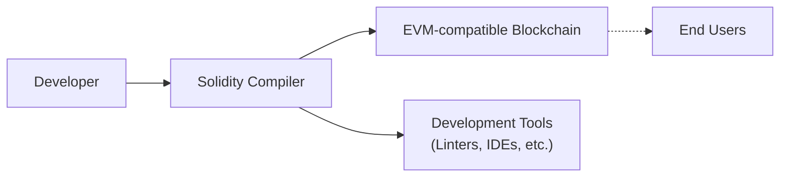
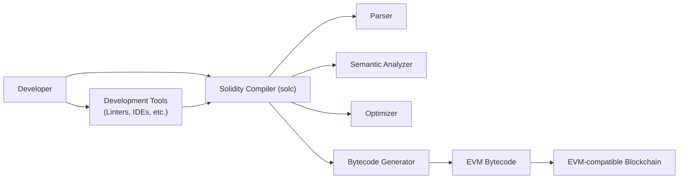
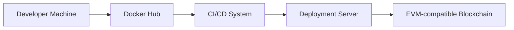
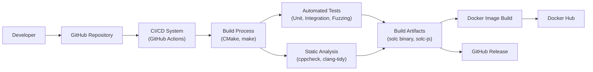

# BUSINESS POSTURE

Business Priorities and Goals:

*   Provide a secure and reliable programming language (Solidity) for developing smart contracts on the Ethereum blockchain and other EVM-compatible blockchains.
*   Enable developers to create decentralized applications (dApps) that are trustworthy and operate as intended.
*   Foster a vibrant ecosystem around Ethereum and smart contract development.
*   Continuously improve the language and compiler to enhance security, efficiency, and developer experience.
*   Maintain backward compatibility where feasible, while also introducing necessary breaking changes to address security vulnerabilities or improve the language.

Most Important Business Risks:

*   Compiler bugs or vulnerabilities that could lead to exploitable smart contracts, resulting in financial losses for users and damage to the reputation of Solidity and Ethereum.
*   Lack of clarity or ambiguity in the language specification, leading to developer errors and insecure smart contracts.
*   Inability to keep pace with the evolving needs of the Ethereum ecosystem and the demands of smart contract developers.
*   Failure to adequately address known security risks and vulnerabilities in a timely manner.
*   Loss of community trust and adoption due to security incidents or perceived lack of responsiveness to developer concerns.

# SECURITY POSTURE

Existing Security Controls:

*   security control: Formal language specification (documentation) to guide compiler development and provide a reference for developers.
*   security control: Extensive testing suite, including unit tests, integration tests, and fuzzing, to identify and fix bugs.
*   security control: Static analysis tools integrated into the compiler to detect potential vulnerabilities and code quality issues.
*   security control: Regular security audits and reviews by internal and external experts.
*   security control: Bug bounty program to incentivize the discovery and reporting of vulnerabilities.
*   security control: Use of linters (solhint) and static analyzers (slither, mythril) by developers.
*   security control: Security recommendations and best practices documented for developers.
*   security control: Versioning and release management process to track changes and manage deployments.
*   security control: Open-source development model, allowing for community scrutiny and contributions.

Accepted Risks:

*   accepted risk: The inherent complexity of a compiler and the possibility of undiscovered bugs or vulnerabilities.
*   accepted risk: The potential for developer errors in smart contract code, even with a secure compiler.
*   accepted risk: The evolving nature of the Ethereum platform and the need for ongoing language updates and improvements.
*   accepted risk: The trade-off between security and performance, requiring careful balancing of optimization and security considerations.

Recommended Security Controls:

*   security control: Implement a more comprehensive and formalized specification of the language, potentially using a formal methods approach.
*   security control: Enhance fuzzing capabilities to cover a wider range of inputs and edge cases.
*   security control: Integrate more advanced static analysis tools and techniques, such as symbolic execution and taint analysis.
*   security control: Develop and maintain a comprehensive threat model for the compiler and language.
*   security control: Provide more detailed and actionable security guidance for developers, including specific examples of common vulnerabilities and how to avoid them.
*   security control: Explore the use of formal verification techniques to prove the correctness of critical compiler components.

Security Requirements:

*   Authentication: Not directly applicable to the compiler itself, but crucial for smart contracts developed using Solidity. The compiler should support secure authentication mechanisms within smart contracts.
*   Authorization: Not directly applicable to the compiler itself, but crucial for smart contracts. The compiler should support secure authorization mechanisms within smart contracts.
*   Input Validation: The compiler should perform strict input validation on source code to prevent compiler crashes or exploits. Smart contracts written in Solidity must perform rigorous input validation, and the compiler should provide features and guidance to facilitate this.
*   Cryptography: The compiler should provide access to secure cryptographic primitives and libraries for use in smart contracts. The compiler itself should use secure cryptographic practices where necessary (e.g., for code signing).
*   Output Encoding: The compiler should generate bytecode that is safe and predictable.

# DESIGN

## C4 CONTEXT

Element Descriptions:

*   Element:
    *   Name: Developer
    *   Type: Person
    *   Description: A person who writes smart contracts using the Solidity programming language.
    *   Responsibilities: Writing, testing, and deploying smart contracts.
    *   Security controls: Follows secure coding practices, uses linters and static analysis tools.

*   Element:
    *   Name: Solidity Compiler
    *   Type: Software System
    *   Description: The compiler that translates Solidity source code into EVM bytecode.
    *   Responsibilities: Parsing Solidity code, performing semantic analysis, generating EVM bytecode, providing warnings and errors.
    *   Security controls: Extensive testing, static analysis, security audits, bug bounty program.

*   Element:
    *   Name: EVM-compatible Blockchain
    *   Type: Software System
    *   Description: A blockchain that implements the Ethereum Virtual Machine (EVM), such as Ethereum mainnet, testnets, or other EVM-compatible chains.
    *   Responsibilities: Executing smart contract bytecode, maintaining the blockchain state, providing consensus mechanisms.
    *   Security controls: Blockchain-specific security mechanisms (e.g., consensus algorithms, validator selection).

*   Element:
    *   Name: Development Tools
    *   Type: Software System
    *   Description: Tools used by developers to write, test, and debug Solidity code, such as linters, IDEs, and debugging tools.
    *   Responsibilities: Assisting developers in writing secure and efficient code.
    *   Security controls: Tool-specific security measures (e.g., secure coding practices for IDE plugins).

*   Element:
    *   Name: End Users
    *   Type: Person
    *   Description: Users who interact with smart contracts deployed on the EVM-compatible blockchain.
    *   Responsibilities: Interacting with dApps and smart contracts.
    *   Security controls: User-level security practices (e.g., secure wallet management).

## C4 CONTAINER

Element Descriptions:

*   Element:
    *   Name: Solidity Compiler (solc)
    *   Type: Container
    *   Description: The main compiler application.
    *   Responsibilities: Orchestrates the compilation process.
    *   Security controls: Input validation, regular security audits.

*   Element:
    *   Name: Parser
    *   Type: Container
    *   Description: Parses Solidity source code into an Abstract Syntax Tree (AST).
    *   Responsibilities: Lexical analysis, syntax analysis.
    *   Security controls: Robust parsing logic to handle invalid input.

*   Element:
    *   Name: Semantic Analyzer
    *   Type: Container
    *   Description: Performs semantic analysis on the AST.
    *   Responsibilities: Type checking, control flow analysis, data flow analysis.
    *   Security controls: Detection of common vulnerabilities (e.g., reentrancy, integer overflows).

*   Element:
    *   Name: Optimizer
    *   Type: Container
    *   Description: Optimizes the intermediate representation of the code.
    *   Responsibilities: Improving code efficiency and reducing gas costs.
    *   Security controls: Ensuring that optimizations do not introduce vulnerabilities.

*   Element:
    *   Name: Bytecode Generator
    *   Type: Container
    *   Description: Generates EVM bytecode from the optimized intermediate representation.
    *   Responsibilities: Creating executable bytecode for the EVM.
    *   Security controls: Correct and secure bytecode generation.

*   Element:
    *   Name: EVM Bytecode
    *   Type: Data
    *   Description: The compiled bytecode that can be executed on the EVM.
    *   Responsibilities: Representing the compiled smart contract.
    *   Security controls: N/A (output of the compiler).

*   Element:
    *   Name: Developer
    *   Type: Person
    *   Description: A person who writes smart contracts using the Solidity programming language.
    *   Responsibilities: Writing, testing, and deploying smart contracts.
    *   Security controls: Follows secure coding practices, uses linters and static analysis tools.

*   Element:
    *   Name: EVM-compatible Blockchain
    *   Type: Software System
    *   Description: A blockchain that implements the Ethereum Virtual Machine (EVM).
    *   Responsibilities: Executing smart contract bytecode, maintaining the blockchain state.
    *   Security controls: Blockchain-specific security mechanisms.

*   Element:
    *   Name: Development Tools
    *   Type: Software System
    *   Description: Tools used by developers to write, test, and debug Solidity code.
    *   Responsibilities: Assisting developers in writing secure and efficient code.
    *   Security controls: Tool-specific security measures.

## DEPLOYMENT

Possible deployment solutions:

1.  Standalone binary (solc): The compiler is distributed as a standalone executable for various platforms (Linux, macOS, Windows).
2.  JavaScript library (solc-js): A JavaScript wrapper around the compiler, allowing it to be used in Node.js environments and web browsers.
3.  Docker image: A containerized version of the compiler, providing a consistent and isolated environment.

Chosen solution (Docker image):

Element Descriptions:

*   Element:
    *   Name: Developer Machine
    *   Type: Infrastructure Node
    *   Description: The machine where developers write and test Solidity code.
    *   Responsibilities: Providing a development environment.
    *   Security controls: Standard developer machine security practices.

*   Element:
    *   Name: Docker Hub
    *   Type: Infrastructure Node
    *   Description: A public registry for Docker images.
    *   Responsibilities: Storing and distributing the Solidity compiler Docker image.
    *   Security controls: Docker Hub security features (e.g., image scanning, access controls).

*   Element:
    *   Name: CI/CD System
    *   Type: Infrastructure Node
    *   Description: A system that automates the building, testing, and deployment of the compiler.
    *   Responsibilities: Building and publishing the Docker image.
    *   Security controls: Secure CI/CD pipeline configuration, access controls.

*   Element:
    *   Name: Deployment Server
    *   Type: Infrastructure Node
    *   Description: Server used to deploy smart contracts to blockchain.
    *   Responsibilities: Deploying smart contracts.
    *   Security controls: Secure access controls, network security.

*   Element:
    *   Name: Blockchain
    *   Type: Infrastructure Node
    *   Description: EVM-compatible Blockchain.
    *   Responsibilities: Smart contract execution.
    *   Security controls: Blockchain security.

## BUILD

Build Process Description:

1.  Developers commit code changes to the GitHub repository.
2.  GitHub Actions (CI/CD system) triggers a build workflow.
3.  The build process uses CMake and make to compile the Solidity compiler (solc) from source code.
4.  Automated tests (unit tests, integration tests, fuzzing) are executed to verify the correctness and security of the compiler.
5.  Static analysis tools (cppcheck, clang-tidy) are run to identify potential code quality issues and vulnerabilities.
6.  If all tests and static analysis checks pass, build artifacts (solc binary, solc-js) are created.
7.  A Docker image is built containing the solc binary.
8.  The Docker image is pushed to Docker Hub.
9.  Build artifacts are published as a GitHub Release.

Security Controls:

*   security control: Automated build process using GitHub Actions, ensuring consistency and reproducibility.
*   security control: Extensive automated testing, including unit tests, integration tests, and fuzzing.
*   security control: Static analysis using cppcheck and clang-tidy to detect potential vulnerabilities.
*   security control: Use of a secure build environment (GitHub Actions runners).
*   security control: Code signing of build artifacts (where applicable).
*   security control: Dependency management to track and update third-party libraries.
*   security control: Regular security reviews of the build process and infrastructure.
*   security control: Supply chain security measures to mitigate risks associated with dependencies.

# RISK ASSESSMENT

Critical Business Processes:

*   Smart contract compilation: Ensuring that the compiler correctly translates Solidity source code into EVM bytecode.
*   Smart contract security: Preventing the generation of vulnerable bytecode that could lead to exploits.
*   Developer trust: Maintaining the trust of developers in the Solidity language and compiler.

Data Sensitivity:

*   Source code: Solidity source code may contain sensitive business logic or intellectual property. (Medium Sensitivity)
*   Bytecode: Compiled bytecode represents the executable logic of a smart contract and is publicly visible on the blockchain. (Low Sensitivity - Public)
*   Compiler internals: Intermediate representations and data structures used during compilation are generally not sensitive. (Low Sensitivity)
*   Test data: Test data used for fuzzing and other testing may include crafted inputs designed to trigger vulnerabilities. (Medium Sensitivity)

# QUESTIONS & ASSUMPTIONS

Questions:

*   Are there any specific compliance requirements (e.g., regulatory standards) that the compiler must adhere to?
*   What is the expected threat model for the compiler (e.g., who are the potential attackers and what are their capabilities)?
*   What is the process for handling security vulnerabilities discovered in the compiler?
*   What level of support is provided for older versions of Solidity?
*   What are the performance requirements for the compiler?

Assumptions:

*   BUSINESS POSTURE: The primary goal is to provide a secure and reliable compiler for smart contract development.
*   SECURITY POSTURE: The existing security controls are adequate, but there is room for improvement.
*   DESIGN: The design is based on the current architecture of the Solidity compiler. The build and deployment processes are assumed to be automated using GitHub Actions and Docker.