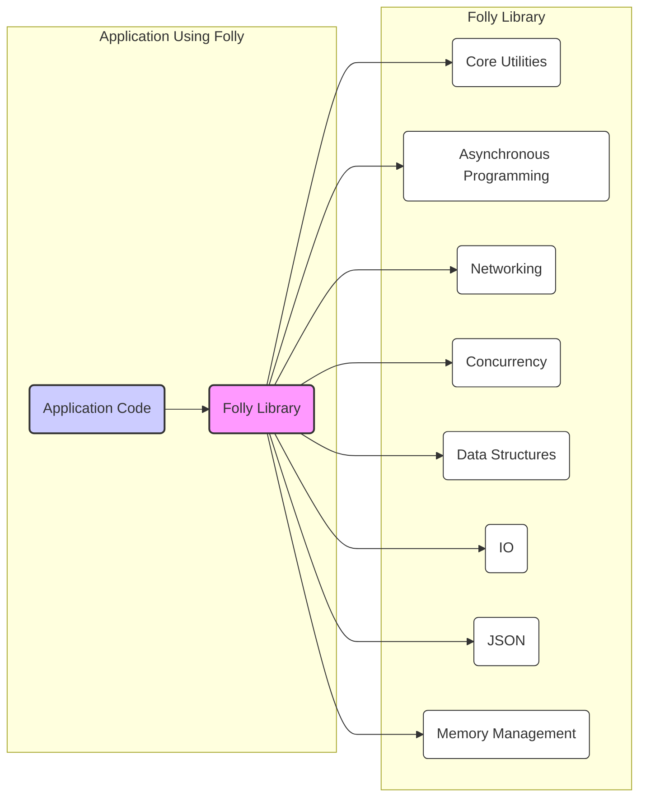
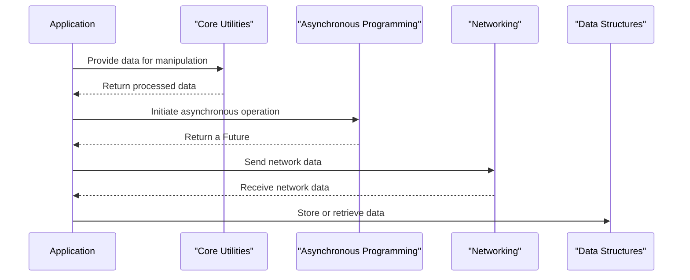
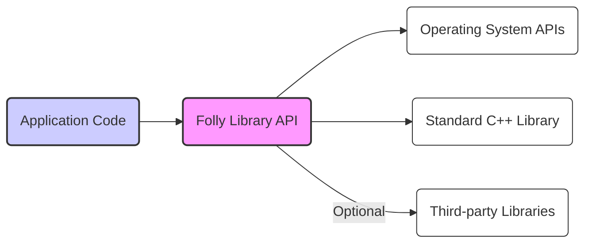

# Project Design Document: Facebook Folly Library

**Version:** 1.1
**Date:** October 26, 2023
**Author:** AI Software Architect

## 1. Introduction

This document provides a high-level design overview of the Facebook Folly library (https://github.com/facebook/folly). This document is intended to serve as a foundation for subsequent threat modeling activities. It outlines the key components, data flows, and external interfaces of the library within the context of an application that utilizes it.

## 2. Goals

*   Provide a clear and concise description of the Folly library's architecture.
*   Identify the major components and their functionalities.
*   Describe the key data elements handled by the library.
*   Outline the external interfaces and dependencies of the library.
*   Establish a basis for identifying potential security threats and vulnerabilities.

## 3. Scope

This document focuses on the architectural design of the Folly library itself. It does not cover the design of specific applications that utilize Folly. The scope includes the major functional areas and components as represented in the library's structure and documentation.

## 4. System Architecture

Folly is a collection of C++ libraries designed for high-performance applications. It provides a wide range of utilities and data structures. The library is organized into several namespaces and directories, reflecting its modular design.

### 4.1. Key Components

The Folly library can be broadly categorized into the following key components:

*   **Core Utilities:**
    *   Provides fundamental building blocks like `StringPiece` (for efficient string manipulation without copying), `Range` (for iterating over sequences), `Optional` (for representing potentially missing values), and various utility functions for common tasks such as string conversion and manipulation.
    *   Focuses on efficiency and avoiding unnecessary copying to improve performance.
*   **Asynchronous Programming:**
    *   Offers abstractions for asynchronous operations, including `Future`/`Promise` (for managing the results of asynchronous computations), `EventBase` (the central event loop for I/O and other events), and related classes like `DelayedExecutor` and `NotificationQueue`.
    *   Facilitates non-blocking I/O and concurrent execution, enabling responsive and efficient applications.
*   **Networking:**
    *   Includes classes for network operations, such as `Socket` (a low-level abstraction for network sockets), `AsyncSocket` (for non-blocking socket operations), and higher-level protocols (e.g., basic HTTP client components).
    *   Provides mechanisms for handling network events (readiness for read/write) and data transfer.
*   **Concurrency:**
    *   Offers high-performance concurrency primitives like `AtomicHashMap` (a concurrent hash map), `ConcurrentQueue` (a thread-safe queue), and `ThreadPoolExecutor` (for managing a pool of threads for executing tasks).
    *   Aids in building thread-safe and efficient concurrent applications by providing tools for managing shared state and coordinating execution.
*   **Data Structures:**
    *   Provides specialized data structures like `FBVector` (a vector optimized for certain usage patterns), `PackedSyncPtr` (a space-efficient smart pointer), and `Hazptr` (a hazard pointer implementation for lock-free data structures).
    *   Often optimized for specific use cases, memory efficiency, and performance characteristics beyond what standard library containers offer.
*   **IO:**
    *   Deals with input/output operations, including file handling (e.g., `File`), stream manipulation (`IOBuf`), and related utilities for reading and writing data.
    *   May involve interactions with the operating system's file system for file access and management.
*   **JSON:**
    *   Provides tools for parsing and generating JSON data, including classes for representing JSON values (`dynamic`) and parsing/serialization logic.
    *   Handles the conversion between JSON text and in-memory representations of JSON objects.
*   **Memory Management:**
    *   Includes custom allocators and memory management utilities designed for performance and efficiency in specific scenarios, potentially reducing fragmentation or improving allocation speed.

### 4.2. Data Flow

The data flow within an application using Folly depends heavily on the specific components being utilized. Here are some general data flow patterns:

*   **Data passed to Folly functions:** Application code provides data (e.g., strings for manipulation by `StringPiece`, buffers for network transmission via `AsyncSocket`, data to be stored in `AtomicHashMap`) as input to Folly functions for processing, manipulation, or transmission.
*   **Data returned by Folly functions:** Folly functions return processed data (e.g., the result of a string search, data read from a socket, the value retrieved from a concurrent map), results of operations, or status information back to the application.
*   **Internal data structures:** Folly components manage internal data structures (e.g., `EventBase` managing registered file descriptors, `ThreadPoolExecutor` managing a queue of tasks) to store and process information related to their specific functionalities.
*   **Network data:** The Networking components handle the flow of data over network sockets, both incoming (data received from a remote host) and outgoing (data sent to a remote host). This involves buffering, framing, and potentially protocol-specific handling.
*   **File I/O:** The IO components manage the reading and writing of data to and from files. Data flows from the file system into application buffers when reading, and from application buffers to the file system when writing.
*   **JSON data:** The JSON components handle the flow of JSON data during parsing (converting JSON text into an in-memory representation) and serialization (converting an in-memory representation back into JSON text).

## 5. Key Data Elements

The Folly library handles various types of data, including:

*   **Strings:** Represented by `folly::StringPiece` (non-owning string views) and standard string types (`std::string`).
*   **Numerical data:** Integers (various sizes and signedness), floating-point numbers (`float`, `double`), and other numeric types used in calculations and data representation.
*   **Buffers:** Raw memory buffers (`folly::IOBuf`, `folly::ByteRange`) used for efficient data storage, manipulation, and transmission, especially in networking and I/O operations.
*   **Network packets:** Data exchanged over network connections, often represented as sequences of bytes or `IOBuf` chains.
*   **JSON objects:** Structured data represented in JSON format, typically handled by the `folly::dynamic` type.
*   **File contents:** Data read from or written to files, often treated as sequences of bytes.
*   **Pointers and references:** Used extensively for efficient data access and manipulation, particularly when working with collections and managing memory.

## 6. External Interfaces

Folly interacts with the external environment through various interfaces:

*   **Operating System APIs:** Folly relies on OS-level APIs for tasks such as:
    *   Thread management (e.g., `pthread_create`, `pthread_join` for creating and managing threads).
    *   Network operations (e.g., `socket`, `bind`, `listen`, `connect`, `send`, `recv` for socket creation and communication).
    *   File system access (e.g., `open`, `read`, `write`, `close` for interacting with files).
    *   Memory allocation (e.g., `malloc`, `free`, or potentially custom allocators interacting with OS memory management).
    *   Timing and synchronization primitives (e.g., `epoll`, `select`, mutexes, condition variables).
*   **Standard C++ Library:** Folly utilizes components from the standard C++ library (STL), including containers (`std::vector`, `std::map`), algorithms (`std::sort`), and utilities (`std::optional`).
*   **Third-party Libraries (Optional):** Depending on the specific Folly components used, there might be optional dependencies on other libraries, such as:
    *   `OpenSSL` or `BoringSSL` for cryptographic functionalities (though Folly itself doesn't heavily focus on core crypto).
    *   Potentially other specialized libraries for specific tasks.
*   **Application Code:** The primary interface is through the C++ API exposed by Folly's headers, which application code directly interacts with by including the relevant headers and calling Folly's functions and methods.

## 7. Deployment Considerations

Folly is a C++ library that is typically compiled and linked directly into the application that uses it. Deployment considerations include:

*   **Compilation:** Requires a compatible C++ compiler (supporting C++14 or later) and a build system (typically CMake is used for Folly projects).
*   **Linking:** The Folly library (either as static or shared libraries) needs to be linked with the application's executable during the build process.
*   **Dependencies:** Ensuring that all required dependencies (including OS libraries and any optional third-party libraries) are available on the target system at runtime. This might involve distributing shared libraries or ensuring they are installed.
*   **Platform Compatibility:** Folly aims to be cross-platform (Linux, macOS, Windows), but specific components might have platform-specific implementations or limitations that need to be considered during deployment.
*   **Resource Requirements:**  Consider the memory footprint and CPU usage of the Folly components used by the application, especially in resource-constrained environments.

## 8. Security Considerations (High-Level)

While this document focuses on the design, it's important to highlight potential security considerations that will be explored in detail during threat modeling:

*   **Memory Safety:** As a C++ library, manual memory management is prevalent. Potential vulnerabilities include buffer overflows (e.g., when copying data into fixed-size buffers), use-after-free errors (accessing memory after it has been deallocated), and other forms of memory corruption.
*   **Input Validation:** Components that handle external input (e.g., networking components receiving data from untrusted sources, JSON parsing components processing potentially malicious JSON) need robust input validation to prevent injection attacks, denial-of-service, and other vulnerabilities.
*   **Concurrency Issues:** Incorrect use of concurrency primitives can lead to race conditions (where the outcome depends on the unpredictable ordering of thread execution), deadlocks (where threads are blocked indefinitely), and other concurrency-related vulnerabilities that can compromise data integrity or availability.
*   **Denial of Service (DoS):** Components might be susceptible to DoS attacks if they don't handle resource consumption properly (e.g., excessive memory allocation in response to large inputs, unbounded loops leading to CPU exhaustion).
*   **Cryptographic Security:** While Folly doesn't provide extensive cryptographic primitives, if it interfaces with cryptographic libraries or if application code uses Folly in conjunction with cryptography, proper implementation, secure key management, and adherence to cryptographic best practices are essential.
*   **Dependency Vulnerabilities:** Vulnerabilities in any third-party libraries that Folly depends on (either directly or transitively) could potentially impact applications using Folly. Regular security audits and updates of dependencies are important.
*   **Integer Overflows:**  Care must be taken when performing arithmetic operations, especially with integer types, to prevent integer overflows that could lead to unexpected behavior or security vulnerabilities.

This document provides a foundational understanding of the Folly library's architecture. This information will be crucial for conducting a thorough threat model to identify and mitigate potential security risks.
