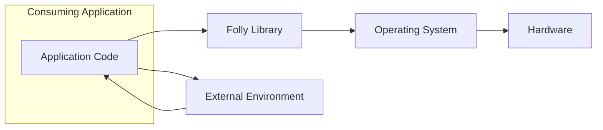
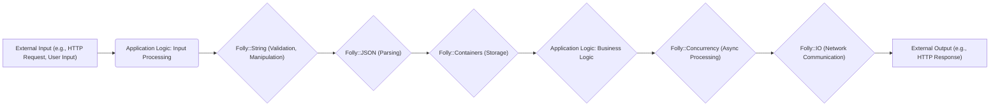

# Project Design Document: Facebook Folly Library (Improved)

**Version:** 1.1
**Date:** October 26, 2023
**Author:** AI Software Architect

## 1. Introduction

This document provides an enhanced architectural design of the Facebook Folly library (available at [https://github.com/facebook/folly](https://github.com/facebook/folly)), specifically tailored for threat modeling purposes. Folly is a widely used collection of C++ components emphasizing pragmatism and efficiency. Understanding its architecture is crucial for identifying potential security vulnerabilities when integrating and utilizing it within larger systems. This document focuses on key architectural aspects and potential attack surfaces relevant to security.

## 2. Goals and Objectives

The primary goal remains to provide a clear and concise architectural overview of the Folly library to facilitate effective threat modeling. Improved objectives include:

*   Providing more detailed descriptions of key components and their potential security implications.
*   Illustrating data flow with more concrete examples relevant to security.
*   Categorizing and elaborating on potential security considerations and attack vectors.
*   Serving as a robust foundation for identifying threat actors, attack vectors, and potential mitigations.

## 3. System Architecture

As Folly is a library, the "system" under consideration is an application or service that integrates and *uses* the Folly library. The architecture can be conceptualized as interactions between layers within the consuming application:

*   **External Environment:**  Sources of input data and destinations for output data (e.g., network, user input, file system).
*   **Application Layer:** The core application logic that orchestrates operations and utilizes Folly components. This layer is responsible for secure usage of Folly.
*   **Folly Library Layer:** The collection of Folly modules and components providing utility functionalities, data structures, and abstractions. Vulnerabilities here often stem from incorrect usage by the Application Layer.
*   **Operating System and Hardware Layer:** The underlying execution environment, providing resources and system calls.

**High-Level Architecture Diagram (Mermaid):**

## 4. Key Components

This section provides more detailed security considerations for key Folly components:

*   **`folly::String` and Related Utilities:**
    *   **Functionality:** Efficient string manipulation, including creation, modification, and searching.
    *   **Potential Security Implications:**
        *   **Buffer Overflows:** Incorrectly sized buffers when copying or manipulating strings, especially when dealing with external input or fixed-size buffers. For example, using `strcpy` (which Folly might wrap or provide alternatives for) without bounds checking.
        *   **Format String Vulnerabilities:**  If `folly::format` or similar functions are used with untrusted input as the format string, attackers could potentially read from or write to arbitrary memory locations.
        *   **Encoding Issues:** Improper handling of different character encodings could lead to vulnerabilities if not correctly validated and converted.
*   **`folly::Containers`:**
    *   **Functionality:** Implementations of various data structures like vectors, maps, and sets optimized for performance.
    *   **Potential Security Implications:**
        *   **Memory Corruption:** Incorrect iterator usage, accessing elements out of bounds, or improper handling of memory allocation/deallocation could lead to crashes or exploitable vulnerabilities. For instance, inserting elements into a vector while holding an invalidated iterator.
        *   **Denial of Service (DoS):**  Inserting a large number of elements without proper size limits could consume excessive memory, leading to a DoS.
        *   **Integer Overflows:** When calculating container sizes or indices, integer overflows could lead to unexpected behavior or memory corruption.
*   **`folly::Memory`:**
    *   **Functionality:** Tools for memory management, including custom allocators and smart pointers.
    *   **Potential Security Implications:**
        *   **Memory Leaks:** Failure to properly deallocate memory can lead to resource exhaustion and potentially DoS.
        *   **Double Free:** Attempting to free the same memory region multiple times can corrupt memory management structures and lead to crashes or exploitable conditions.
        *   **Use-After-Free:** Accessing memory after it has been freed can lead to unpredictable behavior and potential exploitation.
        *   **Heap Overflow:** Writing beyond the allocated bounds of a heap buffer.
*   **`folly::Concurrency`:**
    *   **Functionality:** Abstractions for threads, asynchronous operations (futures, promises), and synchronization primitives (mutexes, atomics).
    *   **Potential Security Implications:**
        *   **Race Conditions:** When multiple threads access and modify shared data without proper synchronization, leading to unpredictable and potentially exploitable states.
        *   **Deadlocks:** Situations where threads are blocked indefinitely, waiting for each other, leading to a DoS.
        *   **Improper Synchronization:**  Insufficient or incorrect use of mutexes, semaphores, or other synchronization mechanisms can lead to data corruption or inconsistent states.
*   **`folly::IO`:**
    *   **Functionality:** Networking and I/O utilities, including socket handling and asynchronous I/O.
    *   **Potential Security Implications:**
        *   **Buffer Overflows:** When receiving data from network sockets without proper bounds checking.
        *   **Injection Attacks:** If data received from network sockets is not properly sanitized before being used in commands or queries (e.g., SQL injection if used in database interactions).
        *   **Denial of Service:** Handling a large number of connections or malformed network packets could exhaust resources.
        *   **Man-in-the-Middle (MITM) Attacks:** If secure communication protocols (like TLS) are not implemented or configured correctly.
*   **`folly::cryptography`:**
    *   **Functionality:** Cryptographic primitives and utilities (often wrappers around external libraries).
    *   **Potential Security Implications:**
        *   **Weak Cryptography:** Using outdated or insecure cryptographic algorithms.
        *   **Improper Key Management:** Storing or handling cryptographic keys insecurely.
        *   **Padding Oracle Attacks:** Vulnerabilities related to the way padding is handled in certain encryption schemes.
        *   **Side-Channel Attacks:** Information leakage through timing variations or other observable side effects of cryptographic operations.
*   **`folly::json`:**
    *   **Functionality:** JSON parsing and serialization.
    *   **Potential Security Implications:**
        *   **Injection Attacks:** If the application constructs JSON from untrusted input without proper escaping, it could lead to injection vulnerabilities in systems consuming that JSON.
        *   **Denial of Service:** Parsing extremely large or deeply nested JSON structures could consume excessive resources.
        *   **Integer Overflows:** When parsing large numerical values from JSON.
*   **`folly::Uri`:**
    *   **Functionality:** URI parsing and manipulation.
    *   **Potential Security Implications:**
        *   **Injection Attacks:** If URI components (e.g., path, query parameters) are used in further processing without sanitization, it could lead to injection vulnerabilities (e.g., server-side request forgery).
        *   **Normalization Issues:** Inconsistent URI normalization could lead to bypasses in access control or validation mechanisms.
*   **`folly::Logging`:**
    *   **Functionality:** Logging infrastructure.
    *   **Potential Security Implications:**
        *   **Information Disclosure:** Logging sensitive information that should not be exposed.
        *   **Log Injection:** If log messages are constructed from untrusted input without proper sanitization, attackers could inject arbitrary log entries, potentially misleading administrators or exploiting log processing systems.

## 5. Data Flow

Data flow within a system using Folly involves the movement and transformation of data as it is processed by the application, leveraging Folly components. Consider these examples:

*   **Processing an HTTP Request:**
    *   Incoming HTTP request data (from the "External Environment") is received by the "Application Logic" (e.g., using a framework that might utilize `folly::IO`).
    *   The request headers and body (potentially strings) might be parsed and manipulated using `folly::String` utilities.
    *   JSON data within the request body could be parsed using `folly::json`.
    *   Data might be stored in `folly::Containers` for further processing.
    *   Asynchronous operations using `folly::Concurrency` might be used to handle the request concurrently.
    *   The response data might be serialized to JSON using `folly::json` and sent back (to the "External Environment").

*   **Handling User Input:**
    *   User input (from the "External Environment") is received by the "Application Logic".
    *   Input strings are validated and sanitized using `folly::String` functions to prevent injection attacks.
    *   Input data might be stored and managed using `folly::Containers`.

**Data Flow Diagram (Mermaid):**

## 6. Security Considerations

This section elaborates on potential security concerns, categorized for clarity:

*   **Input Validation Vulnerabilities:**
    *   Failure to validate and sanitize external input before processing it with Folly components (e.g., using untrusted strings with `folly::String` functions, parsing malicious JSON with `folly::json`).
    *   Improper handling of different character encodings.
*   **Memory Safety Vulnerabilities:**
    *   Buffer overflows when using `folly::String` or interacting with raw memory.
    *   Use-after-free errors due to incorrect memory management with `folly::Memory` tools or container usage.
    *   Double-free vulnerabilities.
    *   Memory leaks leading to resource exhaustion.
*   **Concurrency Vulnerabilities:**
    *   Race conditions in multithreaded applications using `folly::Concurrency` primitives incorrectly.
    *   Deadlocks due to improper synchronization.
*   **Cryptographic Vulnerabilities:**
    *   Using weak or outdated cryptographic algorithms provided by `folly::cryptography` (or its underlying libraries).
    *   Improper key management practices.
*   **Denial of Service (DoS) Vulnerabilities:**
    *   Exploiting resource consumption through large inputs (e.g., parsing very large JSON payloads).
    *   Triggering excessive memory allocation through container manipulation.
    *   Exhausting resources through improper handling of network connections.
*   **Injection Vulnerabilities:**
    *   Format string vulnerabilities when using `folly::format` with untrusted input.
    *   Potential for injection attacks if URI components from `folly::Uri` are used without sanitization.
    *   Log injection vulnerabilities if log messages are constructed from untrusted input.
*   **Dependency Chain Vulnerabilities:**
    *   Vulnerabilities in Folly's dependencies (e.g., Boost, OpenSSL) could indirectly affect applications using Folly.

## 7. Dependencies

Folly's dependencies remain a crucial security consideration:

*   **Core Dependencies:**
    *   Boost
    *   Double-Conversion
    *   Glog
    *   Gflags
    *   Libevent
*   **Optional Dependencies (for certain features):**
    *   OpenSSL or BoringSSL
    *   Zstd
    *   LZ4
    *   Snappy

It is essential to keep these dependencies updated to address known vulnerabilities. The security of the consuming application is partly reliant on the security of these underlying libraries.

## 8. Deployment Considerations

Secure deployment practices are critical when using Folly:

*   **Secure Compilation:** Employing compiler flags that help mitigate certain types of vulnerabilities (e.g., `-fstack-protector-strong`, `-D_FORTIFY_SOURCE=2`).
*   **Dependency Management:** Utilizing tools and processes to track and update Folly and its dependencies.
*   **Runtime Environment Security:** Ensuring the operating system and runtime environment are secure and patched.
*   **Access Controls:** Implementing appropriate access controls to protect the deployed application and its resources.

## 9. Future Considerations

Further enhancements to this document could include:

*   More granular data flow diagrams focusing on specific use cases or potential attack paths.
*   Detailed analysis of Folly's internal security mechanisms and coding practices.
*   Integration with threat modeling frameworks and tools.
*   Guidance on secure coding practices when using Folly components.

This improved design document provides a more comprehensive foundation for threat modeling the integration of the Facebook Folly library. By understanding the potential security implications of each component and the data flow within the application, security professionals and developers can more effectively identify and mitigate potential risks.