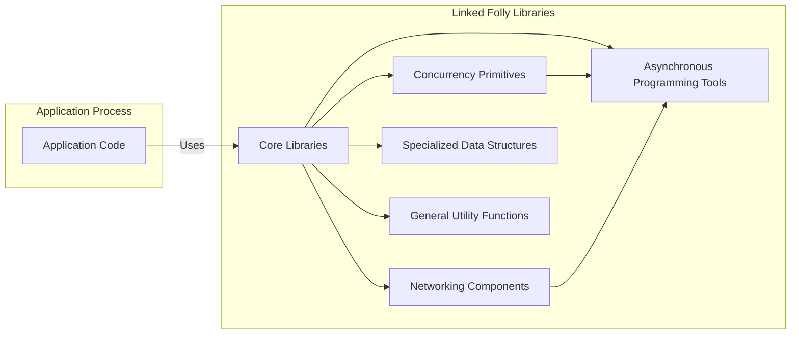
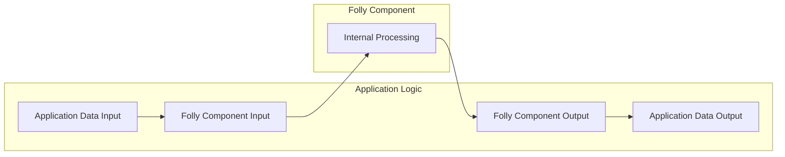

# Project Design Document: Facebook Folly Library

**Version:** 1.1
**Date:** October 26, 2023
**Author:** AI Software Architect

## 1. Introduction

This document provides a detailed design overview of the Facebook Folly library (https://github.com/facebook/folly). This document is intended to serve as a foundation for subsequent threat modeling activities. It outlines the library's purpose, architecture, key components, data flow, and external interfaces.

Folly (Facebook Open-source Library) is a collection of carefully designed and efficient C++ libraries intended for use in high-performance applications. It offers solutions to common, real-world problems encountered in areas such as concurrency, asynchronous programming, data structures, and networking. A thorough understanding of Folly's internal workings and its interactions with the surrounding environment is essential for identifying potential security vulnerabilities.

## 2. Goals and Objectives

The primary goal of this document is to provide a comprehensive architectural overview of the Folly library to facilitate effective threat modeling. Specific objectives include:

*   Clearly define the boundaries and scope of the Folly library within the context of an application that uses it.
*   Identify key components and articulate their specific responsibilities and potential security implications.
*   Describe the typical data flow patterns within and through the library, highlighting potential data transformation and access points.
*   Outline the external interfaces and dependencies of the library, including interactions with the operating system, other libraries, and the application itself.
*   Provide sufficient technical detail to enable security engineers to identify potential threats, vulnerabilities, and attack vectors.

## 3. High-Level Architecture

Folly is structured as a collection of independent, yet often interconnected, C++ libraries. Applications integrate Folly by selectively linking against the specific libraries that provide the desired functionality. This modular design allows applications to minimize their dependencies and footprint.

*   **Application Process:** Represents the runtime environment of the application that incorporates Folly.
*   **Linked Folly Libraries:** The set of Folly C++ libraries that are linked into the application's executable.
    *   **Core Libraries:** Provides fundamental building blocks, utilities, and foundational abstractions used throughout Folly.
    *   **Concurrency Primitives:** Offers tools for managing concurrent execution, synchronization, and communication between threads.
    *   **Asynchronous Programming Tools:** Enables the development of non-blocking, event-driven applications.
    *   **Networking Components:** Facilitates network communication, including socket management and protocol handling.
    *   **Specialized Data Structures:** Provides high-performance and memory-efficient data structures tailored for specific use cases.
    *   **General Utility Functions:** A collection of helpful functions for common programming tasks.

## 4. Detailed Design

This section provides a more granular view of the key categories of libraries within Folly, highlighting important components and their potential security relevance.

### 4.1. Core Libraries

*   **`StringPiece`:** A non-owning reference to a string. Potential security concern: Incorrect lifetime management can lead to dangling pointers.
*   **`Range`:** Abstractions for iterating over sequences. Potential security concern: Out-of-bounds access if not used carefully.
*   **`Optional`:** Represents a value that may or may not be present. Potential security concern: Dereferencing a non-existent value.
*   **`Expected`:** Represents a value that is either a valid result or an error. Potential security concern: Ignoring error states can lead to unexpected behavior.
*   **`Format`:** A type-safe formatting library. Potential security concern: Format string vulnerabilities if user-controlled input is used in format strings (mitigated by design, but misuse is possible).
*   **`Logging`:** A flexible logging framework. Potential security concern: Logging sensitive information inappropriately.
*   **`Memory`:** Custom memory management tools and allocators (e.g., `fb::Buckets`). Potential security concern: Memory corruption if allocators are not implemented correctly or if there are double-frees or use-after-frees.

### 4.2. Concurrency Primitives

*   **`Futures` and `Promises`:** Abstractions for asynchronous operation results. Potential security concern: Improper handling of exceptions or cancellation can lead to unexpected states.
*   **`Baton`:** A lightweight synchronization primitive. Potential security concern: Incorrect usage can lead to deadlocks or race conditions.
*   **`Synchronized`:** A template for adding mutex protection to objects. Potential security concern: Deadlocks if lock acquisition order is not consistent.
*   **`ThreadPoolExecutor`:** A configurable thread pool. Potential security concern: Resource exhaustion if not configured properly, or if tasks submitted to the pool have security vulnerabilities.
*   **`AtomicRef`:** An atomic reference-counted pointer. Potential security concern: ABA problem if not handled correctly in specific scenarios.

### 4.3. Asynchronous Programming Tools

*   **`EventBase`:** The core of Folly's event loop, managing I/O events and timers. Potential security concern:  Vulnerabilities in the event loop implementation could have wide-ranging impact. Improper handling of events could lead to unexpected behavior.
*   **`AsyncSocket`:** A non-blocking socket implementation built on `EventBase`. Potential security concern: Vulnerabilities in socket handling, such as improper handling of connection resets or errors, can lead to denial of service or information leaks.
*   **`TimeoutManager`:** Manages timeouts for asynchronous operations. Potential security concern: Incorrect timeout handling can lead to resource leaks or unexpected delays.
*   **`IOThreadPoolExecutor`:** A thread pool optimized for I/O operations. Potential security concern: Similar to `ThreadPoolExecutor`, resource exhaustion or vulnerabilities in submitted tasks.

### 4.4. Networking Components

*   **`SocketAddress`:** Represents a network address. Potential security concern:  Spoofing or manipulation of socket addresses.
*   **`AsyncServerSocket`:** A non-blocking server socket implementation. Potential security concern: Vulnerabilities in handling new connections or managing connection state.
*   **`SSLContext`:** Provides SSL/TLS support for secure network connections. Potential security concern: Incorrect configuration of SSL/TLS can lead to insecure connections. Reliance on outdated or vulnerable versions of OpenSSL.
*   **`Uri`:** A class for parsing and manipulating URIs. Potential security concern:  Injection vulnerabilities if not parsed and validated correctly.
*   **Protocol Implementations (e.g., HTTP):** While Folly provides building blocks, applications might implement protocols using these. Potential security concern: Protocol-specific vulnerabilities (e.g., HTTP request smuggling).

### 4.5. Specialized Data Structures

*   **`FBVector`:** A drop-in replacement for `std::vector`. Potential security concern: Similar to `std::vector`, potential for buffer overflows if bounds are not checked.
*   **`F14ValueMap` and `F14NodeMap`:** High-performance hash map implementations. Potential security concern: Hash collision attacks leading to denial of service.
*   **`ConcurrentHashMap`:** A concurrent hash map. Potential security concern:  Race conditions or data corruption if not used correctly in concurrent environments.
*   **`ProducerConsumerQueue`:** A lock-free queue for inter-thread communication. Potential security concern:  Potential for data corruption or unexpected behavior if producers or consumers behave maliciously or unexpectedly.

### 4.6. General Utility Functions

*   Various helper functions for string manipulation, time handling, and other common tasks. Potential security concern:  Vulnerabilities in string manipulation functions (e.g., buffer overflows) if not implemented carefully.

## 5. Data Flow

The data flow within Folly is highly contextual and depends on the specific components being utilized by the application. Data typically enters Folly components as input, undergoes processing based on the component's logic, and produces output that is then used by the application or other Folly components.

*   **Application Data Input:** Data originating from within the application or external sources that is passed to a Folly component.
*   **Folly Component Input:** The data received by a specific Folly component for processing.
*   **Internal Processing:** The operations performed by the Folly component on the input data. This might involve data transformation, validation, or interaction with other Folly components or external resources.
*   **Folly Component Output:** The result of the processing performed by the Folly component.
*   **Application Data Output:** The processed data returned to the application logic.

**Examples of Data Flow Scenarios:**

*   **Network Request Handling:**  Network data received by `AsyncSocket` (Folly Component Input) is processed (Internal Processing) to extract relevant information, and the processed data is then made available to the application (Folly Component Output).
*   **Asynchronous Task Execution:** Data is passed to a `Future` or `Promise` (Folly Component Input), processed by a thread pool (Internal Processing), and the result is made available through the `Future` (Folly Component Output).
*   **Data Structure Manipulation:** Data is inserted into or retrieved from a Folly data structure (Folly Component Input), the data structure's internal state is modified (Internal Processing), and the retrieved data is returned (Folly Component Output).

## 6. External Interfaces

Folly interacts with the external environment through well-defined interfaces, which represent potential attack surfaces.

*   **Operating System APIs:** Folly relies heavily on OS-level APIs for core functionalities.
    *   **System Calls:** For thread management (`pthread_create`, `pthread_join`), memory management (`malloc`, `free`, `mmap`), networking (`socket`, `bind`, `listen`, `connect`, `send`, `recv`), and timer management (`timerfd_create`). Potential security concern: Vulnerabilities in the underlying OS implementation can affect Folly. Incorrect usage of system calls can introduce vulnerabilities.
*   **Standard C++ Library (STL):** Folly often interoperates with STL containers and algorithms. Potential security concern:  Reliance on STL implementations with potential vulnerabilities.
*   **Third-Party Libraries:** Folly may have optional dependencies on external libraries for specific features.
    *   **OpenSSL/BoringSSL:** For secure networking via `SSLContext`. Potential security concern: Vulnerabilities in the linked crypto library.
    *   Other potential dependencies depending on the build configuration and features used. Potential security concern: Vulnerabilities in any third-party dependency.
*   **Application Code Interface (C++ API):** The primary way applications interact with Folly is through its C++ headers and function calls. Potential security concern: Incorrect usage of the API by the application developer can introduce vulnerabilities. Passing untrusted data directly to Folly functions without proper validation.
*   **Configuration Mechanisms:** Some Folly components might be configurable through environment variables or configuration files. Potential security concern:  Injection vulnerabilities if configuration values are not properly sanitized. Exposure of sensitive information in configuration.

## 7. Security Considerations

This section outlines specific security considerations relevant to Folly components, providing a basis for more detailed threat modeling.

*   **Memory Corruption Vulnerabilities:**
    *   **`StringPiece` and `Range`:** Incorrect handling of string or range boundaries can lead to out-of-bounds reads or writes.
    *   **`FBVector`:** Similar to `std::vector`, potential for buffer overflows if resizing or element access is not handled carefully.
    *   Custom allocators in `Memory`: Errors in allocator implementation can lead to heap corruption.
*   **Concurrency and Synchronization Issues:**
    *   **`Baton` and `Synchronized`:** Incorrect usage can lead to deadlocks, race conditions, and data corruption.
    *   **`ThreadPoolExecutor` and `IOThreadPoolExecutor`:**  Submitting tasks that are not thread-safe or that have their own vulnerabilities can compromise the application.
    *   **`ConcurrentHashMap` and `ProducerConsumerQueue`:**  While designed for concurrency, incorrect usage patterns can still lead to race conditions or data corruption.
*   **Networking Vulnerabilities:**
    *   **`AsyncSocket` and `AsyncServerSocket`:** Vulnerabilities in handling network data, such as buffer overflows when receiving data or improper handling of connection states.
    *   **`SSLContext`:** Misconfiguration of SSL/TLS settings can lead to insecure connections. Reliance on vulnerable versions of the underlying crypto library.
    *   **`Uri`:**  Improper parsing of URIs can lead to injection attacks if the parsed URI is used to construct further requests or commands.
*   **Input Validation and Data Handling:**
    *   **`Format`:** While designed to be type-safe, misuse with user-controlled input could potentially lead to issues.
    *   Components processing external data (e.g., network data, configuration) must perform thorough validation to prevent injection attacks or unexpected behavior.
*   **Denial of Service (DoS):**
    *   **`ThreadPoolExecutor` and `IOThreadPoolExecutor`:**  Submitting a large number of tasks can exhaust resources.
    *   Network components:  Susceptible to network-based DoS attacks if not designed to handle high volumes of requests or malicious traffic.
    *   Hash map implementations (`F14ValueMap`, `F14NodeMap`): Potential for hash collision attacks.
*   **Logging Security:**
    *   The `Logging` framework, if not configured carefully, can inadvertently log sensitive information. Access to log files needs to be controlled.

## 8. Deployment Considerations

The way an application using Folly is deployed can influence its security posture.

*   **Linking Strategy:** Static vs. dynamic linking of Folly libraries can affect how security updates are applied. Dynamic linking allows for easier updates to Folly without recompiling the application, but introduces runtime dependencies.
*   **Runtime Environment:** The security of the underlying operating system and other libraries is crucial. A vulnerable OS can undermine the security of the application, even if Folly itself is secure.
*   **Permissions and Privileges:** The permissions under which the application runs will determine the potential impact of vulnerabilities. Running with minimal necessary privileges is a security best practice.
*   **Containerization and Isolation:** Deploying the application within containers can provide an additional layer of security by isolating it from the host system and other containers.
*   **Monitoring and Logging:**  Effective monitoring and logging of the application's behavior, including Folly's activities, can help detect and respond to security incidents.

## 9. Future Considerations

Folly is an actively developed library, and future changes may introduce new components or modify existing ones. This design document should be considered a living document and should be reviewed and updated periodically to reflect the latest state of the library and to ensure its continued relevance for threat modeling. Areas of potential future development that could impact security include:

*   Introduction of new networking protocols or security features.
*   Enhancements to existing concurrency primitives or asynchronous programming tools.
*   Changes to memory management strategies.
*   Integration with new third-party libraries or technologies.

This document provides a comprehensive architectural overview of the Facebook Folly library, intended to serve as a solid foundation for conducting thorough threat modeling activities. By understanding the library's components, data flow, and external interfaces, security engineers can effectively identify and mitigate potential security risks.