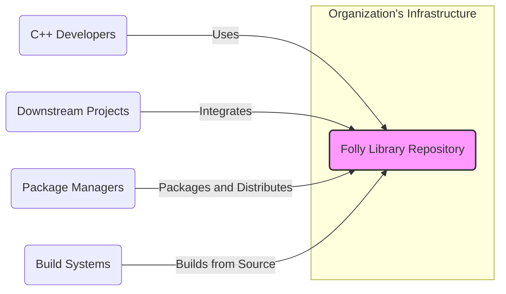
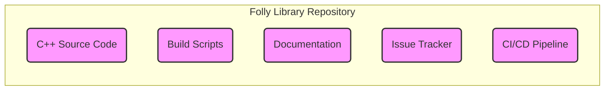
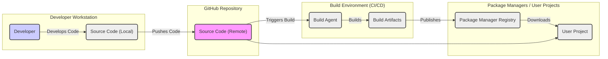

# BUSINESS POSTURE

- Business Priorities and Goals:
  - Provide a high-performance, reusable C++ library for general use.
  - Foster an open-source community around the library to encourage contributions and wider adoption.
  - Enhance the reputation of the organization (Facebook) as a leader in C++ development and open source.
  - Enable faster development and improved performance of applications that utilize the library.
- Business Risks:
  - Security vulnerabilities in the library could negatively impact users and damage the reputation of the organization.
  - Lack of community adoption could limit the library's impact and value.
  - Maintenance overhead and ensuring long-term support for the library.
  - Compatibility issues with different platforms and compiler versions.

# SECURITY POSTURE

- Existing Security Controls:
  - security control: Code review process for contributions (described in GitHub repository contribution guidelines).
  - security control: Static analysis tools are likely used internally by the organization during development (not explicitly documented in the public repository).
  - security control: Public vulnerability reporting mechanism via GitHub issues or security channels (standard open-source practice, not explicitly documented in the repository).
- Accepted Risks:
  - accepted risk: Potential for undiscovered vulnerabilities in the library due to its complexity and wide usage.
  - accepted risk: Reliance on community contributions for security fixes, which might have varying response times.
  - accepted risk: Open source nature means vulnerability disclosures are public, potentially leading to faster exploitation before patches are widely deployed.
- Recommended Security Controls:
  - security control: Implement automated static analysis and SAST tools in the CI/CD pipeline to proactively identify potential vulnerabilities.
  - security control: Establish a clear security vulnerability disclosure and response policy, including a dedicated security contact and expected response times.
  - security control: Perform regular security audits and penetration testing of the library, especially before major releases.
  - security control: Provide security guidelines and best practices for users integrating the library into their applications.
- Security Requirements:
  - Authentication: Not directly applicable to a library. Authentication is relevant for the development and contribution process (e.g., GitHub accounts for contributors).
  - Authorization: Not directly applicable to a library. Authorization is relevant for controlling access to the repository and contribution process (e.g., GitHub permissions).
  - Input Validation: Important for library functions that accept external input. The library should perform robust input validation to prevent vulnerabilities like buffer overflows, format string bugs, and injection attacks. Input validation should be implemented within the library's code.
  - Cryptography: If the library includes cryptographic functionalities, they must be implemented correctly and securely, following best practices and using well-vetted cryptographic libraries. Cryptographic implementations should be reviewed by security experts.

# DESIGN

## C4 CONTEXT

- Context Diagram Elements:
  - - Name: Folly Library Repository
    - Type: Software System
    - Description: The Folly C++ library repository hosted on GitHub, containing source code, documentation, and build scripts.
    - Responsibilities:
      - Provide source code for the Folly C++ library.
      - Manage contributions and maintain the library.
      - Document the library's functionalities and usage.
    - Security controls:
      - security control: GitHub access controls for repository maintainers.
      - security control: Code review process for contributions.
  - - Name: C++ Developers
    - Type: Person
    - Description: Developers who contribute to the Folly library or use it in their projects.
    - Responsibilities:
      - Contribute code, bug fixes, and feature requests to the library.
      - Use the library in their own C++ projects.
      - Report issues and provide feedback on the library.
    - Security controls:
      - security control: Authentication via GitHub accounts for contributions.
  - - Name: Downstream Projects
    - Type: Software System
    - Description: External software projects that integrate and utilize the Folly C++ library as a dependency.
    - Responsibilities:
      - Integrate Folly library into their codebase.
      - Utilize Folly's functionalities to enhance their own features and performance.
    - Security controls:
      - security control: Dependency management practices to ensure they are using trusted versions of Folly.
  - - Name: Package Managers
    - Type: Software System
    - Description: Systems like Conan, vcpkg, or system package managers that package and distribute the Folly library for easier consumption.
    - Responsibilities:
      - Package Folly library for different platforms and package managers.
      - Distribute Folly library to developers.
    - Security controls:
      - security control: Package signing and verification to ensure integrity of distributed packages.
  - - Name: Build Systems
    - Type: Software System
    - Description: Systems like CMake, Make, or Bazel used to build the Folly library from source code.
    - Responsibilities:
      - Build the Folly library from source code.
      - Generate build artifacts (libraries, headers).
    - Security controls:
      - security control: Build system configurations to ensure secure build process.

## C4 CONTAINER

- Container Diagram Elements:
  - - Name: C++ Source Code
    - Type: Code Repository
    - Description: Contains the C++ source code of the Folly library, organized into modules and components.
    - Responsibilities:
      - Implement the functionalities of the Folly library.
      - Provide the core logic and algorithms.
    - Security controls:
      - security control: Code review to identify vulnerabilities.
      - security control: Static analysis tools to detect potential issues.
  - - Name: Build Scripts
    - Type: Configuration Files
    - Description: CMake build scripts and configuration files used to compile and build the Folly library across different platforms.
    - Responsibilities:
      - Define the build process for the library.
      - Manage dependencies and compilation flags.
    - Security controls:
      - security control: Review of build scripts to prevent malicious modifications.
  - - Name: Documentation
    - Type: Documentation Files
    - Description: Documentation for the Folly library, including API references, usage guides, and examples.
    - Responsibilities:
      - Provide information on how to use the library.
      - Document API and functionalities.
    - Security controls:
      - security control: Review of documentation to prevent misleading or insecure usage instructions.
  - - Name: Issue Tracker
    - Type: Issue Tracking System
    - Description: GitHub issue tracker used to manage bug reports, feature requests, and security vulnerabilities.
    - Responsibilities:
      - Track and manage issues related to the library.
      - Facilitate communication and collaboration on issues.
    - Security controls:
      - security control: Access controls to manage issue reporting and resolution.
  - - Name: CI/CD Pipeline
    - Type: Automation System
    - Description: Automated CI/CD pipeline (likely GitHub Actions or similar) for building, testing, and potentially publishing the library.
    - Responsibilities:
      - Automate the build and test process.
      - Perform static analysis and security checks.
      - Potentially automate release and publication processes.
    - Security controls:
      - security control: Secure configuration of CI/CD pipeline.
      - security control: Integration of security scanning tools in the pipeline.

## DEPLOYMENT

- Deployment Architecture:
  - Folly is a library, not a standalone application. "Deployment" in this context refers to how it is made available for use by other projects. The most relevant deployment method is distribution via package managers and source code availability for direct integration. We will focus on source code availability and build process as deployment.

- Deployment Diagram Elements:
  - - Name: Developer Workstation
    - Type: Environment
    - Description: Developer's local machine where they write and test code.
    - Responsibilities:
      - Code development and local testing.
    - Security controls:
      - security control: Developer workstation security practices (OS hardening, antivirus, etc.).
  - - Name: Source Code (Local)
    - Type: File System
    - Description: Local copy of the Folly source code on the developer's workstation.
    - Responsibilities:
      - Storing the local codebase.
    - Security controls:
      - security control: Access controls on developer workstation file system.
  - - Name: GitHub Repository
    - Type: Code Repository
    - Description: Remote GitHub repository hosting the official Folly source code.
    - Responsibilities:
      - Version control and remote storage of the codebase.
      - Collaboration platform for development.
    - Security controls:
      - security control: GitHub access controls and security features.
  - - Name: Build Environment (CI/CD)
    - Type: Environment
    - Description: Automated build environment (e.g., GitHub Actions) for compiling and testing the library.
    - Responsibilities:
      - Automated building, testing, and security checks.
      - Generation of build artifacts.
    - Security controls:
      - security control: Secure configuration of CI/CD pipeline.
      - security control: Access controls to CI/CD environment.
  - - Name: Build Artifacts
    - Type: File System
    - Description: Compiled library files (e.g., .so, .a, .lib) and header files produced by the build process.
    - Responsibilities:
      - Storing compiled library artifacts.
    - Security controls:
      - security control: Integrity checks on build artifacts.
  - - Name: Package Manager Registry
    - Type: Package Repository
    - Description: Public or private package registries (e.g., ConanCenter, vcpkg registry) where Folly packages are published.
    - Responsibilities:
      - Hosting and distributing Folly packages.
    - Security controls:
      - security control: Package signing and verification.
      - security control: Access controls to package registry.
  - - Name: User Project
    - Type: Environment
    - Description: Downstream projects that integrate and use the Folly library.
    - Responsibilities:
      - Integrating and utilizing Folly library.
    - Security controls:
      - security control: Dependency management practices in user projects.

## BUILD

```mermaid
flowchart LR
    A("Developer") --> B("Code Changes")
    B --> C("Git Repository")
    C --> D("CI Trigger (e.g., GitHub Actions)")
    D --> E("Build Environment")
    E --> F("Compilation & Linking")
    F --> G("Unit Tests & Integration Tests")
    G --> H("SAST & Security Scanners")
    H --> I("Build Artifacts")
    I --> J("Package Registry (Optional)")

    style A fill:#ccf,stroke:#333,stroke-width:2px
    style B fill:#eee,stroke:#333,stroke-width:2px
    style C fill:#f9f,stroke:#333,stroke-width:2px
    style D fill:#eee,stroke:#333,stroke-width:2px
    style E fill:#eee,stroke:#333,stroke-width:2px
    style F fill:#eee,stroke:#333,stroke-width:2px
    style G fill:#eee,stroke:#333,stroke-width:2px
    style H fill:#eee,stroke:#333,stroke-width:2px
    style I fill:#eee,stroke:#333,stroke-width:2px
    style J fill:#eee,stroke:#333,stroke-width:2px
```

- Build Process Description:
  - Developer makes code changes and commits them to a local Git repository.
  - Changes are pushed to the remote GitHub repository.
  - A CI/CD pipeline (e.g., GitHub Actions) is triggered by code changes in the repository.
  - The CI/CD pipeline sets up a build environment with necessary dependencies and tools.
  - The build environment compiles and links the source code to create build artifacts (libraries, headers).
  - Automated unit tests and integration tests are executed to verify the functionality and stability of the library.
  - Static Application Security Testing (SAST) and other security scanners are run to identify potential vulnerabilities in the code.
  - If all checks pass, the build artifacts are generated and stored.
  - Optionally, build artifacts can be published to a package registry for distribution.
- Build Process Security Controls:
  - security control: Secure CI/CD pipeline configuration and access controls.
  - security control: Use of hardened build environments.
  - security control: Dependency scanning to ensure no vulnerable dependencies are introduced.
  - security control: Static Application Security Testing (SAST) tools integrated into the build pipeline to detect code-level vulnerabilities.
  - security control: Code linters and formatters to enforce coding standards and reduce potential errors.
  - security control: Signing of build artifacts to ensure integrity and authenticity.
  - security control: Access control to build artifacts storage and package registries.

# RISK ASSESSMENT

- Critical Business Processes:
  - Development and maintenance of the Folly C++ library.
  - Distribution of the Folly C++ library to users.
  - Maintaining the reputation and trust in the Folly library and the organization.
- Data to Protect and Sensitivity:
  - Source code of the Folly library: High sensitivity. Confidentiality and integrity are crucial to prevent unauthorized modifications or disclosure of intellectual property and potential vulnerabilities.
  - Build artifacts (libraries, headers): Medium sensitivity. Integrity is important to ensure users are using trusted and unmodified libraries. Availability is also important for users to access and utilize the library.
  - Issue tracker data (bug reports, security vulnerabilities): Medium sensitivity. Confidentiality of security vulnerability reports before a fix is released is important to prevent exploitation. Integrity and availability of issue tracking system are important for development and maintenance.

# QUESTIONS & ASSUMPTIONS

- Questions:
  - What specific static analysis and SAST tools are currently used in the development and CI/CD process for Folly?
  - Is there a formal security vulnerability disclosure and response policy in place for Folly?
  - Are regular security audits or penetration testing conducted on the Folly library?
  - What package managers are officially supported for distributing Folly binaries?
- Assumptions:
  - BUSINESS POSTURE assumption: The primary business goal is to provide a valuable open-source C++ library that benefits the wider community and enhances the organization's reputation.
  - SECURITY POSTURE assumption: Standard secure software development lifecycle practices are generally followed, including code review and some level of security testing, but specific details need to be confirmed.
  - DESIGN assumption: The project utilizes a standard CI/CD pipeline for building and testing, and the deployment primarily involves making source code and potentially pre-built packages available to users.