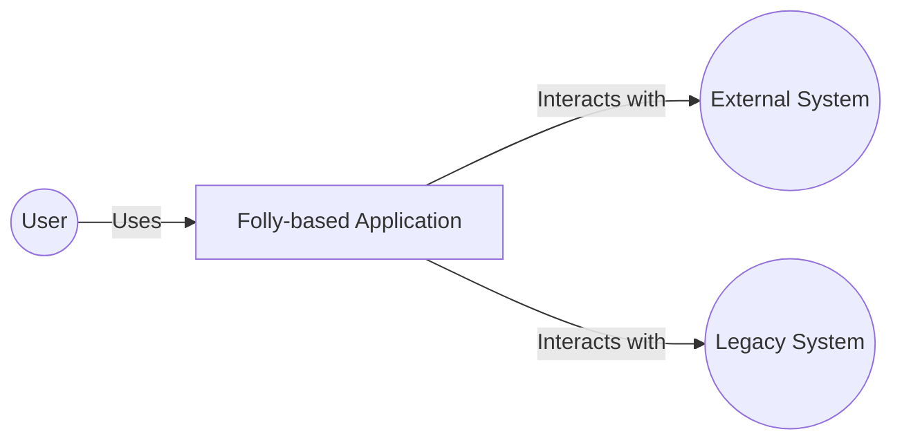
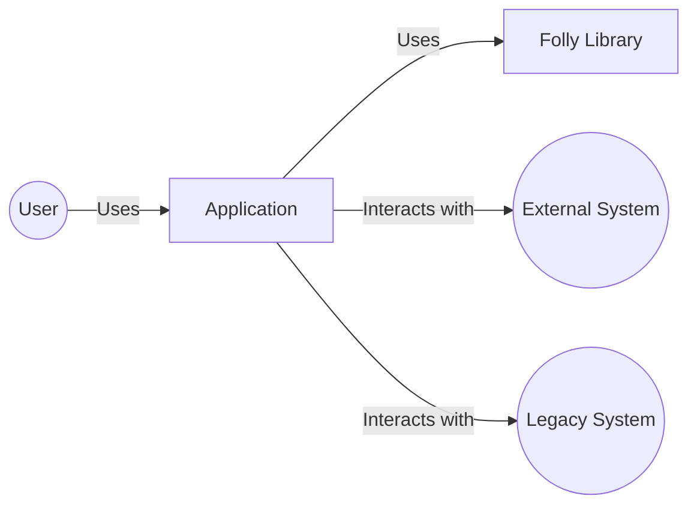
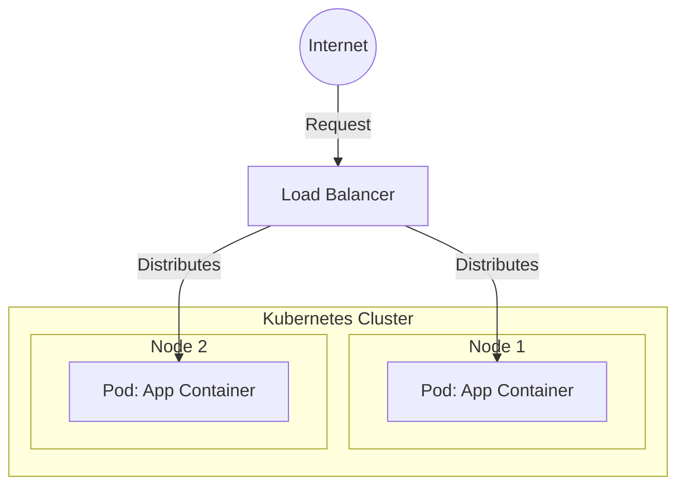
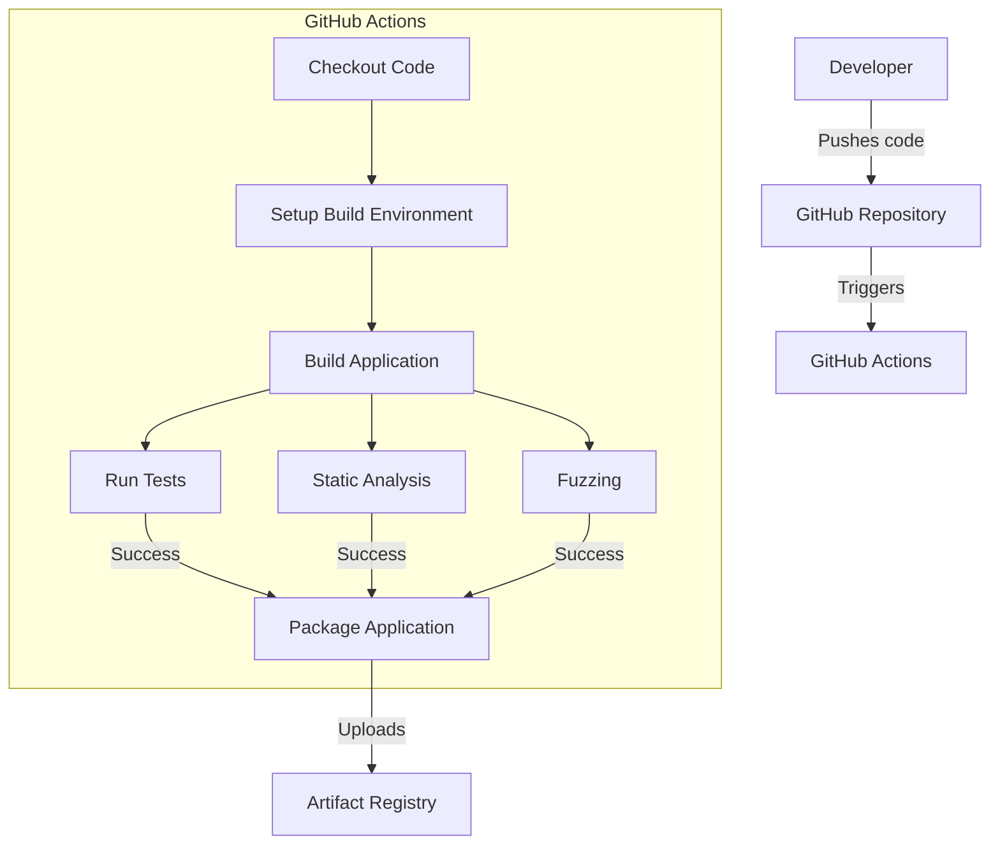

Okay, let's create a design document for the Folly project, keeping in mind its purpose and potential security considerations.

# BUSINESS POSTURE

Folly is a library of C++ components designed to be used as a foundation for high-performance, scalable, and robust applications, particularly within a large-scale environment like Facebook (Meta).

Priorities and Goals:

-   Provide reusable, well-tested, and high-performance C++ components.
-   Improve developer productivity by offering efficient implementations of common patterns.
-   Support the development of high-throughput, low-latency services.
-   Maintain backward compatibility where possible, but prioritize performance and correctness.
-   Foster an open-source community and encourage contributions.

Business Risks:

-   Vulnerabilities in Folly components could be exploited in applications that depend on them, potentially leading to widespread impact.  This is the most critical risk, given Folly's role as a foundational library.
-   Performance regressions in Folly could negatively affect the performance of dependent applications.
-   Incompatibility with specific compiler versions or platforms could limit adoption or require costly workarounds.
-   Lack of sufficient documentation or examples could hinder developer adoption and increase the risk of misuse.
-   Failure to address security vulnerabilities promptly could damage reputation and erode trust.

# SECURITY POSTURE

Existing Security Controls (based on the GitHub repository and common practices):

-   security control: Code Reviews: Pull requests are used, implying a code review process before merging changes. (Visible in the GitHub contribution guidelines and workflow).
-   security control: Static Analysis: Likely use of static analysis tools (e.g., linters, clang-tidy) to identify potential code quality and security issues. (Inferred from Facebook's engineering practices and presence of .clang-tidy and .clang-format).
-   security control: Dynamic Analysis: Use of fuzzing (OSS-Fuzz integration) to find bugs and vulnerabilities. (Visible in the fuzz/ subdirectory and integration with OSS-Fuzz).
-   security control: Testing: Extensive unit tests and benchmark tests to ensure correctness and performance. (Visible in the test/ and benchmark/ subdirectories).
-   security control: Compiler Warnings: Compilation with high warning levels to catch potential issues. (Inferred from standard C++ best practices).
-   security control: Dependency Management: Careful management of external dependencies to minimize the risk of supply chain attacks. (Inferred from Facebook's engineering practices).
-   security control: Secure Coding Practices: Emphasis on secure coding practices to prevent common vulnerabilities (e.g., buffer overflows, integer overflows). (Inferred from Facebook's engineering practices and the nature of the library).

Accepted Risks:

-   accepted risk: Complexity: Folly is a complex library, and despite best efforts, undiscovered vulnerabilities may exist.
-   accepted risk: Performance Trade-offs: Some optimizations might introduce subtle security risks, although performance is a key goal.
-   accepted risk: Third-Party Code: Folly may incorporate third-party code, which could introduce vulnerabilities.
-   accepted risk: Compiler/Platform Specific Issues: Undiscovered vulnerabilities may exist due to compiler or platform-specific behavior.

Recommended Security Controls:

-   security control: Regular Security Audits: Conduct periodic, independent security audits of the Folly codebase.
-   security control: Threat Modeling: Perform threat modeling exercises to identify potential attack vectors and vulnerabilities.
-   security control: Memory Safety: Explore using safer memory management techniques where feasible, even in C++, to mitigate memory corruption vulnerabilities.
-   security control: Input Validation: Ensure robust input validation for all components that handle external data.
-   security control: Hardening: Enable compiler and linker hardening flags (e.g., stack canaries, ASLR, DEP/NX) to make exploitation more difficult.

Security Requirements:

-   Authentication: Not directly applicable to Folly itself, as it's a library, not a service. However, applications using Folly should implement appropriate authentication mechanisms.
-   Authorization: Not directly applicable to Folly itself. Applications using Folly should implement appropriate authorization mechanisms.
-   Input Validation: Folly components that handle external data (e.g., network input, file parsing) *must* perform rigorous input validation to prevent injection attacks, buffer overflows, and other vulnerabilities. This is critical.
-   Cryptography: Folly provides some cryptographic primitives. These *must* be implemented using industry-standard algorithms and best practices.  Key management should be handled securely by applications using Folly.  Avoid rolling custom cryptography.
-   Error Handling: Folly components *must* handle errors gracefully and securely, avoiding information leakage or denial-of-service vulnerabilities.
-   Logging:  While Folly itself may not perform extensive logging, applications using Folly should implement appropriate logging to aid in security auditing and incident response.

# DESIGN

## C4 CONTEXT

Element Descriptions:

-   1.  Name: User
    2.  Type: Person
    3.  Description: A user of a Folly-based application.
    4.  Responsibilities: Interacts with the Folly-based application.
    5.  Security controls: N/A (External to the system)

-   1.  Name: Folly-based Application
    2.  Type: Software System
    3.  Description: An application built using the Folly library.
    4.  Responsibilities: Provides functionality to the user, utilizing Folly components.
    5.  Security controls: Code Reviews, Static Analysis, Dynamic Analysis, Testing, Compiler Warnings, Secure Coding Practices.

-   1.  Name: External System
    2.  Type: Software System
    3.  Description: An external system that the Folly-based application interacts with (e.g., a database, a web service).
    4.  Responsibilities: Provides services or data to the Folly-based application.
    5.  Security controls: Relies on the security of the external system. The Folly-based application should use secure communication protocols and validate data received from the external system.

-   1.  Name: Legacy System
    2.  Type: Software System
    3.  Description: A legacy system that the Folly-based application interacts with.
    4.  Responsibilities: Provides services or data to the Folly-based application.
    5.  Security controls: Relies on the security of the legacy system. The Folly-based application should use secure communication protocols and validate data received from the legacy system.

## C4 CONTAINER

Since Folly is a library, the container diagram is essentially an expansion of the context diagram, showing how Folly components are integrated within an application.

Element Descriptions:

-   1.  Name: User
    2.  Type: Person
    3.  Description: A user of the application.
    4.  Responsibilities: Interacts with the application.
    5.  Security controls: N/A (External to the system)

-   1.  Name: Application
    2.  Type: Container
    3.  Description: The main application logic, built using Folly.
    4.  Responsibilities: Provides functionality to the user, utilizing Folly components.
    5.  Security controls: Code Reviews, Static Analysis, Dynamic Analysis, Testing, Compiler Warnings, Secure Coding Practices.

-   1.  Name: Folly Library
    2.  Type: Container
    3.  Description: The Folly library, providing reusable components.
    4.  Responsibilities: Provides efficient implementations of common patterns and utilities.
    5.  Security controls: Code Reviews, Static Analysis, Dynamic Analysis (Fuzzing), Testing, Compiler Warnings, Secure Coding Practices.

-   1.  Name: External System
    2.  Type: Software System
    3.  Description: An external system that the application interacts with.
    4.  Responsibilities: Provides services or data to the application.
    5.  Security controls: Relies on the security of the external system. The application should use secure communication protocols and validate data received from the external system.

-   1.  Name: Legacy System
    2.  Type: Software System
    3.  Description: A legacy system that the application interacts with.
    4.  Responsibilities: Provides services or data to the application.
    5.  Security controls: Relies on the security of the legacy system. The application should use secure communication protocols and validate data received from the legacy system.

## DEPLOYMENT

Folly, as a library, is not deployed independently. It is *linked* into applications. Therefore, the deployment diagram focuses on how a Folly-based application would be deployed. We'll consider a common scenario: deploying a C++ application as a service on a Linux server.

Possible Deployment Solutions:

1.  Direct deployment on bare-metal servers.
2.  Deployment within containers (e.g., Docker) on a container orchestration platform (e.g., Kubernetes).
3.  Deployment as a virtual machine image on a cloud platform (e.g., AWS EC2, Google Compute Engine).

Chosen Solution (for detailed description): Containerized deployment using Docker and Kubernetes.

Element Descriptions:

-   1.  Name: Internet
    2.  Type: Network
    3.  Description: The public internet.
    4.  Responsibilities: Routes traffic to the application's load balancer.
    5.  Security controls: Network firewalls, intrusion detection/prevention systems.

-   1.  Name: Load Balancer
    2.  Type: Infrastructure
    3.  Description: Distributes incoming traffic across multiple instances of the application.
    4.  Responsibilities: Load balancing, health checks.
    5.  Security controls: TLS termination, DDoS protection, Web Application Firewall (WAF).

-   1.  Name: Kubernetes Cluster
    2.  Type: Infrastructure
    3.  Description: A cluster of nodes managed by Kubernetes.
    4.  Responsibilities: Orchestrates the deployment and scaling of the application containers.
    5.  Security controls: Kubernetes RBAC, network policies, pod security policies.

-   1.  Name: Node 1, Node 2
    2.  Type: Infrastructure
    3.  Description: A worker node in the Kubernetes cluster.
    4.  Responsibilities: Runs application containers.
    5.  Security controls: OS hardening, container runtime security.

-   1.  Name: Pod: App Container (PodA, PodB)
    2.  Type: Container
    3.  Description: A Kubernetes pod running the Folly-based application container.
    4.  Responsibilities: Executes the application code.
    5.  Security controls: Container image security (scanning for vulnerabilities), least privilege principle (running as non-root), resource limits.

## BUILD

The build process for a Folly-based application typically involves compiling the C++ code and linking it with the Folly library.  We'll describe a build process using GitHub Actions for CI/CD.

Build Process Description:

1.  Developer pushes code changes to the GitHub repository.
2.  GitHub Actions workflow is triggered.
3.  The workflow checks out the code.
4.  The build environment (compilers, dependencies, Folly) is set up.
5.  The application is built (compiled and linked).
6.  Unit tests are run.
7.  Static analysis tools (e.g., clang-tidy, linters) are executed.
8.  Fuzzing tests are run (if configured).
9.  If all tests and checks pass, the application is packaged (e.g., into a Docker image).
10. The packaged application (e.g., Docker image) is uploaded to an artifact registry (e.g., Docker Hub, GitHub Container Registry).

Security Controls in Build Process:

-   security control: Dependency Management: Use a dependency management system (e.g., Conan, vcpkg) to manage Folly and other dependencies, ensuring that known vulnerable versions are not used.
-   security control: Static Analysis: Integrate static analysis tools into the build process to identify potential code quality and security issues.
-   security control: Dynamic Analysis: Integrate fuzzing into the build process to find bugs and vulnerabilities.
-   security control: Software Composition Analysis (SCA): Use SCA tools to scan dependencies for known vulnerabilities.
-   security control: Build Automation: Use a CI/CD system (like GitHub Actions) to automate the build process, ensuring consistency and reproducibility.
-   security control: Artifact Signing: Sign the build artifacts (e.g., Docker images) to ensure their integrity and authenticity.
-   security control: Least Privilege: Run build steps with the least necessary privileges.

# RISK ASSESSMENT

Critical Business Processes:

-   The primary business process is the *execution of applications that rely on Folly*.  These applications could be anything from high-frequency trading systems to social media platforms.  The criticality depends entirely on the *specific application* using Folly.
-   The *development and maintenance of Folly itself* is also a critical process, as vulnerabilities in Folly can impact many downstream applications.

Data Sensitivity:

-   Folly itself, as a library, does *not* inherently handle sensitive data.  It provides tools, but the *application* using Folly is responsible for data handling.
-   The *sensitivity of data handled by applications using Folly varies greatly*.  It could range from non-sensitive public data to highly sensitive personal data, financial data, or intellectual property.  The application developers are responsible for classifying and protecting this data.

# QUESTIONS & ASSUMPTIONS

Questions:

-   What specific compiler versions and platforms are officially supported by Folly?
-   What is the process for reporting security vulnerabilities in Folly?
-   Are there any specific security certifications or compliance requirements that Folly aims to meet?
-   What are the specific performance targets and constraints for Folly components?
-   What is the long-term roadmap for Folly development, and are there any plans for major architectural changes?

Assumptions:

-   BUSINESS POSTURE: We assume a large-scale, high-performance environment similar to Meta, where performance and reliability are paramount.
-   SECURITY POSTURE: We assume a strong emphasis on security best practices, including code reviews, static analysis, and fuzzing. We assume that Facebook has internal security teams and processes that are not publicly documented.
-   DESIGN: We assume that Folly is used as a library within larger applications and is not deployed as a standalone service. We assume a containerized deployment model for Folly-based applications. We assume a CI/CD pipeline using GitHub Actions.