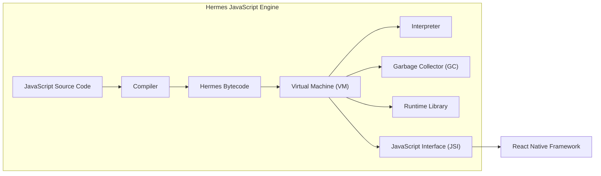
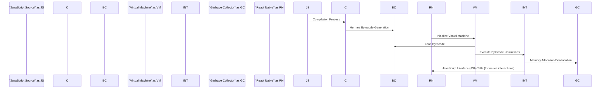

## Project Design Document: Hermes JavaScript Engine

**1. Introduction**

This document details the architectural design of the Hermes JavaScript engine, an open-source JavaScript engine specifically optimized for running React Native applications on Android and iOS platforms. Hermes aims to enhance the performance of these applications by focusing on faster startup times, reduced memory consumption, and efficient execution. This document serves as a comprehensive guide to the system's components, data flow mechanisms, and deployment strategies, forming a crucial foundation for subsequent threat modeling exercises. The complete source code for Hermes is publicly available at: https://github.com/facebook/hermes.

**2. Goals and Objectives**

The primary objectives driving the development of the Hermes project are:

* **Accelerated Application Startup:** Significantly decrease the time required for React Native applications to become interactive by precompiling JavaScript.
* **Minimized Memory Footprint:** Reduce the overall memory usage of React Native applications, which is particularly critical on resource-constrained mobile devices.
* **Enhanced Execution Performance:** Improve the speed and efficiency of JavaScript code execution within React Native applications through compiler and runtime optimizations.
* **Standard JavaScript Compliance:** Maintain a high level of compatibility with established JavaScript language features and the ECMAScript standard.
* **Seamless React Native Integration:** Provide a straightforward and efficient integration path within the React Native framework.

**3. System Architecture**

The Hermes JavaScript engine is structured around several core components that collaborate to execute JavaScript code.

* **Compiler:** This component is responsible for transforming JavaScript source code into Hermes bytecode. This process typically occurs offline during the application build phase. Key functionalities include:
    * **Parsing:** Analyzing the JavaScript source code to create an Abstract Syntax Tree (AST).
    * **Optimization:** Applying various optimization techniques to the AST to improve performance.
    * **Bytecode Generation:** Emitting Hermes-specific bytecode instructions based on the optimized AST.
* **Hermes Bytecode:** This is a platform-independent, compact, and optimized representation of the JavaScript code. Its design facilitates efficient loading and execution by the Hermes Virtual Machine.
* **Virtual Machine (VM):** The central execution environment for Hermes bytecode. It encompasses several sub-components:
    * **Interpreter:** Executes the bytecode instructions sequentially.
    * **Just-In-Time (JIT) Compiler (Optional, Future Consideration):** While currently primarily an interpreter-based VM, future versions might incorporate a JIT compiler for further performance gains on frequently executed code.
    * **Garbage Collector (GC):** Manages dynamic memory allocation and deallocation. Hermes employs a generational garbage collector to efficiently reclaim memory occupied by unused objects.
    * **Runtime Library:** Provides implementations of built-in JavaScript objects (e.g., `Object`, `Array`, `String`), functions (e.g., `parseInt`, `setTimeout`), and core functionalities required for JavaScript execution.
* **JavaScript Interface (JSI) Integration Layer:** This layer facilitates communication and interaction between the JavaScript code running within the Hermes VM and the native components of the React Native framework. It enables JavaScript to invoke native functions and access native modules.

**4. Data Flow**

The flow of data within the Hermes engine follows these key stages:

1. **Compilation Phase:**
    * JavaScript source code files are provided as input to the Hermes Compiler.
    * The Compiler parses the source code, generating an Abstract Syntax Tree (AST).
    * Optimization passes are applied to the AST to improve performance characteristics.
    * The Compiler then generates Hermes bytecode, which is the output of this phase. This bytecode is typically bundled within the application package.
2. **Runtime Execution Phase:**
    * When the React Native application starts, the Hermes Virtual Machine is initialized.
    * The VM loads the precompiled Hermes bytecode from the application bundle into memory.
    * The Interpreter within the VM begins executing the bytecode instructions sequentially.
    * During execution, the Garbage Collector automatically manages memory allocation and deallocation, reclaiming memory from objects that are no longer referenced.
    * When JavaScript code needs to interact with native functionalities, it utilizes the JavaScript Interface (JSI) to communicate with the React Native framework. This involves marshaling data between the JavaScript and native environments.

**5. Deployment Model**

Hermes is primarily deployed as the JavaScript engine within React Native applications running on mobile devices.

* **On-Device Execution:** The Hermes engine resides and executes directly on the user's mobile device (Android or iOS). The compiled Hermes bytecode is packaged within the application's installation files (APK for Android, IPA for iOS).
* **React Native Integration:**  Developers configure their React Native projects to utilize Hermes as the JavaScript engine. This involves making changes to the project's build configuration files (e.g., `android/app/build.gradle` for Android).
* **Build-Time Compilation:** The process of compiling JavaScript code to Hermes bytecode is typically integrated into the application's build pipeline. This can occur on the developer's local machine during development or on a Continuous Integration/Continuous Deployment (CI/CD) server as part of the release process. The React Native tooling provides mechanisms to trigger the Hermes compiler.

**6. Security Considerations**

Security is a critical aspect of the Hermes design. Key considerations include:

* **Code Integrity:**
    * **Bytecode Verification:** Mechanisms to ensure the integrity and authenticity of the compiled Hermes bytecode are essential to prevent malicious code injection or tampering.
    * **Secure Compilation Environment:**  The build environment where JavaScript is compiled into bytecode should be secured to prevent unauthorized modification of the compilation process.
* **Sandbox Security:**
    * **VM Isolation:** The Hermes Virtual Machine operates within a sandbox provided by the operating system and the React Native framework. Vulnerabilities that could allow escape from this sandbox need to be addressed.
    * **Resource Limits:** Implementing and enforcing resource limits (e.g., memory, execution time) can help mitigate denial-of-service attacks.
* **Memory Safety:**
    * **Garbage Collector Security:**  Bugs or vulnerabilities in the Garbage Collector could lead to memory corruption, potentially allowing attackers to gain control of the application.
    * **Bounds Checking:** Ensuring proper bounds checking during memory access within the VM is crucial to prevent buffer overflows.
* **JavaScript Interface (JSI) Security:**
    * **Secure Native Module Interactions:**  The interface between JavaScript and native code (JSI) must be carefully designed to prevent vulnerabilities arising from interactions with potentially malicious native modules. Input validation and secure coding practices in native modules are essential.
    * **Data Marshaling Security:** Securely handling data passed between JavaScript and native code is important to prevent injection attacks or data breaches.
* **JavaScript Language Security:**
    * **Mitigation of JavaScript Vulnerabilities:** Hermes needs to handle potential vulnerabilities inherent in the JavaScript language itself (e.g., prototype pollution, type confusion) to prevent their exploitation.
    * **Content Security Policy (CSP):** While not directly a Hermes feature, integration with and enforcement of Content Security Policy within the React Native environment can help mitigate certain types of attacks (e.g., cross-site scripting).
* **Denial of Service (DoS) Prevention:**
    * **Script Execution Timeouts:** Implementing timeouts for long-running scripts can prevent malicious or poorly written code from consuming excessive resources and causing the application to become unresponsive.
    * **Memory Limits:** Enforcing limits on memory allocation can prevent memory exhaustion attacks.

**7. Assumptions and Constraints**

* **Trusted Build Pipeline:** It is assumed that the process of compiling JavaScript code to Hermes bytecode occurs within a secure and trusted build environment.
* **Reliance on Operating System Security:** Hermes relies on the underlying operating system's security features for process isolation, memory protection, and other security primitives.
* **Integration within React Native Ecosystem:** Hermes is designed to function within the React Native framework and relies on its APIs, infrastructure, and security mechanisms.
* **Target Mobile Platforms:** The primary target platforms for Hermes are Android and iOS. Security considerations are focused on the characteristics and vulnerabilities of these mobile environments.

**8. Future Considerations**

* **Just-In-Time (JIT) Compilation:** Exploring and potentially implementing a JIT compiler to further optimize the performance of frequently executed code.
* **Enhanced Security Audits:** Conducting regular and thorough security audits and penetration testing to identify and address potential vulnerabilities.
* **Improved Developer Tooling:** Developing enhanced debugging and profiling tools specifically for Hermes to aid developers in identifying and resolving performance and security issues.
* **Support for Emerging JavaScript Standards:** Continuously updating Hermes to support the latest ECMAScript specifications and language features.
* **Potential for Broader Adoption:** Investigating the feasibility and benefits of using Hermes in other JavaScript runtime environments beyond React Native.

This detailed design document provides a comprehensive overview of the Hermes JavaScript engine's architecture, data flow, and deployment model, highlighting key security considerations. This information is crucial for conducting effective threat modeling and implementing appropriate security measures.
