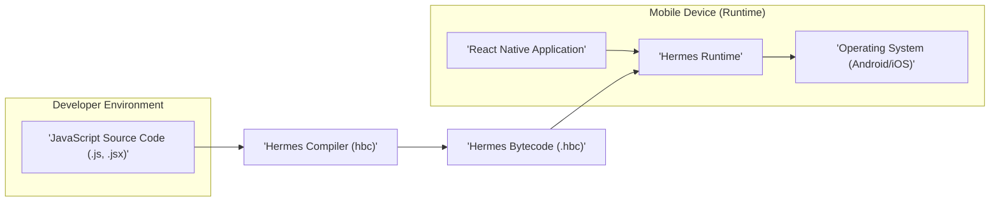
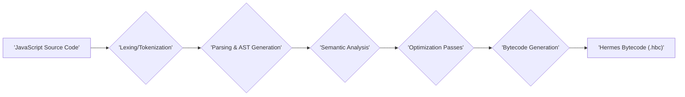
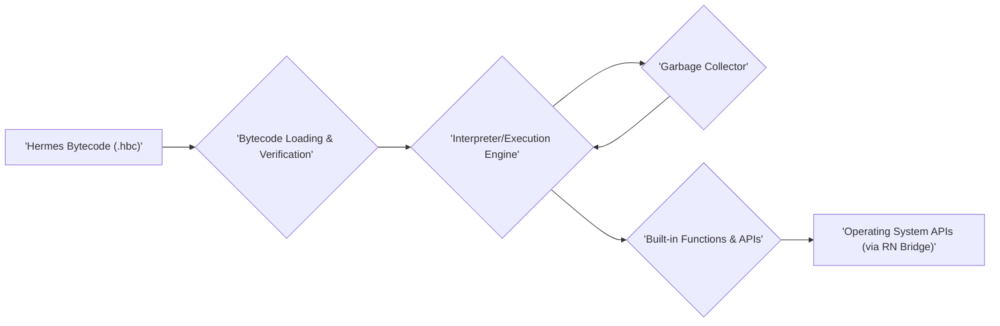

# Project Design Document: Hermes JavaScript Engine

**Version:** 1.1
**Date:** October 26, 2023
**Author:** AI Software Architect

## 1. Introduction

This document provides a detailed design overview of the Hermes JavaScript engine, an open-source JavaScript engine developed by Facebook, specifically optimized for running React Native applications on mobile devices. This document aims to provide a comprehensive understanding of Hermes' architecture, components, and data flows, which will serve as the foundation for subsequent threat modeling activities. This revision includes more detail on specific components and potential security considerations.

## 2. Goals

*   Clearly define the architecture and components of the Hermes JavaScript engine, with more specific details on key modules.
*   Describe the key processes and data flows within Hermes, elaborating on the steps involved.
*   Identify the major interfaces and interactions with external systems, providing more context on the nature of these interactions.
*   Provide sufficient detail to facilitate effective threat modeling, including more concrete examples of potential security concerns.

## 3. Scope

This document covers the core architecture and functionality of the Hermes JavaScript engine as represented in the provided GitHub repository. It focuses on the compilation process, runtime environment, and integration with the React Native framework. It does not delve into the specifics of the React Native framework itself, nor does it cover the native platform SDKs (Android/iOS) in detail, except where they directly and significantly interact with Hermes. This version provides more detail on the internal stages of compilation and runtime execution.

## 4. High-Level Architecture

The following diagram illustrates the high-level architecture of Hermes:



**Components:**

*   **JavaScript Source Code (.js, .jsx):** The input to the Hermes compilation process. This is the standard JavaScript code written by developers, adhering to ECMAScript standards.
*   **Hermes Compiler (hbc):** A standalone command-line tool responsible for ahead-of-time (AOT) compilation of JavaScript source code into Hermes bytecode. This involves parsing, optimization, and bytecode generation.
*   **Hermes Bytecode (.hbc):** A compact, platform-independent bytecode format specifically designed for efficient execution by the Hermes Runtime. It contains instructions optimized for the Hermes virtual machine.
*   **React Native Application:** The application framework that embeds and utilizes the Hermes Runtime to execute JavaScript code. It provides the necessary native infrastructure for running JavaScript on mobile devices.
*   **Hermes Runtime:** The core component running on the mobile device, responsible for interpreting and executing the Hermes bytecode. This includes the interpreter, garbage collector, and built-in functions.
*   **Operating System (Android/iOS):** The underlying operating system providing the necessary resources and APIs for the Hermes Runtime, such as memory management, threading, and access to hardware.

## 5. Detailed Design

### 5.1 Compilation Process

The compilation process transforms JavaScript source code into Hermes bytecode. This is typically done as a build step before the application is deployed to a device, often integrated into the React Native build pipeline.



**Steps:**

*   **Lexing/Tokenization:** The input JavaScript source code is broken down into a stream of tokens, representing the basic building blocks of the language (keywords, identifiers, operators, etc.).
*   **Parsing & AST Generation:** The stream of tokens is then parsed to construct an Abstract Syntax Tree (AST), a hierarchical tree representation of the code's structure, capturing the relationships between different parts of the code.
*   **Semantic Analysis:** This stage involves checking the semantic correctness of the code, ensuring that variable references are valid, types are consistent where necessary, and the code adheres to the language's rules.
*   **Optimization Passes:** Various optimization techniques are applied to the AST to improve the performance and efficiency of the generated bytecode. These optimizations might include:
    *   **Inlining:** Replacing function calls with the actual function body to reduce overhead.
    *   **Dead code elimination:** Removing code that will never be executed.
    *   **Constant folding:** Evaluating constant expressions at compile time.
    *   **Instruction selection:** Choosing the most efficient bytecode instructions for the target architecture.
*   **Bytecode Generation:** The optimized AST is then translated into Hermes bytecode instructions. This bytecode is designed to be a low-level, platform-independent representation of the JavaScript code, optimized for the Hermes virtual machine.
*   **Hermes Bytecode Output:** The generated bytecode is stored in a `.hbc` file, which is then bundled with the application's assets.

### 5.2 Runtime Environment

The Hermes Runtime is responsible for executing the pre-compiled Hermes bytecode on the target mobile device. It provides the environment necessary for the bytecode to run and interact with the device.



**Components:**

*   **Bytecode Loading & Verification:** The Hermes Runtime loads the `.hbc` file from the application bundle into memory. Verification steps might be performed to ensure the integrity and validity of the bytecode.
*   **Interpreter/Execution Engine:** The core of the runtime, responsible for fetching, decoding, and executing the bytecode instructions sequentially. Hermes employs an interpreter-based approach, focusing on startup performance and memory efficiency.
*   **Garbage Collector:** Manages memory allocation and deallocation for JavaScript objects created during runtime. Hermes uses a generational garbage collector to reclaim memory occupied by objects that are no longer in use, preventing memory leaks.
*   **Built-in Functions & APIs:** Provides implementations for standard JavaScript built-in objects (e.g., `Array`, `String`, `Math`) and global functions (e.g., `parseInt`, `setTimeout`). These are implemented natively for performance.
*   **Operating System APIs (via RN Bridge):** The runtime interacts with the underlying operating system to access device resources and functionalities. This interaction is primarily mediated through the React Native Bridge, which facilitates communication between the JavaScript environment and native code.

### 5.3 Integration with React Native

Hermes is designed to be tightly integrated with the React Native framework, replacing the previously used JavaScriptCore engine.

```mermaid
graph LR
    A["'React Native Application (JavaScript)'"] --> B["'React Native Bridge (Serialization)'"]
    B --> C["'Native Modules (Android/iOS)'"]
    C --> D["'Operating System'"]
    E["'Hermes Runtime'"] -- Executes JavaScript --> F["'React Native Bridge (Deserialization)'"]
    F == Data == B
```

**Interaction Points:**

*   **JavaScript Execution:** The React Native framework initializes and uses the Hermes Runtime to execute the application's JavaScript code. The runtime provides the execution environment for the JavaScript logic of the application.
*   **React Native Bridge:** A crucial mechanism that enables communication between JavaScript code running in the Hermes Runtime and native code (written in Java/Kotlin for Android and Objective-C/Swift for iOS). This involves:
    *   **Serialization:** Converting JavaScript data structures into a format suitable for transmission to the native side.
    *   **Deserialization:** Converting the received data back into native data structures.
*   **Native Modules:** Platform-specific code that provides access to device features and functionalities not directly available in JavaScript (e.g., accessing the camera, geolocation, sensors). The Hermes Runtime interacts with these modules via the asynchronous message passing mechanism of the React Native Bridge.

## 6. Data Flows

### 6.1 Compilation Data Flow

1. The developer writes JavaScript code using a text editor or IDE.
2. The Hermes Compiler (`hbc`) is invoked, typically as part of the build process, and takes the JavaScript source code files as input.
3. The compiler performs lexical analysis and tokenization to break down the code into tokens.
4. The tokens are parsed to create an Abstract Syntax Tree (AST) representing the code's structure.
5. Semantic analysis is performed to ensure the code is meaningful and adheres to language rules.
6. Various optimization passes are applied to the AST to improve performance.
7. The optimized AST is translated into Hermes bytecode instructions.
8. The Hermes bytecode is written to a `.hbc` file, which is then included in the application bundle.

### 6.2 Runtime Data Flow

1. When the React Native application starts on a mobile device, the Hermes Runtime is initialized by the native host.
2. The runtime loads the pre-compiled `.hbc` file from the application's assets into memory.
3. The interpreter within the runtime begins fetching and executing the bytecode instructions sequentially.
4. During execution, the runtime allocates memory for JavaScript objects.
5. The garbage collector periodically runs to identify and reclaim memory occupied by unreachable objects.
6. JavaScript code may call built-in functions and access built-in objects provided by the runtime.
7. When JavaScript code needs to interact with native functionalities, it sends messages across the React Native Bridge.
8. The React Native Bridge serializes the data and passes it to the appropriate native module.
9. The native module performs the requested operation, potentially interacting with operating system APIs.
10. The native module sends a response back across the bridge.
11. The bridge deserializes the response and delivers it back to the JavaScript code running in the Hermes Runtime.

## 7. Interfaces and External Interactions

*   **Input:** JavaScript source code files (`.js`, `.jsx`) provided to the Hermes Compiler.
*   **Output:** Hermes bytecode file (`.hbc`) generated by the Hermes Compiler.
*   **React Native Bridge:** A fundamental interface for communication between the Hermes Runtime and the native parts of the React Native application. This involves:
    *   **Asynchronous Message Passing:**  JavaScript calls native functions and receives results asynchronously.
    *   **Data Serialization/Deserialization:**  Data is converted between JavaScript and native representations.
*   **Operating System APIs:** The Hermes Runtime, indirectly through the React Native Bridge and native modules, interacts with OS-level APIs for various functionalities, including:
    *   **File System Access:** Reading and writing files.
    *   **Network Communication:** Making network requests.
    *   **Device Sensors:** Accessing sensor data (e.g., accelerometer, gyroscope).
    *   **UI Rendering:**  Interacting with the native UI framework.
    *   **Memory Management:** The OS manages the memory allocated to the application, including the Hermes Runtime.

## 8. Security Considerations (Preliminary)

This section outlines initial security considerations based on the design. A more detailed threat model will build upon this foundation.

*   **Bytecode Manipulation:** If an attacker gains access to the device's file system, they might attempt to modify the `.hbc` file to inject malicious bytecode. This could lead to arbitrary code execution within the application's context.
*   **Vulnerabilities in the Hermes Runtime:** Bugs or vulnerabilities in the interpreter, garbage collector, or built-in functions could be exploited by carefully crafted JavaScript code. This could lead to crashes, information disclosure, or even remote code execution if combined with other vulnerabilities. For example, a buffer overflow in a built-in function could be triggered.
*   **Security of the React Native Bridge:**  The serialization and deserialization process across the bridge is a potential attack surface. Vulnerabilities in the bridge implementation could allow attackers to inject malicious data or intercept sensitive information being passed between JavaScript and native code. Improperly secured native modules could also be exploited.
*   **Access to Native APIs:**  Overly permissive or vulnerable native modules could expose sensitive device functionalities or data to JavaScript code, potentially leading to security breaches. For instance, a native module that doesn't properly validate input could be used to access unauthorized files.
*   **Supply Chain Security:**  Compromise of the Hermes Compiler or its dependencies could lead to the generation of malicious bytecode, affecting all applications built with that compromised compiler.
*   **Absence of JIT Compilation:** While the lack of JIT compilation reduces the attack surface associated with JIT vulnerabilities, it's important to consider the performance implications and whether future additions of JIT might introduce new security concerns.
*   **Memory Safety Issues:** Vulnerabilities in the garbage collector could lead to memory corruption, potentially allowing attackers to control program execution.
*   **Information Disclosure:** Improper handling of sensitive data within the Hermes Runtime or during communication across the React Native Bridge could lead to information disclosure.

## 9. Deployment Considerations

*   The Hermes Compiler is typically integrated into the React Native development workflow and executed during the application build process.
*   The generated `.hbc` file is bundled as an asset within the application package (APK for Android, IPA for iOS).
*   The Hermes Runtime is included as a shared library or framework within the React Native application.
*   The operating system loads the application, including the Hermes Runtime, into memory when the user launches the application.
*   Considerations for code signing and integrity checks of the `.hbc` file during deployment to prevent tampering.

## 10. Future Considerations

*   **Potential for JIT Compilation:** Future versions of Hermes might explore the introduction of Just-In-Time (JIT) compilation to further optimize performance. This would require careful consideration of the security implications and potential vulnerabilities associated with JIT compilers.
*   **WebAssembly (Wasm) Integration:**  Exploring the possibility of supporting the execution of WebAssembly modules within the Hermes environment could expand its capabilities but would also introduce new security considerations related to Wasm's security model.
*   **Enhanced Debugging and Profiling Tools:** Further development of debugging and profiling tools specifically for Hermes to aid developers in identifying and resolving issues.
*   **Security Hardening:** Continuous efforts to identify and mitigate potential security vulnerabilities within the Hermes Runtime and compilation process.

This revised document provides a more detailed design overview of the Hermes JavaScript engine, offering a stronger foundation for subsequent threat modeling activities. The enhanced descriptions of components, data flows, and interfaces, along with more specific security considerations, will enable a more thorough and effective security analysis.