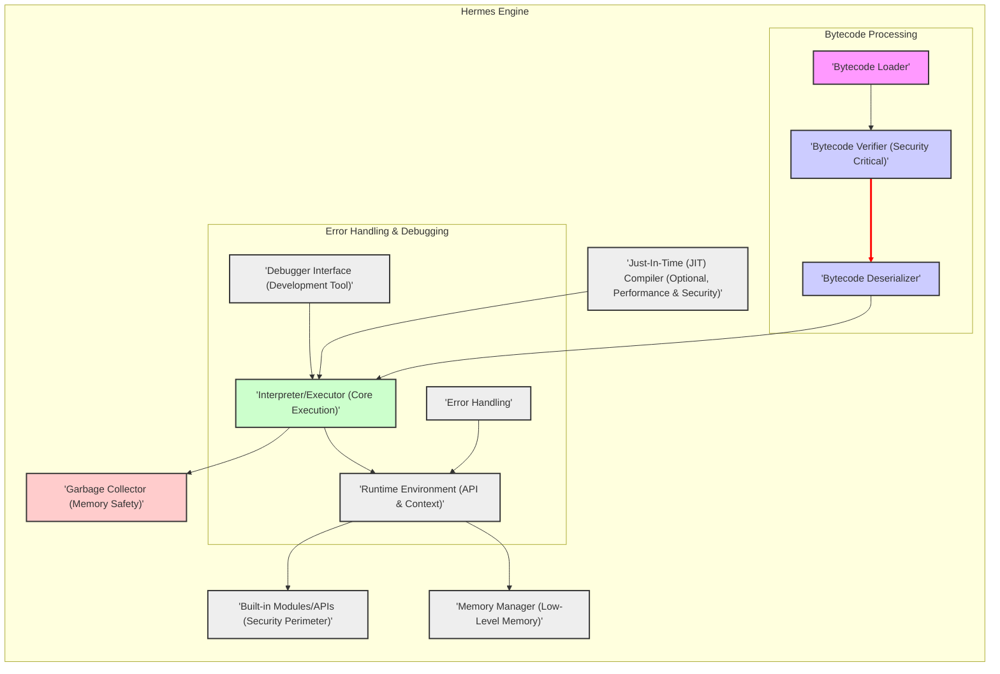
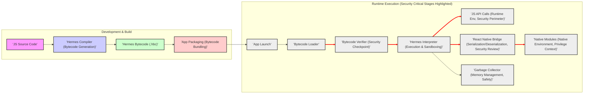

# Hermes JavaScript Engine - Project Design Document

**Version:** 1.1
**Date:** October 26, 2023
**Author:** AI Expert (You)

## 1. Introduction

This document provides an enhanced and more detailed design overview of the Hermes JavaScript engine, an open-source JavaScript engine optimized for React Native. Building upon version 1.0, this document further refines the system architecture, clarifies component interactions, and expands on security considerations. It is specifically tailored to serve as a robust foundation for subsequent threat modeling activities. This document aims to provide a comprehensive understanding of Hermes's internal workings, data flow, and security landscape to facilitate the identification, analysis, and mitigation of potential security risks.

## 2. Goals and Objectives

The primary goals of the Hermes project remain focused on enhancing the React Native ecosystem:

* **Superior React Native Application Performance:** Significantly reduce application startup time, minimize memory footprint, and decrease overall application size, leading to a smoother user experience.
* **Mobile-First Optimization:**  Specifically tailor the engine's design and implementation for resource-constrained mobile devices, ensuring efficient operation on a wide range of mobile hardware.
* **Modern JavaScript Standard Compliance:**  Provide a fully compliant and up-to-date JavaScript engine that supports the latest ECMAScript language features and standards, enabling developers to leverage modern JavaScript capabilities.
* **Seamless React Native Integration:**  Maintain complete compatibility and seamless integration with the React Native framework, ensuring a smooth transition and consistent behavior for React Native developers.
* **Open and Collaborative Development:**  Foster an open-source community around Hermes, encouraging contributions, transparency, and collaborative improvement of the engine.

This design document is specifically enhanced to:

* **Provide a more granular and detailed articulation of the Hermes architecture, including internal data structures and algorithms where relevant for security.**
* **Clearly define the interfaces and interactions between key components, highlighting potential trust boundaries.**
* **Elaborate on the data flow within the engine and its interaction with the React Native Bridge, focusing on data serialization and deserialization points.**
* **Significantly expand and categorize the initial security considerations, providing a more structured and actionable basis for threat modeling.**
* **Serve as a comprehensive and readily understandable resource for security professionals, developers, and project stakeholders involved in threat modeling and security assessments.**

## 3. Target Audience

The target audience for this document remains consistent, but with an increased emphasis on security professionals:

* **Security Engineers and Threat Modelers:** To gain an in-depth understanding of the system architecture, data flow, and potential attack surfaces for effective threat modeling, vulnerability assessments, and penetration testing.
* **Software Developers (Hermes Contributors and React Native Developers):** To acquire a detailed understanding of Hermes's internal workings for development, debugging, performance optimization, and contributing to the project.
* **React Native Developers:** To understand the implications of using Hermes in their applications, particularly concerning performance, debugging, and potential security considerations.
* **Project Stakeholders and Product Managers:** To obtain a high-level overview of the system design, its security posture, and the ongoing efforts to maintain and improve Hermes.

## 4. System Architecture

Hermes's architecture is refined in this version to provide more detail and context relevant to security analysis.

### 4.1. High-Level Architecture (Refined)

The high-level architecture diagram is enhanced to emphasize the trust boundary between JavaScript code and the native environment:

```mermaid
graph LR
    subgraph "React Native Application"
        A["'JavaScript Code (.js, .jsx)'"] --> B["'Hermes Bytecode (.hbc)'"];
        B --> C["'Hermes Engine (Trust Boundary)'"];
        C --> D["'React Native Bridge (Serialization/Deserialization)'"];
        D --> E["'Native Modules (Java/Objective-C) (Native Environment)'"];
    end
    style A fill:#f9f,stroke:#333,stroke-width:2px
    style B fill:#ccf,stroke:#333,stroke-width:2px
    style C fill:#cfc,stroke:#333,stroke-width:2px
    style D fill:#fcc,stroke:#333,stroke-width:2px
    style E fill:#eee,stroke:#333,stroke-width:2px
    linkStyle 2,3,4 stroke-width:2px,stroke:red;
```

**Refinements and Security Focus:**

* **Trust Boundary Indication:** The "Hermes Engine" node is explicitly labeled as a "Trust Boundary." This highlights the critical security perimeter where untrusted JavaScript code is executed within a controlled environment. Breaches of this boundary are primary security concerns.
* **Bridge Serialization/Deserialization Emphasis:** The "React Native Bridge" node now explicitly mentions "Serialization/Deserialization." This points to a crucial area for security analysis, as vulnerabilities can arise during data conversion between JavaScript and native environments. Data validation and sanitization at these points are essential.
* **Native Environment Distinction:** "Native Modules" are explicitly labeled as residing in the "Native Environment," emphasizing the higher privilege level and potential access to sensitive system resources compared to the JavaScript environment.

### 4.2. Hermes Engine Components (Detailed)

The Hermes Engine component diagram is expanded to include more internal details relevant to security and execution flow:



**Enhanced Component Descriptions with Security Context:**

1. **Bytecode Loader:**  Loads Hermes bytecode from storage.  Security consideration: Ensure bytecode is loaded from a trusted source and integrity is maintained during loading.
2. **Bytecode Verifier (Security Critical):**  This component is now explicitly labeled "Security Critical." It performs rigorous checks on the bytecode to ensure its validity, integrity, and safety.  This is the **first line of defense** against malicious or corrupted bytecode.  Vulnerabilities here are high severity.  Verification includes checks for:
    * **Format correctness:**  Ensuring the bytecode adheres to the expected structure.
    * **Type safety:**  Verifying type annotations and preventing type confusion vulnerabilities.
    * **Control flow integrity:**  Ensuring valid program flow and preventing jumps to arbitrary code locations.
    * **Resource limits:**  Potentially enforcing limits on bytecode size or complexity to prevent denial-of-service attacks.
3. **Bytecode Deserializer:**  Transforms the loaded bytecode (which might be in a serialized format) into an in-memory representation suitable for the interpreter.  Security consideration:  Deserialization processes can be vulnerable to attacks if not handled carefully (e.g., buffer overflows, integer overflows).
4. **Interpreter/Executor (Core Execution):** Executes the verified and deserialized bytecode instructions. This is the core of the engine where JavaScript logic is executed. Security considerations:
    * **Vulnerability to Exploits:**  Interpreter bugs (e.g., buffer overflows, use-after-free, type confusion) can lead to arbitrary code execution.
    * **Sandboxing Enforcement:**  The interpreter must strictly enforce the JavaScript sandbox and prevent access to unauthorized resources.
5. **Garbage Collector (Memory Safety):**  Automates memory management.  Labeled "Memory Safety" to highlight its role in preventing memory-related vulnerabilities. Security considerations:
    * **GC Bugs:**  Bugs in the GC (e.g., double-free, use-after-free) can lead to memory corruption and exploitable vulnerabilities.
    * **Denial of Service:**  Inefficient GC algorithms or vulnerabilities can lead to excessive memory consumption and denial-of-service.
6. **Runtime Environment (API & Context):** Provides the execution context for JavaScript code, including global objects, built-in APIs, and the overall environment. Labeled "API & Context" to emphasize its role in defining the available functionalities and security boundaries.
7. **Built-in Modules/APIs (Security Perimeter):**  Implements standard JavaScript APIs (e.g., `setTimeout`, `fetch`, `console`). Labeled "Security Perimeter" because these APIs are the primary interface between JavaScript code and the outside world. Security considerations:
    * **API Vulnerabilities:**  Bugs in built-in APIs can be exploited.
    * **API Misuse:**  APIs might be misused to bypass security restrictions or access sensitive information if not designed with security in mind.
    * **Privilege Escalation:**  Improperly implemented APIs could potentially lead to privilege escalation.
8. **Memory Manager (Low-Level Memory):**  Handles low-level memory allocation and deallocation, interacting with the operating system. Security considerations:  Low-level memory management errors can lead to memory corruption vulnerabilities.
9. **Just-In-Time (JIT) Compiler (Optional, Performance & Security):**  If present, compiles frequently executed bytecode to native machine code for performance optimization. Labeled "Performance & Security" to highlight the dual nature. Security considerations:
    * **JIT Vulnerabilities:** JIT compilers are complex and can be highly vulnerable to attacks (e.g., JIT spraying, code injection).
    * **Increased Attack Surface:**  JIT compilation increases the attack surface of the engine.
10. **Error Handling:**  Manages errors and exceptions during JavaScript execution. Security consideration:  Error handling mechanisms should not leak sensitive information or create vulnerabilities (e.g., by revealing memory addresses or internal state).
11. **Debugger Interface (Development Tool):**  Provides an interface for debugging JavaScript code.  Labeled "Development Tool" to emphasize its primary purpose. Security consideration: Debugger interfaces, if not properly secured in production environments, can be exploited to gain unauthorized access or control.  Debuggers should be disabled or secured in production builds.

## 5. Data Flow (Refined)

The data flow diagram is enhanced to highlight security-relevant stages:



**Data Flow Refinements and Security Emphasis:**

* **Security Critical Stages Highlighted:**  The "Runtime Execution" subgraph is now labeled to emphasize security-critical stages.
* **Security Checkpoint Label:** The "Bytecode Verifier" is labeled "Security Checkpoint," reinforcing its role as a crucial security gate.
* **Execution & Sandboxing Label:** The "Hermes Interpreter" is labeled "Execution & Sandboxing," highlighting its responsibility for both executing code and enforcing the security sandbox.
* **Security Perimeter Label:** "JS API Calls" are labeled "Security Perimeter," again emphasizing the APIs as the boundary between JavaScript and the system.
* **Security Review Label:** "React Native Bridge" is labeled "Security Review," indicating the need for careful security review of serialization/deserialization processes.
* **Privilege Context Label:** "Native Modules" are labeled "Privilege Context," reminding that native code operates with higher privileges.
* **Memory Management, Safety Label:** "Garbage Collector" is labeled "Memory Management, Safety," linking it to memory safety considerations.
* **Red Link Style for Security Stages:**  Red, thicker lines are used to visually highlight the security-critical stages in the runtime execution flow.

## 6. Security Considerations (Expanded and Categorized)

This section significantly expands and categorizes the security considerations to provide a more structured and actionable basis for threat modeling.

**6.1. Bytecode and Compilation Security:**

* **6.1.1. Malicious Bytecode Injection:**
    * **Threat:** An attacker could attempt to inject malicious Hermes bytecode into the application package, bypassing the intended JavaScript code.
    * **Mitigation:**
        * **Strong Bytecode Verification:** Robust Bytecode Verifier to detect and reject invalid or malicious bytecode.
        * **Code Signing and Integrity Checks:**  Employ application code signing and integrity checks to ensure the application package and its contents (including bytecode) have not been tampered with after compilation.
        * **Secure Build Pipeline:**  Secure the build pipeline to prevent unauthorized modification of bytecode during the build process.
* **6.1.2. Bytecode Verifier Vulnerabilities:**
    * **Threat:**  Vulnerabilities in the Bytecode Verifier itself could be exploited to bypass verification and execute malicious bytecode.
    * **Mitigation:**
        * **Rigorous Testing and Auditing:**  Extensive testing, fuzzing, and security audits of the Bytecode Verifier.
        * **Formal Verification Techniques:**  Consider applying formal verification techniques to mathematically prove the correctness and security of the verifier (where feasible).
        * **Regular Updates and Patching:**  Promptly address and patch any identified vulnerabilities in the verifier.

**6.2. Interpreter and Runtime Security:**

* **6.2.1. Interpreter Exploits (Memory Corruption, Code Execution):**
    * **Threat:**  Bugs in the Interpreter/Executor (e.g., buffer overflows, use-after-free, type confusion) could be exploited to achieve arbitrary code execution within the Hermes Engine's process.
    * **Mitigation:**
        * **Memory-Safe Programming Practices:**  Employ memory-safe programming practices in the Interpreter implementation (e.g., using safe languages or memory management techniques).
        * **Address Space Layout Randomization (ASLR) and Data Execution Prevention (DEP):**  Leverage OS-level security features like ASLR and DEP to mitigate the impact of memory corruption vulnerabilities.
        * **Sandboxing and Isolation:**  Implement robust sandboxing within the Hermes Engine to limit the privileges and capabilities of JavaScript code and isolate it from the underlying system.
        * **Regular Fuzzing and Vulnerability Scanning:**  Continuously fuzz the Interpreter and runtime environment to discover potential vulnerabilities.
* **6.2.2. Garbage Collector Vulnerabilities:**
    * **Threat:**  Bugs in the Garbage Collector could lead to memory corruption (e.g., double-free, use-after-free) or denial-of-service.
    * **Mitigation:**
        * **Careful GC Implementation and Testing:**  Thoroughly design, implement, and test the Garbage Collector to ensure memory safety and prevent vulnerabilities.
        * **Memory Safety Audits of GC:**  Conduct specific security audits focused on the Garbage Collector's memory management logic.
* **6.2.3. Built-in API Vulnerabilities and Misuse:**
    * **Threat:**  Vulnerabilities in built-in JavaScript APIs or their improper design could be exploited to bypass security restrictions, access sensitive data, or perform unintended actions.
    * **Mitigation:**
        * **Secure API Design Principles:**  Design built-in APIs with security in mind, following principles of least privilege and input validation.
        * **API Security Reviews and Audits:**  Conduct security reviews and audits of all built-in APIs to identify potential vulnerabilities and misuse scenarios.
        * **Input Validation and Sanitization:**  Implement robust input validation and sanitization within APIs to prevent injection attacks and other input-related vulnerabilities.
        * **Principle of Least Privilege for APIs:**  Grant APIs only the necessary privileges and access to system resources.

**6.3. React Native Bridge Security:**

* **6.3.1. Bridge Communication Interception and Tampering:**
    * **Threat:**  An attacker could potentially intercept or tamper with communication over the React Native Bridge between JavaScript and native code. (Less likely in typical mobile app scenarios, but relevant in certain deployment contexts or with rooted devices).
    * **Mitigation:**
        * **Secure Communication Channels (if applicable):**  If communication channels are exposed or traverse untrusted networks, consider using encryption or other security measures to protect bridge communication.
        * **Input Validation and Sanitization at Bridge Boundary:**  Perform thorough input validation and sanitization on data received from the bridge in both JavaScript and native code to prevent injection attacks and data corruption.
* **6.3.2. Serialization/Deserialization Vulnerabilities:**
    * **Threat:**  Vulnerabilities in the serialization and deserialization processes used by the React Native Bridge could be exploited (e.g., buffer overflows, format string bugs, injection attacks).
    * **Mitigation:**
        * **Secure Serialization Libraries and Practices:**  Use secure and well-vetted serialization libraries and follow secure serialization practices to prevent vulnerabilities.
        * **Input Validation and Type Checking during Deserialization:**  Strictly validate and type-check data during deserialization to prevent unexpected data types or malicious payloads from being processed.

**6.4. Debugger Security:**

* **6.4.1. Debugger Access in Production:**
    * **Threat:**  Leaving the debugger interface enabled or accessible in production builds could allow attackers to connect to the debugger, inspect application state, and potentially manipulate execution flow.
    * **Mitigation:**
        * **Disable Debugger in Production Builds:**  Ensure the debugger interface is completely disabled or securely restricted in production builds of React Native applications using Hermes.
        * **Authentication and Authorization for Debugger Access (Development):**  If debugger access is needed in development or testing environments, implement proper authentication and authorization mechanisms to control access.

**6.5. Dependency Security:**

* **6.5.1. Vulnerabilities in Third-Party Libraries:**
    * **Threat:**  Hermes may depend on third-party libraries that contain security vulnerabilities.
    * **Mitigation:**
        * **Dependency Scanning and Management:**  Regularly scan Hermes's dependencies for known vulnerabilities using vulnerability scanning tools.
        * **Dependency Updates and Patching:**  Keep dependencies up-to-date and promptly patch any identified vulnerabilities.
        * **Vetting of Dependencies:**  Carefully vet and select dependencies, prioritizing well-maintained and reputable libraries with a strong security track record.

## 7. Technologies Used (No Change)

* **Programming Languages:** C++, JavaScript, potentially Assembly (for performance-critical sections).
* **Build System:** Likely CMake or similar.
* **Version Control:** Git (as it's hosted on GitHub).
* **Operating System Support:**  Android, iOS, and potentially other platforms supported by React Native.

## 8. Deployment Model (No Change)

Hermes is deployed as part of React Native applications.

* **Integration with React Native CLI:** React Native command-line interface (CLI) tools are used to build and package React Native applications with Hermes enabled.
* **Application Bundling:** Hermes bytecode is bundled within the application package (APK for Android, IPA for iOS).
* **Runtime Loading:**  The Hermes engine and bytecode are loaded and executed when the React Native application is launched on a user's device.

## 9. Assumptions and Constraints (No Change)

* **Trusted Development Environment:** It is assumed that the development and build environment used to compile JavaScript code into Hermes bytecode is secure and trusted.
* **Secure Distribution Channel:**  It is assumed that the application distribution channels (e.g., app stores) are reasonably secure and prevent tampering with the application package after compilation.
* **React Native Framework Security:**  The security of Hermes is also dependent on the security of the React Native framework itself and its native components.
* **Performance Optimization Focus:** Hermes is primarily designed for performance optimization. Security should be considered without significantly compromising performance goals.
* **Open Source Nature:** Being open source allows for community scrutiny and contributions to security, but also means the codebase is publicly accessible for potential attackers to study.

## 10. Future Considerations (No Change)

* **Threat Modeling Exercise:** This design document should be used as input for a comprehensive threat modeling exercise to identify and prioritize potential security threats.
* **Security Audits:** Regular security audits and penetration testing should be conducted to identify and address vulnerabilities in Hermes.
* **Fuzzing:** Fuzzing techniques should be employed to automatically discover potential bugs and vulnerabilities in the bytecode verifier, interpreter, and other components.
* **Security Monitoring:**  Consider incorporating security monitoring and logging mechanisms to detect and respond to potential security incidents in deployed applications.
* **JIT Compiler Security Hardening (If Implemented):** If a JIT compiler is added, specific security hardening measures will be necessary to mitigate JIT-related vulnerabilities.

This enhanced design document provides a more detailed and security-focused understanding of the Hermes JavaScript engine. The expanded security considerations section, categorized by threat areas, is intended to be directly actionable for a comprehensive threat modeling exercise.  Regular review and updates to this document are recommended as Hermes evolves and new security insights emerge.