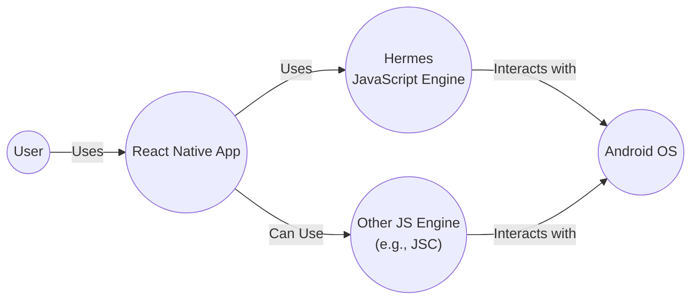
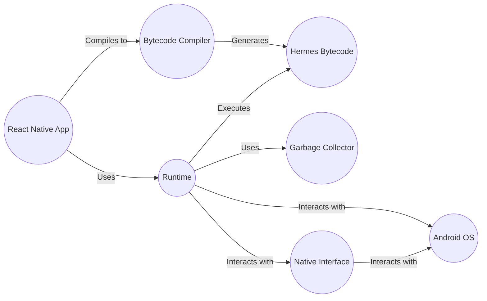
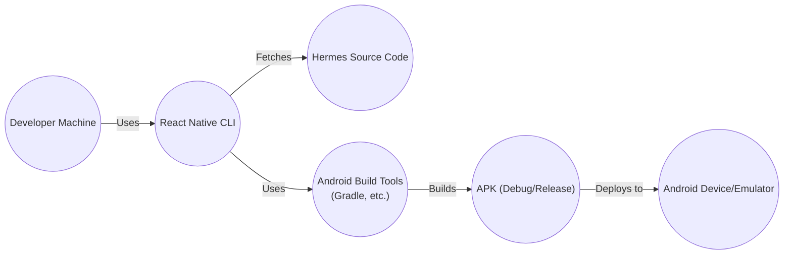

# BUSINESS POSTURE

Hermes is a small, fast JavaScript engine optimized for running React Native on Android. Given that it's developed by Facebook (Meta), a large and established company, the business posture likely leans towards a lower risk appetite, prioritizing stability, security, and performance for a massive user base.

Business Priorities and Goals:

*   Improve React Native performance on Android: Faster startup time, reduced memory usage, and smaller app size are primary goals. This directly impacts user experience and potentially user retention.
*   Maintain compatibility with React Native: Hermes must remain a seamless replacement for other JavaScript engines used with React Native, ensuring minimal disruption for developers.
*   Open Source Community Engagement: Encourage adoption and contributions from the open-source community, fostering innovation and shared responsibility.
*   Reduce operational costs: Smaller app size and reduced memory usage can lead to lower infrastructure costs for applications using React Native.

Most Important Business Risks:

*   Security vulnerabilities in the engine: Exploitable vulnerabilities could compromise user data and damage Meta's reputation.
*   Performance regressions: Any performance degradation compared to existing solutions would negatively impact user experience.
*   Compatibility issues: Incompatibilities with React Native or specific Android versions could hinder adoption and create developer friction.
*   Lack of community adoption: If the open-source community doesn't embrace Hermes, it could limit its long-term viability and innovation.

# SECURITY POSTURE

Existing Security Controls:

*   security control: Fuzzing: The repository contains fuzzing infrastructure (using libFuzzer) to identify potential vulnerabilities. (Mentioned in `Fuzzing.md`)
*   security control: Continuous Integration (CI): GitHub Actions are used for CI, which likely includes static analysis and testing. (Visible in `.github/workflows`)
*   security control: Code Reviews: As an open-source project on GitHub, code reviews are inherent to the contribution process.
*   security control: Static Analysis: Likely used within the CI pipeline, although specific tools aren't explicitly named.
*   security control: Compiler Warnings: The build system is configured to treat warnings as errors, preventing potential issues from slipping through. (Mentioned in documentation)

Accepted Risks:

*   accepted risk: Reliance on external libraries: Hermes, like any software, likely depends on external libraries, which introduce a supply chain risk.
*   accepted risk: Zero-day vulnerabilities: Despite all precautions, the possibility of undiscovered vulnerabilities (zero-days) always exists.

Recommended Security Controls:

*   security control: Software Composition Analysis (SCA): Implement SCA tooling to identify and track known vulnerabilities in third-party dependencies.
*   security control: Static Application Security Testing (SAST): Integrate a SAST tool into the CI pipeline to automatically scan for potential security flaws in the Hermes codebase.
*   security control: Dynamic Application Security Testing (DAST): While fuzzing is a form of DAST, consider adding more targeted DAST scans that simulate real-world attacks.
*   security control: Regular Security Audits: Conduct periodic security audits by internal or external experts to identify potential weaknesses.
*   security control: Bug Bounty Program: Establish a bug bounty program to incentivize external security researchers to find and report vulnerabilities.

Security Requirements:

*   Authentication: Not directly applicable to a JavaScript engine.
*   Authorization: Not directly applicable to a JavaScript engine.
*   Input Validation:
    *   The engine must correctly handle all valid JavaScript inputs according to the ECMAScript specification.
    *   The engine must gracefully handle invalid or malicious JavaScript inputs without crashing or exposing vulnerabilities. This is covered by fuzzing.
*   Cryptography:
    *   If Hermes implements any cryptographic functions (e.g., for web APIs), they must use strong, well-vetted cryptographic libraries and algorithms.
    *   Any cryptographic keys used internally must be securely managed.
*   Memory Management
    *   The engine must handle memory safely, preventing buffer overflows, use-after-free errors, and other memory-related vulnerabilities.

# DESIGN

## C4 CONTEXT



Element Descriptions:

*   Element:
    *   Name: User
    *   Type: Person
    *   Description: A person interacting with a React Native application.
    *   Responsibilities: Interacts with the application's user interface.
    *   Security controls: N/A - External to the system.

*   Element:
    *   Name: React Native App
    *   Type: Software System
    *   Description: A mobile application built using the React Native framework.
    *   Responsibilities: Provides application functionality to the user. Executes JavaScript code.
    *   Security controls: Relies on the security of the underlying JavaScript engine (Hermes or another) and the Android OS. Implements application-specific security controls.

*   Element:
    *   Name: Hermes
    *   Type: Software System
    *   Description: A JavaScript engine optimized for React Native on Android.
    *   Responsibilities: Executes JavaScript code efficiently and securely.
    *   Security controls: Fuzzing, CI, Code Reviews, Static Analysis, Compiler Warnings.

*   Element:
    *   Name: Android OS
    *   Type: Software System
    *   Description: The Android operating system.
    *   Responsibilities: Provides the underlying platform and system services for the application.
    *   Security controls: Android OS security features (sandboxing, permissions, etc.).

*   Element:
    *   Name: Other JS Engine (e.g., JSC)
    *   Type: Software System
    *   Description: Alternative JavaScript engines that can be used with React Native.
    *   Responsibilities: Executes JavaScript code.
    *   Security controls: Dependent on the specific engine's implementation.

## C4 CONTAINER



Element Descriptions:

*   Element:
    *   Name: React Native App
    *   Type: Software System
    *   Description: A mobile application built using the React Native framework.
    *   Responsibilities: Provides application functionality to the user. Executes JavaScript code.
    *   Security controls: Relies on the security of the underlying JavaScript engine (Hermes or another) and the Android OS. Implements application-specific security controls.

*   Element:
    *   Name: Bytecode Compiler
    *   Type: Container
    *   Description: Compiles JavaScript source code into Hermes bytecode.
    *   Responsibilities: Parsing, syntax analysis, optimization, and bytecode generation.
    *   Security controls: Input validation, static analysis, compiler warnings.

*   Element:
    *   Name: Runtime
    *   Type: Container
    *   Description: Executes Hermes bytecode.
    *   Responsibilities: Bytecode interpretation, JIT compilation (optional), interaction with the garbage collector and native interfaces.
    *   Security controls: Memory safety checks, bounds checking, sandboxing (if applicable).

*   Element:
    *   Name: Garbage Collector
    *   Type: Container
    *   Description: Manages memory allocation and deallocation.
    *   Responsibilities: Reclaiming unused memory to prevent memory leaks.
    *   Security controls: Robust memory management algorithms to prevent use-after-free and other memory corruption vulnerabilities.

*   Element:
    *   Name: Hermes Bytecode
    *   Type: Data
    *   Description: Optimized bytecode representation of the JavaScript code.
    *   Responsibilities: N/A - Data representation.
    *   Security controls: N/A - Data representation.

*   Element:
    *   Name: Android OS
    *   Type: Software System
    *   Description: The Android operating system.
    *   Responsibilities: Provides the underlying platform and system services.
    *   Security controls: Android OS security features.

*   Element:
    *   Name: Native Interface
    *   Type: Container
    *   Description: Provides a bridge between the JavaScript engine and native Android APIs.
    *   Responsibilities: Handling calls between JavaScript and native code.
    *   Security controls: Careful validation of data passed between JavaScript and native code.

## DEPLOYMENT

Possible Deployment Solutions:

1.  **Integrated into React Native CLI:** Hermes is typically integrated into the React Native build process. When building a React Native app for Android, the developer can choose to enable Hermes.
2.  **Manual Integration:** While less common, it's possible to manually integrate Hermes into an existing Android project.

Chosen Solution (1. Integrated into React Native CLI):



Element Descriptions:

*   Element:
    *   Name: Developer Machine
    *   Type: Infrastructure Node
    *   Description: The developer's computer where the React Native project is developed.
    *   Responsibilities: Running the React Native CLI, writing code, initiating builds.
    *   Security controls: Developer machine security best practices (OS updates, antivirus, etc.).

*   Element:
    *   Name: React Native CLI
    *   Type: Software
    *   Description: Command-line interface for React Native development.
    *   Responsibilities: Managing the build process, fetching dependencies, invoking build tools.
    *   Security controls: Relies on the security of the underlying operating system and network.

*   Element:
    *   Name: Hermes Source Code
    *   Type: Data
    *   Description: The source code of the Hermes JavaScript engine.
    *   Responsibilities: N/A - Data representation.
    *   Security controls: Code reviews, static analysis, fuzzing (applied to the source code).

*   Element:
    *   Name: Android Build Tools (Gradle, etc.)
    *   Type: Software
    *   Description: Tools used to build Android applications (e.g., Gradle, Android SDK).
    *   Responsibilities: Compiling code, linking libraries, packaging the application.
    *   Security controls: Relies on the security of the build tools themselves and their configurations.

*   Element:
    *   Name: Android Device/Emulator
    *   Type: Infrastructure Node
    *   Description: The physical Android device or emulator where the application is deployed.
    *   Responsibilities: Running the Android operating system and the React Native application.
    *   Security controls: Android OS security features.

*   Element:
    *   Name: APK (Debug/Release)
    *   Type: Data
    *   Description: The Android application package file.
    *   Responsibilities: N/A - Data representation.
    *   Security controls: Code signing (for release builds), ProGuard/R8 obfuscation (optional).

## BUILD

```mermaid
graph LR
    Developer(("Developer"))
    Git(("Git Repository\n(GitHub)"))
    CI(("CI Server\n(GitHub Actions)"))
    Compiler(("Compiler\n(Clang/GCC)"))
    Fuzzer(("Fuzzer\n(libFuzzer)"))
    StaticAnalysis(("Static Analysis Tools"))
    Tests(("Unit/Integration Tests"))
    HermesBytecode((Hermes Bytecode))
    HermesEngine((Hermes Engine\n(Shared Library)))

    Developer -- Pushes code to --> Git
    Git -- Triggers --> CI
    CI -- Checks out code from --> Git
    CI -- Uses --> Compiler
    CI -- Runs --> Fuzzer
    CI -- Runs --> StaticAnalysis
    CI -- Runs --> Tests
    Compiler -- Produces --> HermesBytecode
    Compiler -- Produces --> HermesEngine
```

Build Process Description:

1.  **Code Commit:** A developer commits code changes to the Hermes repository on GitHub.
2.  **CI Trigger:** The commit triggers a GitHub Actions workflow (CI).
3.  **Checkout:** The CI server checks out the latest code from the repository.
4.  **Compilation:** The code is compiled using a C++ compiler (Clang or GCC). Compiler warnings are treated as errors.
5.  **Fuzzing:** The fuzzer (libFuzzer) runs against the compiled code to identify potential vulnerabilities.
6.  **Static Analysis:** Static analysis tools (not specified in the repository, but recommended) scan the code for potential security flaws and coding errors.
7.  **Testing:** Unit and integration tests are executed to ensure the engine's functionality and stability.
8.  **Artifact Generation:** If all checks pass, the build process produces the Hermes bytecode compiler and the Hermes engine (as a shared library).

Security Controls in Build Process:

*   security control: Compiler Warnings as Errors: Prevents potential issues from being introduced.
*   security control: Fuzzing: Identifies potential vulnerabilities through random input testing.
*   security control: CI: Automates the build and testing process, ensuring consistency and repeatability.
*   security control: Static Analysis (Recommended): Detects potential security flaws and coding errors.
*   security control: Unit/Integration Tests: Verify the correctness and stability of the engine.
*   security control: Code Reviews (Implicit): Part of the GitHub contribution process.

# RISK ASSESSMENT

Critical Business Processes to Protect:

*   Execution of JavaScript code within React Native applications.
*   Compilation of JavaScript code to Hermes bytecode.
*   Interaction with the Android operating system.

Data to Protect and Sensitivity:

*   **JavaScript Source Code (Indirectly):** While Hermes doesn't directly handle user data, it executes JavaScript code that might contain sensitive logic or indirectly access user data. Sensitivity: Low to Medium (depending on the application).
*   **Hermes Bytecode:** Represents the compiled JavaScript code. Sensitivity: Low to Medium (similar to source code).
*   **Internal Engine State:** Data structures and memory used during runtime. Sensitivity: Medium (could potentially be exploited to leak information or gain control).
*   **No direct user data** is handled by Hermes itself.

# QUESTIONS & ASSUMPTIONS

Questions:

*   What specific static analysis tools are used (if any) in the CI pipeline?
*   Are there any plans to implement a bug bounty program?
*   What are the specific performance metrics used to evaluate Hermes against other JavaScript engines?
*   What is the process for handling security vulnerabilities reported by external researchers?
*   Are there any specific security certifications or compliance requirements that Hermes aims to meet?

Assumptions:

*   BUSINESS POSTURE: Assumed that Meta prioritizes security and stability due to its large user base and reputation.
*   SECURITY POSTURE: Assumed that code reviews are a standard part of the development process. Assumed that CI includes some form of static analysis, even if not explicitly mentioned.
*   DESIGN: Assumed the typical deployment model through the React Native CLI. Assumed the general structure of the Hermes engine based on common JavaScript engine architectures.