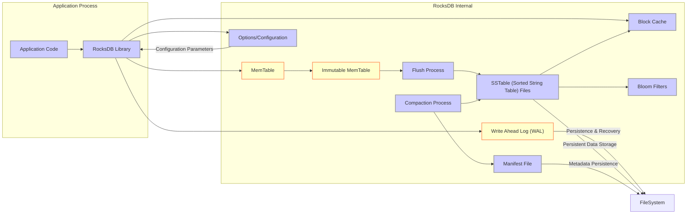
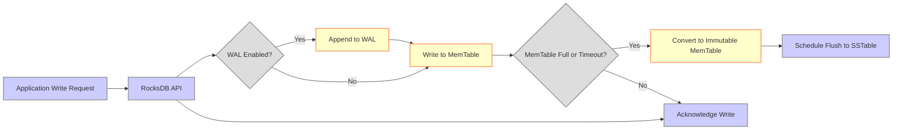
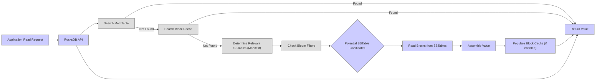

# Project Design Document: RocksDB

**Version:** 1.1
**Date:** October 26, 2023
**Author:** AI Software Architect

## 1. Introduction

This document provides an enhanced and more detailed design overview of the RocksDB embedded persistent key-value store, specifically tailored to facilitate comprehensive threat modeling. It elaborates on the core components, intricate data flows, and diverse interfaces of RocksDB, ensuring a robust foundation for identifying potential security vulnerabilities and attack vectors.

## 2. Goals

*   Deliver a refined and more detailed architectural overview of RocksDB, emphasizing security-relevant aspects.
*   Clearly delineate key components and their interactions, highlighting potential security boundaries and trust zones.
*   Thoroughly describe the data flow within RocksDB for both read and write operations, pinpointing stages susceptible to security threats.
*   Precisely outline external interfaces and dependencies, focusing on potential points of interaction for malicious actors.
*   Serve as a comprehensive and actionable basis for subsequent in-depth threat modeling exercises.

## 3. High-Level Architecture

RocksDB operates as an embedded library intricately linked within the application process that utilizes it. This tight integration necessitates careful consideration of the application's security context. RocksDB manages data persistence through a layered approach combining volatile in-memory structures with durable on-disk files.

## 4. Key Components

*   **Application Code:** The encompassing user application that directly integrates and leverages the RocksDB library. Its security posture directly impacts RocksDB.
*   **RocksDB Library:** The core library providing the robust key-value store functionality. Vulnerabilities within this library can have significant security implications.
*   **MemTable:** A volatile in-memory data structure (typically a skip list or a similar sorted structure) where the most recent write operations are initially buffered. Data in the MemTable is lost on process termination without prior flushing.
*   **Write Ahead Log (WAL):** A sequential, append-only file on persistent storage that records every write operation *before* it is applied to the MemTable. This crucial component ensures data durability and atomicity in the event of crashes or power failures. Replay of the WAL is critical for recovery.
*   **Immutable MemTable:** When a MemTable reaches a predefined size or after a specific time interval, it is marked as immutable. A new active MemTable is created to handle incoming writes. The immutable MemTable is then scheduled for flushing to disk.
*   **Flush Process:** The background operation responsible for writing the contents of an Immutable MemTable to disk as an SSTable file. This process involves sorting the data and writing it in a structured format.
*   **SSTable (Sorted String Table) Files:** Immutable, sorted files stored on disk that hold the persistent key-value data. SSTables are organized into levels, with newer data typically residing in lower levels. The immutability simplifies concurrency control but necessitates the compaction process.
*   **Block Cache:** An in-memory cache that stores blocks read from SSTable files. This significantly improves read performance by reducing the need for disk I/O. Cache poisoning is a potential security concern.
*   **Bloom Filters:** Probabilistic data structures associated with SSTables. They provide a space-efficient way to check if a key is *likely* present in a given SSTable before attempting a more expensive disk read. False positives are possible, but false negatives are not.
*   **Compaction Process:** A crucial background process that merges and sorts SSTable files from different levels. This process reclaims space from deleted or overwritten keys, reduces fragmentation, and optimizes data organization for efficient reads. Bugs in the compaction process can lead to data loss or corruption.
*   **Manifest File:** A persistent file that maintains a record of all active SSTable files, their levels, and other metadata necessary for consistent data retrieval and recovery. Corruption of the Manifest file can lead to data loss or inconsistency.
*   **Options/Configuration:** A comprehensive set of parameters that govern the behavior of RocksDB. These options control aspects like memory allocation, file system interactions, compaction strategies, and security features like encryption. Incorrect or insecure configurations can introduce vulnerabilities.
*   **FileSystem:** The underlying operating system's file system where RocksDB persists its data, including WAL files, SSTable files, and the Manifest file. The security of this layer is paramount.

## 5. Data Flow

### 5.1 Write Operation

*   The application initiates a write request through the RocksDB API.
*   RocksDB checks its configuration to determine if the Write Ahead Log (WAL) is enabled. Disabling the WAL compromises durability.
*   If the WAL is enabled, the write operation is atomically appended to the WAL file on disk. This ensures durability even if a crash occurs before the data is in the MemTable.
*   The write operation is then inserted into the active MemTable.
*   RocksDB checks if the MemTable has reached its capacity limit or a predefined time interval has elapsed.
*   If the conditions are met, the current MemTable is converted into an Immutable MemTable.
*   The Immutable MemTable is then scheduled for a background flush operation to create a new SSTable file on disk.
*   If the MemTable is not full, the RocksDB API acknowledges the write operation to the application.

### 5.2 Read Operation

*   The application sends a read request for a specific key to the RocksDB API.
*   RocksDB first searches for the key in the active MemTable.
*   If the key is found in the MemTable, the associated value is returned.
*   If not found in the MemTable, RocksDB checks the Block Cache for the requested data blocks.
*   If the data is found in the Block Cache, it is returned.
*   If not in the Block Cache, RocksDB consults the Manifest file to determine which SSTable files might contain the key.
*   Bloom filters associated with the potential SSTables are checked to quickly rule out SSTables that do not contain the key.
*   Based on the Bloom filter results, RocksDB identifies a set of candidate SSTable files.
*   RocksDB reads the necessary data blocks from the identified SSTable files.
*   The value is assembled from the read blocks.
*   Optionally, the read data blocks are populated into the Block Cache for potential future reads.
*   The retrieved value is returned to the application.

## 6. External Interfaces

*   **Programming Language APIs:** RocksDB exposes its functionality through well-defined APIs in various programming languages, primarily C++, with wrappers for languages like Java, Python, and Go. Vulnerabilities in these APIs or their bindings could be exploited.
*   **File System:** RocksDB directly interacts with the underlying file system for all persistent storage operations. This includes creating, reading, writing, and deleting WAL files, SSTable files, and the Manifest file. File system permissions and security are critical.
*   **Configuration Files/Options:** RocksDB's behavior is extensively configurable through a wide range of options set during initialization. Improperly configured options can introduce security vulnerabilities or performance issues.
*   **Operating System Primitives:** RocksDB relies on operating system primitives for fundamental operations such as memory management, threading, file locking, and file system access. Security vulnerabilities in the underlying OS can affect RocksDB.
*   **Metrics and Monitoring Interfaces:** RocksDB exposes various internal metrics that can be used for monitoring its performance and health. Access to these metrics should be controlled, as they might reveal sensitive information.
*   **Third-Party Libraries:** RocksDB may depend on third-party libraries for certain functionalities (e.g., compression algorithms). Vulnerabilities in these dependencies can impact RocksDB's security.

## 7. Deployment Models

RocksDB is primarily designed for deployment as an embedded library directly within an application process. This close coupling means the security context of the application is highly relevant to RocksDB's security.

*   **Embedded within Applications:** This is the most common deployment model. RocksDB provides local persistence for the application's data within the same process. Security relies heavily on the application's security measures.
*   **Standalone with Client Libraries (Less Common):** While not the primary design intent, it's technically possible to build services on top of RocksDB and interact with them via client libraries over a network. This model significantly expands the attack surface and introduces network security considerations. This approach requires careful security design and implementation.

## 8. Security Considerations (Pre-Threat Model)

This section outlines key security considerations that will be the focus of subsequent threat modeling activities. These considerations are categorized for clarity.

*   **Confidentiality:**
    *   **Data at Rest Encryption:** RocksDB supports encryption at rest, protecting sensitive data stored on disk. Key management and rotation are critical security aspects.
    *   **Memory Security:** Sensitive data may reside in memory (MemTable, Block Cache). Consider potential memory dumping or access vulnerabilities.
    *   **Logging and Auditing:** Logs might contain sensitive information. Secure logging practices are essential.
*   **Integrity:**
    *   **Data Corruption:**  Consider scenarios that could lead to data corruption, such as bugs in compaction, file system errors, or malicious modifications.
    *   **WAL Security:** The integrity of the WAL is crucial for recovery. Protect the WAL files from unauthorized modification.
    *   **Manifest File Integrity:** Corruption of the Manifest file can lead to data loss or inconsistency.
*   **Availability:**
    *   **Denial of Service (DoS):**  Consider how an attacker might try to overload RocksDB with excessive read or write requests, exhausting resources.
    *   **Resource Exhaustion:** Improper configuration or malicious activity could lead to resource exhaustion (memory, disk space, file handles).
    *   **File System Limits:**  Exceeding file system limits (e.g., number of open files) can impact availability.
*   **Authentication and Authorization:**
    *   As an embedded database, RocksDB typically relies on the embedding application for authentication and authorization. Secure application design is paramount.
    *   Consider the need for granular access control at the application level, potentially using features like column families.
*   **Input Validation:**
    *   The RocksDB API expects specific data types and formats. Improperly validated input by the application can lead to unexpected behavior or vulnerabilities.
*   **Dependency Management:**
    *   Ensure that RocksDB's dependencies are secure and up-to-date. Vulnerabilities in dependencies can impact RocksDB.
*   **Side-Channel Attacks:**
    *   While less common for embedded databases, consider potential side-channel attacks based on timing or resource usage.
*   **Operational Security:**
    *   Secure deployment practices, including proper file system permissions and secure configuration management, are essential.

This enhanced design document provides a more comprehensive and security-focused understanding of RocksDB's architecture and components. This detailed information will be invaluable for identifying potential threats, vulnerabilities, and attack vectors during the subsequent threat modeling process.
