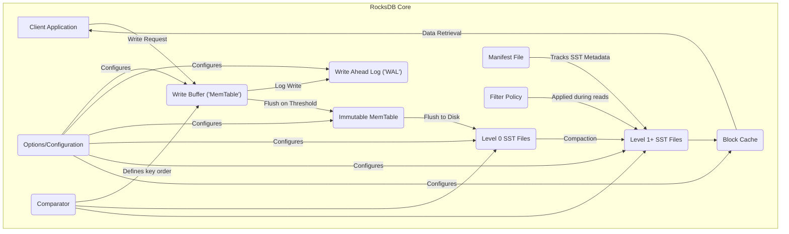

# Project Design Document: RocksDB (Improved)

**Project Name:** RocksDB

**Project Repository:** [https://github.com/facebook/rocksdb](https://github.com/facebook/rocksdb)

**Document Version:** 1.1

**Date:** October 26, 2023

**Author:** AI Software Architect

## 1. Introduction

This document provides an enhanced design overview of the RocksDB project, focusing on aspects relevant to threat modeling. It details the key architectural components, data flow, and external interfaces, with a stronger emphasis on security considerations. This document serves as a foundation for identifying potential threats and vulnerabilities within systems utilizing RocksDB.

RocksDB is a high-performance embedded database for key-value data. Its architecture, based on the Log-Structured Merge-tree (LSM-tree), is optimized for write-intensive workloads. Understanding its internal workings is crucial for assessing the security posture of applications that rely on it.

## 2. Goals

The primary goals of this improved design document are to:

*   Provide a more detailed and technically accurate overview of the RocksDB architecture.
*   Clearly identify the major components, their specific functions, and their interactions.
*   Elaborate on the data flow during various operations, highlighting data transformations and persistence mechanisms.
*   Thoroughly outline the external interfaces and APIs, including potential security implications.
*   Provide a more comprehensive analysis of security considerations and potential threat vectors.

## 3. Architectural Overview

RocksDB's architecture centers around the LSM-tree principle. Incoming writes are initially buffered in memory and then flushed to disk in a structured manner. The following diagram illustrates the core components and their relationships:

## 4. Key Components (Detailed)

*   **Client Application:** The software application that embeds the RocksDB library and utilizes its key-value storage capabilities. This is the primary point of interaction and potential vulnerability introduction.
*   **Write Buffer ('MemTable'):** An in-memory data structure (typically a skip list or a hash table, configurable) that holds recent write operations. It provides fast write performance. Multiple MemTables can exist concurrently, with one active for writes.
*   **Write Ahead Log ('WAL'):** A sequential log file on disk that durably records every write operation *before* it is applied to the MemTable. This ensures data durability and recoverability in case of system crashes. The WAL can be a target for tampering if file system permissions are weak.
*   **Immutable MemTable:** When the active MemTable reaches a configured size limit, it becomes immutable. New writes are directed to a new active MemTable. Immutable MemTables are then scheduled for flushing to disk.
*   **SST Files (Sorted String Table Files):** On-disk files that store sorted key-value pairs. They are the persistent storage units of RocksDB.
    *   **Level 0 SST Files:** Created directly from flushing Immutable MemTables. These files may have overlapping key ranges.
    *   **Level 1+ SST Files:** Created by the compaction process, merging and sorting SST files from lower levels. Files within each level have non-overlapping key ranges, improving read efficiency. SST files are potential targets for unauthorized access or modification.
*   **Compaction:** A background process that merges and sorts SST files. This process is crucial for maintaining read performance and reclaiming disk space. Different compaction strategies can be configured, impacting performance and resource usage.
*   **Block Cache:** An in-memory cache that stores frequently accessed data blocks read from SST files. This significantly speeds up read operations. The Block Cache holds sensitive data in memory, making it a potential target for memory dumping attacks.
*   **Manifest File:** A file that persistently stores metadata about the SST files, including their names, levels, and the current database state. It acts as the single source of truth for the database structure. Corruption or tampering with the Manifest file can lead to data loss or inconsistency.
*   **Options/Configuration:** A comprehensive set of parameters that control various aspects of RocksDB's behavior, including memory usage, compaction strategies, WAL settings, and security-related features (if enabled at the application level). Misconfiguration can introduce vulnerabilities.
*   **Filter Policy (e.g., Bloom Filters):**  Data structures associated with SST files that allow RocksDB to quickly determine if a key is *not* present in an SST file, avoiding unnecessary disk reads.
*   **Comparator:** Defines the order in which keys are sorted within MemTables and SST files. This is crucial for efficient data retrieval and range scans.

## 5. Data Flow (Detailed)

### 5.1. Write Operation (Detailed)

1. The **Client Application** initiates a write operation (e.g., `Put(key, value)`, `Delete(key)`).
2. The write request is first appended to the **Write Ahead Log ('WAL')**. This ensures durability. The WAL entry includes the type of operation, the key, and the value (or tombstone for deletion).
3. The write operation is then inserted into the active **Write Buffer ('MemTable')**, ordered according to the configured **Comparator**.
4. When the MemTable reaches its configured size limit, it is marked as **Immutable**.
5. The Immutable MemTable is flushed to disk, creating one or more new **Level 0 SST files**. The data is written in sorted order based on the **Comparator**.

### 5.2. Read Operation (Detailed)

1. The **Client Application** requests a read operation (e.g., `Get(key)`).
2. RocksDB first checks the active **Write Buffer ('MemTable')**.
3. If the key is not found, it checks the **Immutable MemTables** (in reverse order of creation).
4. If still not found, RocksDB consults the **Manifest File** to determine which SST files might contain the key.
5. It then checks the **Block Cache** for relevant data blocks from those SST files.
6. If the data is not in the cache, RocksDB reads the necessary blocks from the **SST files** on disk. **Filter Policies** (like Bloom filters) can be used to quickly skip SST files that do not contain the requested key.
7. The data is returned to the **Client Application**.

### 5.3. Compaction Process (Detailed)

1. The compaction process is triggered based on configured strategies (e.g., when a certain number of Level 0 files exist, or based on time intervals).
2. RocksDB selects a set of SST files from one or more levels to be compacted.
3. The selected SST files are read, and their key-value pairs are merged and sorted according to the **Comparator**.
4. New, larger SST files are created in the next higher level. These new files have non-overlapping key ranges within that level.
5. The **Manifest File** is updated atomically to reflect the new set of SST files and the removal of the old ones.
6. The old SST files are eventually deleted.

## 6. External Interfaces (Security Implications)

*   **C++ API:** The primary interface. Security vulnerabilities in the calling application that misuse the API (e.g., providing unsanitized input) can directly impact RocksDB's integrity.
*   **Java API (JNI):** Introduces a potential boundary for vulnerabilities between the Java application and the native RocksDB library. Incorrect JNI usage can lead to crashes or memory corruption.
*   **Python API:** Similar to the Java API, potential vulnerabilities can arise from the interaction between the Python interpreter and the underlying C++ library.
*   **Other Language Bindings:** Each binding introduces its own set of potential security considerations related to the language's memory management and interaction with native code.
*   **Configuration Files:** If configuration files are used, improper access controls on these files could allow malicious actors to modify RocksDB's behavior.
*   **File System:** RocksDB's direct interaction with the file system for storing WAL, SST files, and the Manifest file makes file system security paramount. Weak permissions can lead to unauthorized access, modification, or deletion of critical data.

## 7. Security Considerations (Expanded)

*   **Data at Rest Encryption:** RocksDB itself does not inherently encrypt data at rest. This responsibility typically falls on the application layer (e.g., encrypting values before writing) or the underlying storage system (e.g., using encrypted file systems or block devices). Lack of encryption makes the data vulnerable if the storage medium is compromised.
*   **Data in Transit Encryption:** As an embedded library, RocksDB does not handle network communication directly. If RocksDB is part of a networked service, the application must implement encryption (e.g., TLS) to protect data transmitted over the network.
*   **Access Control:** RocksDB lacks built-in user authentication and authorization. The embedding application is responsible for implementing access control mechanisms to restrict who can read and write data.
*   **Input Validation:**  RocksDB relies on the application to provide valid and sanitized input. Failure to validate input can lead to unexpected behavior, crashes, or even potential injection vulnerabilities if the application uses keys or values in other contexts.
*   **Resource Exhaustion:**  A malicious application or a bug can lead to excessive resource consumption (memory, disk space, file handles). Configuration options (e.g., limiting cache sizes, write buffer sizes) can help mitigate this, but proper application design is crucial.
*   **Denial of Service (DoS):**  An attacker controlling the application could flood RocksDB with read or write requests, potentially impacting performance or causing a denial of service. Rate limiting and proper resource management in the application are necessary.
*   **WAL Security:** The WAL contains a history of recent write operations, including potentially sensitive data. Securing the WAL files with appropriate file system permissions is critical.
*   **SST File Security:** SST files hold the persistent data. Protecting these files from unauthorized access or modification is paramount for data integrity and confidentiality.
*   **Configuration Security:**  Misconfigured options can weaken security. For example, disabling the WAL for performance gains sacrifices durability. Securely managing and validating configuration settings is important.
*   **Memory Security:** Sensitive data resides in memory (MemTable, Block Cache). Applications should be aware of potential memory dumping attacks and consider techniques to mitigate them (though this is largely outside of RocksDB's direct control).

## 8. Deployment Considerations (Security Context)

The deployment environment significantly impacts the security considerations for RocksDB:

*   **Standalone Embedded Database:** Security relies heavily on the security of the host operating system and file system.
*   **Underlying Storage Engine:** Security becomes a shared responsibility between the higher-level database system and the underlying RocksDB instance. Secure communication and access control within the larger system are crucial.
*   **Containerized Environments:**  Proper container security practices are essential to isolate RocksDB instances and protect their data.

## 9. Potential Threat Areas (Refined and Categorized)

This section outlines potential threat areas for a threat modeling exercise, categorized for clarity:

*   **Data Confidentiality Threats:**
    *   Unauthorized access to SST files or WAL files on disk.
    *   Memory dumping attacks targeting the Block Cache or MemTable.
    *   Exposure of data through insecure application-level logging or error handling.
*   **Data Integrity Threats:**
    *   Tampering with WAL files or SST files, leading to data corruption.
    *   Exploiting vulnerabilities in the application to write malicious data.
    *   Corruption of the Manifest file, leading to data loss or inconsistency.
*   **Availability Threats (Denial of Service):**
    *   Flooding RocksDB with excessive read or write requests.
    *   Exploiting resource limitations (memory, disk space, file handles).
    *   Causing crashes through malformed API calls or unexpected input.
*   **Authentication and Authorization Threats:**
    *   Lack of built-in access control in RocksDB, relying on the application for enforcement.
    *   Vulnerabilities in the application's authentication or authorization mechanisms.
*   **Operational Threats:**
    *   Misconfiguration of RocksDB leading to security weaknesses.
    *   Insecure storage or transmission of configuration files.
    *   Insufficient monitoring or logging of RocksDB activity.
*   **Supply Chain Threats:**
    *   Compromised dependencies or malicious code injected into the RocksDB build process (though this is a general software security concern).

## 10. Conclusion

This improved design document provides a more detailed and security-focused overview of RocksDB. It highlights the key components, data flow, and external interfaces, emphasizing potential security implications at each level. This information is crucial for conducting thorough threat modeling and implementing appropriate security measures in applications that utilize RocksDB. Understanding these potential threat areas allows developers and security professionals to proactively address vulnerabilities and build more resilient systems.