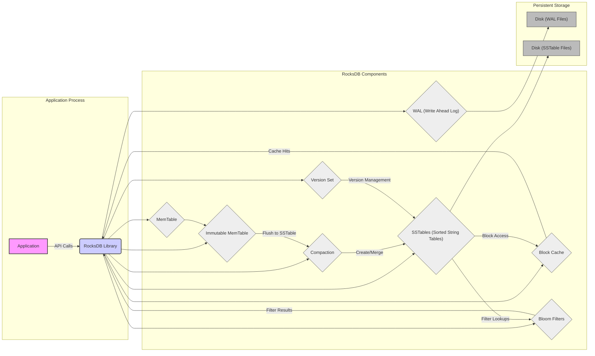

# Project Design Document: RocksDB

**Project Name:** RocksDB Embedded Key-Value Store

**Version:** 1.1

**Date:** 2023-10-27

**Author:** Gemini (AI Expert in Software, Cloud, and Cybersecurity Architecture)

## 1. Project Overview

### 1.1. Introduction

RocksDB is a high-performance embedded key-value store developed by Facebook (now Meta). It is a fork of LevelDB, optimized for performance, scalability, and flexibility. RocksDB is designed to be embedded within applications, providing persistent storage for structured data. It is widely used in various applications requiring fast and reliable data access, including databases, distributed systems, and storage engines. Its embeddable nature allows applications to directly link with the RocksDB library, avoiding the overhead of network communication and inter-process communication often associated with client-server database systems.

### 1.2. Project Goals

The primary goals of RocksDB are:

*   **High Performance:** Provide low-latency read and write operations, even under heavy load, crucial for demanding applications.
*   **Scalability:** Efficiently handle large datasets and scale with increasing data volume, accommodating growth without significant performance degradation.
*   **Flexibility:** Offer a wide range of configuration options to tune performance and resource usage for different workloads, allowing customization for specific application needs.
*   **Persistence:** Ensure data durability and reliability through robust persistent storage mechanisms, guaranteeing data survival across system restarts and failures.
*   **Embeddability:** Designed to be easily integrated into applications as a library, simplifying deployment and reducing operational complexity.
*   **Tunability:** Provide extensive tuning parameters to optimize for various hardware and workload characteristics.

### 1.3. Target Audience

This design document is intended for:

*   **Security Architects and Engineers:** To understand the architecture of RocksDB for threat modeling, security assessments, and designing secure integration strategies.
*   **Software Developers:** To gain insights into the internal workings of RocksDB for effective integration, optimal utilization, and debugging potential issues.
*   **Operations and Infrastructure Teams:** To understand the deployment, operational aspects, resource requirements, and monitoring considerations of applications using RocksDB.
*   **Quality Assurance and Testing Teams:** To understand the system architecture for designing comprehensive test plans, including performance, reliability, and security testing.

### 1.4. Document Scope

This document provides a high-level architectural overview of RocksDB, focusing on components and data flow relevant for security considerations and threat modeling. It will cover:

*   High-level architecture and components with descriptions of their functions.
*   Detailed data flow diagrams for read and write operations, illustrating data movement and processing.
*   Key security considerations and potential threat areas, providing a basis for security analysis.

This document does not cover:

*   Detailed API specifications and function-level descriptions.
*   Performance tuning guides and benchmarking methodologies.
*   Specific code implementation details, algorithms, or data structure implementations beyond a high-level overview.
*   Operational procedures like backup, restore, and monitoring in detail.

## 2. System Architecture

### 2.1. High-Level Architecture Diagram



### 2.2. Component Description

*   **Application:** The software that embeds and utilizes the RocksDB library for data storage and retrieval. It interacts with RocksDB through its public API.
*   **RocksDB Library:** The core RocksDB library providing the API and functionality for key-value store operations. It manages all internal components and data flow.
*   **MemTable:** An in-memory write buffer, typically implemented as a skip list or hash table, optimized for fast insertion of recent write operations. Data is stored in sorted order (in skip list implementation) for efficient flushing.
*   **Immutable MemTable:** A read-only version of MemTable, created when the active MemTable reaches its size limit. It is queued for flushing to disk as SSTables in the background, allowing writes to continue to the new active MemTable without blocking.
*   **WAL (Write Ahead Log):** A sequential log on persistent storage that records every write operation *before* it is applied to the MemTable. This ensures durability and atomicity of writes. In case of a crash, RocksDB can replay the WAL to recover committed transactions.
*   **SSTables (Sorted String Tables):** On-disk files storing sorted key-value pairs. SSTables are immutable after creation and organized into levels (LevelDB architecture) to optimize read performance and storage efficiency. Levels closer to level 0 contain newer data and potentially overlapping key ranges, while higher levels contain older, compacted, and non-overlapping data.
*   **Block Cache:** An in-memory cache that stores frequently accessed data blocks read from SSTables. This significantly reduces disk I/O for read operations by serving data from memory when possible. Different cache implementations (LRU, etc.) can be configured.
*   **Bloom Filters:** Probabilistic data structures associated with SSTables. They provide a fast way to check if a key is *definitely not* present in an SSTable, avoiding unnecessary disk reads when a key is likely absent. Bloom filters can have false positives but no false negatives.
*   **Compaction:** A background process that merges and compacts SSTables from different levels. Compaction reclaims storage space by removing obsolete data (e.g., overwritten or deleted keys), reduces read amplification by merging fragmented data, and moves data to higher levels, optimizing query performance and storage organization.
*   **Version Set:** Manages the different versions of the database state. It tracks the set of SSTables that constitute a consistent snapshot of the database at any point in time. This enables consistent reads and supports features like snapshots and point-in-time recovery.
*   **Disk (WAL Files):** Persistent storage (typically hard drives or SSDs) for Write Ahead Log files, ensuring durable write records.
*   **Disk (SSTable Files):** Persistent storage for Sorted String Table files, holding the main key-value data on disk.

### 2.3. Data Structures

RocksDB leverages several key data structures for efficient operation:

*   **Key-Value Pairs:** The fundamental data unit. Keys and values are treated as raw byte arrays, offering flexibility in data representation.
*   **MemTable:** In-memory sorted data structure (e.g., skip list, hash table) optimized for write performance and in-memory lookups.
*   **SSTable:** On-disk file format with a hierarchical block-based structure. SSTables contain data blocks, index blocks, and metadata blocks, all organized for efficient range scans and point lookups. Data within SSTables is sorted by key.
*   **Bloom Filter:** A space-efficient probabilistic data structure used to quickly check for the potential existence of a key in an SSTable.

## 3. Data Flow

### 3.1. Write Operation Flow

```mermaid
graph LR
    A["Application Write Request"] -->|Write API (Put, Delete, Merge)| B("RocksDB Library");
    B --> C{"Write to WAL"};
    C --> D{"Write to MemTable"};
    D --> E{"Return Success to Application"};
    E --> F["Application Write Success"];
    B --> G{"Background Flush (MemTable -> Immutable MemTable)"};
    G --> H{"Write SSTable to Disk"};
    H --> I{"Update Version Set"};
    I --> J{"Trigger Compaction (Potentially)"};

    style A fill:#f9f,stroke:#333,stroke-width:2px
    style B fill:#ccf,stroke:#333,stroke-width:2px
    style C fill:#eee,stroke:#333,stroke-width:1px
    style D fill:#eee,stroke:#333,stroke-width:1px
    style E fill:#eee,stroke:#333,stroke-width:1px
    style F fill:#f9f,stroke:#333,stroke-width:2px
    style G fill:#eee,stroke:#333,stroke-width:1px
    style H fill:#eee,stroke:#333,stroke-width:1px
    style I fill:#eee,stroke:#333,stroke-width:1px
    style J fill:#eee,stroke:#333,stroke-width:1px

    linkStyle 0,1,2,3,4,5,6,7,8,9 stroke:#333,stroke-width:1px;
```

1.  **Application Write Request:** The application initiates a write operation (put, delete, merge) through the RocksDB API.
2.  **RocksDB Library:** The RocksDB library receives the write request and starts the write process.
3.  **Write to WAL:** The write operation is first synchronously written to the Write Ahead Log (WAL) for durability. This ensures that even in case of a sudden system crash, the write operation is guaranteed to be persisted and can be recovered upon restart.
4.  **Write to MemTable:** After successful WAL write, the write operation is then written to the MemTable, the in-memory data structure. This operation is typically very fast.
5.  **Return Success to Application:** RocksDB acknowledges the write operation as successful to the application after writing to both WAL and MemTable. This "write-ahead logging" approach ensures durability while maintaining low latency for write operations.
6.  **Background Flush:** When the MemTable reaches a configured size threshold, it becomes immutable. A new MemTable is created to accept subsequent writes. The immutable MemTable is then scheduled for flushing to disk in a background thread.
7.  **Write SSTable to Disk:** The background flush process converts the immutable MemTable's sorted contents into a new SSTable file and writes it to disk.
8.  **Update Version Set:** Once the SSTable is successfully written to disk, the Version Set is updated to include the new SSTable. This makes the newly written data persistent and visible for subsequent read operations.
9.  **Trigger Compaction (Potentially):** The creation of a new SSTable might trigger the compaction process, especially if it increases the number of SSTables at a particular level beyond a threshold. Compaction is a background process that optimizes storage and read performance over time.

### 3.2. Read Operation Flow

```mermaid
graph LR
    A["Application Read Request"] -->|Read API (Get)| B("RocksDB Library");
    B --> C{"Check MemTable"};
    C -- "Key Found" --> D{"Return Value from MemTable"};
    C -- "Key Not Found" --> E{"Check Immutable MemTables"};
    E -- "Key Found" --> F{"Return Value from Immutable MemTable"};
    E -- "Key Not Found" --> G{"Check Block Cache"};
    G -- "Key Found" --> H{"Return Value from Block Cache"};
    G -- "Key Not Found" --> I{"Check Bloom Filters (SSTables)"};
    I -- "Key Might Exist" --> J{"Read SSTables from Disk"};
    J --> K{"Return Value from SSTable (if found)"};
    I -- "Key Does Not Exist" --> L{"Key Not Found in SSTables"};
    K -- "Value Found" --> M{"Return Value to Application"};
    L -- "Value Not Found" --> M;
    M --> N["Application Read Response"];
    N --> O["Update Block Cache (Potentially)"];

    style A fill:#f9f,stroke:#333,stroke-width:2px
    style B fill:#ccf,stroke:#333,stroke-width:2px
    style C fill:#eee,stroke:#333,stroke-width:1px
    style D fill:#eee,stroke:#333,stroke-width:1px
    style E fill:#eee,stroke:#333,stroke-width:1px
    style F fill:#eee,stroke:#333,stroke-width:1px
    style G fill:#eee,stroke:#333,stroke-width:1px
    style H fill:#eee,stroke:#333,stroke-width:1px
    style I fill:#eee,stroke:#333,stroke-width:1px
    style J fill:#eee,stroke:#333,stroke-width:1px
    style K fill:#eee,stroke:#333,stroke-width:1px
    style L fill:#eee,stroke:#333,stroke-width:1px
    style M fill:#eee,stroke:#333,stroke-width:1px
    style N fill:#f9f,stroke:#333,stroke-width:2px
    style O fill:#eee,stroke:#333,stroke-width:1px

    linkStyle 0,1,2,3,4,5,6,7,8,9,10,11,12,13,14,15,16,17 stroke:#333,stroke-width:1px;
```

1.  **Application Read Request:** The application initiates a read operation (get) through the RocksDB API, requesting the value associated with a specific key.
2.  **RocksDB Library:** The RocksDB library receives the read request and begins the lookup process.
3.  **Check MemTable:** RocksDB first checks the current active MemTable. As MemTable holds the most recent writes, it's the first place to look for the key. If the key is found in the MemTable, the corresponding value is returned directly from memory, providing the fastest read path.
4.  **Check Immutable MemTables:** If the key is not found in the active MemTable, RocksDB checks the Immutable MemTables (if any are still in memory before being flushed to disk).
5.  **Check Block Cache:** If the key is not found in MemTables, RocksDB checks the Block Cache. The Block Cache stores frequently accessed data blocks from SSTables in memory. If the data block containing the key is in the cache, it is returned from memory, avoiding disk I/O.
6.  **Check Bloom Filters (SSTables):** If the key is not in the cache, RocksDB consults the Bloom Filters associated with each SSTable. Bloom filters are used to quickly determine if an SSTable *might* contain the requested key. This step efficiently filters out SSTables that definitely do not contain the key, reducing unnecessary disk reads.
7.  **Read SSTables from Disk:** For SSTables where the Bloom filter suggests the key *might* exist, RocksDB reads the relevant SSTable(s) from disk. It reads index blocks to locate the data block containing the key and then reads the data block itself.
8.  **Return Value from SSTable (if found):** If the key is found within the SSTable data blocks read from disk, the corresponding value is retrieved.
9.  **Key Not Found in SSTables:** If after checking all relevant SSTables (as indicated by Bloom filters), the key is still not found, RocksDB concludes that the key is not present in the database.
10. **Return Value to Application:** RocksDB returns the retrieved value (if found) or indicates that the key was not found to the application.
11. **Application Read Response:** The application receives the read response from RocksDB, containing either the requested value or an indication of key absence.
12. **Update Block Cache (Potentially):** If data was read from SSTables on disk, the retrieved data block is often added to the Block Cache to improve performance for subsequent reads of nearby keys or the same key. Cache insertion depends on cache policy and available space.

## 4. Key Security Considerations

RocksDB, as an embedded library, operates within the security context of the host application. Security is a shared responsibility, with the embedding application playing a crucial role. Here are key security considerations:

### 4.1. Access Control

*   **Application-Level Enforcement:** RocksDB does not enforce user authentication or authorization internally. Access control is entirely managed by the embedding application. Applications must implement their own mechanisms to authenticate users and authorize access to specific data or operations before interacting with RocksDB.
*   **Operating System Level Permissions:** File system permissions on the directories where RocksDB stores WAL and SSTable files are critical. Restrict access to these directories to only the user and processes that need to operate RocksDB. This prevents unauthorized access, modification, or deletion of database files by other users or processes on the system.
*   **Principle of Least Privilege:** Apply the principle of least privilege to the application user and processes running RocksDB. Grant only the necessary permissions required for RocksDB to function, minimizing the potential impact of compromised application components.

### 4.2. Data at Rest Encryption

*   **Built-in Encryption Support:** RocksDB offers built-in support for data-at-rest encryption. It can encrypt data blocks before writing them to SSTables and WAL, and decrypt them upon reading.
*   **Encryption Options:** RocksDB supports various encryption algorithms, including AES-CBC and AES-CTR. The choice of algorithm should be based on security requirements, performance considerations, and compliance standards.
*   **Key Management is Critical:** Secure key management is paramount for data-at-rest encryption. RocksDB relies on the embedding application to provide and manage encryption keys. Applications must implement robust key generation, secure storage (e.g., using hardware security modules, key management systems), key rotation, and access control mechanisms for encryption keys. Compromised keys render encryption ineffective.
*   **Encryption Granularity:** RocksDB's encryption operates at the block level. Consider the implications of this granularity for your security requirements.
*   **Performance Impact:** Encryption and decryption operations introduce performance overhead. Evaluate the performance impact of encryption on your application's workload and choose algorithms and configurations accordingly.

### 4.3. Data Integrity

*   **Checksums for Data Verification:** RocksDB uses checksums extensively to ensure data integrity. Checksums are calculated and stored for data blocks, metadata blocks, and WAL records. During reads, these checksums are verified to detect any data corruption that might have occurred due to disk errors, hardware failures, or malicious tampering.
*   **WAL for Durability and Recovery:** The Write Ahead Log (WAL) not only ensures durability but also contributes to data integrity. By logging operations before applying them, WAL provides a consistent recovery point in case of crashes, preventing data loss and ensuring transactional integrity. WAL records are also protected by checksums.
*   **Corruption Handling Mechanisms:** RocksDB has built-in mechanisms to detect and handle data corruption. Upon detecting a checksum mismatch or other forms of corruption, RocksDB can attempt recovery (e.g., by replaying WAL) or report an error to the application. The application should be designed to handle these error conditions gracefully.
*   **Data Validation on Input:** While RocksDB provides data integrity checks at the storage level, the embedding application should also perform input validation to ensure that the data being written to RocksDB is valid and conforms to expected formats. This helps prevent application-level data corruption issues.

### 4.4. Input Validation

*   **Key and Value as Byte Arrays:** RocksDB treats keys and values as raw byte arrays without imposing any inherent structure or validation. This flexibility places the responsibility of input validation entirely on the embedding application.
*   **Injection Vulnerabilities:** Applications must carefully validate and sanitize input data (both keys and values) before storing it in RocksDB. Failure to do so can lead to injection vulnerabilities. For example, if keys are constructed from user input without proper sanitization, it might be possible to inject malicious keys that could interfere with database operations or lead to unexpected behavior.
*   **Data Type and Format Validation:** Applications should enforce expected data types and formats for values stored in RocksDB. This prevents storing malformed or unexpected data that could cause issues during retrieval or processing.
*   **Configuration Parameter Validation:** Carefully review and validate all RocksDB configuration parameters provided by the application. Incorrect or malicious configuration values could lead to security vulnerabilities, performance degradation, or unexpected behavior.

### 4.5. Resource Exhaustion

*   **Denial of Service (DoS) Potential:** Malicious or poorly designed applications can potentially cause resource exhaustion in RocksDB, leading to denial of service. This can be achieved by:
    *   **Unbounded Writes:** Flooding RocksDB with excessive write requests can overwhelm the system, filling up MemTables, WAL, and eventually disk space.
    *   **Large Key/Value Sizes:** Writing extremely large keys or values can consume excessive memory and disk space, impacting performance and potentially leading to out-of-memory errors or disk space exhaustion.
    *   **Inefficient Queries:** Performing very broad range scans or repeatedly querying for non-existent keys can increase disk I/O and CPU usage, degrading performance for legitimate users.
*   **Memory Management:** Configure appropriate limits for MemTable size, Block Cache size, and other memory-related parameters to prevent uncontrolled memory consumption. Implement eviction policies for caches to manage memory usage effectively.
*   **Disk Space Management:** Monitor disk space usage for RocksDB data directories. Implement data retention policies, compaction strategies, and potentially data archival mechanisms to manage disk space and prevent exhaustion.
*   **Rate Limiting and Throttling:** Consider implementing rate limiting or throttling mechanisms at the application level to control the rate of write and read requests to RocksDB, mitigating potential DoS attacks or accidental overload.
*   **Resource Monitoring and Alerting:** Implement monitoring for key RocksDB metrics (e.g., memory usage, disk I/O, compaction backlog, query latency). Set up alerts to detect anomalies and potential resource exhaustion issues early on.

### 4.6. Logging and Auditing

*   **RocksDB Internal Logs:** RocksDB generates internal logs for operational events, errors, and debugging purposes. These logs can be valuable for troubleshooting and monitoring RocksDB's health. Configure appropriate logging levels and log rotation policies.
*   **Application-Level Audit Logging:** For security auditing and compliance purposes, the embedding application should implement its own audit logging mechanisms. RocksDB itself does not provide built-in audit logging for data access or modification operations.
*   **What to Audit:** Application-level audit logs should typically include:
    *   **Data Access:** Records of who accessed what data (keys or ranges), when, and from where.
    *   **Data Modification:** Logs of all write operations (puts, deletes, merges), including who performed the operation, when, and what data was modified.
    *   **Administrative Actions:** Logs of any administrative actions related to RocksDB configuration or management.
*   **Secure Log Storage:** Store audit logs securely and protect them from unauthorized access or modification. Consider using dedicated logging systems or secure storage solutions for audit logs.

### 4.7. Dependency Management

*   **Third-Party Libraries:** RocksDB depends on various third-party libraries (e.g., Snappy, Zlib, Bzip2 for compression). Ensure that these dependencies are regularly updated to the latest stable versions and patched promptly to address any known security vulnerabilities.
*   **Software Bill of Materials (SBOM):** Generate and maintain a Software Bill of Materials (SBOM) for RocksDB and its dependencies. This helps track all components and facilitates vulnerability scanning and management.
*   **Vulnerability Scanning:** Regularly scan RocksDB and its dependencies for known vulnerabilities using vulnerability scanning tools. Address any identified vulnerabilities by updating libraries or applying patches as needed.
*   **Secure Build Process:** Secure the build process for RocksDB and its dependencies to prevent supply chain attacks. Verify the integrity of downloaded source code and build artifacts. Use trusted build environments and practices.

## 5. Threat Modeling Considerations

This design document serves as a foundation for threat modeling RocksDB. A structured threat modeling exercise should be conducted to identify, analyze, and mitigate potential security threats. Consider the following threat categories and examples:

**5.1. Confidentiality Threats (Unauthorized Data Disclosure)**

*   **Threat:** Unauthorized access to SSTable or WAL files on disk.
    *   **Example:** An attacker gains access to the file system where RocksDB data is stored and directly reads SSTable files to extract sensitive data.
    *   **Mitigation:** Implement strong file system permissions, data-at-rest encryption, access control lists, and potentially disk encryption.
*   **Threat:** Information leakage through side-channel attacks.
    *   **Example:** An attacker analyzes timing variations in RocksDB operations to infer information about the data being accessed. (Less likely in typical embedded usage but relevant in highly sensitive environments).
    *   **Mitigation:** Employ constant-time algorithms where feasible, implement countermeasures against timing attacks, and conduct side-channel analysis if necessary.
*   **Threat:** Exposure of sensitive data in logs.
    *   **Example:** RocksDB internal logs or application audit logs inadvertently log sensitive data in plaintext.
    *   **Mitigation:** Sanitize logs to remove sensitive information, implement secure log storage, and use appropriate log retention policies.

**5.2. Integrity Threats (Unauthorized Data Modification or Corruption)**

*   **Threat:** Data tampering by modifying SSTable or WAL files.
    *   **Example:** An attacker gains write access to RocksDB data directories and modifies SSTable files to corrupt data or inject malicious data.
    *   **Mitigation:** Implement strong file system permissions, integrity monitoring for data files, and potentially digital signatures for SSTables.
*   **Threat:** Data corruption due to software bugs or hardware failures.
    *   **Example:** A bug in RocksDB or underlying hardware failure leads to data corruption within SSTables or WAL.
    *   **Mitigation:** Utilize RocksDB's checksum mechanisms, implement robust error handling, perform regular data integrity checks, and use reliable hardware.
*   **Threat:** Injection attacks through application input.
    *   **Example:** An attacker exploits input validation vulnerabilities in the embedding application to inject malicious keys or values that corrupt data or cause unexpected behavior in RocksDB.
    *   **Mitigation:** Implement thorough input validation and sanitization in the embedding application.

**5.3. Availability Threats (Denial of Service)**

*   **Threat:** Resource exhaustion attacks leading to DoS.
    *   **Example:** An attacker floods RocksDB with excessive write requests, causing resource exhaustion (memory, disk space, CPU) and making the database unavailable.
    *   **Mitigation:** Implement rate limiting, input validation, resource quotas, monitoring, and capacity planning.
*   **Threat:** Exploitation of configuration vulnerabilities leading to DoS.
    *   **Example:** Misconfiguration of RocksDB parameters (e.g., unbounded cache sizes) leads to excessive resource consumption and DoS.
    *   **Mitigation:** Securely configure RocksDB parameters, validate configuration inputs, and follow security best practices for configuration management.
*   **Threat:** Dependency vulnerabilities leading to DoS.
    *   **Example:** A vulnerability in a third-party library used by RocksDB is exploited to cause a crash or DoS.
    *   **Mitigation:** Regularly update dependencies, perform vulnerability scanning, and have incident response plans in place.

**5.4. Threat Modeling Process:**

1.  **Identify Assets:** Determine what assets need protection (e.g., sensitive data stored in RocksDB, availability of the application).
2.  **Identify Threats:** Use threat modeling methodologies (e.g., STRIDE) and the threat categories above to identify potential threats relevant to your application and deployment environment.
3.  **Assess Risks:** Analyze the likelihood and impact of each identified threat to determine the overall risk level.
4.  **Identify Mitigations:** For each significant risk, identify appropriate security controls and mitigations based on the security considerations outlined in this document and industry best practices.
5.  **Validate Mitigations:** Test and validate the effectiveness of implemented security controls.
6.  **Continuously Review and Update:** Threat models should be living documents. Regularly review and update the threat model as the application, environment, and threat landscape evolve.

This document provides a comprehensive starting point for understanding RocksDB's architecture and security considerations. By leveraging this information and conducting thorough threat modeling, organizations can build secure and resilient applications using RocksDB. Remember that security is an ongoing process, and continuous vigilance and adaptation are essential.