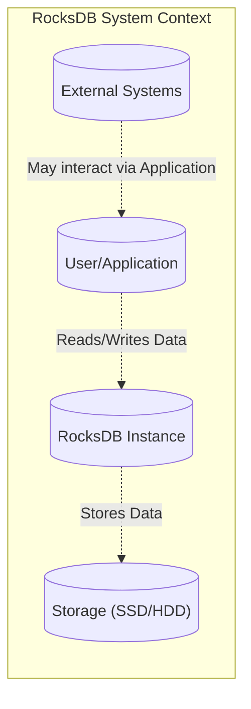
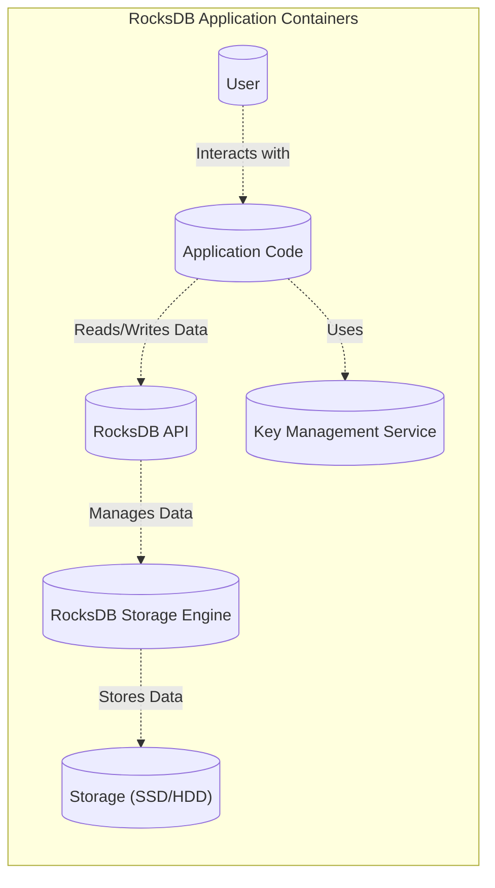
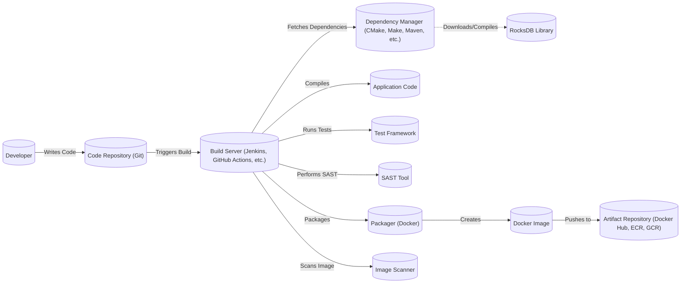

# BUSINESS POSTURE

RocksDB is a key-value store library developed and open-sourced by Facebook (now Meta). It's designed for high performance, particularly on fast storage like SSDs. Given its origin and widespread use in large-scale systems, the business posture can be inferred as follows:

Priorities and Goals:

*   High Performance: Enable applications to handle large volumes of data with low latency. This is crucial for Meta's services, which deal with massive datasets and require rapid access.
*   Scalability: Support systems that need to scale horizontally to accommodate growing data and user loads.
*   Reliability: Ensure data durability and consistency, even in the face of hardware or software failures.  This is paramount for a database.
*   Flexibility: Provide a configurable and adaptable storage engine that can be tuned for various workloads and use cases.
*   Open Source Community: Foster a vibrant open-source community around RocksDB, encouraging contributions, adoption, and external validation.
*   Operational Efficiency: Minimize operational overhead, including resource consumption (CPU, memory, storage) and administrative tasks.

Business Risks:

*   Data Loss or Corruption: Given RocksDB's role as a foundational data store, any data loss or corruption could have catastrophic consequences for applications relying on it.
*   Performance Degradation:  Slowdowns or performance bottlenecks in RocksDB can directly impact the responsiveness and user experience of dependent applications.
*   Security Vulnerabilities:  Exploitable vulnerabilities in RocksDB could lead to unauthorized data access, modification, or denial of service.
*   Lack of Adoption/Community Stagnation: If the open-source community around RocksDB shrinks or becomes inactive, it could hinder future development, support, and security patching.
*   Compatibility Issues:  Changes or updates to RocksDB could introduce compatibility issues with existing applications or systems, leading to operational disruptions.
*   Resource Exhaustion: Poorly configured or unoptimized RocksDB instances could lead to excessive resource consumption, impacting other applications or system stability.

# SECURITY POSTURE

Existing Security Controls:

*   security control: Access Control: RocksDB itself does not implement user-level authentication or authorization. It relies on the application using it to manage access control. (Inferred from documentation and common usage patterns).
*   security control: Data Encryption: RocksDB supports encryption at rest using block-based encryption. (Described in RocksDB documentation: [https://github.com/facebook/rocksdb/wiki/Encryption](https://github.com/facebook/rocksdb/wiki/Encryption)).
*   security control: Input Validation: RocksDB performs internal checks on data consistency and integrity, but primarily relies on the application for input validation of key-value data. (Inferred from design and API).
*   security control: Checksums: RocksDB uses checksums to detect data corruption on disk. (Described in RocksDB documentation).
*   security control: Regular Security Audits: As a widely used open-source project from a major technology company, it's highly likely that RocksDB undergoes regular internal and external security audits. (Inferred, but not explicitly stated in the repository).
*   security control: Fuzz Testing: RocksDB employs fuzz testing to identify potential vulnerabilities and crashes. (Mentioned in the repository and common practice for critical libraries).
*   security control: Community Scrutiny: Being open-source, RocksDB benefits from continuous scrutiny by the developer community, which helps identify and address security issues.

Accepted Risks:

*   accepted risk: Application-Level Security: RocksDB explicitly pushes the responsibility of authentication, authorization, and fine-grained access control to the application layer. This is an accepted risk, as RocksDB is a library, not a full-fledged database system.
*   accepted risk: Limited Denial-of-Service Protection: While RocksDB has some internal mechanisms to handle resource limits, it's primarily the application's responsibility to prevent denial-of-service attacks.
*   accepted risk: Insider Threat: RocksDB's encryption at rest protects against unauthorized access to the data files on disk, but it does not inherently protect against malicious actors with legitimate access to the system or application.

Recommended Security Controls:

*   security control: Integrate with a Secure Key Management System: When using encryption at rest, ensure that the encryption keys are managed securely using a dedicated key management system (KMS) or hardware security module (HSM).
*   security control: Implement Robust Monitoring and Alerting: Monitor RocksDB's performance metrics, resource usage, and error logs to detect anomalies that might indicate security issues or attacks.
*   security control: Regularly Update Dependencies: Keep RocksDB and its dependencies up to date to patch any known vulnerabilities.
*   security control: Consider using a memory-safe language for interfacing with RocksDB: Since RocksDB is written in C++, using a memory-safe language (like Rust) for the application layer can reduce the risk of memory corruption vulnerabilities that could be exploited through RocksDB.

Security Requirements:

*   Authentication: Not directly applicable to RocksDB itself. The *application* using RocksDB must implement authentication.
*   Authorization: Not directly applicable to RocksDB itself. The *application* using RocksDB must implement authorization and access control.
*   Input Validation:
    *   The application using RocksDB *must* validate the size and format of keys and values to prevent potential buffer overflows or other injection attacks.
    *   RocksDB should internally validate data structures and parameters to ensure consistency and prevent crashes.
*   Cryptography:
    *   If encryption at rest is used, RocksDB *must* use a strong, industry-standard encryption algorithm (e.g., AES-256).
    *   Key management *must* follow best practices, including secure key generation, storage, rotation, and destruction.
    *   Checksums *must* be used to verify data integrity and detect corruption.
*   Configuration Security:
    *   Provide secure default configurations.
    *   Document all security-relevant configuration options.
    *   Provide mechanisms to prevent unauthorized modification of configuration.

# DESIGN

## C4 CONTEXT



Element Descriptions:

*   Element:
    *   Name: User/Application
    *   Type: User/External System
    *   Description: Represents the user or application that interacts with RocksDB to store and retrieve data.
    *   Responsibilities:
        *   Initiates read and write requests to RocksDB.
        *   Handles authentication and authorization.
        *   Performs input validation.
        *   Manages data serialization and deserialization.
    *   Security controls: Authentication, Authorization, Input Validation, Rate Limiting, potentially others depending on the specific application.

*   Element:
    *   Name: RocksDB Instance
    *   Type: System
    *   Description: A running instance of the RocksDB library.
    *   Responsibilities:
        *   Manages data storage and retrieval.
        *   Handles data consistency and durability.
        *   Performs internal data validation.
        *   Manages encryption at rest (if enabled).
    *   Security controls: Data Encryption (if enabled), Checksums, Internal Data Validation.

*   Element:
    *   Name: Storage (SSD/HDD)
    *   Type: External System
    *   Description: The underlying storage device (SSD or HDD) where RocksDB stores its data.
    *   Responsibilities:
        *   Provides persistent storage for data.
    *   Security controls: Physical security of the storage device, potentially disk-level encryption.

*   Element:
    *   Name: External Systems
    *   Type: External System
    *   Description: Other systems that may interact with the user/application, but not directly with RocksDB.
    *   Responsibilities: Varies depending on the specific external system.
    *   Security controls: Varies depending on the specific external system.

## C4 CONTAINER

Since RocksDB is a library, the container diagram is essentially an elaboration of the context diagram, showing the internal components of a typical application that uses RocksDB.



Element Descriptions:

*   Element:
    *   Name: User
    *   Type: User
    *   Description: The end-user interacting with the application.
    *   Responsibilities: Interacts with the application's user interface.
    *   Security controls: None directly within this diagram; handled by the Application.

*   Element:
    *   Name: Application Code
    *   Type: Container (Application)
    *   Description: The application code that utilizes RocksDB for data storage.
    *   Responsibilities:
        *   Handles user requests.
        *   Implements business logic.
        *   Performs authentication and authorization.
        *   Validates user input.
        *   Interacts with the RocksDB API.
    *   Security controls: Authentication, Authorization, Input Validation, Session Management, Error Handling, etc.

*   Element:
    *   Name: RocksDB API
    *   Type: Container (Library Interface)
    *   Description: The API provided by the RocksDB library.
    *   Responsibilities:
        *   Provides functions for opening, closing, reading, and writing data to RocksDB.
        *   Handles configuration and options.
    *   Security controls: Limited; primarily relies on the application for security.

*   Element:
    *   Name: RocksDB Storage Engine
    *   Type: Container (Library)
    *   Description: The core storage engine of RocksDB.
    *   Responsibilities:
        *   Manages data storage and retrieval.
        *   Handles data consistency and durability.
        *   Implements encryption at rest (if enabled).
        *   Performs internal data validation.
    *   Security controls: Data Encryption (if enabled), Checksums, Internal Data Validation.

*   Element:
    *   Name: Storage (SSD/HDD)
    *   Type: Container (Storage)
    *   Description: The underlying storage device.
    *   Responsibilities: Provides persistent storage.
    *   Security controls: Physical security, potentially disk-level encryption.

*   Element:
    *   Name: Key Management Service
    *   Type: Container (External Service)
    *   Description: An external service used to manage encryption keys.
    *   Responsibilities: Securely stores and manages encryption keys.
    *   Security controls: Access Control, Encryption, Auditing, Key Rotation.

## DEPLOYMENT

RocksDB, being a library, is not "deployed" in the traditional sense like a standalone service. It's embedded within an application. Therefore, the deployment diagram focuses on how the *application* using RocksDB is deployed.  Several deployment models are possible:

1.  **Single Server:** The application and RocksDB are deployed on a single physical or virtual server.
2.  **Distributed System (e.g., Sharded Database):**  Multiple instances of the application, each with its own embedded RocksDB instance, are deployed across multiple servers.  Sharding logic is handled by the application.
3.  **Cloud-Based Deployment (e.g., VMs, Containers):** The application is deployed on cloud infrastructure, such as virtual machines or containers (e.g., Docker, Kubernetes).

We'll describe the **Cloud-Based Deployment (Containers)** model in detail, as it's a common and modern approach.

```mermaid
graph LR
    subgraph "Cloud Provider (e.g., AWS, GCP, Azure)"
        subgraph "Virtual Network"
            subgraph "Kubernetes Cluster"
                Node1[("Node 1")]
                Node2[("Node 2")]
                Node3[("Node 3")]

                Pod1[("Pod 1")] -.->|Runs on| Node1
                Pod2[("Pod 2")] -.->|Runs on| Node2
                Pod3[("Pod 3")] -.->|Runs on| Node3

                Container1[("Application Container")] -.->|Runs in| Pod1
                Container2[("Application Container")] -.->|Runs in| Pod2
                Container3[("Application Container")] -.->|Runs in| Pod3

                Container1 -.->|Uses| Volume1[("Persistent Volume 1")]
                Container2 -.->|Uses| Volume2[("Persistent Volume 2")]
                Container3 -.->|Uses| Volume3[("Persistent Volume 3")]
            end
        end
         KMS[(("Key Management Service"))]
    end

    Application -.-> KMS
```

Element Descriptions:

*   Element:
    *   Name: Cloud Provider (e.g., AWS, GCP, Azure)
    *   Type: Infrastructure
    *   Description: The cloud provider hosting the infrastructure.
    *   Responsibilities: Provides compute, storage, networking, and other services.
    *   Security controls: Physical security, network security, access control, compliance certifications, etc.

*   Element:
    *   Name: Virtual Network
    *   Type: Network
    *   Description: A logically isolated network within the cloud provider.
    *   Responsibilities: Provides network connectivity and isolation for the application.
    *   Security controls: Network ACLs, Security Groups, Firewalls.

*   Element:
    *   Name: Kubernetes Cluster
    *   Type: Orchestration Platform
    *   Description: A Kubernetes cluster for managing containerized applications.
    *   Responsibilities: Orchestrates container deployment, scaling, and management.
    *   Security controls: Role-Based Access Control (RBAC), Network Policies, Pod Security Policies.

*   Element:
    *   Name: Node 1, Node 2, Node 3
    *   Type: Compute Instance (VM)
    *   Description: Virtual machines that serve as worker nodes in the Kubernetes cluster.
    *   Responsibilities: Run containerized applications.
    *   Security controls: OS hardening, vulnerability scanning, intrusion detection.

*   Element:
    *   Name: Pod 1, Pod 2, Pod 3
    *   Type: Pod (Kubernetes)
    *   Description: Pods running on the Kubernetes nodes.
    *   Responsibilities: Host one or more containers.
    *   Security controls: Pod Security Policies, Resource Limits.

*   Element:
    *   Name: Application Container
    *   Type: Container (Docker)
    *   Description: Containers running the application code, which includes the embedded RocksDB library.
    *   Responsibilities: Runs the application logic and interacts with RocksDB.
    *   Security controls: Container image security scanning, minimal base image, least privilege.

*   Element:
    *   Name: Persistent Volume 1, Persistent Volume 2, Persistent Volume 3
    *   Type: Storage Volume
    *   Description: Persistent storage volumes attached to the containers for storing RocksDB data.
    *   Responsibilities: Provides persistent storage for RocksDB data.
    *   Security controls: Encryption at rest (using cloud provider's storage encryption or RocksDB's built-in encryption), access control.

*   Element:
    *   Name: Key Management Service
    *   Type: External Service
    *   Description: Cloud provider's key management service.
    *   Responsibilities: Securely manages encryption keys.
    *   Security controls: Access control, encryption, auditing, key rotation.

## BUILD

The build process for an application using RocksDB typically involves the following steps:

1.  **Development:** Developers write application code that uses the RocksDB library.
2.  **Dependency Management:** The build system (e.g., CMake, Make, Maven, Gradle) fetches the RocksDB library and its dependencies. This might involve downloading pre-built binaries or compiling RocksDB from source.
3.  **Compilation:** The application code and RocksDB (if compiled from source) are compiled into executable binaries or libraries.
4.  **Testing:** Unit tests, integration tests, and potentially fuzz tests are run to verify the functionality and security of the application and its interaction with RocksDB.
5.  **Packaging:** The application and its dependencies (including RocksDB) are packaged into a deployable artifact, such as a Docker image.
6.  **Security Scanning:** Static analysis security testing (SAST) tools are used to scan the application code and its dependencies for vulnerabilities. Container image scanning tools are used to scan the Docker image for vulnerabilities in the operating system and installed packages.
7.  **Artifact Storage:** The deployable artifact (e.g., Docker image) is stored in a secure artifact repository (e.g., Docker Hub, Amazon ECR, Google Container Registry).



Security Controls in the Build Process:

*   security control: Dependency Management: Use a trusted dependency manager and verify the integrity of downloaded dependencies (e.g., using checksums or digital signatures).
*   security control: SAST: Use static analysis security testing (SAST) tools to identify vulnerabilities in the application code.
*   security control: Container Image Scanning: Scan container images for vulnerabilities in the operating system and installed packages.
*   security control: Least Privilege: Run build processes with the least necessary privileges.
*   security control: Secure Artifact Repository: Store build artifacts in a secure repository with access control and auditing.
*   security control: Software Bill of Materials (SBOM): Generate and maintain an SBOM to track all components and dependencies used in the application.
*   security control: Reproducible Builds: Aim for reproducible builds to ensure that the same source code always produces the same binary artifact.

# RISK ASSESSMENT

Critical Business Processes:

*   Data Storage and Retrieval: The core functionality of RocksDB is to store and retrieve data reliably and efficiently. This is a critical business process for any application that relies on persistent data.
*   Application Functionality: The application that uses RocksDB depends on its availability and performance. Any disruption to RocksDB can impact the application's functionality.

Data Sensitivity:

The sensitivity of the data stored in RocksDB depends entirely on the *application* using it. RocksDB itself does not have any inherent knowledge of the data's meaning or sensitivity.  Examples:

*   **High Sensitivity:** If RocksDB is used to store user credentials, personal information, financial data, or other sensitive data, then the data is highly sensitive.
*   **Medium Sensitivity:** If RocksDB is used to store application configuration data, logs, or other operational data, then the data might be considered medium sensitivity.
*   **Low Sensitivity:** If RocksDB is used to store publicly available data or non-sensitive data, then the data might be considered low sensitivity.

The application using RocksDB *must* implement appropriate security controls based on the sensitivity of the data it stores.

# QUESTIONS & ASSUMPTIONS

Questions:

*   What specific applications are using RocksDB in this context? (This is crucial for understanding the data sensitivity and security requirements.)
*   What are the performance requirements for these applications? (This helps determine the appropriate configuration and deployment model for RocksDB.)
*   What is the expected data growth rate? (This helps plan for scalability.)
*   What are the existing security policies and procedures for the organization? (This helps ensure that the RocksDB deployment complies with existing policies.)
*   Are there any specific compliance requirements (e.g., GDPR, HIPAA, PCI DSS) that need to be considered?
*   What level of access do developers have to production systems?
*   What is the process for handling security incidents?

Assumptions:

*   BUSINESS POSTURE: The organization prioritizes data integrity, availability, and performance.
*   SECURITY POSTURE: The organization has a basic understanding of security best practices and is willing to implement necessary controls. The application using RocksDB is responsible for authentication and authorization.
*   DESIGN: RocksDB is used as an embedded key-value store within an application. The application is responsible for managing data serialization, deserialization, and schema. A containerized deployment model is preferred. The build process includes security scanning.