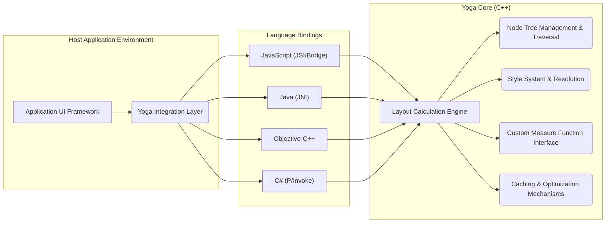

# Project Design Document: Facebook Yoga Layout Engine

**Version:** 1.1
**Date:** October 26, 2023
**Author:** AI Software Architect

## 1. Introduction

This document provides an enhanced design overview of the Facebook Yoga layout engine. Yoga is a cross-platform, high-performance layout engine that implements a subset of Flexbox. It is a foundational component in frameworks like React Native, enabling consistent and predictable UI layout across diverse platforms. This document details Yoga's architecture, key components, and data flow, serving as a basis for comprehensive threat modeling.

## 2. Goals and Objectives

The core goals driving the development of the Yoga project are:

- **Platform Agnostic Layout:** To provide a consistent layout behavior across various operating systems (iOS, Android, Windows, macOS) and rendering environments (web browsers via JavaScript).
- **Accurate Flexbox Implementation:** To faithfully implement the core principles of the Flexbox layout model as defined by the W3C specifications, ensuring predictable layout outcomes.
- **Optimized Performance:** To achieve high performance in layout calculations, minimizing CPU usage and ensuring smooth and responsive user interfaces, especially in complex layouts.
- **Seamless Integration:** To be easily embeddable and interoperable with different host environments and programming languages through well-defined and efficient language bindings.
- **Code Maintainability and Extensibility:** To maintain a clean, modular, and well-documented codebase that facilitates ongoing maintenance, bug fixes, and the potential addition of new features.

## 3. High-Level Architecture

Yoga's architecture is characterized by a core layout engine implemented in C++ and a set of language-specific bindings that expose its functionality to different programming environments. This separation allows for a performant core while enabling integration into diverse ecosystems.

**Architectural Components:**

- **Host Application Environment:** The environment where Yoga is utilized, such as a React Native application or a native mobile application.
    - **Application UI Framework:** The specific framework used to build the user interface (e.g., React Native's view hierarchy, native Android views, native iOS views).
    - **Yoga Integration Layer:** The code within the host application that acts as an intermediary, translating the application's UI structure and styles into a format understandable by the Yoga bindings.
- **Yoga Core (C++):** The central component containing the core layout logic.
    - **Layout Calculation Engine:** The primary engine responsible for executing the Flexbox algorithm, determining the size and position of layout nodes.
    - **Node Tree Management & Traversal:** Manages the creation, manipulation, and traversal of the hierarchical tree of layout nodes representing the UI structure.
    - **Style System & Resolution:** Handles the application of layout styles (e.g., `flexDirection`, `margin`, `padding`) to individual nodes, including style inheritance and conflict resolution.
    - **Custom Measure Function Interface:** Provides a mechanism for host applications to supply custom sizing information for specific nodes, particularly useful for elements with content-dependent dimensions (e.g., text).
    - **Caching & Optimization Mechanisms:** Implements various caching strategies and optimizations to avoid redundant layout calculations and improve performance.
- **Language Bindings:**  Provide the necessary interfaces for different programming languages to interact with the Yoga Core.
    - **JavaScript (JSI/Bridge):** Enables integration with JavaScript environments, primarily used in React Native and web contexts. Modern versions utilize the JavaScript Interface (JSI) for more direct communication, while older versions rely on a bridge.
    - **Java (JNI):** Facilitates integration with Android applications through the Java Native Interface.
    - **Objective-C++:** Allows seamless interaction with iOS and macOS applications, often leveraging Objective-C++ for direct C++ interoperability.
    - **C# (P/Invoke):** Enables integration with Windows applications using Platform Invoke to call native C++ functions.

## 4. Component Details

### 4.1. Yoga Core (C++) - Deep Dive

- **Purpose:**  To provide the foundational layout logic, implementing the Flexbox algorithm and managing the layout tree.
- **Key Features:**
    - **Flexbox Algorithm Implementation:**  A precise implementation of the W3C Flexbox specification, handling various Flexbox properties and their interactions.
    - **`YGNode` Structure:** The fundamental data structure representing a layout node. It stores style properties, layout results (position, size), and relationships to other nodes (parent, children).
    - **`YGConfig` Object:** Allows for configuration of layout behavior, such as specifying a point scale factor for rounding and enabling web-compatible behavior for certain edge cases.
    - **Layout Calculation Stages:** The layout process involves distinct stages, including style resolution, sizing (determining the dimensions of each node), and positioning (calculating the final position of each node within its parent).
    - **Dirty Flagging:** An optimization technique where nodes are marked as "dirty" when their styles change, ensuring that only necessary parts of the layout tree are recalculated.
    - **Measure Function Handling:**  Provides a well-defined interface for integrating custom measurement functions provided by the host application.
- **Internal Structure Highlights:**
    - **`YGLayout` struct:** Stores the calculated layout information for a node (position, dimensions, borders, paddings, margins).
    - **Style Attribute Storage:** Efficient storage mechanisms for various Flexbox style properties.
    - **Tree Traversal Algorithms:** Optimized algorithms for navigating the layout tree during calculation.

### 4.2. Language Bindings - Implementation Specifics

- **Purpose:** To bridge the gap between the C++ core and the respective host programming languages.
- **Key Considerations:**
    - **Memory Management:**  Crucial to manage memory correctly across language boundaries to prevent leaks or crashes. Bindings often involve manual memory management or smart pointers.
    - **Object Mapping:**  Mapping concepts from the C++ core (e.g., `YGNode`) to equivalent objects or structures in the target language.
    - **Thread Safety:** Ensuring that interactions with the Yoga Core from different threads in the host application are handled safely.
    - **Error Handling:**  Propagating errors from the C++ core to the host language in a meaningful way.
- **Examples:**
    - **JavaScript Bindings (React Native):**
        - **JSI (JavaScript Interface):** A more modern approach allowing direct calls between JavaScript and C++, offering better performance.
        - **Bridge:** An older architecture involving asynchronous message passing between the JavaScript and native threads.
        - Exposes Yoga functionality through JavaScript objects and methods (e.g., `YogaNode`, `YogaConfig`).
    - **Java Bindings (Android):**
        - Utilizes the Java Native Interface (JNI) to call native C++ functions.
        - Involves creating Java classes that mirror the C++ API (e.g., `com.facebook.yoga.YogaNode`).
        - Requires careful handling of object references and memory management across the JNI boundary.
    - **Objective-C++ (iOS/macOS):**
        - Often involves a mix of Objective-C and C++ code, allowing for direct interaction with the C++ core.
        - May use Objective-C++ classes that wrap the C++ Yoga objects.
        - Benefits from the close interoperability between Objective-C and C++.
    - **C# Bindings (Windows):**
        - Leverages P/Invoke (Platform Invoke) to call functions in the native Yoga C++ DLL.
        - Requires defining C# signatures that match the C++ function signatures.
        - Involves marshaling data between the managed C# environment and the unmanaged C++ environment.

### 4.3. Host Application Integration - Workflow

- **Purpose:** To integrate Yoga into the application's UI rendering pipeline to manage layout.
- **Typical Integration Steps:**
    1. **Node Tree Construction:** The host application creates a tree of Yoga nodes that mirrors the structure of its UI elements. This can be done programmatically or through a declarative syntax (e.g., JSX in React Native).
    2. **Style Application:** Layout styles (Flexbox properties) are applied to the Yoga nodes. These styles are typically derived from the application's styling system.
    3. **Layout Calculation Invocation:** The host application triggers the layout calculation process, usually by calling a method on the root Yoga node. This initiates the recursive calculation of the layout for the entire tree.
    4. **Layout Result Retrieval:** After calculation, the host application retrieves the calculated layout information (position and dimensions) from the Yoga nodes.
    5. **UI Element Positioning:** The retrieved layout information is then used to position and size the actual UI elements on the screen using the platform's rendering APIs.
    6. **Custom Measure Function Implementation (Optional):** For elements with dynamic content (e.g., text), the host application may provide custom measure functions that Yoga calls during layout to determine the appropriate size of these elements.

## 5. Data Flow - Enhanced View

The data flow during a layout calculation can be visualized as follows:

```mermaid
graph LR
    A["Host Application: Define UI Tree & Styles"] --> B("Integration Layer: Create & Configure Yoga Nodes");
    B --> C("Language Bindings: Translate to Yoga Core Structures");
    C --> D["Yoga Core: Build Internal Node Tree Representation"];
    D --> E{"Yoga Core: Initiate Layout Calculation (Root Node)"};
    E --> F["Yoga Core: Traverse Node Tree (Depth-First)"];
    F --> G{"Yoga Core: Style Resolution & Inheritance"};
    G --> H{"Yoga Core: Apply Flexbox Algorithm Rules"};
    H --> I{"Yoga Core: Execute Measure Functions (if provided)"};
    I --> J{"Yoga Core: Calculate Node Dimensions & Positions"};
    J --> K["Yoga Core: Store Layout Results in YGNode"];
    K --> L("Language Bindings: Retrieve Layout Results");
    L --> M["Integration Layer: Map Results to UI Elements"];
    M --> N["Host Application: Update UI Element Layout"];
```

**Detailed Breakdown:**

1. **Host Application: Define UI Tree & Styles:** The application's UI is defined, and associated layout styles are specified.
2. **Integration Layer: Create & Configure Yoga Nodes:** The integration layer creates corresponding Yoga nodes and sets their initial styles based on the application's UI definition.
3. **Language Bindings: Translate to Yoga Core Structures:** The language bindings translate the host application's representation of nodes and styles into the internal data structures used by the Yoga Core.
4. **Yoga Core: Build Internal Node Tree Representation:** The Yoga Core constructs its internal representation of the layout tree based on the information received from the bindings.
5. **Yoga Core: Initiate Layout Calculation (Root Node):** The layout calculation process is initiated, typically starting from the root node of the layout tree.
6. **Yoga Core: Traverse Node Tree (Depth-First):** The layout engine traverses the node tree, typically using a depth-first approach, to calculate the layout of each node.
7. **Yoga Core: Style Resolution & Inheritance:** For each node, the applicable styles are resolved, taking into account style inheritance from parent nodes.
8. **Yoga Core: Apply Flexbox Algorithm Rules:** The core Flexbox algorithm is applied, considering the node's styles, its parent's styles, and available space.
9. **Yoga Core: Execute Measure Functions (if provided):** If a custom measure function is provided for a node, it is executed to determine the node's intrinsic size.
10. **Yoga Core: Calculate Node Dimensions & Positions:** Based on the applied styles and the Flexbox algorithm, the final dimensions (width and height) and position (relative to its parent) of the node are calculated.
11. **Yoga Core: Store Layout Results in YGNode:** The calculated layout information is stored within the `YGLayout` structure of the corresponding `YGNode`.
12. **Language Bindings: Retrieve Layout Results:** The language bindings provide mechanisms for the integration layer to access the calculated layout results from the Yoga nodes.
13. **Integration Layer: Map Results to UI Elements:** The integration layer maps the layout results from the Yoga nodes to the corresponding UI elements in the host application.
14. **Host Application: Update UI Element Layout:** The host application uses the retrieved layout information to update the position and size of the actual UI elements on the screen, triggering a re-render if necessary.

## 6. Security Considerations (Detailed)

While Yoga's primary function is layout calculation, several security considerations are relevant:

- **Denial of Service (DoS) via Complex Layouts:**
    - **Threat:** Maliciously crafted, deeply nested, or excessively complex layout structures with computationally expensive styles could consume excessive CPU resources during layout calculations, leading to application unresponsiveness or crashes.
    - **Mitigation:** Implement safeguards against excessively deep nesting or complex style combinations. Consider resource limits or timeouts for layout calculations.
- **Integer Overflow/Underflow in Calculations:**
    - **Threat:** Errors in the C++ core's arithmetic operations during layout calculations could lead to integer overflows or underflows, potentially resulting in incorrect layout calculations or unexpected behavior.
    - **Mitigation:** Employ robust coding practices, including careful handling of integer types and boundary conditions. Utilize compiler flags and static analysis tools to detect potential issues.
- **Memory Corruption Vulnerabilities:**
    - **Threat:** Bugs in the C++ core related to memory management (e.g., buffer overflows, use-after-free) could lead to crashes or exploitable vulnerabilities, potentially allowing arbitrary code execution.
    - **Mitigation:** Implement rigorous memory management practices, utilize smart pointers, and employ memory safety tools (e.g., AddressSanitizer, MemorySanitizer) during development and testing.
- **Dependency Chain Vulnerabilities:**
    - **Threat:** Yoga relies on standard C++ libraries and potentially other third-party libraries. Vulnerabilities in these dependencies could indirectly affect Yoga's security.
    - **Mitigation:** Regularly update dependencies and monitor for known vulnerabilities. Employ dependency scanning tools to identify and address potential risks.
- **Language Binding Security Issues:**
    - **Threat:** Vulnerabilities could exist in the language bindings if they don't correctly handle data marshaling between the host language and the C++ core, potentially leading to buffer overflows or other memory safety issues. Incorrect exposure of internal APIs could also introduce risks.
    - **Mitigation:** Implement secure coding practices in the bindings, including thorough input validation and careful handling of data passed across language boundaries. Minimize the exposed API surface.
- **Information Disclosure (Indirect):**
    - **Threat:** While Yoga doesn't directly handle sensitive user data, excessively complex or deeply nested layouts might indirectly reveal information about the application's structure or data flow to an attacker who can observe layout behavior.
    - **Mitigation:**  While primarily an application-level concern, awareness of potential indirect information leakage through layout complexity is important.
- **Configuration Vulnerabilities:**
    - **Threat:** Although Yoga has limited configuration options, incorrect or insecure configuration (if exposed) could potentially lead to unexpected behavior or vulnerabilities.
    - **Mitigation:**  Minimize configurable options and ensure that any configuration parameters are validated and securely handled.

## 7. Deployment

Yoga is typically deployed as a native library integrated within the host application's build process.

- **Mobile Platforms (iOS, Android):** The respective language bindings (Objective-C++ for iOS, Java/JNI for Android) are compiled and linked into the application package (IPA for iOS, APK for Android).
- **Desktop Platforms (Windows, macOS):** Similar to mobile, the appropriate bindings (C# for Windows, Objective-C++ for macOS) are integrated into the application's build process.
- **Web Environments (via React Native Web):** The JavaScript bindings are included as part of the JavaScript bundle.

The deployment process generally involves:

- Including pre-compiled Yoga library binaries or building them from source as part of the application build.
- Linking the necessary libraries with the application's executable.
- Ensuring that the correct runtime environment and dependencies are available on the target platform.

## 8. Technologies Used

- **Core Layout Engine:** C++ (primarily C++11 and later)
- **Language Bindings:**
    - JavaScript (using JSI or the React Native Bridge)
    - Java (using JNI)
    - Objective-C++
    - C# (using P/Invoke)
- **Build System:** CMake (for the core C++ library and potentially for generating bindings). Platform-specific build tools (e.g., Xcode for iOS, Gradle for Android) are used for integrating Yoga into application projects.
- **Version Control:** Git (hosted on platforms like GitHub).
- **Testing Frameworks:**  Likely a combination of unit tests for the C++ core and integration tests within the frameworks that consume Yoga (e.g., React Native).

## 9. Future Considerations

- **Further Performance Optimizations:** Ongoing research and development to improve layout calculation speed and reduce memory footprint. Exploration of techniques like incremental layout and more advanced caching strategies.
- **Expanded Flexbox Feature Support:**  Potentially implementing more advanced or less commonly used features from the full Flexbox specification.
- **Integration with New UI Frameworks:** Exploring opportunities to integrate Yoga with emerging UI frameworks and platforms.
- **Improved Debugging and Profiling Tools:** Development of more sophisticated tools to help developers understand and debug Yoga layout behavior.
- **Accessibility Enhancements:**  Continued focus on ensuring that layouts generated by Yoga are compatible with accessibility guidelines and assistive technologies.
- **WebAssembly (Wasm) Adoption:**  Investigating the potential of compiling the Yoga Core to WebAssembly to improve performance in web-based environments.

This revised document provides a more in-depth and detailed design overview of the Facebook Yoga layout engine, offering a stronger foundation for subsequent threat modeling and security analysis.