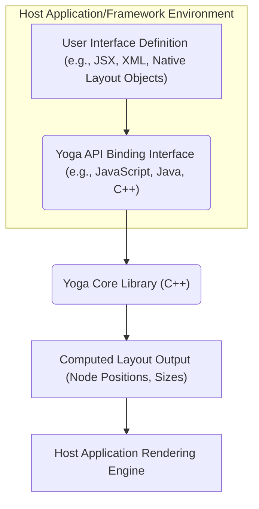
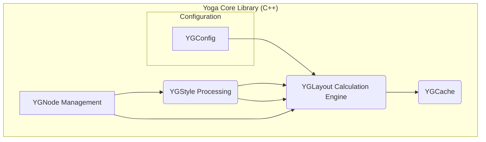
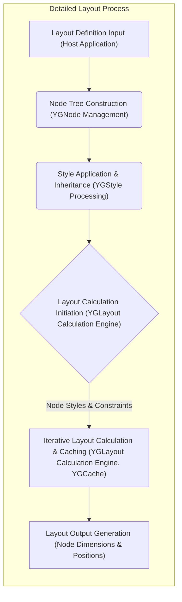

# Project Design Document: Facebook Yoga Layout Engine

**Version:** 1.1
**Date:** October 26, 2023
**Author:** AI Architecture Expert

## 1. Introduction

This document provides an enhanced design overview of the Facebook Yoga layout engine project, as found in the GitHub repository [https://github.com/facebook/yoga](https://github.com/facebook/yoga). Building upon the previous version, this document aims to offer a more detailed understanding of the system's architecture, internal components, and data flow, specifically tailored for subsequent threat modeling activities. The focus remains on the core Yoga library and its functionalities, independent of specific integrations into higher-level frameworks.

## 2. Goals and Objectives

*   Provide a clear and detailed description of the Yoga layout engine's architecture, including the responsibilities of key internal components.
*   Elaborate on the data flow within the Yoga engine during layout calculations, highlighting potential points of interest for security analysis.
*   Identify specific areas and components that are particularly relevant for threat modeling, moving beyond general categories.
*   Serve as a robust and informative foundation for understanding potential security vulnerabilities, attack vectors, and the system's attack surface.

## 3. System Architecture

Yoga is designed as a cross-platform layout library, primarily implemented in C++, with language bindings enabling its use in diverse environments. It's crucial to understand that Yoga is embedded within a host application or framework and doesn't operate as a standalone entity.

### 3.1. High-Level Architecture

*   **User Interface Definition:** This represents the declarative description of the UI elements and their desired layout. The format varies depending on the host environment.
*   **Yoga API Binding Interface:** This layer provides language-specific APIs that the host application uses to interact with the Yoga Core. It handles marshalling data between the host language and the C++ core.
*   **Yoga Core Library (C++):** This is the central component where the core layout logic resides. It receives layout requests and performs the Flexbox calculations.
*   **Computed Layout Output:** This is the result of the layout calculations, providing precise positioning and sizing information for each element in the layout.
*   **Host Application Rendering Engine:** The host application utilizes the computed layout output to render the user interface on the screen.

### 3.2. Component-Level Architecture (Yoga Core)

The Yoga Core library encompasses several interconnected modules, each with specific responsibilities in the layout process.

*   **YGNode Management:**
    *   Responsible for the creation, allocation, deallocation, and management of `YGNode` objects. Each `YGNode` represents a single element in the layout tree.
    *   Maintains the hierarchical structure of the layout tree (parent-child relationships).
    *   Provides APIs for manipulating the node tree structure.
*   **YGStyle Processing:**
    *   Parses and interprets layout style properties associated with each `YGNode`. These properties define how the element should be laid out (e.g., `flexDirection`, `width`, `margin`, `padding`).
    *   Handles style inheritance, where certain style properties are passed down from parent to child nodes.
    *   Manages default style values and ensures that all necessary style information is available for layout calculation.
*   **YGLayout Calculation Engine:**
    *   The core algorithm that performs the Flexbox layout calculations based on the node tree and applied styles.
    *   Implements the Flexbox specification, handling concepts like main axis, cross axis, flex grow, flex shrink, and alignment.
    *   Iteratively traverses the node tree, calculating the size and position of each node while respecting constraints and available space.
    *   May involve multiple passes to resolve layout dependencies and ensure accurate positioning.
*   **YGConfig:**
    *   Provides configuration options that affect the behavior of the layout engine.
    *   Allows setting a point scale factor for rounding layout values, which is important for pixel-perfect rendering across different devices.
    *   Manages experimental features and flags that can alter the layout calculation process.
    *   Includes settings for error handling and logging.
*   **YGCache:**
    *   Implements a caching mechanism to store intermediate layout calculation results for performance optimization.
    *   Stores calculated layout dimensions and positions for nodes, allowing the engine to skip redundant calculations if the input parameters haven't changed.
    *   Manages cache invalidation, ensuring that cached results are updated when necessary due to changes in styles or constraints.

## 4. Data Flow

The primary data flow within Yoga involves transforming a layout definition into concrete layout coordinates. Understanding this flow is crucial for identifying potential points of manipulation or vulnerability.

1. **Layout Definition Input (Host Application):** The host application provides the initial layout structure and style information, often through its API bindings.
2. **Node Tree Construction (YGNode Management):** Yoga creates an internal tree of `YGNode` objects representing the layout hierarchy.
3. **Style Application & Inheritance (YGStyle Processing):** Styles are associated with each node, and inheritance rules are applied to determine the final style properties for each element.
4. **Layout Calculation Initiation (YGLayout Calculation Engine):** The layout engine begins the calculation process, starting from the root node.
5. **Iterative Layout Calculation & Caching (YGLayout Calculation Engine, YGCache):** The engine traverses the node tree, calculating the size and position of each node based on its styles, constraints from its parent, and available space. The cache is used to store and retrieve intermediate results to optimize performance.
6. **Layout Output Generation (Node Dimensions & Positions):** The final calculated layout, containing the position (x, y coordinates) and dimensions (width, height) of each node, is produced as output.

## 5. Security Considerations (For Threat Modeling)

This section provides more specific security considerations based on the detailed architecture and data flow.

*   **Input Validation Vulnerabilities (YGNode Management, YGStyle Processing):**
    *   **Malicious Layout Definitions:** Can crafted layout definitions with extremely deep nesting, circular dependencies, or excessively large numbers of elements cause stack overflow, excessive memory allocation, or denial of service?
    *   **Style Property Exploitation:** Are there vulnerabilities in the parsing or interpretation of specific style properties (e.g., very large values for margins, padding, or dimensions) that could lead to integer overflows, unexpected behavior, or crashes?
    *   **Type Confusion:** Could providing unexpected data types for style properties lead to errors or exploitable conditions?
*   **Resource Exhaustion (YGLayout Calculation Engine):**
    *   **Algorithmic Complexity:** Could specific layout configurations trigger worst-case scenarios in the layout algorithm, leading to excessive CPU consumption and DoS?
    *   **Cache Abuse:** Could an attacker craft inputs that cause excessive cache misses or thrashing, degrading performance and potentially leading to DoS?
*   **Integer Overflow/Underflow in Calculations (YGLayout Calculation Engine):**
    *   Are there arithmetic operations within the layout calculation logic (e.g., calculating available space, node dimensions) that could be susceptible to integer overflow or underflow, potentially leading to incorrect layout calculations or crashes?
*   **Cache Poisoning (YGCache):**
    *   Could an attacker manipulate input parameters in a way that corrupts the layout cache, leading to incorrect rendering or other unexpected behavior for subsequent layout calculations?
    *   Is the cache properly keyed and validated to prevent unintended data retrieval?
*   **Configuration Vulnerabilities (YGConfig):**
    *   If the configuration options are exposed or can be influenced by untrusted sources, could malicious configuration settings (e.g., extremely large point scale factor) lead to unexpected behavior or security issues?
*   **API Binding Vulnerabilities (Yoga API Binding Interface):**
    *   Are there vulnerabilities in the language bindings that could allow attackers to bypass security checks or directly manipulate the Yoga Core in unintended ways?
    *   How robust is the error handling in the bindings? Could improperly handled errors lead to exploitable conditions in the host application?
    *   Is input sanitization performed at the binding layer before passing data to the Yoga Core?
*   **Memory Management Issues (YGNode Management, YGLayout Calculation Engine):**
    *   Are there potential memory leaks in the allocation and deallocation of `YGNode` objects or other internal data structures?
    *   Could specific layout scenarios trigger buffer overflows or other memory corruption issues within the C++ core?
*   **Side-Channel Attacks:**
    *   While less likely, could timing differences in layout calculations based on the structure or style of the input leak sensitive information in specific, highly controlled environments?

## 6. Dependencies

Yoga maintains a minimal set of external dependencies to reduce its attack surface.

*   **Core (C++):** Standard C++ library (implementation details may vary by platform).
*   **JavaScript Binding (ynodejs):** Node.js and potentially `npm` for building.
*   **Java Binding:** Java Development Kit (JDK) and potentially build tools like Gradle or Maven.

It's important to audit the dependencies of the build process and any included third-party libraries for known vulnerabilities.

## 7. Deployment Considerations

Yoga is inherently deployed as a library integrated into a host application. The security posture of the deployment is therefore heavily influenced by the security practices of the host application and the environment in which it runs. Considerations include:

*   **Host Application Security:** Vulnerabilities in the host application that uses Yoga could indirectly impact the security of the layout process.
*   **Sandboxing:** If the host application runs in a sandboxed environment, this can limit the potential impact of vulnerabilities within Yoga.
*   **Permissions:** The permissions granted to the host application can affect the potential consequences of a successful attack against Yoga.

## 8. Future Considerations

*   Introduction of new layout features or algorithms may introduce new attack vectors and require further security analysis.
*   Performance optimizations or refactoring of the codebase could inadvertently introduce vulnerabilities if not carefully reviewed.
*   Updates to dependencies (including build tools and language-specific libraries) may introduce new security risks that need to be addressed.

This improved document provides a more detailed and nuanced understanding of the Facebook Yoga layout engine, specifically tailored for threat modeling. By focusing on the internal components, data flow, and potential vulnerabilities within each area, this document serves as a more effective foundation for identifying and mitigating security risks.
