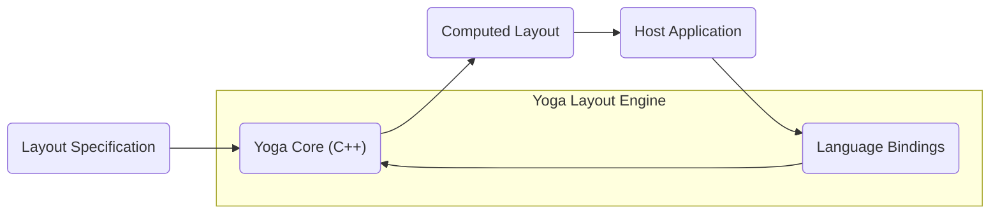
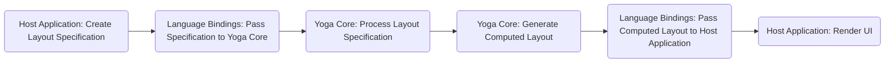

# Project Design Document: Yoga Layout Engine

**Version:** 1.1
**Date:** October 26, 2023
**Prepared By:** Gemini (AI Language Model)

## 1. Introduction

This document details the architectural design of the Facebook Yoga layout engine project, available at [https://github.com/facebook/yoga](https://github.com/facebook/yoga). It serves as the foundation for subsequent threat modeling activities by providing a clear understanding of Yoga's components, interactions, and data flow.

### 1.1. Purpose

This document's primary goal is to offer a comprehensive and unambiguous description of the Yoga project's architecture. This detailed understanding is essential for identifying potential security weaknesses and formulating appropriate mitigation strategies during the threat modeling process.

### 1.2. Scope

This document encompasses the core architectural elements of the Yoga layout engine, its interactions with integrating applications, and the data flow involved in calculating layouts. The focus is on the logical architecture, avoiding low-level implementation specifics unless directly relevant to the overall architecture and potential security implications.

### 1.3. Goals

*   Clearly define the primary components of the Yoga layout engine.
*   Illustrate the movement of data within the system.
*   Identify crucial interfaces and interactions between components.
*   Establish a basis for identifying potential attack vectors.

## 2. Overview

Yoga is a cross-platform layout engine implementing the Flexbox specification. Designed for high performance, it integrates into diverse host applications across various platforms, including mobile, web, and desktop. The core is implemented in C++, with bindings enabling usage in languages like Java, JavaScript, and others. Yoga's main function is to compute the precise position and size of each element within a user interface layout. This layout is described as a tree of nodes with associated styling properties.

## 3. Architectural Design

The Yoga architecture comprises these key components:

*   **Yoga Core (C++):** The central component responsible for layout calculations based on the Flexbox algorithm. It receives layout specifications and outputs the computed layout.
*   **Language Bindings:** Wrappers around the Yoga Core, allowing integration with different programming languages. Examples include:
    *   Java bindings (often using JNI) for Android development.
    *   JavaScript bindings for React Native and web environments.
    *   Objective-C/Swift bindings for iOS development.
*   **Host Application:** The application embedding and utilizing the Yoga library. It provides layout specifications to Yoga and consumes the resulting computed layout for rendering the user interface.
*   **Layout Specification:** The input to the Yoga engine, defining the structure and styling of UI elements. It's typically a tree of nodes, each representing a UI element with properties like `flexDirection`, `width`, `height`, `margin`, and `padding`.
*   **Computed Layout:** The output from the Yoga engine, containing the calculated position (x, y coordinates) and dimensions (width, height) for each node in the layout tree.

## 4. Data Flow

The typical data flow within the Yoga system is as follows:

1. The **Host Application** constructs a **Layout Specification** representing the desired UI structure and styling.
2. The **Host Application** uses the appropriate **Language Bindings** to transmit the **Layout Specification** to the **Yoga Core**.
3. The **Yoga Core** processes the **Layout Specification** according to the Flexbox algorithm. This involves traversing the layout tree and calculating the position and size of each node based on its properties and those of its parent and siblings.
4. The **Yoga Core** generates the **Computed Layout**, containing the final position and dimensions for each node.
5. The **Language Bindings** relay the **Computed Layout** back to the **Host Application**.
6. The **Host Application** utilizes the **Computed Layout** to render the user interface.

## 5. Key Interfaces and Interactions

*   **Host Application to Language Bindings:** This interaction involves invoking functions provided by the language bindings to create Yoga nodes, set their properties, and initiate layout calculations. The specific API varies depending on the programming language. Data exchanged includes layout properties and control signals.
*   **Language Bindings to Yoga Core:** Typically involves Foreign Function Interface (FFI) calls, where language bindings invoke functions exposed by the Yoga Core C++ library. Data is marshalled between language-specific representations and C++ representations. This includes layout node data and configuration parameters.
*   **Yoga Core Internal Interfaces:** The Yoga Core internally manages the layout tree, accesses node properties, and performs core layout calculations through internal functions and data structures. These are not directly exposed to the host application.
*   **Yoga Core to Language Bindings (Return):** The computed layout data (node positions and dimensions) is passed back from the Yoga Core to the language bindings, again involving data marshalling.
*   **Language Bindings to Host Application (Return):** The language bindings provide the computed layout data to the host application in a language-specific format, allowing the host to position and size UI elements.

## 6. Key Security Considerations (For Threat Modeling)

This section outlines initial security considerations to be explored during threat modeling.

*   **Input Validation on Layout Specification:** The Yoga Core relies on the input layout specification. Maliciously crafted specifications could lead to:
    *   **Denial of Service (DoS):**  Extremely deep or wide layout trees, or layouts with highly complex constraints, could consume excessive CPU or memory, rendering the application unresponsive. For example, a layout with an extremely large number of nested elements or excessively large dimensions.
    *   **Integer Overflow/Underflow:**  Large or negative values in layout properties (e.g., `width`, `height`, `margin`) could cause integer overflow or underflow issues within the Yoga Core's calculations, particularly in the C++ code. This could lead to unexpected behavior or crashes.
*   **Memory Safety in Yoga Core (C++):** As the core is in C++, memory safety vulnerabilities are potential risks:
    *   **Buffer Overflows:** Incorrect handling of input data or internal state could lead to writing beyond allocated memory buffers.
    *   **Use-After-Free:** Accessing memory that has already been freed could lead to crashes or exploitable vulnerabilities.
    *   **Dangling Pointers:** Pointers referencing memory that is no longer valid could lead to unpredictable behavior.
*   **Vulnerabilities in Language Bindings:** The bindings act as a bridge. Vulnerabilities here could arise from:
    *   **Incorrect Data Marshalling:** Errors in converting data between languages could lead to unexpected values being passed to the Yoga Core.
    *   **Lack of Input Validation:** Bindings might not adequately validate input from the host application before passing it to the Yoga Core.
*   **Dependency Chain Vulnerabilities:** Yoga depends on other libraries and tools. Vulnerabilities in these dependencies (e.g., build tools, testing frameworks) could indirectly impact Yoga's security. Keeping dependencies updated is crucial.
*   **Information Disclosure:** While primarily focused on layout, if sensitive data is inadvertently included in layout specifications or if errors expose internal memory contents, there's a potential risk of information disclosure. Error messages or logging could also inadvertently reveal sensitive information.

## 7. Dependencies

The Yoga project relies on the following:

*   **CMake:** Used as the build system for generating build files across different platforms.
*   **A C++ Compiler (supporting C++11 or later):**  Essential for compiling the Yoga Core C++ code (e.g., GCC, Clang, MSVC).
*   **Platform-Specific SDKs and Build Tools:** Required for building language bindings (e.g., Java Development Kit (JDK) for Java bindings, Node.js and npm for JavaScript bindings, Xcode for Objective-C/Swift bindings).
*   **Testing Frameworks (e.g., Google Test):** Used for writing and running unit tests to ensure the correctness of the Yoga Core.

## 8. Deployment

Yoga is deployed as a library integrated into a host application. Deployment methods vary by platform:

*   **Mobile Applications (Android/iOS):** The relevant language bindings (Java/Kotlin for Android, Objective-C/Swift for iOS) are compiled and packaged within the application.
*   **Web Applications (React Native):** The JavaScript bindings are included as part of the React Native application bundle.
*   **Desktop Applications:** Depending on the framework, either direct C++ linking or language-specific bindings (e.g., for Electron applications using JavaScript) are employed.

## 9. Future Considerations

Potential future developments for Yoga include:

*   **Performance Enhancements:** Further optimizations to the layout calculation algorithms for improved efficiency.
*   **Expansion of Layout Features:** Implementing newer CSS layout specifications or adding custom layout capabilities.
*   **New Language Bindings:** Providing support for additional programming languages to broaden its applicability.
*   **Improved Debugging and Error Reporting:** Enhancing tools and mechanisms for diagnosing and resolving layout issues.

This document provides a solid architectural understanding of the Yoga layout engine, forming a crucial foundation for effective threat modeling. The next step involves a detailed analysis of these components and data flows to identify specific threats and develop appropriate mitigation strategies.